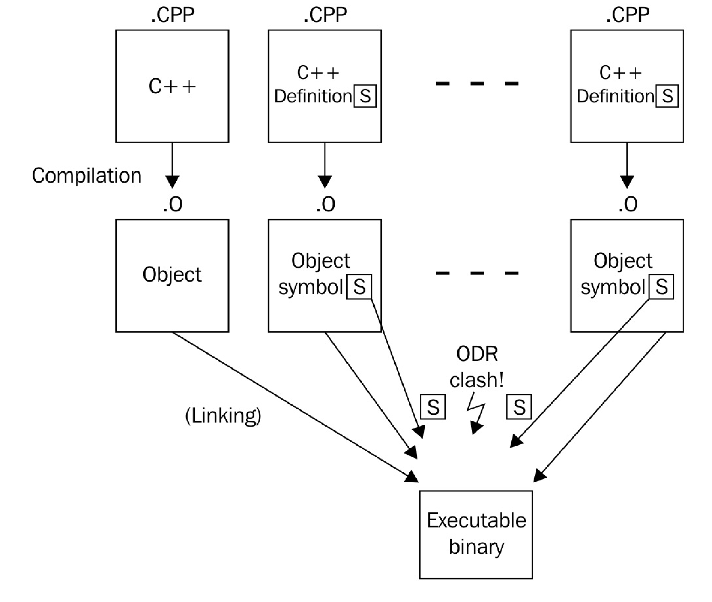
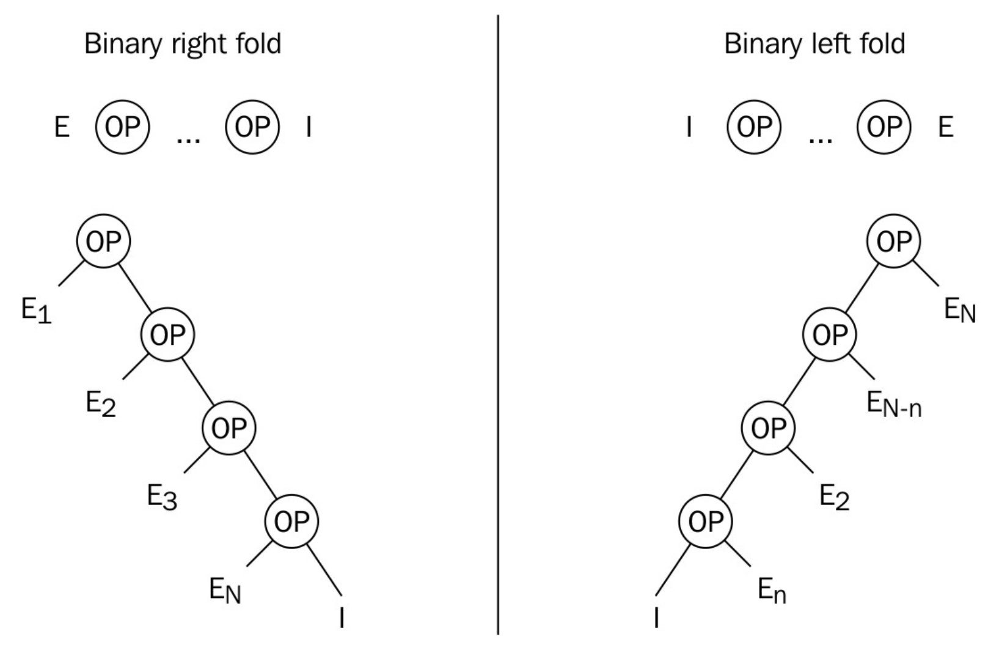

# C++17的新特性

## 使用结构化绑定来解包绑定的返回值

### How to do it...

C++17配备了一种新的特性——**结构化绑定**，其可以结合语法糖来自动推到类型，并可以从组对、元组和结构体中提取单独的变量。其他编程语言中，这种特性也被成为**解包**。

假设有函数：

```
std::pair<int, int> divide_remainder(int dividend, int divisor)
{
	return std::make_pair(dividend / divisor, dividend % divisor);
}
```

原有的调用和结果访问方式可能为：

```
const auto result(divide_remainder(16, 3));
std::cout << "16 / 3 is " 
    << result.first << " with a remainder of "
    << result.second << '\n';
```

新规则下可以将相应的值赋予对应的变量，这样写出来的代码可读性更高:

```
auto [fraction, remainder] = divide_remainder(16, 3);
std::cout << "16 / 3 is "
    << fraction << " with a remainder of "
    << remainder << '\n';	
```

也能对 `std::tuple` 进行结构化绑定：让我们使用下面的实例函数，获取股票的在线信息：

 ```
std::tuple<std::string, std::chrono::system_clock::time_point, unsigned>
stock_info(const std::string &name);
 ```

我们可以使用如下的方式获取这个例子的各个变量的值：

```
const auto [name, valid_time, price] = stock_info("INTC");
```

结构化绑定也能用在自定义结构体上。假设有这么一个结构体：

```
struct employee{
    unsigned id;
    std::string name;
    std::string role;
    unsigned salary;
};
```

现在我们来看下如何使用结构化绑定访问每一个成员。我们假设有一组`employee`结构体的实例，存在于`vector`中，下面使用循环将其内容进行打印：

```
int main(){
    std::vector<employee> employees{
        /* Initialized from somewhere */
    };

    for (const auto &[id, name, role, salary] : employees){
        std::cout << "Name: " << name
                  << "Role: " << role
                  << "Salary: " << salary << '\n';
    }
}
```

### How it works...

结构化绑定以以下方式进行应用：

```
auto [var1, var2, ...] = <pair, tuple, struct, or array expression>;
```

- `var1, var2, ...`表示一个变量列表，其变量数量必须匹配表达式所对应的结构。
- `<pair, tuple, struct, or array expression>`必须是下面的其中一种：
  - 一个`std::pair`实例。
  - 一个`std::tuple`实例。
  - 一个结构体实例。其所有成员都必须是非静态成员，每个成员以基础类定义。结构体中的第一个声明成员赋予第一个变量的值，第二个声明的编程赋予第二个变量的值，依次类推。
  - 固定长度的数组。
- `auto`部分，也就是`var`的类型，可以是`auto`,`const auto`,`const auto&`和`auto&&`。确保在适当的时刻使用引用，尽量减少不必要的副本。

如果中括号中变量不够，那么编译器将会报错:

```
std::tuple<int, float, long> tup(1, 2.0, 3);
auto [a, b] = tup; // Does not work
```

这个例子中想要将三个成员值，只赋予两个变量。编译器会立即发现这个错误。

### There's more...

STL 中的基础数据结构都能通过结构结构化绑定直接进行访问，而无需修改任何东西。考虑下面这个例子，循环中打印`std::map`中的元素：

```
std::map<std::string, size_t> animal_population{
    {"humans", 7000000},
    {"chickens", 178633760},
    {"camels", 24246291},
    {"sheep", 10868815}
};

for (const auto& [species, count] : animal_population) {
    std::cout << "There are " << count << " " << species
    << " on this planet.\n";
}
```

从`std::map`容器中获取元素的方式比较特殊，我们会在每次迭代时获得一个`std::pair<const key_type, value_type>`实例。另外每个实例都需要进行结构化绑定(`key_type`绑定到`species`字符串上，`value_type`为一个`size_t`格式的统计数字)，从而达到访问每一个成员的目的。

在 C++17 之前，使用`std::tie`可达到类似的效果:

```
int remainder;
std::tie(std::ignore, remainder) = divide_remainder(16, 5);
std::cout << "16 % 5 is " << remainder << '\n';
```

`std::tie`的能力远没有结构化绑定强，因为在进行赋值的时候，所有变量需要提前定义。另外，本例也展示了一种在`std::tie`中有，而结构化绑定没有的功能：可以使用`std::ignore`的值，作为虚拟变量。分数部分将会赋予到这个虚拟变量中，因为这里我们不需要用到分数值，所以使用虚拟变量忽略分数值。

使用结构化绑定时，就不能再使用std::tie创建虚拟变量了，所以我们不得不绑定所有值到命名过的变量上。对部分成员进行绑定的做法是高效的，因为编译器可以很容易的对未绑定的变量进行优化。

`divide_remainder`函数也可以通过使用传入输出参数的方式进行实现：

```
bool divide_remainder(int dividend, int divisor, int &fraction, int &remainder);
```

调用该函数的方式如下所示：

```
int fraction, remainder;
const bool success {divide_remainder(16, 3, fraction, remainder)};
if (success) {
  std::cout << "16 / 3 is " << fraction << " with a remainder of "
            << remainder << '\n';
}
```

很多人都很喜欢使用特别复杂的结构，比如组对、元组和结构体，他们认为这样避免了中间拷贝过程，所以代码会更快。对于现代编译器来说，这种想法不再是正确的了，这里编译器并没有刻意避免拷贝过程，而是优化了这个过程。(其实拷贝过程还是存在的)。

与 C 的语法特征不同，将复杂结构体作为返回值传回会耗费大量的时间，因为对象需要在返回函数中进行初始化，之后将这个对象拷贝到相应容器中返回给调用端。现代编译器支持 [返回值优化](https://zh.wikipedia.org/wiki/返回值优化)(RVO, return value optimization)技术，这项技术可以省略中间副本的拷贝。

## 将变量作用域限制在if和switch区域内

将变量的生命周期尽可能的限制在指定区域内，是一种非常好的代码风格。有时我们需要在满足某些条件时获得某个值，然后对这个值进行操作。

为了让这个过程更简单，C++17中为if和switch配备了初始化区域。

### How to do it...

这个案例中，我们使用初始化语句，来了解下其使用方式：

`if`：假设我们要在一个字母表中查找一个字母，我们`std::map`的成员`find`完成这个操作：

```
if (auto itr (character_map.find(c)); itr != character_map.end()) {
  // *itr is valid. Do something with it.
} else {
  // itr is the end-iterator. Don't dereference.
}
// itr is not available here at all
```

`switch`：这个例子看起来像是从玩家输入的字母决定某个游戏中的行为。通过使用`switch`查找字母相对应的操作：

```
switch (char c (getchar()); c) {
  case 'a': move_left(); break;
  case 's': move_back(); break;
  case 'w': move_fwd(); break;
  case 'd': move_right(); break;
  case 'q': quit_game(); break;
  case '0'...'9': select_tool('0' - c); break;
  default:
    std::cout << "invalid input: " << c << '\n';
}
```

### How it works...

带有初始化的`if`和`switch`相当于语法糖一样。

```
// if: before C++17
{
    auto var(init_value);
    if (condition){
        // branch A. var is accessible
    } else {
        // branch B. var is accessible
    }
    // var is still accessible
}


// if: since C++17
if (auto var (init_value); condition){
    // branch A. var is accessible
} else {
    // branch B. var is accessible
}
// var is not accessible any longer
```


```
// switch: before C++17
{
    auto var (init_value);
    switch (var) {
      case 1: ...
      case 2: ...
      ...
    }
    // var is still accessible
}

// switch: since C++17
switch(auto var (init_value); var){
    case 1: ...
    case 2: ...
    ...
}
// var is not accessible any longer
```

这些有用的特性保证了代码的简洁性。C++17之前只能使用外部括号将代码包围，就像上面的例子中展示的那样。减短变量的生命周期，能帮助我们保持代码的整洁性，并且更加易于重构。

### There's more...

另一个有趣的例子是临界区限定变量生命周期。

```
if (std::lock_guard<std::mutex> lg {my_mutex}; some_condition) {
  // Do something
}
```

首先，创建一个`std::lock_guard`。这个类接收一个互斥量和作为其构造函数的参数。这个类在其构造函数中对互斥量上锁，之后当代码运行完这段区域后，其会在析构函数中对互斥量进行解锁。这种方式避免了忘记解锁互斥量而导致的错误。C++17 之前，为了确定解锁的范围，需要一对额外的括号对。

另一个例子中对弱指针进行区域限制：

```
if (auto shared_pointer (weak_pointer.lock()); shared_pointer != nullptr) {
  // Yes, the shared object does still exist
} else {
  // shared_pointer var is accessible, but a null pointer
}
// shared_pointer is not accessible any longer
```

这个例子中有一个临时的`shared_pointer`变量，虽然`if`条件块或外部括号会让其保持一个无用的状态，但是这个变量确实会“泄漏”到当前范围内。

当要使用传统API的输出参数时，`if`初始化段就很有用：

```
if (DWORD exit_code; GetExitCodeProcess(process_handle, &exit_code)) {
  std::cout << "Exit code of process was: " << exit_code << '\n';
}
// No useless exit_code variable outside the if-conditional
```

`GetExitCodeProcess`函数是Windows操作系统的内核 API 函数。其通过返回码来判断给定的进程是否合法的处理完成。当离开条件域，变量就没用了，也就可以销毁这个变量了。

具有初始化段的`if`代码块在很多情况下都特别有用，尤其是在使用传统 API 的输出参数进行初始化时。

使用带有初始化段的`if`和`switch`能保证代码的紧凑性。这使您的代码紧凑，更易于阅读，在重构过程中，会更容易改动。

## 新的括号初始化规则

C++11引入了新的括号初始化语法`{}`。其不仅允许集合式初始化，而且还是对常规构造函数的调用。遗憾的是，当与`auto`类型变量结合时，这种方式就很容易出现错误。C++17将会增强这一系列初始化规则。本节中，我们将了解到如何使用C++17语法正确的初始化变量。

### How to do it...

一步初始化所有变量。使用初始化语法时，注意两种不同的情况：

- 不使用 `auto` 声明的括号初始化：

```
// Three identical ways to initialize an int:
int x1 = 1;
int x2{ 1 };
int x3(1);

std::vector<int> v1{ 1, 2, 3 }; // Vector with three ints
std::vector<int> v2 = { 1, 2, 3 }; // same here
std::vector<int> v3(10, 20); // Vector with 10 ints, each have value 20
```

- 使用 `auto` 声明的括号初始化：

```
auto v{ 1 }; // v is int
auto w{ 1, 2 }; // error: only single elements in direct
// auto initialization allowed! (this is new)
auto x = { 1 }; // x is std::initializer_list<int>
auto y = { 1, 2 }; // y is std::initializer_list<int>
auto z = { 1, 2, 3.0 }; // error: Cannot deduce element type
```

### How it works...

无`auto`类型声明时，`{}`的操作没什么可大惊小怪的。当在初始化STL容器时，例如`std::vector`，`std::list`等等，括号初始化就会去匹配`std::initializer_list`(初始化列表)的构造函数，从而初始化容器。其构造函数会使用一种“贪婪”的方式，这种方式就意味着不可能匹配非聚合构造函数(与接受初始化列表的构造函数相比，非聚合构造函数是常用构造函数)。

`std::vector`就提供了一个特定的非聚合构造函数，其会使用任意个相同的数值填充`vector`容器：`std::vector<int> v(N, value)`。当写成`std::vector<int> v{N, value}`时，就选择使用`initializer_list`的构造函数进行初始化，其会将`vector`初始化成只有 N 和 value 两个元素的变量。这个“陷阱”大家应该都知道。

`{}`与`()`调用构造函数初始化的方式，不同点在于`{}`没有类型的隐式转换，比如`int x(1.2);`和`int x = 1.2;`通过静默的对浮点值进行向下取整，然后将其转换为整型，从而将x的值初始化为1。相反的，`int x{1.2};`将会遇到编译错误，初始化列表中的初始值，需要与变量声明的类型完全匹配。

C++17添加的条件也适用于auto(推断类型)——C++11引入，用于正确的推导匹配变量的类型。`auto x{123};`中`std::initializer_list<int>`中只有 一个元素，这并不是我们想要的结果。C++17将会生成一个对应的整型值。

经验法则：

- `auto var_name {one_element};`将会推导出 `var_name` 的类型——与 `one_element` 一样。
- `auto var_name {element1, element2, ...};`是非法的，并且无法通过编译。
- `auto var_name = {element1, element2, ...};`将会使用 `std::initializer_list<T>` 进行初始化，列表中 `elementN` 变量的类型均为 T。

## 构造函数自动推导模板的类型

C++ 中很多类都需要指定类型，其实这个类型可以从用户所调用的构造函数中推导出来。不过，在 C++17 之前，这是一个未标准化的特性。C++17 能让编译器自动的从所调用的构造函数，推导出模板类型。

### How to do it...

使用最简单的方法创建`std::pair`和`std::tuple`实例。其可以实现一步创建：

```
std::pair my_pair (123, "abc"); // std::pair<int, const char*>
std::tuple my_tuple (123, 12.3, "abc"); // std::tuple<int, double, const char*>
```

### How it works...

让我们定义一个类，了解自动化的对模板类型进行推断的价值。

```
template <typename T1, typename T2, typename T3>
class my_wrapper {
    T1 t1;
    T2 t2;
    T3 t3;
public:
    explicit my_wrapper(T1 t1_, T2 t2_, T3 t3_)
        : t1{ t1_ }, t2{ t2_ }, t3{ t3_ }
    {}
    /* ... */
};
```

好！我们定义了一个模板类。C++17之前，我们为了创建该类的实例：

```
my_wrapper<int, double, const char *> wrapper {123, 1.23, "abc"};
```

我们省略模板特化的部分：

```
my_wrapper wrapper {123, 1.23, "abc"};
```

C++17 之前，我们可能会通过以下的方式实现一个工厂函数：

```
my_wrapper<T1, T2, T3> make_wrapper(T1 t1, T2 t2, T3 t3)
{
  return {t1, t2, t3};
}
```

使用工厂函数：

 ```
auto wrapper (make_wrapper(123, 1.23, "abc"));
 ```

STL 中有很多工厂函数，比如`std::make_shared`、`std::make_unique`、`std::make_tuple`等等。C++17 中，这些工厂函数就过时了。当然，考虑到兼容性，这些工厂函数在之后还会保留。

### There's more...

我们已经了解过隐式模板类型推导。但一些例子中，不能依赖类型推导。如下面的例子：

```
// example class
template <typename T>
struct sum{
    T value;

    template <typename ... Ts>
    sum(Ts&& ... values) : value{(values + ...)} {}
};
```

结构体中，`sum`能接受任意数量的参数，并使用折叠表达式将它们添加到一起。加法操作后得到的结果保存在`value`变量中。现在的问题是，`T`的类型是什么？如果我们不显式的进行指定，那就需要通过传递给构造函数的变量类型进行推导。当我们提供了多个字符串实例，其类型为`std::string`。当我们提供多个整型时，其类型就为`int`。当我们提供多个整型、浮点和双浮点时，编译器会确定哪种类型适合所有的值，而不丢失信息。为了实现以上的推导，我们提供了指导性显式推导：

```
template <typename ... Ts>
sum(Ts&& ... ts) -> sum<std::common_type_t<Ts...>>;
```

指导性推导会告诉编译器使用`std::common_type_t`的特性，其能找到适合所有值的共同类型。来看下如何使用：

```
sum s {1u, 2.0, 3, 4.0f};
sum string_sum {std::string{"abc"}, "def"};
std::cout << s.value << '\n'
          << string_sum.value << '\n';
```

第1行中，我们创建了一个`sum`对象，构造函数的参数类型为`unsigned`, `double`, `int`和`float`。`std::common_type_t`将返回`double`作为共同类型，所以我们获得的是一个`sun<double>`实例。

第2行中，我们创建了一个`std::string`实例和一个C风格的字符串。在我们的指导下，编译器推导出这个实例的类型为`sum<std::string>`。

当我们运行这段代码时，屏幕上会打印出 `10` 和 `abcdef`。其中 `10` 为数值`sum`的值，`abcdef` 为字符串`sum`的值。

## 使用constexpr-if简化编译

模板化编程中，通常要以不同的方式做某些事情，比如特化模板类型。C++17 带了`constexpr-if`表达式，可以在很多情况下简化代码。

### How to do it...

实现一个很小的辅助模板类。它能处理不同模板类型的特化，因为它可以在完全不同的代码中，选取相应的片段，依据这些片段的类型对模板进行特化：

完成代码中的通用部分。在我们的例子中，它是一个简单的类，它的成员函数`add`，支持对`U`类型值与`T`类型值的加法:

```
template <typename T>
class addable
{
  T val;
public:
  addable(T v) : val{v} {}
  template <typename U>
  T add(U x) const {
    return val + x;
  }
};
```

假设类型`T`是`std::vector<something>`，而类型`U`是`int`。这里就有问题了，为整个`vector`添加整数是为了什么呢？其应该是对`vector`中的每个元素加上一个整型数。实现这个功能就需要在循环中进行：

```
template <typename U>
T add(U x)
{
  auto copy (val); // Get a copy of the vector member
  for (auto &n : copy) {
    n += x;
  }
  return copy;
}
```

下一步也是最后一步，将两种方式结合在一起。如果`T`类型是一个`vector`，其每个元素都是`U`类型，则进行循环。如果不是，则进行普通的加法：

```
template <typename U>
T add(U x) const{
    if constexpr(std::is_same<T, std::vector<U>>::value){
        auto copy(val);
        for (auto &n : copy){
            n += x;
        }
        return copy;
    } else {
        return val + x;
    }
}
```

现在就可以使用这个类了。让我们来看下其对不同类型处理的是多么完美，下面的例子中有`int`,` float`，`std::vector<int>`和`std::vector<string>`:

```
addable<int> {1}.add(2); // is 3
addable<float> {1.f}.add(2); // is 3.0
addable<std::string> {"aa"}.add("bb"); // is "aabb"

std::vector<int> v{1, 2, 3};
addable<std::vector<int>> {v}.add(10); // is std::vector<int> {11, 12, 13}

std::vector<std::string> sv{"a", "b", "c"};
addable<std::vector<std::string>> {sv}.add(std::string{"z"}); // is {"az", "bz", "cz"}
```

### How it works...

新特性`constexpr-if`的工作机制与传统的`if-else`类似。不同点就在于前者在编译时进行判断，后者在运行时进行判断。所以，使用`constexpr-if`的代码在编译完成后，程序的这一部分其实就不会有分支存在。有种方式类似于`constexpr-if`，那就是`#if-#else`的预编译方式进行宏替换，不过这种方式在代码的构成方面不是那么优雅。组成`constexpr-if`的所有分支结构都是优雅地，没有使用分支在语义上不要求合法。

为了区分是向`vector`的每个元素加上x，还是普通加法，我们使用`std::is_same`来进行判断。表达式`std::is_same<A, B>::value`会返回一个布尔值，当A和B为同样类型时，返回true，反之返回false。我们的例子中就写为`std::is_same<T, std::vector<U>>::value()`(`is_same_v = is_same<T, U>::value;`)，当返回为true时，且用户指定的T为`std::vector<X>`，之后试图调用add，其参数类型`U = X`。

当然，在一个`constexpr-if-else`代码块中，可以有多个条件(注意：a和b也可以依赖于模板参数，并不需要其为编译时常量)：

```
if constexpr(a){
    // do something
} else if constexpr(b){
    // do something else
} else {
    // do something completely different
}
```

### There's more...

这里对比一下 C++ 17 之前的实现和添加`constexpr-if`后的实现，从而体现出这个特性的加入会给 C++ 带来多大的提升：

```
template <typename T>
class addable{
    T val;
public:
    addable(T v):val{v}{}

    template <typename U>
    std::enable_if_t<!std::is_same<T, std::vector<U>>::value, T> 
    add(U x) const {
        return val + x;
    }

    template <typename U>
    std::enable_if_t<!std::is_same<T, std::vector<U>>::value, std::vector<U>>
    add (U x) const{
        auto copy(val);
        for (auto &n: copy){
            n += x;
        }
        return copy;
    }
};
```

在没有了`constexpr-if`的帮助下，这个类看起特别复杂，不像我们所期望的那样。怎么使用这个类呢？

简单来看，这里重载实现了两个完全不同的`add`函数。其返回值的类型声明，让这两个函数看起里很复杂；这里有一个简化的技巧——表达式，例如`std::enable_if_t<condition, type>`，如果条件为真，那么就为`type`类型，反之`std::enable_if_t`表达式不会做任何事。这通常被认为是一个错误，不过我们能解释为什么什么都没做。

对于第二个`add`函数，相同的判断条件，但是为反向。这样，在两个实现不能同时为真。

当编译器看到具有相同名称的不同模板函数并不得不选择其中一个时，一个重要的原则就起作用了：替换失败不是错误([SFINAE](http://zh.cppreference.com/w/cpp/language/sfinae), **Substitution Failure is not An Error**)。这个例子中，就意味着如果函数的返回值来源一个错误的模板表示，无法推断得出，这时编译器不会将这种情况视为错误(和`std::enable_if`中的条件为false时的状态一样)。这样编译器就会去找函数的另外的实现。

## 只有头文件的库中启用内联变量

这种库在声明函数时，始终是内联的，C++17 中允许声明内联变量。C++17 之前只能使用其他变通的方法实现内联变量，新标准的支持让实现只有头文件的库更加的容易。

### How  it's done...

本节中，我们创建一个类，可以作为典型头文件库的成员。其目的就是给定一个静态成员，然后使用`inline`关键字对其进行修饰，使得其实例在全局范围内都能访问到，在 C++17 之前这样做是不可能的。

`process_monitor`类必须包含一个静态成员，并且能全局访问。当该单元被重复包含时，会产生符号重定义的问题。

```
// foo_lib.hpp
class process_monitor {
public:
static const std::string standard_string{
    "some static globally available string"};
};
process_monitor global_process_monitor;
```

多个`.cpp`文件中包含这个头文件时，链接阶段会出错。为了修复这个问题，添加了`inline`关键字：

 ```
// foo_lib.hpp
class process_monitor {
public:
static const inline std::string standard_string{
    "some static globally available string"};
};
inline process_monitor global_process_monitor;
 ```

### How it works...

C++程序通常都有多个C++源文件组成(其以`.cpp`或`.cc`结尾)。这些文件会单独编译成模块/二进制文件(通常以`.o`结尾)。链接所有模块/二进制文件形成一个单独的可执行文件，或是动态库/静态库则是编译的最后一步。

当链接器发现一个特定的符号，被定义了多次时就会报错。举个栗子，现在我们有一个函数声明`int foo();`，当我们在两个模块中定义了同一个函数，那么哪一个才是正确的呢？链接器自己不能做主。这样没错，但是这也可能不是开发者想看到的。

为了能提供全局可以使用的方法，通常会在头文件中定义函数，这可以让C++的所有模块都调用头文件中函数的实现(C++中，头文件中实现的函数，编译器会隐式的使用inline来进行修饰，从而避免符号重复定义的问题)。这样就可以将函数的定义单独的放入模块中。之后，就可以安全的将这些模块文件链接在一起了。这种方式也被称为[**定义与单一定义规则**](http://zh.cppreference.com/w/cpp/language/definition)(ODR，One Definition Rule)。看了下图或许能更好的理解这个规则：




如果这是唯一的方法，就不需要只有头文件的库了。只有头文件的库非常方便，因为只需要使用`#include`语句将对应的头文件包含入 C++ 源文件/头文件中后，就可以使用这个库了。当提供普通库时，开发者需要编写相应的编译脚本，以便连接器将库模块链接在一起，形成对应的可执行文件。这种方式对于很小的库来说是不必要的。

对于这样例子，`inline`关键字就能解决不同的模块中使用同一符号采用不同实现的方式。当连接器找到多个具有相同签名的符号时，这些函数定义使用`inline`进行声明，链接器就会选择首先找到的那个实现，然后认为其他符号使用的是相同的定义。所有使用`inline`定义的符号都是完全相同的，对于开发者来说这应该是常识。

我们的例子中，连接器将会在每个模块中找到`process_monitor::standard_string`符号，因为这些模块包含了`foo_lib.hpp`。如果没有了`inline`关键字，连接器将不知道选择哪个实现，所以其会将编译过程中断并报错。同样的原理也适用于`global_process_monitor`符号。

使用`inline`声明所有符号之后，连接器只会接受其找到的第一个符号，而将后续该符号的不同实现丢弃。

C++17 之前，解决的方法是通过额外的C++模块文件提供相应的符号，这将迫使我们的库用户强制在链接阶段包含该文件。 

传统的`inline`关键字还有另外一种功能。其会告诉编译器，可以通过实现直接放在调用它的地方来消除函数调用的过程。这样的话，代码中的函数调用会减少，这样我们会认为程序会运行的更快。如果函数非常短，那么生成的程序段也会很短(假设函数调用也需要若干个指令，保护现场等操作，其耗时会高于实际工作的代码)。当内联函数非常长，那么二进制文件的大小就会变得很大，有时并无法让代码运行的更快。因此，编译器会将`inline`关键字作为一个提示，可能会对内联函数消除函数调用。当然，编译器也会将一些函数进行内联，尽管开发者没有使用`inline`进行提示。

### There's more...

C++17 之前的解决方法就是将对应函数声明为静态函数，这个函数会返回某个静态对象的引用：

```
class foo{
public:
    static std::string& standard_string(){
        static std::string s{"some standard string"};
        return s;
    }    
};
```

通过这种方式，将头文件包含在多个模块中是完全合法的，但仍然可以访问相同的实例。不过，对象并没有在程序开始时立即构造，而是在第一次调用这个获取函数时才进行构造。对于一些特定的情况来说，这也个问题。假设我们想要在程序开始时就构造静态和全局函数，从而完成一些比较重要的事情(就和我们的例程库一样)，不过当程序运行后，在调用时去构造这些对象，就会带来比较大的性能开销。

另一个解决方法是将非模板类看做一个模板类，因此非模板类也适用于这项规则。

不过，以上的两种策略在 C++17 中不太适用了，C++17 已经使用新的`inline`完美解决。

## 使用折叠表达式实现辅助函数

自 C++11 起，加入了变长模板参数包，能让函数包含任意数量的参数。有时，这些参数都组合成一个表达式，从中得出函数结果。C++17 中使用折叠表达式，可以让这项任务变得更加简单。

### How to do it...

首先，实现一个函数，用于将所有参数进行累加：

```
template <typename ... Ts>
auto sum(Ts ... ts);
```

那么现在我们拥有一个参数包`ts`，并且函数必须将参数包展开，然后使用表达式进行求和。如果我们对这些参数进行某个操作(比如：加法)，那么为了将这个操作应用于该参数包，就需要使用括号将表达式包围：

```
template<typename ... Ts>
auto sum(Ts ... ts){
    return (ts + ...);
}
```

现在我们可以调用这个函数：

```
int the_sum {sum(1, 2, 3, 4, 5)}; // value: 15
```

这个操作不仅对`int`类型起作用，我们能对任何支持加号的类型使用这个函数，比如`std::string`:

```
std::string a{"Hello "};
std::string b{"World"};

std::cout << sum(a, b) << '\n'; // output: Hello World
```

### How it works...

这里只是简单的对参数集进行简单的递归，然后应用二元操作符`+`将每个参数加在一起。这称为折叠操作。C++17中添加了**折叠表达式**，其能用更少的代码量，达到相同的结果。

其中有种称为**一元折叠**的表达式。C++17中的折叠参数包支持如下二元操作符：`+` `-` `*` `/` `%` `^` `&` `|` `=` `<` `>` `<<` `>>` `+=` `-=` `*=` `/=` `%=` `^=` `&=` `|=` `<<=` `>>=` `==` `!=` `<=` `>=` `&&` `||` `,` `.*` `->*`。

这样的话，在我们的例子中表达式`(ts+...)`和`(...+ts)`等价。不过，对于某些其他的例子，这就有所不同了——当`...`在操作符右侧时，称为有“右折叠”；当`...`在操作符左侧时，称为”左折叠“。

我们sum例子中，一元左折叠的扩展表达式为`1+(2+(3+(4+5)))`，一元右折叠的扩展表达式为`(((1+2)+3)+4)+5`。根据操作符的使用，我们就能看出差别。当用来进行整数相加，那么就没有区别。

### There's more...

如果在调用 `sum` 函数的时候没有传入参数，那么可变参数包中就没有可以被折叠的参数。对于大多数操作来说，这将导致错误(对于一些例子来说，可能会是另外一种情况，我们后面就能看到)。这时我们就需要决定，这时一个错误，还是返回一个特定的值。如果是特定值，显而易见应该是 0。

如何返回一个特定值：

```
template <typenme ... Ts>
auto sume(Ts ... ts){
    return (ts + ... + 0);
}
```

`sum()`会返回0，`sum(1, 2, 3)`返回`(1+(2+(3+0)))`。这样具有初始值的折叠表达式称为**二元折叠**。

当我们写成`(ts + ... + 0)`或`(0 + ... + ts)`时，不同的写法就会让二元折叠表达式处于不同的位置(二元右折叠或二元左折叠)。下图可能更有助于理解左右二元折叠：

 

为了应对无参数传入的情况，我们使用二元折叠表达式，这里标识元素这个概念很重要——本例中，将0加到其他数字上不会有任何改变，那么0就一个标识元素。因为有这个属性，对于加减操作来说，可以将0添加入任何一个折叠表达式，当参数包中没有任何参数时，我们将返回0。从数学的角度来看，这没问题。但从工程的角度，我们需要根据我们需求，定义什么是正确的。

同样的原理也适用于乘法。这里，标识元素为1：

```
template <typename ... Ts>
auto product(Ts ... ts){
    return (ts * ... * 1);
}
```

`product(2, 3)`的结果是6，`product()`的结果是1。

逻辑操作符`and(&&)`和`or(||)`具有内置的标识元素。`&&`操作符为 `true`，`||`操作符为 `false`。

对于逗号表达式来说，其标识元素为`void()`。

为了更好的理解这特性，让我们可以使用这个特性来实现的辅助函数。

#### 匹配范围内的单个元素

如何告诉函数在一定范围内，我们提供的可变参数至少包含一个值：

```
template <typename R, typename ... Ts>
auto matches(const R& range, Ts ... ts)
{
    return (std::count(std::begin(range), std::end(range), ts) + ...);
}
```

辅助函数中使用STL中的`std::count`函数。这个函数需要三个参数：前两个参数定义了迭代器所要遍历的范围，第三个参数则用于与范围内的元素进行比较。`std::count`函数会返回范围内与第三个参数相同元素的个数。

在我们的折叠表达式中，我们也会将开始和结束迭代器作为确定范围的参数传入`std::count`函数。不过，对于第三个参数，我们将会每次从参数包中放入一个不同参数。最后，函数会将结果相加返回给调用者。

可以这样使用：

```
std::vector<int> v{1, 2, 3, 4, 5};

matches(v, 2, 5); // return 2
matches(v, 100, 200); // return 0
matches("abcdefg", 'x', 'y', 'z'); // return 0
matches("abcdefg", 'a', 'b', 'f'); // return 3
```

如我们所见，`matches`辅助函数十分灵活——可以直接传入`vector`或`string`直接调用。其对于初始化列表也同样适用，也适用于`std::list`，`std::array`，`std::set`等STL容器的实例。

#### 检查集合中的多个插入操作是否成功

我们完成了一个辅助函数，用于将任意数量参数插入`std::set`实例中，并且返回是否所有插入操作都成功完成：

```
template <typename T, typename ... Ts>
bool insert_all(T &set, Ts ... ts)
{
    return (set.insert(ts).second && ...);
}
```

那么这个函数如何工作呢？`std::set`的`insert`成员函数声明如下：

```
std::pair<iterator, bool> insert(const value_type& value);
```

当我们使用`insert`函数插入一个元素时，该函数会使用一个包含一个迭代器和一个布尔值的组对作为返回值。当该操作成功，那么迭代器指向的就是新元素在`set`实例中的位置。否则，迭代器指向某个已经存在的元素，这个元素与插入项有冲突。

我们的辅助函数在完成插入后，会访问`.second`区域，这里的布尔值反映了插入操作成功与否。如果所有插入操作都为true，那么都是成功的。折叠标识使用逻辑操作符`&&`链接所有插入结果的状态，并且返回计算之后的结果。

可以这样使用它：

```
std::set<int> my_set{1, 2, 3};

insert_all(my_set, 4, 5, 6); // Returns true
insert_all(my_set, 7, 8, 2); // Returns false, because the 2 collides
```

需要注意的是，当在插入3个元素时，第2个元素没有插入成功，那么`&&`会根据短路特性，终止插入剩余元素：

```
std::set<int> my_set{1, 2, 3};

insert_all(my_set, 4, 2, 5); // Returns flase
// set contains {1, 2, 3, 4} now, without the 5!
```

#### 检查所有参数是否在范围内

当要检查多个变量是否在某个范围内时，可以多次使用查找单个变量是否在某个范围的方式。这里我们可以使用折叠表达式进行表示：

```
template <typename T, typename ... Ts>
bool within(T min, T max, Ts ...ts)
{
    return ((min <= ts && ts <= max) && ...);
}
```

表达式`(min <= ts && ts <= max)`将会告诉调用者参数包中的每一个元素是否在这个范围内。我们使用`&&`操作符对每次的结果进行处理，从而返回最终的结果。

如何使用这个辅助函数：

```
within(10, 20, 1, 15, 30); // --> false
within(10, 20, 11, 12, 13); // --> true
within(5.0, 5.5, 5.1, 5.2, 5.3) // --> true
```

这个函数也是很灵活的，其只需要传入的参数类型可以进行比较，且支持`<=`操作符即可。并且该规则对于`std::string`都是适用的：

```
std::string aaa {"aaa"};
std::string bcd {"bcd"};
std::string def {"def"};
std::string zzz {"zzz"};

within(aaa, zzz, bcd, def); // --> true
within(aaa, def, bcd, zzz); // --> false
```

#### 将多个元素推入vector中

可以编写一个辅助函数，不会减少任何结果，又能同时处理同一类的多个操作。比如向`std::vector`传入元素:

```
template <typename T, typename ... Ts>
void insert_all(std::vector<T> &vec, Ts ... ts){
    (vec.push_back(ts), ...);
}

int main(){
    std::vector<int> v{1, 2, 3};
    insert_all(v, 4, 5, 6);
}
```

需要注意的是，使用了逗号操作符将参数包展开，然后推入vector中。该函数也不惧空参数包，因为逗号表达式具有隐式标识元素，`void()`可以翻译为什么都没做。


