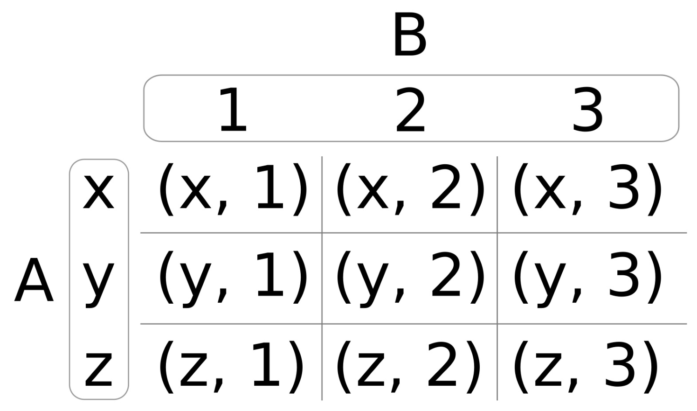
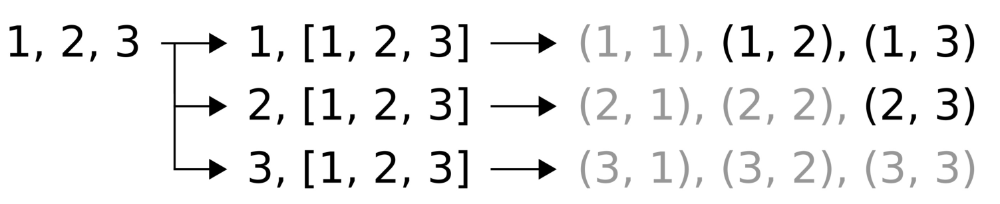

# Lambda表达式

Lambda表达式或者Lambda函数为闭包结构。闭包是描述未命名对象的通用术语，也可以称为匿名函数。为了在C++中加入这个特性，就需要相应对象实现`()`括号操作符。C++11之前想要实现类似具有Lambda的对象，代码如下所示：

```
#include <iostream>
#include <string>
int main() {
    struct name_greeter {
        std::string name;

        void operator()() {
            std::cout << "Hello, " << name << '\n';
        }
    };

    name_greeter greet_john_doe {"John Doe"};
    greet_john_doe();
}
```

构造`name_greeter`对象需要传入一个字符串。这里需要注意的是，这个结构类型，Lambda可以使用一个没有名字的实例来表示。对于闭包结构来说，我们称之为捕获一个字符串。其就像我们在构造这个例子中的实例时传入的字符串一样，不过Lambda不需要参数，就能完成打印`Hello, John Doe`。

C++11之后，使用闭包的方式来实现会更加简单：

```
#include <iostream>
int main() {
    auto greet_john_doe ([] {
        std::cout << "Hello, John Doe\n";
    });
    greet_john_doe();
}
```

这样就行了！不再需要`name_greeter`结构体，直接使用Lambda表达式替代。

## 使用Lambda表达式定义函数

### How to do it...

```
#include <iostream>
#include <string>

int main()
{
    auto just_one ( [](){ return 1; } );
    auto just_two ( []  { return 2; } );
    
    std::cout << just_one() << ", " << just_two() << '\n';    
```

现在，来定义另一个函数对象，其名为plus，因为它要将两个参数进行加和：

```
	auto plus ( [](auto l, auto r) { return l + r; } );
	std::cout << plus(1, 2) << '\n';
    std::cout << plus(std::string{"a"}, "b") << '\n';
```

当然，我们可以不使用变量的方式对Lambda表达式进行保存。我们只需要在使用到的地方对其进行定义即可：

```
    std::cout
        << [](auto l, auto r){ return l + r; }(1, 2)
        << '\n';
```

接下来，我们定义一个闭包，包里面装着一个计数器。当我们调用这个计数器时，其值就会自加，并且会将自加后的值返回。为了对计数变量进行初始化，我们(在中括号对中)对`count`进行了赋值。为了能让函数对获取的值进行修改，我们使用`mutable`关键字对函数进行修饰，否则在编译时会出问题：

```
    auto counter (
        [count = 0] () mutable { return ++count; }
    );
```

现在让我们调用函数对象5次，并且打印其返回值，观察每次调用后计数器增加后的值：

```
    for (size_t i {0}; i < 5; ++i) {
        std::cout << counter() << ", ";
    }
    std::cout << '\n';
```

我们也可以通过捕获已经存在的变量的引用，在闭包中进行修改。这样的话，捕获到的值会自加，并且在闭包外部也能访问到这个变量。为了完成这个任务，我们在中括号对中写入`&a`，`&`符号就意味着捕获的是对应变量的引用，而非副本：

```
    int a {0};
    auto incrementer ( [&a] { ++a; } );
```

如果这样能行，那我们就可以多次的调用这个函数对象，并且直接在外部对a变量的值进行观察：

```
   incrementer();
   incrementer();
   incrementer();

   std::cout
       << "Value of 'a' after 3 incrementer() calls: "
       << a << '\n';
```

最后一个例子是一个多方位展示，这个例子中一个函数对象可以接受参数，并且将其传入另一个函数对象中进行保存。在这个`plus_ten`函数对象中，我们会调用`plus`函数对象：

```
    auto plus_ten ( [=] (int x) { return plus(10, x); } );
    std::cout << plus_ten(5) << '\n';
}
```

### How it works...

Lambda表达式的特点：

```
[capture list] (parameters)
    mutable            (optional)
    constexpr        (optional)
    exception attr    (optional)
    -> return type    (optional)
{
    body
}
```

Lambda表达式的最短方式可以写为`[]{}`。其没有参数，没有捕获任何东西，并且也不做实质性的执行。

#### 捕获列表 capture list

指定我们需要捕获什么。其由很多种方式，我们展示两种比较“懒惰”的方式：

- 将Lambda表达式写成`[=] () {...}`时，会捕获到外部所有变量的副本。
- 将Lambda表达式写成`[&] () {...}`时，会捕获到外部所有变量的引用。

当然，也可以在捕获列表中单独的去写需要捕获的变量。比如`[a, &b] () {...}`，就是捕获`a`的副本和`b`的引用，这样捕获列表就不会去捕获那些不需要捕获的变量。

我们定义了一个Lambda表达式：`[count=0] () {...}`，这样我们就不会捕获外部的任何变量。我们定义了一个新的`count`变量，其类型通过初始化的值的类型进行推断，由于初始化为0，所以其类型为`int`。

所以，可以通过捕获列表捕获变量的副本和/或引用：

- `[a, &b] () {...}`：捕获`a`的副本和`b`的引用。
- `[&, a] () {...}`：除了捕获`a`为副本外，其余捕获的变量皆为引用。
- `[=, &b, i{22}, this] () {...}`：捕获`b`的引用，`this`的副本，并将新变量`i`初始化成22，并且其余捕获的变量都为其副本。

当你需要捕获一个对象的成员变量时，不能直接去捕获成员变量。需要先去捕获对象的`this`指针或引用。

#### mutable (optional)

当函数对象需要去修改通过副本传入的变量时，表达式必须用`mutable`修饰。这就相当于对捕获的对象使用非常量函数。

**constexpr (optional)**

如果我们显式的将Lambda表达式修饰为`constexpr`，编译器将不会通过编译，因为其不满足`constexpr`函数的标准。`constexpr`函数有很多条件，编译器会在编译时对Lambda表达式进行评估，看其在编译时是否为一个常量参数，这样就会让程序的二进制文件体积减少很多。

当我们不显式的将Lambda表达式声明为`constexpr`时，编译器就会自己进行判断，如果满足条件那么会将Lambda表达式隐式的声明为`constexpr`。当我们需要一个Lambda表达式为`constexpr`时，我们最好显式的对Lambda的表达式进行声明，当编译不通过时，编译器会告诉我们哪里做错了。

**exception attr (optional)**

这里指定在运行错误时，是否抛出异常。

**return type (optional)**

当想完全控制返回类型时，我们不会让编译器来做类型推导。我们可以写成这样`[] () -> Foo {}`，这样就告诉编译器，这个Lambda表达式总是返回`Foo`类型的结果。

## 使用Lambda为std::function添加多态性

### How to do it...

本节我们将创建很多Lambda表达式，其捕获类型是完全不同的，但是其函数签名的类型是相同的。然后，使用`std::function`将这些函数对象存入一个`vector`：

```
 #include <iostream>
 #include <deque>
 #include <list>
 #include <vector>
 #include <functional>
```

我们先实现一个简单的函数，其返回值是一个Lambda表达式。其需要传入一个容器，并且返回一个函数对象，这个函数对象会以引用的方式捕获容器。且函数对象本身接受传入一个整型参数。当向函数对象传入一个整型时，表达式将会把传入的整型，添加到捕获的容器尾部：

```
template <typename C>
static auto consumer (C &container)
    return [&] (auto value) {
        container.push_back(value);
    };
}

template <typename C>
static void print (const C &c)
{
    for (auto i : c) {
        std::cout << i << ", ";
    }
    std::cout << '\n';
}

int main()
{
    std::deque<int> d;
    std::list<int> l;
    std::vector<int> v;    
```

现在使用`consumer`函数对象与刚刚实例化的容器进行配合：将在`vector`中存储生成自定义的函数对象。然后，用一个`vector`存放着三个函数对象。每个函数对象都会捕获对应的容器对象。这些容器对象都是不同的类型，不过都是函数对象。所以，`vector`中的实例类型为`std::function<void(int)>`。所有函数对象都将隐式转换成一个`std::function`对象，这样就可以存储在`vector`中了。

 ```
    const std::vector<std::function<void(int)>> consumers
        {consumer(d), consumer(l), consumer(v)};
 ```

现在我们将10个整型值传入自定义函数对象：

```
    for (size_t i {0}; i < 10; ++i) {
        for (auto &&consume : consumers) {
            consume(i);
        }
    }
```

三个容器都包含了同样的10个整数。让我们来打印它们：

```
    print(d);
    print(l);
    print(v);
}
```

### How it works...

```
const std::vector<std::function<void(int)>> consumers
    {consumer(d), consumer(l), consumer(v)};
```

d，l和v对象都包装进一个`consumer(...)`调用中。这个调用会返回多个函数对象，这样每个函数对象都能捕获这三个容器实例。虽然函数对象只能接受`int`型变量为参数，但是其捕获到的是完全不同的类型。这就将不同类型的A、B和C变量存入到一个`vector`中一样。

为了这个功能，需要找到一个共同的类型，也就是能保存不同类型的函数对象，这个类型就是`std::function`。一个`std::function<void(int)>`对象可以存储我们的函数对象或传统函数，其接受只有一个整型参数和返回为空的函数类型。这里使用了多态性，为函数类型进行解耦。思考如下的写法：

```
std::function<void(int)> f (
    [&vector](int x) { vector.push_back(x); });
```

这里有个函数对象，将Lambda表达式包装入`std::function`对象当中，当我们调用`f(123)`时，会产生一个虚函数调用，其会重定向到对象内部的实际执行函数。

当存储函数对象时，`std::function`就显得非常智能。当我们使用Lambda表达式捕获越来越多的变量时，`std::function`实例的体积也会越来越大。如果对象体积特别特别巨大，那么其将会在堆上分配出对应内存空间来存放这个函数对象。这些对于我们代码的功能性并没有什么影响，这里需要让你了解一下是因为这样的存储方式会对性能有一定的影响。

## 并置函数

### How to do it...

```
#include <iostream>
#include <functional>
```

然后，我们实现一个辅助函数`concat`，其可以去任意多的参数。这些参数都是函数，比如f，g和h。并且一个函数的结果是另一个函数的输入，可以写成`f(g(h(...)))`:

```
template <typename T, typename ...Ts>
auto concat(T t, Ts ...ts)
{
```

现在，代码就会变有些复杂了。当用户提供函数f，g和h时，我们现将其转换为`f( concat(g,h))`，然后再是`f(g(concat(h)))`，类似这样进行递归，直到得到`f(g(h(...)))`为止。用户提供的这些函数都可以由Lambda表达式进行捕获，并且Lambda表达式将在之后获得相应的参数p，然后前向执行这些函数`f(g(h(p)))`。这个Lambda表达式就是我们要返回的。`if constexpr`结构会检查在递归步骤中，当前函数是否串联了多个函数：

```
    if constexpr (sizeof...(ts) > 0) {
        return [=](auto ...parameters) {
            return t(concat(ts...)(parameters...));
        };
    }
```

当我们到达递归的末尾，编译器会选择`if constexpr`的另一分支。这个例子中，我们只是返回函数`t`，因为其传入的只有参数了：

```
    else {
           return t;
    }
}
```

现在，让我们使用刚创建的函数连接器对函数进行串联。我们先在主函数的起始位置定义两个简单的函数对象：

```
int main()
{
    auto twice ([] (int i) { return i * 2; });
    auto thrice ([] (int i) { return i * 3; });
```

现在，来串联他们。这里我们将两个乘法器函数和一个STL函数`std::plus<int>`放在一起，STL的这个函数可以接受两个参数，并返回其加和。这样我们就得到了函数`twice(thrice(plus( a, b )))`:

```
    auto combined (
        concat(twice, thrice, std::plus<int>{})
    );
```

我们来应用一下。`combined`函数现在看起来和一般函数一样，并且编译器会将这些函数连接在一起，且不产生任何不必要的开销：

```
    std::cout << combined(2, 3) << '\n';
}
```

编译运行这个例子就会得到如下的结果，和我们的期望一致，因为`2 * 3 * (2 + 3)`为30：

### How it works...

`concat`函数是本节的重点。其函数体看起来非常的复杂，因为其要对另一个Lambda表达式传过来`ts`参数包进行解析，`concat`会递归多次调用自己，每次调用参数都会减少：

```
template <typename T, typename ...Ts>
auto concat(T t, Ts ...ts)
{
    if constexpr (sizeof...(ts) > 0) {
        return [=](auto ...parameters) {
            return t(concat(ts...)(parameters...));
        };
    } else {
        return [=](auto ...parameters) {
            return t(parameters...);
        };
    }
}
```

让我们写一个简单点的版本，这次串联了三个函数：

```
template <typename F, typename G, typename H>
auto concat(F f, G g, H h)
{
    return [=](auto ... params) {
        return f( g( h( params... ) ) );
    };
}
```

这个例子看起来应该很简单了吧。返回的Lambda表达式可以对f，g和h函数进行捕获。这个Lambda表达式可以接受任意多的参数传入，然后在调用f，g和h函数。我们先定义`auto combined (concat(f, g, h))`，并在之后传入两个参数，例如`combined(2, 3)`，这里的2和3就为`concat`函数的参数包。

看起来很复杂，但`concat`却很通用，有别与`f(g(h( params... )))`式的串联。我们完成的是`f(concat(g, h))(params...)`的串联，`f(g(concat(h)))(params...)`为其下一次递归调用的结果，最终会的结果为`f(g(h( params...)))`。

## 通过逻辑连接创建复杂谓词

### How to do it...

我们将来实现一个非常简单的字符串过滤谓词，并且将其和辅助函数结合让其变得更加通用。

```
#include <iostream>
#include <functional>
#include <string>
#include <iterator>
#include <algorithm>

using namespace std;
```

这里实现两个简单的谓词函数，后面会用到它们。第一个谓词会告诉我们字符串的首字母是否是`a`，第二个谓词则会告诉我们字符串的结尾字母是否为`b`：

```
static bool begins_with_a (const std::string &s)
{
    return s.find("a") == 0;
}
static bool ends_with_b (const std::string &s)
{
    return s.rfind("b") == s.length() - 1;
}
```

现在，让我们来实现辅助函数，我们称其为`combine`。其需要一个二元函数作为其第一个参数，可以是逻辑'与'或逻辑'或'操作。之后的两个参数为需要结合在一起的谓词函数：

```
template <typename A, typename B, typename F>
auto combine(F binary_func, A a, B b)
{
```

之后，我们会返回一个Lambda表达式，这个表达式可以获取到两个合并后的谓词。这个表达式需要一个参数，这个参数会传入两个谓词中，然后表达式将返回这个两个谓词结合后的结果：

```
    return [=](auto param) {
        return binary_func(a(param), b(param));
    };
}
```

现在，让将两个谓词函数合并在一起，形成另一个全新的谓词函数，其会告诉我们输入的字符串是否以'a'开头，并且以'b'结尾，比如"ab"或"axxxb"就会返回true。二元函数我们选择`std::logical_and`。这是个模板类，需要进行实例化，所以这里我们使用大括号对创建其实例。需要注意的是，因为该类的默认类型为void，所以这里我们并没有提供模板参数。特化类的参数类型，都由编译器推导得到：

```
int main()
{
    auto a_xxx_b (combine(
        logical_and<>{},
        begins_with_a, ends_with_b));
```

我们现在可以对标准输入进行遍历，然后打印出满足全新谓词的词组：

```
    copy_if(istream_iterator<string>{cin}, {},
            ostream_iterator<string>{cout, ", "},
            a_xxx_b);
    cout << '\n';
}
```

### There's more...

STL已经提供了一些非常有用的函数对象，例如`std::logical_and`，`std::logical_or`等等。所以我们没有必要所有东西都自己去实现。可以去看一下C++的参考手册，了解一下都有哪些函数对象已经实现：

- 英文：http://en.cppreference.com/w/cpp/utility/functional
- 中文：http://zh.cppreference.com/w/cpp/utility/functional

## 使用同一输入调用多个函数

### How to do it..

我们将要完成两个Lambda表达式辅助器，一个能接受一组参数，并调用多个函数对象；另一个使用一个函数调用，引发后续多个函数调用。我们的例子中，我们将使用不同的打印函数打印一些信息出来。

```
#include <iostream>
```

首先，让我们实现`multicall`函数，这个函数是本章的重点。这个函数可以接受任意数量的参数，并且返回一个Lambda表达式，这个Lambda表达式只接受一个参数。表达式可以通过这个参数调用所有已提供的函数。这样，我们可以定义`auto call_all (multicall(f, g, h))`函数对象，然后调用`call_all(123)`，从而达到同时调用`f(123); g(123); h(123);`的效果。这个函数看起来比较复杂，是因为我们需要一个语法技巧来展开参数包functions，并在`std::initializer_list`实例中包含一系列可调用的函数对象。

```
template <typename ... Ts>
static auto multicall (Ts ...functions)
{
    return [=](auto x) {
        (void)std::initializer_list<int>{
            ((void)functions(x), 0)...
        };
    };
}
```

下一个辅助器能接受一个函数f和一个参数包`xs`。这里要表示的就是参数包中的每个参数都会传入f中运行。这种方式类似于`for_each(f, 1, 2, 3)`调用，从而会产生一系列调用——`f(1); f(2); f(3);`。本质上来说，这个函数使用同样的技巧来为函数展开参数包`xs`：

```
template <typename F, typename ... Ts>
static auto for_each (F f, Ts ...xs) {
    (void)std::initializer_list<int>{
           ((void)f(xs), 0)...
    };
}
```

`brace_print`函数能接受两个字符，并返回一个新的函数对象，这个函数对象可以接受一个参数`x`。其将会打印这个参数，当然会让之前的两个字符将这个参数包围：

```
static auto brace_print (char a, char b) {
    return [=] (auto x) {
        std::cout << a << x << b << ", ";
    };
}
```

现在，我们终于可以在main函数中使用这些定义好的东西了。首先，我们定义函数f，g和h。其使用括号打印函数将其参数进行包围。`nl`函数只打印换行符。

```
int main()
{
    auto f (brace_print('(', ')'));
    auto g (brace_print('[', ']'));
    auto h (brace_print('{', '}'));
    auto nl ([](auto) { std::cout << '\n'; });
```

让我们将所有函数和`multicall`辅助器放在一起：

```
    auto call_fgh (multicall(f, g, h, nl));
```

这里我们提供一组数字，之后这些数字就会被相应的括号包围，然后打印出来。这样，我们现在调用一次，就等于以前调用五次主函数中定义的函数。

```
    for_each(call_fgh, 1, 2, 3, 4, 5);
}
```

### How it works...

再来看一下`for_each`的实现：

```
auto for_each ([](auto f, auto ...xs) {
    (void)std::initializer_list<int>{
        ((void)f(xs), 0)...
    };
});
```

这段代码的核心在于`f(xs)`表达式。`xs`是一个参数包，我们需要将其进行解包，才能获取出独立的参数，以便调用函数f。不幸的是，我们知道这里不能简单的使用`...`标记，写成`f(xs)...`。

所以，我能做的只能是构造出一个`std::initializer_list`列表，其具有一个可变的构造函数。表达式可以直接通过`return std::initializer_list<int>{f(xs)...};`方式构建，不过其也有缺点。在让我们看一下`for_each`的实现，看起来要比之前简单许多：

```
auto for_each ([](auto f, auto ...xs) {
    return std::initializer_list<int>{f(xs)...};
});
```

这看起来非常简单易懂，但是我们要了解其缺点所在：

1. 其使用f函数的所有调用返回值，构造了一个初始化列表。但我们并不关心返回值。
2. 虽然其返回的初始化列表，但是我们想要一个“即发即弃”的函数，这些函数不用返回任何东西。
3. f在这里可能是一个函数，因为其不会返回任何东西，可能在编译时就会被优化掉。

要想`for_each`修复上面所有的问题，会让其变的更加复杂。例子中做到了一下几点：

1. 不返回初始化列表，但会将所有表达式使用`(void)std::initializer_list<int>{...}`转换为`void`类型。
2. 初始化表达式中，其将`f(xs)...`包装进`(f(xs),0)...`表达式中。这会让程序将返回值完全抛弃，不过0将会放置在初始化列表中。
3. `f(xs)`在`(f(xs), 0)...`表达式中，将会再次转换成`void`，所以这里就和没有返回值一样。

这些不幸的事导致例程如此复杂丑陋，不过其能为所有可变的函数对象工作，并且不管这些函数对象是否返回值，或返回什么样的值。

这种技术可以很好控制函数调用的顺序，严格保证多个函数/函数对象以某种顺序进行调用。

## 使用std::accumulate和Lambda函数实现transform_if

大多数用过`std::copy_if`和`std::transform`的开发者可能曾经疑惑过，为什么标准库里面没有`std::transform_if`。`std::copy_if`会将源范围内符合谓词判断的元素挑出来，不符合条件的元素忽略。而`std::transform`会无条件的将源范围内所有元素进行变换，然后放到目标范围内。这里的变换谓词是由用户提供的一个函数，这个函数不会太复杂，比如乘以多个数或将元素完全变换成另一种类型。

### How to do it...

```
#include <iostream>
#include <iterator>
#include <numeric>
```

首先，我们来实现一个`map`函数。其能接受一个转换函数作为参数，然后返回一个函数对象，这个函数对象将会和`std::accumulate`一起工作。

当传入一个递减函数时，我们会返回一个函数对象，当这个函数对象调用递减函数时，其会返回另一个函数对象，这个函数对象可以接受一个累加器和一个输入参数。递减函数会在累加器中进行调用，并且`fn`将会对输入变量进行变换。如果这里看起来比较复杂的话，我们将在后面进行详细的解析：

```
template <typename T>
auto map(T fn)
{
    return [=] (auto reduce_fn) {
        return [=] (auto accum, auto input) {
            return reduce_fn(accum, fn(input));
        };
    };
}
```

现在，让我们来实现一个`filter`函数。其和`map`的工作原理一样，不过其不会对输入进行修改(`map`中会对输入进行变换)。另外，我们接受一个谓词函数，并且在不接受谓词函数的情况下，跳过输入变量，而非减少输入变量：

 ```
template <typename T>
auto filter(T predicate)
{
    return [=] (auto reduce_fn) {
        return [=] (auto accum, auto input) {
            if (predicate(input)) {
                return reduce_fn(accum, input);
            } else {
                return accum;
            }
        };
    };
}
 ```

两个Lambda表达式与`map`函数具有相同的函数签名。其不同点在于`input`参数是否进行过操作。谓词函数用来区分我们是否对输入调用`reduce_fn`函数，或者直接调用累加器而不进行任何修改：

现在让我们使用这些辅助函数。我们实例化迭代器，我们会从标准输入中获取整数值：

```
int main()
{
    std::istream_iterator<int> it {std::cin};
    std::istream_iterator<int> end_it;
    
    auto even ([](int i) { return i % 2 == 0; });
    auto twice ([](int i) { return i * 2; });
    auto copy_and_advance ([](auto it, auto input) {
        *it = input;
        return ++it;
    });
```

我们对标准输入进行迭代，通过输出迭代器`ostream_iterator`将对应的值输出在终端上。 `copy_and_advance`函数对象将会接收用户输入的整型值，之后使用输出迭代器进行输出。将值赋值给输出迭代器，将会使打印变得高效。不过，我们只会将偶数挑出来，然后对其进行乘法操作。为了达到这个目的，我们将`copy_and_advance`函数包装入`even`过滤器中，再包装入`twice`引射器中：

```
    std::accumulate(it, end_it,
        std::ostream_iterator<int>{std::cout, ", "},
        filter(even)(
            map(twice)(
                copy_and_advance
            )
        ));
    std::cout << '\n';
}
```

### How it works...

我们先了解一下`std::accumulate`的内部工作原理。下面的实现类似一个标准函数的实现：

```
template <typename T, typename F>
T accumulate(InputIterator first, InputIterator last, T init, F f)
{
    for (; first != last; ++first) {
        init = f(init, *first);
    }
    return init;
}
```

函数参数f在这起到主要作用，所有值都会累加到用户提供的`init`变量上。通常情况下，迭代器范围将会传入一组数字，类似`0, 1, 2, 3, 4`，并且`init`的值为0。函数`f`只是一个二元函数，其会计算两个数的加和。

例子中循环将会将所有值累加到`init`上，也就类似于`init += (((0 + 1) + 2) + 3) + 4`。这样看起来`std::accumulate`就是一个通用的折叠函数。折叠范围意味着，将二值操作应用于累加器变量和迭代范围内的每一个值(累加完一个数，再累加下一个数)。这个函数很通用，可以用它做很多事情，就比如实现`std::transform_if`函数！`f`函数也会递减函数中进行调用。

`transform_if`的一种很直接的实现，类似如下代码：

 ```
template <typename InputIterator, typename OutputIterator, typename P, typename Transform>
OutputIterator transform_if(InputIterator first, InputIterator last,OutputIterator out,P predicate, Transform trans)
{
    for (; first != last; ++first) {
        if (predicate(*first)) {
            *out = trans(*first);
            ++out;
        }
    }
    return out;
}
 ```

这个实现看起来和`std::accumulate`的实现很类似，这里的`out`参数可以看作为`init`变量，并且使用函数`f`替换`if`。

我们确实做到了。我们构建了`if`代码块，并且将二元函数对象作为一个参数提供给了`std::accumulate`：

```
auto copy_and_advance ([](auto it, auto input) {
    *it = input;
    return ++it;
});
```

`std::accumulate`会将`init`值作为二元函数`it`的参数传入，第二个参数则是当前迭代器所指向的数据。我们提供了一个输出迭代器作为`init`参数。这样`std::accumulate`就不会做累加，而是将其迭代的内容转发到另一个范围内。这就意味着，我们只需要重新实现`std::copy`就可以了。

通过`copy_and_advance`函数对象，使用我们提供的谓词，将过滤后的结果传入另一个使用谓词的函数对象：

````
template <typename T>
auto filter(T predicate)
{
    return [=] (auto reduce_fn) {
        return [=] (auto accum, auto input) {
            if (predicate(input)) {
                return reduce_fn(accum, input);
            } else {
                return accum;
            }
        };
    };
}
````

构建过程看上去没那么简单，不过先来看一下`if`代码块。当`predicate`函数返回true时，其将返回`reduce_fn`函数处理后的结果，也就是`accum`变量。这个实现省略了使用过滤器的操作。`if`代码块位于Lambda表达式的内部，其具有和`copy_and_advance`一样的函数签名，这使它成为一个合适的替代品。

现在我们就要进行过滤，但不进行变换。这个操作有`map`辅助函数完成：

```
template <typename T>
auto map(T fn)
{
    return [=] (auto reduce_fn) {
        return [=] (auto accum, auto input) {
            return reduce_fn(accum, fn(input));
        };
    };
}
```

这段代码看起来就简单多了。其内部有一个还有一个Lambda表达式，该表达式的函数签名与`copy_and_advance`，所以可以替代`copy_and_advance`。这个实现仅转发输入变量，不过会通过二元函数对`fn`的调用，对参数进行量化。

之后，当我们使用这些辅助函数时，我们可以写成如下的表达式：

```
filter(even)(
    map(twice)(
        copy_and_advance
    )
)
```

`filter(even)`将会捕获`even`谓词，并且返回给我们一个函数，其为一个包装了另一个二元函数的二元函数，被包装的那个二元函数则是进行过滤的函数。`map(twice)`函数做了相同的事情，`twice`变换函数，将`copy_and_advance`包装入另一个二元函数中，那另一个二元函数则是对参数进行变换的函数。

虽然没有任何的优化，但我们的代码还是非常的复杂。为了让函数之间能一起工作，我们对函数进行了多层嵌套。不过，这对于编译器来说不是一件很难的事情，并且能对所有代码进行优化。程序最后的结果要比实现`transform_if`简单很多。

## 编译时生成笛卡尔乘积

笛卡尔乘积是一个数学运算。其可以表示为`A x B`，其意思为使用集合A和集合B来结算笛卡尔乘积。结果为另一个单独的集合，其包含集合A和集合B一一对应的组对。这个运算的意义在于，将两个集合中的元素进行匹配。下图就描述了这种运算操作：



图中，`A = (x, y, z)`，`B = (1, 2, 3)`，所产生的笛卡尔乘积为`(x, 1)` , `(x, 2)` ,`(x, 3)`,`(y, 1)` ,`(y, 2)`等等。如果A和B为同一个集合，比如说是`(1, 2)`，那么其笛卡尔乘积为`(1, 1)` , `(1, 2)` ,`(2, 1)`, 和`(2, 2)`。有时候，这样的操作却十分冗余，比如集合`(1, 1)`，或是刚才例子中的`(1, 2)`和`(2, 1)`。笛卡尔乘积可以通过一个简单的条件，对结果进行过滤。

### How to do it...

我们实现了一个函数对形象，其能接受一个函数`f`，以及一组参数。该函数对象将会通过输出参数集合创建笛卡尔乘积，将冗余的部分进行过滤，并对每个乘积调用函数`f`。

```
#include <iostream>
static void print(int x, int y)
{
    std::cout << "(" << x << ", " << y << ")\n";
}

int main()
{
```

我们先实现了一个辅助函数`cartesian`，我们将在下一步实现这个函数。这个函数能接受一个参数`f`，在我们使用过程中，这个`f`函数就是`print`函数。另一些参数是`x`和参数包`rest`。其包含了计算笛卡尔乘积的元素。在`f(x, rest)`表达式中：当`x=1`和`rest=2, 3, 4`，为了得到结果，我们需要调用三次:`f(1, 2); f(1, 3); f(1, 4);`。`(x < rest)`的条件，会删除冗余的组对。我们来看下代码：

```
    constexpr auto call_cart (
        [=](auto f, auto x, auto ...rest) constexpr {
            (void)std::initializer_list<int>{
                (((x < rest)
                    ? (void)f(x, rest)
                    : (void)0)
                ,0)...
            };
        });
```

`cartesian`函数在本节中，算是最复杂的部分了。其能接受一个参数包`xs`，并返回一个其捕获的函数对象。返回的函数对象能接受一个函数对象`f`。参数包，比如`xs = 1, 2, 3`，其内部Lambda表达式将会生成如下调用：call_cart(f, **1**, 1, 2, 3); call_cart(f, **2**, 1, 2, 3); call_cart(f, **3**, 1, 2, 3);。通过对这些函数的调用，我们能得到我们想要的所有笛卡尔乘积。我们使用`...`对`xs`参数包扩展了两次，第一次看起来有些奇怪。调用`call_cart`时，我们第一次对`xs`进行了扩展。第二次扩展将会使得`call_cart`调用多次，并且每次的第二个参数都会不同。

```
   constexpr auto cartesian ([=](auto ...xs) constexpr {
       return [=] (auto f) constexpr {
           (void)std::initializer_list<int>{
               ((void)call_cart(f, xs, xs...), 0)...
           };
       };
   });
```

那么，现在让我们使用数字集`1, 2, 3`来生成笛卡尔乘积，并对组对进行打印。过滤了冗余的组对，所剩的结果应该为 `(1, 2)` , `(2, 3)` , 和 `(1, 3)`。我们对很多的结果进行了过滤，并且不考虑结果中组对中的数字顺序。这也就是说，我们不需要`(1, 1)`，并且认为`(1, 2)`和`(2, 1)`为同一个组对。首先，我们让`cartesian`函数产生一个函数对象，其会包含所有可能的组对，并且能够接受我们的打印函数。然后，我们将所产生的组对，使用打印函数进行打印输出。我们将`print_cart`变量声明为`constexpr`，这样我们就能在编译时获得所有的乘积结果:

```
    constexpr auto print_cart (cartesian(1, 2, 3));

    print_cart(print);
}
```

### How it works...



- 我们将`1, 2, 3`作为新集合中的三个元素，其报了三个新的集合。第一个则是集合中的每一个单独向，而第二部分则是整个集合本身。
- 我们可以将第一个元素与每一个元素相组合(包括自己)，就能得到很多组对。
- 对于三个结果组对来说，我们只需要将其中不冗余的部分取出就好。

```
constexpr auto cartesian ([=](auto ...xs) constexpr {
    return [=](auto f) constexpr {
        (void)std::initializer_list<int>{
            ((void)call_cart(f, xs, xs...), 0)...
        };
    };
});
```

内部表达式`call_cart(xs, xs...)`将会对集合`1, 2, 3`分别进行表示，比如：`1, [1, 2, 3]`。整个表达式`((void)call_cart(f, xs, xs...), 0)...`其将`...`放在外部，其会将集合进行拆解，我们将会得到`2，[1, 2, 3]`和`3, [1, 2, 3]`。

`call_cart`完成了第2和第3步：

```
auto call_cart ([](auto f, auto x, auto ...rest) constexpr {
    (void)std::initializer_list<int>{
        (((x < rest)
            ? (void)f(x, rest)
            : (void)0)
        ,0)...
    };
});
```

参数`x`始终包含从这个集合中挑出的但选值，并且`rest`包含了整个集合。让我么先忽略`x < rest`这个条件。这里，`f(x, rest)`表达式与`...`参数包展开所得到的调用`f(1, 1)`，`f(1, 2)`等等，其就会生成将被打印的组对。这就是第2步完成的事。

第3步中，就是用`x < rest`条件来过滤冗余的组对了。

我们先给所有Lambda表达式和持有变量声明成`constexpr`。通过这样做，我们可以在运行时对代码进行评估，这样编译出的二进制文件将会包含所有组对，而无需在运行时对其进行计算。需要注意的是，这里需要传入常量函数的参数为已知量，这样才能在运行时让编译器知道，并对函数进行执行。


