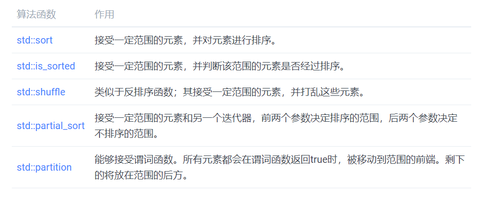
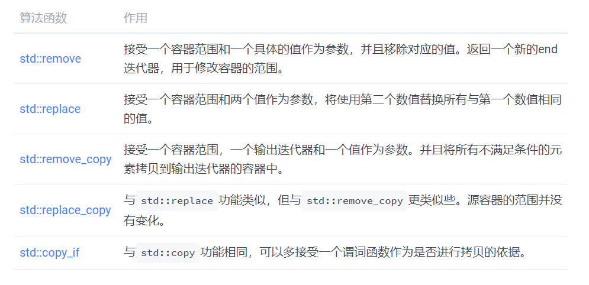
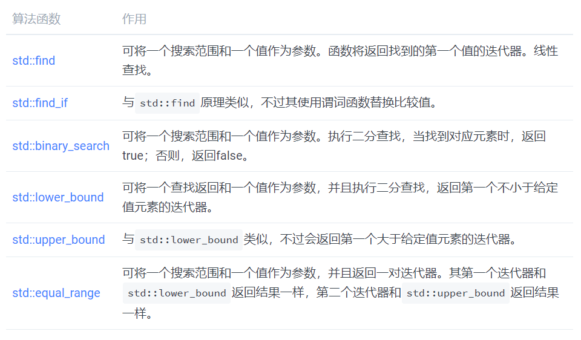
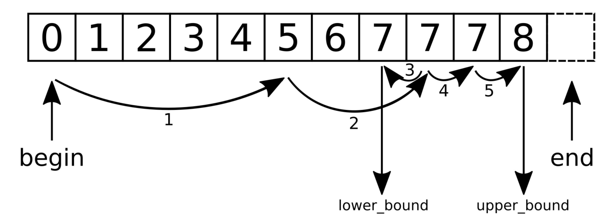
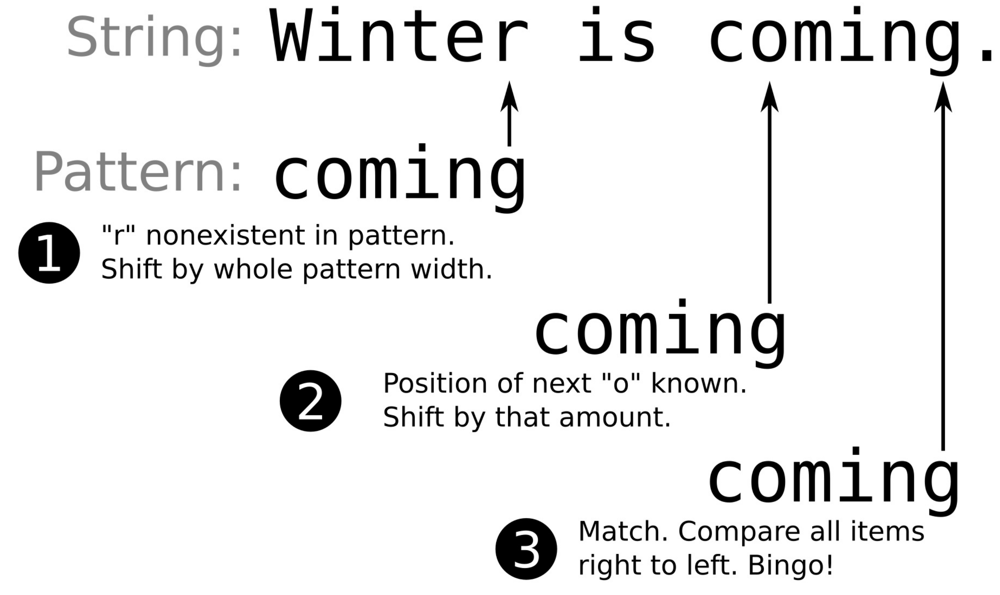
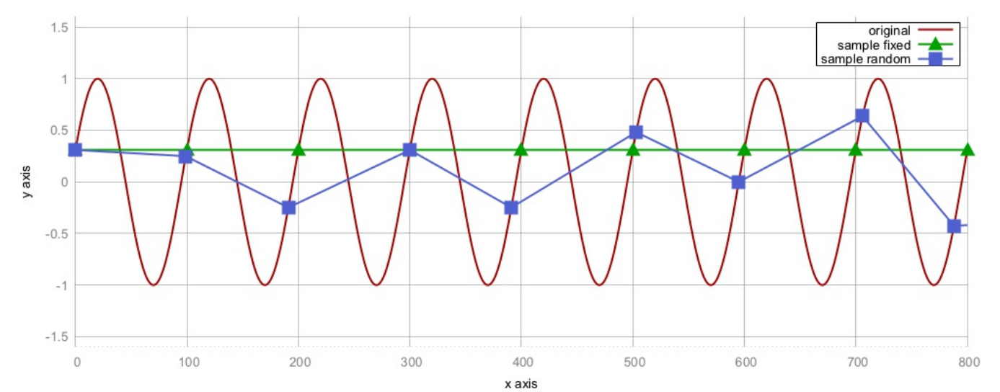
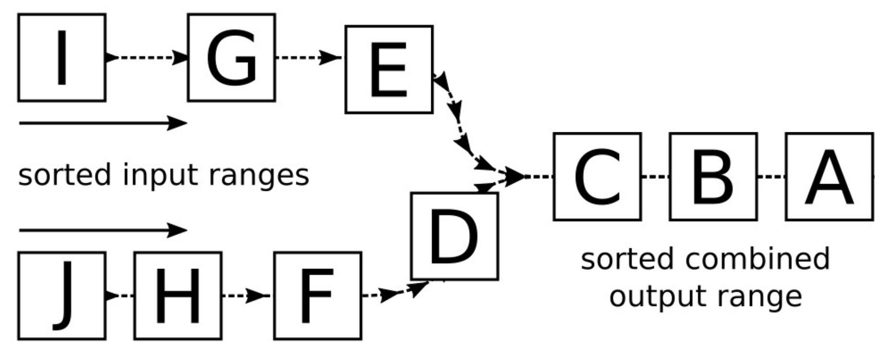

# STL基础算法

使用STL算法的好处：

- **维护性**：算法的名字已经说明它要做什么了。显式使用循环的方式与使用STL算法的方式没法对比。
- **正确性**：STL是由专家编写和审阅过的，并且经过了良好的测试，重新实现的复杂程度可能是你无法想象的。
- **高效性**：STL算法真的很高效，至少要比手写的循环要强许多。

## 容器间相互复制元素

可以对`vector`，`list`，`deque`，`map`等等数据结构进行迭代。我们甚至可以使用迭代器作为文件/标准输入输出的出入口。能将迭代器接口放入算法中。这样的话，我们可以使用迭代器访问任何元素，并且可以将迭代器作为STL算法的参数传入，对特定范围内的数据进行处理。

`std::copy`算法可以很好的展示迭代器是如何将不同的数据结构进行抽象，而后将一个容器的数据拷贝到另一个容器。类似这样的算法就与数据结构的类型完全没有关系了。

### How to do it...

```
#include <iostream>
#include <vector>
#include <map>
#include <string>
#include <tuple>
#include <iterator>
#include <algorithm>

using namespace std;
```

我们将使用整型和字符串值进行组对。为了能很好的将其进行打印，我们将会重载`<<`流操作：

```
namespace std {
ostream& operator<<(ostream &os, const pair<int, string> &p)
{
    return os << "(" << p.first << ", " << p.second << ")";
}
}
```

使用整型-字符串对填充一个`vector`。并且我们声明一个`map`变量，其用来关联整型值和字符串值：

```
int main()
{
    vector<pair<int, string>> v {
        {1, "one"}, {2, "two"}, {3, "three"},
        {4, "four"}, {5, "five"}};

    map<int, string> m;
```

现在将`vector`中的前几个整型字符串对使用`std::copy_n`拷贝到`map`中。因为`vector`和`map`是两种完全不同的结构体，我们需要对`vector`中的数据进行变换，这里就要使用到`insert_iterator`适配器。`std::inserter`函数为我们提供了一个适配器。在算法中使用类似`std::copy_n`的算法时，需要与插入迭代器相结合，这是一种更加通用拷贝/插入元素的方式(从一种数据结构到另一种数据结构)，但这种方式不是最快的。使用指定数据结构的成员函数插入元素无疑是更加高效的方式：

```
    copy_n(begin(v), 3, inserter(m, begin(m)));
```

让我们打印一下`map`中的内容。纵观本书，我们会经常使用`std::copy`函数来打印容器的内容。`std::ostream_iterator`在这里很有用，因为其可以将用户的标准输出作为另一个容器，而后将要输出的内容拷贝过去：

```
    auto shell_it (ostream_iterator<pair<int, string>>{cout,
    ", "});

    copy(begin(m), end(m), shell_it);
    cout << '\n';
```

对`map`进行清理，然后进行下一步的实验。这次，我们会将`vector`的元素*移动*到`map`中，并且是所有元素：

```
    m.clear();

    move(begin(v), end(v), inserter(m, begin(m)));
```

我们将再次打印`map`中的内容。此外，`std::move`是一种改变数据源的算法，这次我们也会打印`vector`。这样，我们就会看到算法时如何对数据源进行的移动：

```
    copy(begin(m), end(m), shell_it);
    cout << '\n';

    copy(begin(v), end(v), shell_it);
    cout << '\n';
}
```

### How it works...

`std::copy`是STL中最简单的算法之一，其实现也非常短。我们可以看一下等价实现：

```
template <typename InputIterator, typename OutputIterator>
OutputIterator copy(InputIterator it, InputIterator end_it,
OutputIterator out_it)
{
    for (; it != end_it; ++it, ++out_it) {
        *out_it = *it;
    }
    return out_it;
}
```

`std::copy`并非能让代码大幅度减少的一个实现，很多其他的算法实现其实非常复杂。这种实现其实在代码层面并不明显，但STL算法更多的在于做了很多底层优化，编译器会选择最优的方式执行算法，这些底层的东西目前还不需要去了解。

这里，我们也使用了`std::move`。其和`std::copy`一样优秀，不过`std::move(*it)`会将循环中的源迭代器，从局部值(左值)转换为引用值(右值)。这个函数就会告诉编译器，直接进行移动赋值操作来代替拷贝赋值操作。对于大多数复杂的对象，这会让程序的性能更好，但会破坏原始对象。

## 容器元素排序

### How to do it...

```
#include <iostream>
#include <algorithm>
#include <vector>
#include <iterator>
#include <random>

using namespace std;
```

我们将打印整数在`vector`出现的次数，为了缩短任务代码的长度，我们在这里写一个辅助函数：

```
static void print(const vector<int> &v)
{
    copy(begin(v), end(v), ostream_iterator<int>{cout, ", "});
    cout << '\n';
}
```

开始实例化一个`vector`：

```
int main()
{
    vector<int> v {1, 2, 3, 4, 5, 6, 7, 8, 9, 10};
    
```

因为我们将使用不同的排序函数将`vector`多次打乱，所以我们需要一个随机数生成器：

```
    random_device rd;
    mt19937 g {rd()};
```

`std::is_sorted`函数会告诉我们，容器内部的值是否已经经过排序。所以这行将打印到屏幕上：

```
    cout << is_sorted(begin(v), end(v)) << '\n';
```

`std::shuffle`将打乱`vector`中的内容，之后我们会再次对`vector`进行排序。前两个参数是容器的首尾迭代器，第三个参数是一个随机数生成器：

```
    shuffle(begin(v), end(v), g);
```

现在`is_sorted`函数将返回false，所以0将打印在屏幕上，`vector`的元素总量和具体数值都没有变，不过顺序发生了变化。我们会将函数的返回值再次打印在屏幕上：

```
    cout << is_sorted(begin(v), end(v)) << '\n';
    print(v);
```

现在，在通过`std::sort`对`vector`进行排序。然后打印是否排序的结果：

```
    sort(begin(v), end(v));

    cout << is_sorted(begin(v), end(v)) << '\n';
    print(v);
```

另一个比较有趣的函数是`std::partition`。有时候，并不需要对列表完全进行排序，只需要比它前面的某些值小就可以。所以，让使用`partition`将数值小于5的元素排到前面，并打印它们：

```
    shuffle(begin(v), end(v), g);

    partition(begin(v), end(v), [] (int i) { return i < 5; });

    print(v);
```

下一个与排序相关的函数是`std::partial_sort`。我们可以使用这个函数对容器的内容进行排序，不过只是在某种程度上的排序。其会将`vector`中最小的N个数，放在容器的前半部分。其余的留在`vector`的后半部分，不进行排序：

```
    shuffle(begin(v), end(v), g);
    auto middle (next(begin(v), int(v.size()) / 2));
    partial_sort(begin(v), middle, end(v));

    print(v);
```

当我们要对没做比较操作符的结构体进行比较，该怎么办呢？让我们来定义一个结构体，然后用这个结构体来实例化一个`vector`：

```
    struct mystruct {
    int a;
    int b;
    };

    vector<mystruct> mv { {5, 100}, {1, 50}, {-123, 1000},
                       {3, 70}, {-10, 20} };
```

`std::sort`函数可以将比较函数作为第三个参数进行传入。让我们来使用它，并且传递一个比较函数。为了展示其实如何工作的，我们会对其第二个成员b进行比较。这样，我们将按`mystruct::b`的顺序进行排序，而非`mystruct::a`的顺序：

```
    sort(begin(mv), end(mv),
    [] (const mystruct &lhs, const mystruct &rhs) {
        return lhs.b < rhs.b;
    });
    
        for (const auto &[a, b] : mv) {
        cout << "{" << a << ", " << b << "} ";
    }
    cout << '\n';
}
```

### How it works...

这里我们使用了很多与排序算法相关的函数：



对于没有实现比较操作符的对象来说，想要排序就需要提供一个自定义的比较函数。其签名为`bool function_name(const T &lhs, const T &rhs)`，并且在执行过程中无副作用。

当然排序还有其他类似`std::stable_sort`的函数，其能保证排序后元素的原始顺序，`std::stable_partition`也有类似的功能。

`std::sort`对于排序有不同的实现。根据所提供的迭代器参数，其实现分为选择排序、插入排序、合并排序，对于元素数量较少的容器可以完全进行优化。在使用者的角度，我们通常都不需要了解这些。

## 从容器中删除指定元素

将过滤出的元素从数据结构中移除，或是简单的移除其中一个，但对于不同数据结构来说，操作上就完全不一样了。在链表中(比如`std::list`)，只要将对应节点的指针进行变动就好。不过，对于连续存储的结构体来说(比如`std::vector`，`std::array`，还有部分`std::deque`)，删除相应的元素时，将会有其他元素来替代删除元素的位置。当一个元素槽空出来后，那么后面所有的元素都要进行移动，来将这个空槽填满。

### How to do it...

```
#include <iostream>
#include <vector>
#include <algorithm>
#include <iterator>

using namespace std;

void print(const vector<int> &v)
{
    copy(begin(v), end(v), ostream_iterator<int>{cout, ", "});
    cout << '\n';
}
```

我们将使用简单的整数对`vector`进行实例化。然后，对`vector`进行打印，这样就能和后面的结果进行对比：

```
int main()
{
    vector<int> v {1, 2, 3, 4, 5, 6};
    print(v);
```

现在，我们移除`vector`中所有的2。`std::remove`将2值移动到其他位置，这样这个值相当于消失了。因为`vector`长度在移除元素后变短了，`std::remove`将会返回一个迭代器，这个迭代器指向新的末尾处。旧的`end`迭代器所指向的地方，实际上就没有什么意义了，所以我们可以告诉`vector`将这个位置进行擦除。我们使用两行代码来完成这个任务：

```
    {
        const auto new_end (remove(begin(v), end(v), 2));
        v.erase(new_end, end(v));
    }
    print(v);
```

现在，我们来移除奇数。为了完成移除，我们需要实现一个谓词函数，这个函数用来告诉程序哪些值是奇数，然后结合`std::remove_if`来使用。

```
    {
        auto odd_number ([](int i) { return i % 2 != 0; });
        const auto new_end (
            remove_if(begin(v), end(v), odd_number));
        v.erase(new_end, end(v));
    }
    print(v);
```

下一个尝试的算法是`std::replace`。我们使用这个函数将所有4替换成123。与`std::replace`函数对应，`std::replace_if`也存在于STL中，同样可以接受谓词函数：

```
    replace(begin(v), end(v), 4, 123);
    print(v);
```

让我们重新初始化`vector`，并为接下来的实验创建两个空的`vector`：

```
    v = {1, 2, 3, 4, 5, 6, 7, 8, 9, 10};

    vector<int> v2;
    vector<int> v3;
```

然后，我们实现两个判读奇偶数的谓词函数：

```
    auto odd_number ([](int i) { return i % 2 != 0; });
    auto even_number ([](int i) { return i % 2 == 0; });
```

接下来的两行做的事情完全相同。其将偶数拷贝到v2和v3中。第一行使用`std::remove_copy_if`函数，当相应数值不满足谓词条件时，函数会从源容器中拷贝到另一个容器中。第二行`std::copy_if`则是拷贝满足谓词条件的元素。

```
    remove_copy_if(begin(v), end(v),back_inserter(v2), odd_number);
    copy_if(begin(v), end(v), back_inserter(v3), even_number);
    
    print(v2);
    print(v3);
}
```

### How it works...



表中没有if的算法函数，都有一个*_if版本存在，其能接受谓词函数，通过谓词函数判断的结果来进行相应的操作。

## 改变容器内容

### How to do it...

我们将使用`std::transform`在拷贝的同时，修改`vector`中的元素：

```
#include <iostream>
#include <vector>
#include <string>
#include <sstream>
#include <algorithm>
#include <iterator>

using namespace std;

int main()
{
    vector<int> v {1, 2, 3, 4, 5};
```

为了打印元素，会将所有元拷贝素到`ostream_iterator`适配器中。`transform`函数可以接受一个函数对象，其能在拷贝过程中对每个元素进行操作。这个例子中，我们将计算每个元素的平方值，所以代码将打印出平方数。因为直接进行了打印，所以平方数并没有进行保存：

```
    transform(begin(v), end(v),
        ostream_iterator<int>{cout, ", "},
        [] (int i) { return i * i; });
    cout << '\n';
```

再来做另一个变换。例如，对于数字3来说，显示成`3^2 = 9`显然有更好的可读性。下面的辅助函数`int_to_string`函数对象就会使用`std::stringstream`对象进行打印操作：

```
auto int_to_string ([](int i) {
    stringstream ss;
    ss << i << "^2 = " << i * i;
    return ss.str();
});
```

这样就可以将整型值放入字符串中。可以说我么将这个证书映射到字符串中。使用`transform`函数，使我们可以拷贝所有数值到一个字符串`vector`中：

```
    vector<string> vs;

    transform(begin(v), end(v), back_inserter(vs),
        int_to_string);
    
     copy(begin(vs), end(vs), ostream_iterator<string>{cout, "\n"});
}
```

### How it works...

# How it works...

`std::transform`函数工作原理和`std::copy`差不多，不过在拷贝的过程中会对源容器中的元素进行变换，这个变换函数由用户提供。

## 在有序和无序的vector中查找元素

查找元素的目的是不同的。当想要让在一段已排序的元素中进行查找，可以使用二分查找法，这种方法要比线性查找快的多。如果没有排序，那么就只能进行线性遍历来查找对应的值。

### How to do it...

```
#include <iostream>
#include <vector>
#include <list>
#include <algorithm>
#include <string>

using namespace std;

struct city {
    string name;
    unsigned population;
};
```

搜索算法需要将元素与目标对象进行对比，所以我们需要重载`city`结构体的`==`操作符：

```
bool operator==(const city &a, const city &b) {
    return a.name == b.name && a.population == b.population;
}
```

我们也需要将`city`实例进行打印，所以我们对其输出操作符`<<`也进行了重载：

```
ostream& operator<<(ostream &os, const city &city) {
    return os << "{" << city.name << ", " << city.population << "}";
}
```

查找函数通常会返回迭代器。当函数找到相应的元素时，会返回指向其的迭代器，否则就会返回容器的`end`迭代器。第二种情况下，我们就不能对该迭代器进行访问。因为要打印输出结果，所以需要实现一个函数，这个函数会返回另一个函数对象，并会将数据结构的`end`迭代器进行包装。当要对结果进行打印时，会与容器的`end`迭代器相比较，如果不是`end`，那么打印出查找到的值；如果是`end`，则仅打印`<end>`：

```
template <typename C>
static auto opt_print (const C &container)
{
    return [end_it (end(container))] (const auto &item) {
        if (item != end_it) {
            cout << *item << '\n';
        } else {
            cout << "<end>\n";
        }
    };
}

int main()
{
    const vector<city> c {
        {"Aachen", 246000},
        {"Berlin", 3502000},
        {"Braunschweig", 251000},
        {"Cologne", 1060000}
    };
    
    auto print_city (opt_print(c));
    {
        auto found_cologne (find(begin(c), end(c),
            city{"Cologne", 1060000}));
        print_city(found_cologne);
    }
```

当不需要知道对应城市的人口数量时，就不需要使用`==`操作符，只需要比较城市名称就好。`std::find_if`函数可以接受一个函数对象作为谓词函数。这样，就能只使用城市名来查找“科隆”了：

```
    {
        auto found_cologne (find_if(begin(c), end(c),
            [] (const auto &item) {
            return item.name == "Cologne";
            }));
        print_city(found_cologne);
    }
```

为了让搜索更加优雅，可以实现谓词构建器。`population_higher_than`函数对象能接受一个人口数量，并且返回人口数量比这个数量多的城市。在这个小数据集中找一下多于2百万人口的城市。例子中，只有柏林(Berlin)符合条件：

```
{
   auto population_more_than ([](unsigned i) {
       return [=] (const city &item) {
           return item.population > i;
       };
   });
   auto found_large (find_if(begin(c), end(c),
       population_more_than(2000000)));
   print_city(found_large);
}
```

使用的查找函数，线性的遍历容器，查找的时间复杂度为O(n)。STL也有二分查找函数，其时间复杂度为O(log(n))。让我们生成一个新的数据集，其包含了一些整数，并构建了另一个`print`函数:

```
    const vector<int> v {1, 2, 3, 4, 5, 6, 7, 8, 9, 10};

    auto print_int (opt_print(v));
```

`std::binary_search`函数会返回一个布尔值，这个布尔值会告诉你函数是否找到了相应的元素，但是不会将指向元素的迭代器返回。二分查找需要查找的列表是已排序的，否则二分查找将出错：

```
    bool contains_7 {binary_search(begin(v), end(v), 7)};
    cout << contains_7 << '\n';
```

如果需要获得查找的元素，就需要使用其他STL函数。其中之一就是`std::equal_range`。其不会返回对应元素的迭代器给我们，不过会返回一组迭代器。第一个迭代器是指向第一个不小于给定值的元素。第二个迭代器指向第一个大于给定值的元素。我们的范围为数字1到10，那么第一个迭代器将指向7，因为其是第一个不小于7的元素。第二个迭代器指向8，因为其实第一个大于7的元素：

```
    auto [lower_it, upper_it] (
        equal_range(begin(v), end(v), 7));
    print_int(lower_it);
    print_int(upper_it);
```

当需要其中一个迭代器，可以使用`std::lower_bound`或`std::upper_bound`。`lower_bound`函数只会返回第一个迭代器，而`upper_bound`则会返回第二个迭代器：

```
    print_int(lower_bound(begin(v), end(v), 7));
    print_int(upper_bound(begin(v), end(v), 7));
}
```

### How it works...



所有这些函数，都能接受一个自定义的比较函数作为可选参数传入。

来看一下`std::equal_range`是如何工作的。假设我们有一个`vector`，`v = {0, 1, 2, 3, 4, 5, 6, 7, 7, 7, 8}`，并且调用`equal_range(begin(v), end(v), 7);`，为了执行对7的二分查找。如`equal_range`要返回一对上下限迭代器那样，这个结果将返回一段区域`{7, 7, 7}`，因为原始`vector`中有很多7，所以这个子队列中也有很多7。下图能说明其运行的原理：



首先，`equal_range`会使用典型的二分查找，直到其找到那个不小于查找值的那个元素。而后，另一个迭代器也是用同样的方式找到。如同分开调用`lower_bound`和`upper_bound`一样。

为了获得一个二分查找函数，并返回其第一个适配条件的元素。我们可以按照如下的方式实现：

 ```
template <typename Iterator, typename T>
Iterator standard_binary_search(Iterator it, Iterator end_it, T value)
{
    const auto potential_match (lower_bound(it, end_it, value));
    if (potential_match != end_it && value == *potential_match) {
        return potential_match;
    }
    return end_it;
}
 ```

这个函数使用`std::lower_bound`，为的就是找到第一个不大于`value`的元素。返回结果`potential_match`，有三种情况：

- 没有值不小于`value`。这样，返回值和`end_it`(`end`迭代器)一样。
- 遇到的第一个不小于`value`的元素，同时也大于`value`。因此需要返回`end_it`，表示没有找到相应的值。
- `potential_match`指向的元素与`value`相同。这个匹配没毛病。因此就返回相应的迭代器。

当类型T没有`==`操作符时，需要为二分查找提供一个`<`操作实现。然后，可以将比较重写为`!(value < *potential_match) && !(*potential_match < value)`。如果它们不小于，也不大于，那么必定等于。

需要留意`std::map`和`std::set`等数据结构，它们有自己的`find`函数。它们携带的`find`函数要比通用的算法快很多，因为他们的实现与数据结构强耦合。

## 将vector中的值控制在特定数值范围内——std::clamp

### How to do it...

将`vector`中的值使用两种不同的方式进行归一化，一种使用`std::minmax_element`，另一种使用`std::clamp`：

```
#include <iostream>
#include <vector>
#include <algorithm>
#include <iterator>

using namespace std;
```

将实现一个获得最大值和最小值的函数。这里最大值和最小值会更新，以便我们进行处理。函数对象会获取最大最小值，并返回另一个函数对象，这个返回的函数对象会做一些实际的转换。为了简单起见，新的最小值为0，所以旧值不需要进行偏移，并且值的归一化都是相对于0。为了有更好的可读性，这里忽略了最大值和最小值可能是一个值的可能性，不过在实际程序中需要格外注意这点，否则就会遇到除零问题：

```
static auto norm (int min, int max, int new_max)
{
    const double diff (max - min);
    return [=] (int val) {
        return int((val - min) / diff * new_max);
    };
}
```

另一个函数对象构造器成为`clampval`，其会返回一个函数对象用于捕获最小值和最大值，并调用`std::clamp`将值控制在一定范围内：

```
static auto clampval (int min, int max)
{
    return [=] (int val) -> int {
        return clamp(val, min, max);
    };
}
```

`vector`中需要归一化的值大小不一。这些数据可能是热度数据、海拔高度或股票金额：

```
int main()
{
    vector<int> v {0, 1000, 5, 250, 300, 800, 900, 321};
```

为对这些值进行归一化，我们需要找到这个`vector`中的最大值和最小值。`std::minmax_element`函数将帮助我们获得这两个值。其会返回一组迭代器来代表这两个值：

```
const auto [min_it, max_it] (minmax_element(begin(v), end(v)));
```

我们会将所有值从第一个`vector`拷贝到另一个中。让我们实例化第二个`vector`，并且让其接收第一个`vector`中的值：

```
    vector<int> v_norm;
    v_norm.reserve(v.size());
```

使用`std::transform`从第一个`vector`拷贝到第二个`vector`。拷贝过程中，将会使用到归一化辅助函数。之前的最大值和最小值为0和1000。在归一化之后，为0和255：

```
    transform(begin(v), end(v), back_inserter(v_norm),
        norm(*min_it, *max_it, 255));
```

在实现另一个归一化策略之前，先将这个操作过后的结果进行打印：

```
    copy(begin(v_norm), end(v_norm),
        ostream_iterator<int>{cout, ", "});
    cout << '\n';
```

对已经归一化的`vector`使用`clampval`，这时的最大值和最小值分别为255和0：

```
    transform(begin(v), end(v), begin(v_norm),
        clampval(0, 255));
```

完成之后，打印所有元素：

```
    copy(begin(v_norm), end(v_norm),
        ostream_iterator<int>{cout, ", "});
    cout << '\n';
}
```

### How it works...

除了`std::transform`，我们使用量两个算法：

`std::minmax_element`能接受一对`begin`和`end`迭代器作为输入。其会对这个范围进行遍历，然后找到这个范围内的最大值和最小值。其返回值是一个组对，我们会在我们的缩放函数中使用这个组对。

`std::clamp`函数无法对一个范围进行可迭代操作。其接受三个值作为参数：一个给定值，一个最小值，一个最大值。这个函数的返回值则会将对应的值截断在最大值和最小值的范围内。我们也能使用`max(min_val, min(max_val, x))`来替代`std::clamp(x, min_val, max_val)`。

### 在字符串中定位模式并选择最佳实现——std::search

### How to do it...

`std::search`在字符串中会大量的用到，不过很多种容器都能使用这个算法来完成查找任务。C++17之后，`std::search`添加了更多有趣的特性，并且其本身可使用简单地交换搜索算法。这些算法都优化过，并且免费提供给开发者使用。另外，我们可以实现自己的搜索算法，并且可以将我们实现的算法插入`std::search`中。

```
#include <iostream>
#include <string>
#include <algorithm>
#include <iterator>
#include <functional>

using namespace std;
```

我们将实现一个辅助函数，用于打印查找算法所范围的位置，从而输出子字符串。

```
template <typename Itr>
static void print(Itr it, size_t chars)
{
    copy_n(it, chars, ostream_iterator<char>{cout});
    cout << '\n';
}
```

我们例子输入的一个勒庞风格的字符串，其中包含我们要查找的字符串。本例中，这个需要查找的字符串为"elitr":

```
int main()
{
    const string long_string {
        "Lorem ipsum dolor sit amet, consetetur"
        " sadipscing elitr, sed diam nonumy eirmod"};
    const string needle {"elitr"};
```

旧`std::search`接口接受一组`begin`和`end`迭代器，用于确定子字符串的查找范围。这个接口会返回一个迭代器指向所查找到的子字符串。如果接口没有找到对应的字符串，其将返回该范围的`end`迭代器：

```
    {
        auto match (search(begin(long_string), end(long_string),
                         begin(needle), end(needle)));
        print(match, 5);
    }
```

C++17版本的`std::search`将会使用一组`begin/end`迭代器和一个所要查找的对象。`std::default_searcher`能接受一组子字符串的`begin`和`end`迭代器，再在一个更大的字符串中，查找这个字符串：

```
    {
        auto match (search(begin(long_string), end(long_string),
            default_searcher(begin(needle), end(needle))));
        print(match, 5);
    }
```

这种改变就很容易切换搜索算法。`std::boyer_moore_searcher`使用Boyer-Moore查找算法进行快速的查找：

```
    {
        auto match (search(begin(long_string), end(long_string),
            boyer_moore_searcher(begin(needle), end(needle))));
        print(match, 5);
    }
```

C++17标准中，有三种不同的搜索器对象实现。其中还有一种是Boyer-Moore-Horspool查找算法实现：

```
    {
        auto match (search(begin(long_string), end(long_string),
            boyer_moore_horspool_searcher(begin(needle),
            end(needle))));
        print(match, 5);
    }
}
```

### How it works...

我们在`std::search`中使用了4种查找方式，得到了相同的结果。这几种方式适用于哪种情况呢？

让我们假设大字符串为`s`，要查找的部分为`p`。然后，调用`std::search(begin(s), end(s), begin(p), end(p));`和`std::search(begin(s), end(s), default_searcher(begin(p), end(p));`做相同的事情。

其他搜索方式将会以更复杂的方式实现：

- `std::default_searcher`：其会重定向到`std::search`的实现。
- `std::boyer_moore_searcher`：使用Boyer-Moore查找算法。
- `std::boyer_moore_horspool_searcher`：使用Boyer-Moore-Horspool查找算法。

为什么会有这些特殊的算法呢？Boyer-Moore算法起源于一个特殊想法——查找部分与原始字符串进行比较，其始于查找字符串的尾部，并且从右到左查找。如果查找的字符多个位置不匹配，并且对应部分没有出现，那么就需要在整个字符串进行平移，然后在进行查找。下图可能会看的更加明白一些。先来看一下第一步发生了什么：因为算法已知所要匹配字符串的长度，所以需要对相应位置上的字符进行比较，然后在平移到下一个长度点进行比较。在图中，这发生在第二步。这样Boyer-Moore算法就能避免对不必要的字符进行比较。



当然，在我们没有提供新的比较查找算法时，Boyer-Moore为默认的查找算法。其要比原先默认的算法快很多，不过其需要快速查找的数据结果进行支持，以判断搜索字符是否存在于查找块中，以及以多少为偏移进行定位。编译器将选择不同复杂度的算法实现，这取决于其所使用到的数据类型(对复杂类型的哈希映射和类型的原始查找表进行更改)。最后，默认的查找算法在查询不是很长的字符串也是非常的快。如果需要查找算法提高性能，那么Boyer-Moore将会是个不错的选择。

Boyer-Moore-Horspool为简化版的Boyer-Moore算法。其丢弃了“坏字符”规则，当对应字符串没有找到时，将会对整个查找块进行偏移。需要权衡的是，这个算法要比Boyer-Moore算法慢，但是其不需要对那么多特殊的数据结构进行操作。

## 对大vector进行采样

有时我们需要处理非常庞大的数据量，不可能在短时间内处理完这些数据。这样的话，数据可能就需要采样来减少要处理的数据量，从而加速整个处理过程。另一些情况下，不减少数据量也能加快程序处理的速度，不过这需要对一些数据进行存储或变换。

采样最原始的方式是每隔N个数据点，采样一次。在大多数情况下这样做没有问题，但是在信号处理中，其会引发一种称为**混淆**的数学情况。当减少两个随机采样点的距离时，这种现象会减弱。我们看一下下面的图，这张图就很能说明问题——当原始信号为一个sin波时，图例为三角的曲线就表示对这个曲线进行每隔100个点的取样。



不幸的是，其采样得到的值都是同一个Y值！连接起来就是与X轴平行的一条线。平方点采样，其每隔`100+random(-15, +15)`个值进行采样。不过，这样连接起来的曲线看起来和原始的曲线还是相差很远，所以在这个例子中就不能以固定的步长进行采样。

`std::sample`函数不会添加随机值来改变采样的步长，而是采用完全随机的点进行采样。所以其工作方式与上图所显示的大为不同。

### How to do it...

```
#include <iostream>
#include <vector>
#include <random>
#include <algorithm>
#include <iterator>
#include <map>
#include <iomanip>

using namespace std;
```

使用常数直接对变量进行初始化。第一个值代表了`vector`的的长度，第二个数代表了采样的步长：

```
int main()
{
    const size_t data_points {100000};
    const size_t sample_points {100};
```

我们要使用符合正态分布的随机值生成器来将`vector`填满。这里先来确定正太分布的平均值和标准差：

```
    const int mean {10};
    const size_t dev {3};
```

现在，我们来设置随机数生成器。首先，我们实例化一个随机设备，然后给定一个随机种子，对生成器进行初始化。然后，就可以得到对应分布的随机生成器：

```
    random_device rd;
    mt19937 gen {rd()};
    normal_distribution<> d {mean, dev};
```

对`vector`进行初始化，并用随机值将`vector`进行填充。这里会使用到`std::generate_n`算法，其会将随机值，通过`back_inserter`迭代器插入`vector`中。生成函数对象包装成了`d(gen)`表达式，其能生成符合分布的随机值：

```
    vector<int> v;
    v.reserve(data_points);

    generate_n(back_inserter(v), data_points,
        [&] { return d(gen); });
```

我们再实例化另一个`vector`，其来放采样过后的数值：

```
    vector<int> samples;
    v.reserve(sample_points);
```

`std::sample`算法与`std::copy`的原理类似，不过其需要两个额外的参数：采样数量和随机值生成对象。前者确定输入范围，后者去确定采样点：

```
    sample(begin(v), end(v), back_inserter(samples),
        sample_points, mt19937{random_device{}()});
```

这样就完成了采样。代码的最后展示一下我们的采样结果。输入数据符合正态分布，如果采样算法可行，那么其采样的结果也要符合正态分布。为了展示采样后的值是否符合正态分布，我们将数值的直方图进行打印：

```
    map<int, size_t> hist;

    for (int i : samples) { ++hist[i]; }
    
    for (const auto &[value, count] : hist) {
        cout << setw(2) << value << " "
        << string(count, '*') << '\n';
    }
}
```

### How it works...

`std::sample`算法是C++17添加的。其函数签名如下：

```
template<class InIterator, class OutIterator,
class Distance, class UniformRandomBitGenerator>
OutIterator sample(InIterator first, InIterator last,
                 SampleIterator out, Distance n,
                 UniformRandomBitGenerator&& g);
```

其输入范围有first和last迭代器确定，`out`迭代器作为采样输出。这些迭代器对于该函数来说和`std::copy`类似，元素从一个容器拷贝到另一个。`std::sample`算法只会拷贝输入中的一部分，因为采样结果只有n个元素。其在内部使用均匀分布，所以能以相同的概率选择输入范围中的每个数据点。

## 生成输入序列的序列

### How to do it...

我们将从标准输入中读取多个字符串，然后使用`std::next_permutation`生成已排序的序列，并且打印这个序列：

```
#include <iostream>
#include <vector>
#include <string>
#include <iterator>
#include <algorithm>

using namespace std;
```

使用标准数组对`vector`进行初始化，接下来对`vector`进行排序：

```
int main()
{
    vector<string> v {istream_iterator<string>{cin}, {}};
    sort(begin(v), end(v));
```

现在来打印`vector`中的内容。随后，调用`std::next_permutation`，其会打乱已经排序的`vector`，再对其进行打印。直到`next_permutation`返回false时，代表`next_permutation`完成了其操作，循环结束：

```
    do {
        copy(begin(v), end(v),
            ostream_iterator<string>{cout, ", "});
        cout << '\n';
    } while (next_permutation(begin(v), end(v)));
}
```

### How it works...

`std::next_permutation`算法使用起来有点奇怪。因为这个函数接受一组开始/结束迭代器，当其找到下一个置换时返回true；否则，返回false。不过“下一个置换”又是什么意思呢？

当`std::next_permutation`算法找到元素中的下一个字典序时，其会以如下方式工作：

- 通过`v[i - 1] < v[i]`的方式找到最大索引i。如果这个最大索引不存在，那么返回false。
- 再找到最大索引j，这里j需要大于等于i，并且`v[j] > v[i - 1]`。
- 将位于索引位置j和i - 1上的值进行交换。
- 将从i到范围末尾的元素进行反向。
- 返回true。

每次单独的置换顺序，都会在同一个序列中呈现。为了看到所有置换的可能，我们先对数组进行了排序。如果我们输入“c b a”到算法中，算法会立即终止，因为每个元素都以反字典序排列。

## 实现字典合并工具

为了将两个已排序列表中的元素进行合并，我们本能的会想需要创建一个新的列表来放置这两个列表中的元素。对于要加入的元素，我们需要将队列中的元素进行对比，然后找到最小的那个元素将其放到列表的最前面。不过，这样输出队列的顺序会被打乱。下面的图就能很好的说明这个问题：



`std::merge`算法就可以直接来帮助我们做这个事情，这样我们就无需过多的参与。本节我们将展示如何使用这个算法。

### How to do it...

我们将创建一个简单的字典，其为英语单词和德语单词一对一的翻译，之后将其存储在`std::deque`数据结构中。程序将标注输入中获取这个字典，并且打印合并之后的字典。

```
#include <iostream>
#include <algorithm>
#include <iterator>
#include <deque>
#include <tuple>
#include <string>
#include <fstream>

using namespace std;

using dict_entry = pair<string, string>;

namespace std {
ostream& operator<<(ostream &os, const dict_entry p)
{
    return os << p.first << " " << p.second;
}
istream& operator>>(istream &is, dict_entry &p)
{
    return is >> p.first >> p.second;
}
}
```

这里需要创建一个辅助函数，其能接受任何流对象作为输入，帮助我们构建字典。其会构建一个`std::deque`来存放一对一的字符串对，并且其会读取标准输入中的所有字符。并在返回字典前，对字典进行排序：

```
template <typename IS>
deque<dict_entry> from_instream(IS &&is)
{
    deque<dict_entry> d {istream_iterator<dict_entry>{is}, {}};
    sort(begin(d), end(d));
    return d;
}
```

这里使用不同的输入流，创建两个不同的字典。其中一个是从`dict.txt`文件中读取出的字符，我们先假设这个文件存在。其每一行为一个组对，另一个流就是标准输入：

```
int main()
{
    const auto dict1 (from_instream(ifstream{"dict.txt"}));
    const auto dict2 (from_instream(cin));
```

作为辅助函数`from_instream`将返回给我们一个已经排过序的字典，这样我们就可以将两个字典直接放入`std::merge`算法中。其能通过给定两个的`begin`和`end`迭代器组确定输入的范围，并在最后给定输出。这里的输出将会打印在用户的屏幕上：

```
    merge(begin(dict1), end(dict1),
        begin(dict2), end(dict2),
        ostream_iterator<dict_entry>{cout, "\n"});
}
```

可以编译这个程序，不过在运行之前，我们需要创建`dict.txt`文件，并且写入如下内容：

```
car auto
cellphone handy
house haus
```

现在我们运行程序了，输入一些英文单词，将其翻译为德文。这时的输出仍旧是一个排序后的字典，其可以将输入的所有单词进行翻译。

### How it works...

`std::meger`算法接受两对`begin/end`迭代器，这两对迭代器确定了输入范围。这两对迭代器所提供的输入范围也必须是已排序的。第五个参数就是输出容器的迭代器，其接受两段范围合并的元素。

其有一个变体`std::inplace_merge`。两个算法几乎一样，不过这个变体只需要一对迭代器，并且没有输出，和其名字一样，其会直接在输入范围上进行操作。比如对`{A, C, B, D}`这个序列来说，可以将第一个子序列定义为`{A, C}`，第二个子序列定义为`{B, D}`。使用`std::inplace_merge`算法将两个序列进行合并，其结果为`{A, B, C, D}`。


