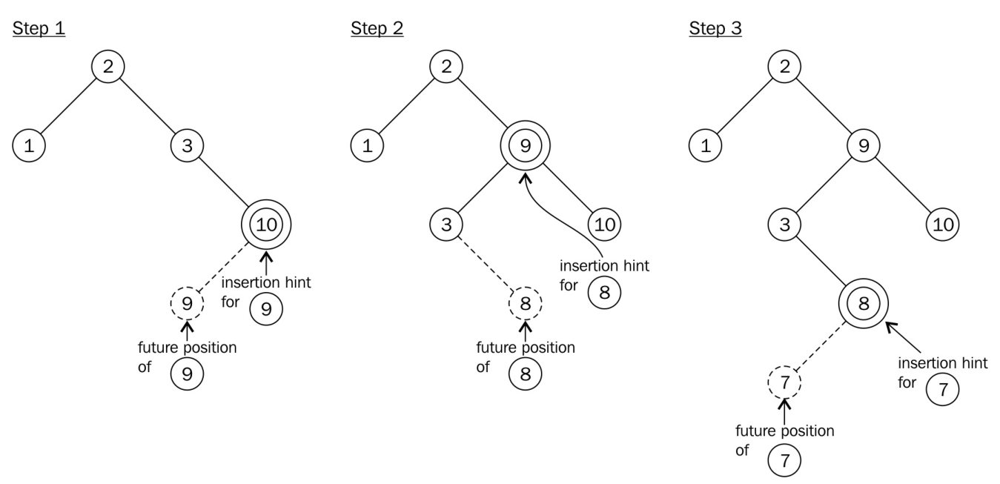

# STL容器

## STL容器的分类

### 连续存储

想要存储一组对象最简单的方式，就是将其一个接一个的存在一块比较大的内存当中。内存可以使用随机访问的方式进行，其时间复杂度为O(1)。

最简单的方式就是使用`std::array`，其就是对C风格数组的一种包装。不过，`std::array`要比C风格数组要先进的多，因为其没有运行时开销，而且进行元素添加时，也会十分舒适和安全。还有一点和C风格数组一样，一旦创建，其长度就是固定的，创建过后无法改变长度。

`std::vector`和`std::array`很类似，不过`std::vector`的长度可变。其会使用堆上的内存来存储对象。当新元素添加到`vector`中后，当前长度超过了原始的长度，那么`std::vector`会自动新分配一段更大的内存，用来放置包括新插入元素的所有元素，并且释放之前所占用的内存。此外，当新元素需要插入到两个旧元素之间时，`std::vector`会移动当前已有的元素。当要删除`vector`中间的一个已存在元素，那么`vector`类会自动地移动其他对象，将删除后的缝隙填补起来。

如果有大量元素在`std::vector`的头部或尾部进行插入或删除，那么为了填补空隙和移动已有元素，将会耗费很多时间。如遇到这样的情况，建议你考虑使用`std::deque`。对象集合会存储在多段固定长度的连续内存中，这些内存段是相互独立的。这就使得双向队列变得很简单，并且增长也很容易，因为不同的内存段相对独立，只需要将新分配的内存段加入就可以了，无需对其他已存在的内存段进行移动。减少的场景也是一样的。

### 列表存储

`std::list`是一个典型的双向链表。如果是单向列表，那就需要进行遍历，所以`std::forward_list`的优势在维护的复杂性上，因为其指针方向只有一个方向。列表遍历的时间复杂度是线性的O(n)。其在特定位置上插入和删除元素的时间复杂度为O(1)。

### 搜索树

当对象集具有可进行排序的自然属性时，可以使用小于的关系将这些元素进行排序，我们就可以使用搜索树来保存这个排序关系。从名字就可以看出，搜索树可以帮助我们很容易的通过一个关键字查找到对应元素，其搜索的时间复杂度为O(log(n))。

STL提供了不同种类的树，`std::set`是其中最简单的一种，保存元素不重复，存储的元素是可排序的(用一种树的结构)。

`std::map`使用的是另一种方式，将存储的数据使用组对进行存储。一个组对有一个key值和一个对应值构成。搜索树会对key值部分进行排序，使组对能作为`std::map`的一种关联容器。`std::map`的key值和`std::set`的值一样，在整个树中只能存在一个。

`std::multiset`和`std::multimap`是被特化的，key对象可以是重复的。

### 哈希表

讨论关联容器时，搜索树并不是唯一的方式。使用哈希表查找元素的时间复杂度只有O(1)，不过这就会忽略其自然序，所以不能简单的使用排序的方式进行遍历。哈希表大小可由用户控制，并且可以单独选择哈希函数，这是一项很重要的特性，因为其性能与空间复杂度依赖于此。

`std::unordered_set`和`std::unordered_map`具有很多接口与`std::set`和`std::map`一样，它们之间几乎可以相互替换。

搜索树的实现中，容器都具有多个变种： `std::unordered_multiset`和`std::unordered_multimap`，这两种方法都取消了对象/键的唯一性，因此我们可以用相同的键存储多个元素。

### 容器适配器

数组、列表、树和哈希表并不是存储和访问数据的唯一方式，这里还有栈、队列等其他的方式也可以存储和访问数据。类似的，越复杂的结构可以使用越原始的方式实现，并且STL使用以下形式的容器适配器进行操作：`std::stack`、`std::queue`和`std::priotity_queue`。

最牛X的是当我们需要这样的数据结构时，我们可以选择一种适配器。然后，当我们觉得到它们性能较差时，就可以改变一个模板参数，以便让适配器使用不同的容器实现。实践中，这也就意味着我们可以将`std::stack`实例中的元素类型从`std::vector`切换成`std::deque`。

## 擦除/移除std::vector元素

本节的全部内容都是在一个`vector`实例中删除元素。当`vector`中部的一个元素消失了，那么位于消失元素右边的所有元素都要往左移(这种操作的时间复杂度为O(n)。新手们会用循环来做这件事，因为循环的确好用。不过，循环会降低代码的优化空间。最后，比起STL的方法，循环是既不快，也不美。

### How to do it...

首先，我们使用整数来填充一个`std::vector`实例，之后剔除一些特定元素。

```
#include <iostream>
#include <vector>
#include <algorithm>

using namespace std;

int main(){
    vector<int> v{1, 2, 3, 2, 5, 2, 6, 2, 4, 8};
}
```

然后移除一些元素。需要我们移除哪些呢？2出现的太多次了，就选择2吧。让我们移除它们吧。

```
const auto new_end(remove(begin(v), end(v), 2));
```

`vector`在删除这些元素之后，长度并没有发生变化。那么下一步就让这个`vector`变得短一些。

```
v.erase(new_end, end(v));
```

现在，让我们来移除一组指定的数据。为了完成这项工作，我们先定义了一个谓词函数，其可接受一个数作为参数，当这个数是奇数时，返回 `true`。

```
const auto odd([](int i){return i % 2 != 0;});
```

这里我们使用`remove_if`函数，使用上面定义的谓词函数，来删除特定的元素。这里我们将上面删除元素的步骤合二为一。

 ```
v.erase(remove_if(begin(v), end(v), odd), end(v));
 ```

所有的奇数都被删除，不过`vector`实例的容量依旧是10。最后一步中，我们将其容量修改为正确的大小。需要注意的是，这个操作会让`vector`重新分配一段内存，以匹配相应元素长度，`vector`中已存的元素会移动到新的内存块中。

```
v.shrink_to_fit();
```

### How it works...

我们可以清楚的看到，要从一个`vector`实例中移除一个元素，首先要进行删除，然后进行擦除，这样才算真正的移除。这会让人感到困惑，那就让我们近距离观察一下这些步骤是如何工作的。

从`vector`中移除2的代码如下所示：

```
const auto new_end (remove(begin(v), end(v), 2));
v.erase(new_end, end(v));
```

`std::begin`和`std::end`函数都以一个`vector`实例作为参数，并且返回其迭代器，迭代器分别指向第一个元素和最后一个元素，就如下图所示。


`std::remove`在删除2的时候，会先将非2元素进行移动，然后修改end迭代器的指向。该算法将严格保留所有非2个值的顺序。

在2步中，2的值仍然存在，并且`vector`应该变短。并且4和8在现有的`vector`中重复了。这是怎么回事？

让我们再来看一下所有的元素，目前`vector`的范围并不是原来那样了，其是从`begin`迭代器，到`new_end`迭代器。`new_end`之后的值其实就不属于`vector`实例了。我们会注意到，在这个范围内的数值，就是我们想要的正确结果，也就是所有的2都被移除了。

最后，也就是为什么要调用`erase`函数：我们需要告诉`vector`实例，`new_end`到`end`之间的元素我们不需要了。我们仅需要保留`begin`到`new_end`间的元素就好了。`erase`函数会将`end`指向`new_end`。这里需要注意的是`std::remove`会直接返回`new_end`迭代器，所以我们可以直接使用它。

`vector`在这里不仅仅移动了内部指针。如果`vector`中元素比较复杂，那么在移除的时候，会使用其析构函数来销毁相应的对象。

最后，这个向量就如步骤3所示：的确变短了。那些旧的元素已经不在`vector`的访问范围内了，不过其仍存储在内存中。

为了不让`vector`浪费太多的内存，我们在最后调用了`shrink_to_fit`。该函数会为元素分配足够的空间，将剩余的元素移到该空间内，并且删除之前那个比较大的内存空间。

### There's more...

`std::remove`函数对其他容器同样有效。当使用`std::array`时，其不支持`erase`操作，因为其内存空间固定，无法进行自动化处理。因为`std::remove`只是将要删除的元素移动到容器末尾，而不是将其真正删除，所以这个函数也可以用于不支持空间大小变化的数据类型。当然也有其他类似的方法，例如字符串中，可以用哨兵值`\0`来覆盖原始的`end`迭代所指向的值。

## 快速或安全的访问std::vector实例的方法

  ### How to do it...

本节我们将使用两种不同的方式访问一个`std::vector`实例，并且利用其特性编写更加安全的代码。

先包含相应的头文件，并且用1000个123填满一个vector实例：

```
#include <iostream>
#include <vector>
using namespace std;
int main()
{
    const size_t container_size{1000};
    vector<int> v(container_size, 123);
```

我们通过`[]`操作符访问范围之外的元素：

```
cout << "Out of range element value: "
	<< v[container_size + 10] << '\n';
```

之后我们使用`at`函数访问范围之外的元素：

```
    cout << "Out of range element value: "
         << v.at(container_size + 10) << '\n';
}
```

让我们运行程序，看下会发生什么。下面的错误信息是由GCC给出。其他编译器也会通过不同方式给出类似的错误提示。第一种方式得到的结果比较奇怪。超出范围的访问方式并没有让程序崩溃，但是访问到了与123相差很大的数字。第二种方式中，我们看不到打印出来的结果，因为在打印之前程序已经崩溃了。当越界访问发生的时候，我们可以通过异常的方式更早的得知！

 ```
Out of range element value: -726629391
terminate called after throwing an instance of 'std::out_of_range'
what(): array::at: __n (which is 1010) >= _Nm (which is 1000)
Aborted (core dumped)
 ```

### How it works...

`std::vector`提供了`[]`操作符和`at`函数，它们的作用几乎是一样的。`at`函数会检查给定的索引值是否越界，如果越界则返回一个异常。这对于很多情景都十分适用，不过因为检查越界要花费一些时间，所以`at`函数会让程序慢一些。

当需要非常快的索引成员时，并能保证索引不越界，我们会使用`[]`快速访问`vector`实例。很多情况下，`at`函数在牺牲一点性能的基础上，有助于发现程序内在的bug。

默认使用`at`函数时一个好习惯。当代码没有bug存在时，可以使用性能更高的操作符来替代`at`函数。

### There's more...

当然，我们需要处理越界访问，避免整个程序崩溃。为了对越界访问进行处理，我们可以使用截获异常的方式。可以用`try`代码块将调用at函数的部分包围，并且定义错误处理的`catch`代码段。

```
try {
    std::cout << "Out of range element value: "
              << v.at(container_size + 10) << '\n';
} catch (const std::out_of_range &e) {
    std::cout << "Ooops, out of range access detected: "
              << e.what() << '\n';
}
```

## 保持对std::vector实例的排序

### How to do it...

本节中我们使用随机单词对`std::vector`进行填充，然后对它进行排序。并在插入更多的单词的同时，保证`vector`实例中单词的整体排序。

```
#include <iostream>
#include <vector>
#include <string>
#include <algorithm>
#include <iterator>
#include <cassert>

using namespace std;

int main()
{
    vector<string> v {"some", "random", "words",
                      "without", "order", "aaa",
                      "yyy"};
```

对 `vector` 实例进行排序。我们使用一些断言语句和 STL 中自带的`is_sorted`函数对是否排序进行检查。

这里我们使用`insert_sorted`函数添加随机单词到已排序的`vector`中，这个函数我们会在后面实现。这些新插入的单词应该在正确的位置上，并且`vector`实例需要保持已排序的状态。

```
insert_sorted(v, "foobar");
insert_sorted(v, "zzz");
```

现在，我们来实现`insert_sorted`函数。

```
void insert_sorted(vector<string> &v, const string &word)
{
    const auto insert_pos (lower_bound(begin(v), end(v), word));
    v.insert(insert_pos, word);
}
```

### How it works...

对于任意的新字符串，通过计算其所在位置，然后进行插入，从而保证`vector`整体的排序性。不过，这里我们假设的情况是，在插入之前，`vector`已经排序。否则，这种方法无法工作。

这里我们使用STL中的`lower_bound`对新单词进行定位，其可接收三个参数。头两个参数是容器开始和结尾的迭代器。这确定了我们单词`vector`的范围。第三个参数是一个单词，也就是要被插入的那个。函数将会找到大于或等于第三个参数的首个位置，然后返回指向这个位置的迭代器。

获取了正确的位置，那就使用`vector`的成员函数`insert`将对应的单词插入到正确的位置上。

### There's more...

`insert_sorted`函数很通用。如果需要其适应不同类型的参数，这样改函数就能处理其他容器所承载的类型，甚至是容器的类似，比如`std::set`、`std::deque`、`std::list`等等。(这里需要注意的是成员函数`lower_bound`与 `std::lower_bound`等价，不过成员函数的方式会更加高效，因为其只用于对应的数据集合)。

```
template <typename C, typename T>
void insert_sorted(C &v, const T &item)
{
    const auto insert_pos (lower_bound(begin(v), end(v), item));
    v.insert(insert_pos, item);
}
```

当我们要将`std::vector`类型转换为其他类型时，需要注意的是并不是所有容器都支持`std::sort`。该函数所对应的算法需要容器为可随机访问容器，例如`std::list`就无法进行排序。

## 向std::map实例中高效并有条件的插入元素

我们需要用键值对填充一个`map`实例时，会碰到两种不同的情况：

- 键不存在。创建一个全新的键值对。
- 键已存在。修改键所对应的值。

我通常会使用`insert`或`emplace`函数对`map`插入新元素，如果插入不成功，那么就是第二种情况，就需要去修改现有的元素。`insert`和`emplace`都会创建一个新元素尝试插入到`map`实例中，不过在第二种情况下，这个新生成的元素会被扔掉。两种情况下，我们都会多余调用一次构造函数。

C++17 中，添加了`try_emplace`函数，其只有在满足条件的情况下，才能插入新元素。让我们实现一个程序，建立一张表，列出各国亿万富翁的数量。我们例子中不会使用很大开销进行元素创建，不过我们的例子来源于生活，其能让你明白如何使用`try_emplace`。

### How to do it...

```
#include <iostream>
#include <functional>
#include <list>
#include <map>

using namespace std;
```

定义一个结构器，代表对应的富翁。

```
struct billionaire {
    string name;
    double dollars;
    string country;
};
```

主函数中，我们定义了一个百万富翁的列表。世界上有很多百万富翁，所以我们创建一个有限列表来存储这些富翁的信息。这个列表是已排序的。

```
int main()
{
    list<billionaire> billionaires {
        {"Bill Gates", 86.0, "USA"},
        {"Warren Buffet", 75.6, "USA"},
        {"Jeff Bezos", 72.8, "USA"},
        {"Amancio Ortega", 71.3, "Spain"},
        {"Mark Zuckerberg", 56.0, "USA"},
        {"Carlos Slim", 54.5, "Mexico"},
        // ...
        {"Bernard Arnault", 41.5, "France"},
        // ...
        {"Liliane Bettencourt", 39.5, "France"},
        // ...
        {"Wang Jianlin", 31.3, "China"},
        {"Li Ka-shing", 31.2, "Hong Kong"}
        // ...
    };
```

现在让我们定义一个表。这个表由表示国家名的字符串和一个组对构成。组对中会具有上面列表的一个(const)副本。这也就是每个国家最富有的人。组对中另一个变量是一个计数器，其会统计某国的富豪人数。

```
map<string, pair<const billionaire, size_t>> m;
```

现在，让我们将列表中的数据尝试插入到组对中。每个组对中都包含了对应国家的百万富翁，并将计数器的值置成1。

```
for (const auto &b : billionaires) {
	auto [iterator, success] = m.try_emplace(b.country, b, 1);
```

如果这一步成功，那就不用再做其他事了。我们使用b和1创建的组对已经插入到表中。如果因为键已存在而插入失败，那么组对就不会构建。当我们百万富翁结构体非常大时，我们需要将运行时拷贝的时间节省下来。不过，在不成功的情况下，我们还是要对计数器进行增加1的操作。

```
    if (!success) {
        iterator->second.second += 1;
        }
    }
```

现在，我们来打印一下每个国家百万富翁的数量，以及各个国家中最富有的人。

```
    for (const auto & [key, value] : m) {
        const auto &[b, count] = value;
        cout << b.country << " : " << count
                << " billionaires. Richest is "
             << b.name << " with " << b.dollars
             << " B$\n";
    }
}
```

### How it works...

本节围绕着`std::map`中的`try_emplace`函数展开，这个函数是C++17添加的。下面是其函数声明之一：

```
std::pair<iterator, bool> try_emplace(const key_type& k, Args&&... args);
```

函数第一个参数`k`是插入的键，`args`表示这个键对应的值。如果我们成功的插入了元素，那么函数就会返回一个迭代器，其指向新节点在表中的位置，组对中布尔变量的值被置为true。当插入不成功，组对中的布尔变量值会置为false，并且迭代器指向与新元素冲突的位置。

这个特性在我们的例子中非常有用——可以完美处理第一次访问到，和之后访问到的情况。

`std::map`中`insert`和`emplace`方法完全相同。`try_emplace`与它们不同的地方在于，在遇到已经存在的键时，不会去构造组对。当相应对象的类型需要很大开销进行构造时，这对于程序性能是帮助的。

### There's more...

如果我们将表的类型从`std::map`换成`std::unordered_map`，程序照样能工作。这样的话，当不同类型的表具有较好的性能特性时，我们就可以快速的进行切换。例子中，唯一可观察到的区别是，亿万富翁表不再按字母顺序打印，因为哈希表和搜索树不同，其不会对对象进行排序。

## 了解std::map::insert新的插入提示语义

`std::map`中查找元素的时间复杂度为O(log(n))，与插入元素的时间复杂相同，因为要在对应位置上插入元素，那么就先要找到这个位置。通常，插入M个新元素的时间复杂度为O(M*log(n))。

为了让插入更加高效，`std::map`插入函数接受一个迭代器参数`hint`。自C++11起，该参数为指向将插入新元素到其前的位置的迭代器。如果这个迭代器给定正确，那么插入的时间复杂度就为O(1)。

### How to do it...

本节会是用传入迭代器的方式向`std::map`实例中插入多个新元素，从而减少耗时：

```
#include <iostream>
#include <map>
#include <string>

int main()
{
    std::map<std::string, size_t> m { {"b", 1}, {"c", 2}, {"d", 3} };
```

我们将插入多个元素，对于每次插入，我们都会传入一个hint迭代器。第一次插入我们不指定其开始位置，只将插入位置指向`map`的`end`迭代器之前。

```
auto insert_it (std::end(m));
```

我们将以字母表的反序进行元素的插入，然后使用hint迭代器，然后使用`insert`函数的返回值重新初始化迭代器的值。下一个元素将在`hint`迭代器前插入。

```
for (const auto &s : {"z", "y", "x", "w"}) {
	insert_it = m.insert(insert_it, {s, 1});
}
```

为了展示在什么情况下`insert`函数不工作，我们将要插入最左侧位置的元素插入到最右侧。

```
m.insert(std::end(m), {"a", 1});
```

### How it works...

本例与常用的方式不同，多了一个迭代器。并且我们提到了这个迭代器的正确与否。

正确的迭代器将会指向一个已存在的元素，其值要比要插入元素的键大，所以新元素会插在这个迭代器之前。如果用户提供的迭代器位置有误，那么插入函数会退化成未优化的版本，其时间复杂度恢复O(log(n))。

对于第一次插入，我们选择了`map`实例的`end`迭代器，因为没有其他更好的选择。在插入“z”之后，函数会返回相应的迭代器，这样我们就知道了要插入“y”的位置。“x”也同理，后面的元素依次类推。

在 C++11 之前，hint迭代器只是建议作为搜索开始位置的迭代器。

### There's more...

其中，比较有趣的事情是，在给定错误的迭代器，`map`实例依旧能保持其排序。那么他是如何工作的呢？还有插入的时间复杂度为O(1)意味着什么？

`std::map`通常使用二叉搜索树实现。当在搜索树中插入一个新键时，该键要和其他键进行比较，从末端到顶端。如果键小于或大于其他节点的键，搜索树的左侧或右侧分支则会成为更深的节点。不过，搜索算法会阻止节点达到当前搜索树的底端。否则会打破搜索树的平衡，所以为了保证正确性，需要使用一个平衡算法用来管理节点。

当我们将元素插入到树中时，这些键值就会成为邻居(就如整数1和2互邻一样)。如果有`hint`传入，那么很容易检查键是否正确。如果这种情况出现，则可以省去搜索的时间。而后，平衡算法会可能还要运行。虽然优化并不是总能成功，不过平均下来，性能上还是会有提升。可以使用多次插入的方式，来统计运行的耗时，这被称之为摊销复杂度。



如果插入的`hint`是错的，那么插入函数会放弃使用`hint`，转而使用搜索算法进行查找。虽然程序不会出什么问题，但这样做会让程序变慢。

## 高效的修改std::map元素的键值

在`std::map`数据结构中，键-值通常都对应存在，而且键通常是唯一并排序过的，而且键值一旦设定那么就不允许用户再进行修改。为了阻止用户修改键，键的类型声明使用了`const`。

这种限制是非常明智的，其可以保证用户很难在使用`std::map`的时候出错。不过，如果我们真的需要修改`map`的键值该怎么办呢？

C++17 之前，因为对应的键已经存在，我们不得不将整个键-值对从树中移除，然后再插入。这种方法的缺点很明显，其需要分配出一些不必要的内存，感觉上也会对性能有一定的影响。

从 C++17 起，我们无需重新分配内存，就可以删除和重新插入map键值对。下面的内容中将会展示如何操作。

### How to do it...

我们使用`std::map`类型一个实现应用，用于确定车手在虚拟比赛中的排位。当车手在比赛中完成超越，那么我们将使用C++17 的新方法改变其键值。

```
#include <iostream>
#include <map>

using namespace std;

template <typename M>
void print(const M &m)
{
    cout << "Race placement:\n";
    for (const auto &[placement, driver] : m) {
           cout << placement << ": " << driver << '\n';
    }
}

int main()
{
    map<int, string> race_placement {
        {1, "Mario"}, {2, "Luigi"}, {3, "Bowser"},
        {4, "Peach"}, {5, "Yoshi"}, {6, "Koopa"},
        {7, "Toad"}, {8, "Donkey Kong Jr."}
    };
    print(race_placement);
```

让我来看下排位赛的某一圈的情况，Bowser因为赛车事故排在最后，Donkey Kong Jr. 从最后一名超到第三位。例子中首先要从`map`中提取节点，因为这是唯一能修改键值的方法。`extract`函数是C++17新加的特性。其可以从`map`中删除元素，并没有内存重分配的副作用。看下这里是怎么用的吧。

```
{
    auto a(race_placement.extract(3));
    auto b(race_placement.extract(8));
```

现在我们要交换Bowser和Donkey Kong Jr.的键。键通常都是无法修改的，不过我们可以通过`extract`方法来修改元素的键。

`std::map`的`insert`函数在C++17中有一个新的重载版本，其接受已经提取出来的节点，就是为了在插入他们时，不会分配不必要的内存。

```
    race_placement.insert(move(a));
    race_placement.insert(move(b));
}
```

### How it works...

在 C++17 中，`std::map`有一个新成员函数`extract`。其有两种形式：

```
node_type extract(const_iterator position);
node_type extract(const key_type& x)
```

在例子中，我们使用了第二个，能接受一个键值，然后找到这个键值，并提取对应的`map`节点。第一个函数接受一个迭代器，提取的速度会更快，因为给定了迭代器就不需要再查找。

当使用第二种方式去提取一个不存在的节点时，会返回一个空`node_type`实例。`empty()`成员函数会返回一个布尔值，用来表明`node_type`实例是否为空。以任何方式访问一个空的实例都会产生未定义行为。

提取节点之后，我们要使用`key()`函数获取要修改的键，这个函数会返回一个非常量的键。

需要注意的是，要将节点重新插会到`map`时，我们需要在`insert`中移动他们。因为`extract`可避免不必要的拷贝和内存分配。还有一点就是，移动一个`node_type`时，其不会让容器的任何值发生移动。

### There's more...

使用`extract`方法提取的`map`节点实际上非常通用。我们可以从一个`map`实例中提取出来节点，然后插入到另一个`map`中，甚至可以插入到`multimap`实例中。这种方式在`unordered_map`和`unordered_multimap`实例中也适用。同样在`set/multiset`和`unordered_set/unordered_multiset`也适用。

为了在不同`map`或`set`结构中移动元素，键、值和分配器的类型都必须相同。需要注意的是，不能将`map`中的节点移动到`unordered_map`中，或是将`set`中的元素移动到`unordered_set`中。

## std::unordered_map中使用自定义类型

### How to do it...

本节中，我们要定义一个简单的`coord`数据结构，其没有默认哈希函数，所以我们必须要自行定义一个。然后我们会使用`coord`对象来对应一些值。

```
#include <iostream>
#include <unordered_map>

struct coord {
    int x;
    int y;
};

bool operator==(const coord &l, const coord &r)
{
    return l.x == r.x && l.y == r.y;
}
```

为了使用STL哈希的能力，我们打开了std命名空间，并且创建了一个特化的`std::hash`模板。其使用`using`将特化类型进行别名。

下面要重载该类型的括号表达式。我们只是为`coord`结构体添加数字，这是一个不太理想的哈希方式，不过这里只是展示如何去实现这个函数。一个好的散列函数会尽可能的将值均匀的分布在整个取值范围内，以减少哈希碰撞。

```
namespace std
{
    template <>
    struct hash<coord>
    {
        using argument_type = coord;
        using result_type = size_t;

        result_type operator()(const argument_type &c) const
        {
            return static_cast<result_type>(c.x)
                      + static_cast<result_type>(c.y);
        }
    };
}
```

我们现在可以创建一个新的`std::unordered_map`实例，其能结构`coord`结构体作为键，并且对应任意值。例子中对`std::unordered_map`使用自定义的类型来说，已经很不错了。让我们基于哈希进行实例化，并填充自定义类型的`map`表，并打印这个`map`表：

```
int main()
{
    std::unordered_map<coord, int> m { 
        { {0, 0}, 1}, 
        { {0, 1}, 2},
        { {2, 1}, 3}
    };
    for (const auto & [key, value] : m) {
        std::cout << "{(" << key.x << ", " << key.y
                 << "): " << value << "} ";
    }
    std::cout << '\n';
}
```

### How it works...

通常实例化一个基于哈希的map表(比如: `std::unordered_map`)时，我们会这样写：

```
std::unordered_map<key_type, value_type> my_unordered_map;
```

编译器为我们创建特化的`std::unordered_map`时，这句话背后隐藏了大量的操作。所以，让我们来看一下其完整的模板类型声明：

```
template<
    class Key,
    class T,
    class Hash = std::hash<Key>,
    class KeyEqual = std::equal_to<Key>,
    class Allocator = std::allocator< std::pair<const Key, T> >
> class unordered_map;
```

这里第一个和第二个模板类型，我么填写的是`coord`和`int`。另外的三个模板类型是选填的，其会使用已有的标准模板类。这里前两个参数需要我们给定对应的类型。

对于这个例子，`class Hash`模板参数是最有趣的一个：当我们不显式定义任何东西时，其就指向`std::hash<key_type>`。STL已经具有`std::hash`的多种特化类型，比如`std::hash<std::string>`、`std::hash<int>`、`std::hash<unique_ptr>`等等。这些类型中可以选择最优的一种类型类解决对应的问题。

不过，STL不知道如何计算我们自定义类型`coord`的哈希值。所以我们要使用我们定义的类型对哈希模板进行特化。编译器会从`std::hash`特化列表中，找到我们所实现的类型，也就是将自定义类型作为键的类型。

如果新特化一个`std::hash<coord>`类型，并且将其命名成my_hash_type，我们可以使用下面的语句来实例化这个类型：

```
std::unordered_map<coord, value_type, my_hash_type> my_unordered_map;
```

这样命名就很直观，可读性好，而且编译器也能从哈希实现列表中找到与之对应的正确的类型。

## 过滤用户的重复输入，并以字母序将重复信息打印出——std::set

### How to do it...

从标准输入流中读取单词，所有不重复的单词将放到一个`std::set`实例中。之后，枚举出所有输入流中不重复的单词。

```
#include <iostream>
#include <set>
#include <string>
#include <iterator>

using namespace std;

int main()
{
    set<string> s;
```

我们只从标准输入中读取，这样我们就要用到`istream_iterator`。

 ```
istream_iterator<string> it {cin};
istream_iterator<string> end;

for (const auto word : s) {
	cout << word << ", ";
}
cout << '\n';
}
 ```

这样就得到了一对`begin`和`end`迭代器，可以用来表示用户的输入，我们可以使用`std::inserter`来填满`set`实例。

### How it works...

程序中有两个有趣的部分。第一个是使用了`std::istream_iterator`来访问用户输入，另一个是将`std::set`实例使用`std::inserter`用包装后，在使用`std::copy`填充。这看起来像是变魔术一样，只需要一行代码，我们就能完成使用输入流填充实例，去除重复的单词和以字母序进行排序。

#### std::istream_iterator

`std::istream_iterator`只传入了一个模板参数。也就我们输入数据的类型。我们选择`std::string`是因为我们假设是文本输入，不过这里也可以是`float`型的输入。基本上任何类型都可以使用`cin >> var;`完成。构造函数接受一个`istream`实例。标准输入使用全局输入流`std::cin`表示，例子中其为`istream`的参数。

```
istream_iterator<string> it {cin};
```

输入流迭代器`it`就已经实例化完毕了，其可以做两件事情：当对其解引用(`*it`)时，会得到当前输入的符号。我们通过输入迭代器构造`std::string`实例，每个字符串容器中都包含一个单词；当进行自加`++it`时，其会跳转到下一个单词，然后再解引用访问下一个单词。

不过，每次自加后的解引用时都须谨慎。当标准输入为空，迭代器就不能再解引用。另外，我们需要终止使用解引用获取单词的循环。终止的条件就是通过和`end`迭代器进行比较，知道何时迭代器无法解引用。如果`it==end`成立，那么说明输入流已经读取完毕。

我们在创建`it`的同时，也创建了一个`std::istream_iterator`的`end`迭代器。其目的是于`it`进行比较，在每次迭代中作为中止条件。

当`std::cin`结束时，`it`迭代器将会与`end`进行比较，并返回true。

#### std::inserter

调用`std::copy`时，我们使用`it`和`end`作为输入迭代器。第三个参数必须是一个输出迭代器。因此，不能使用`s.begin()`或`s.end()`。一个空的`set`中，这二者是一致的，所以不能对`set`的迭代器进行解引用(无论是读取或赋值)。

这就使`std::inserter`有了用武之地。其为一个函数，返回一个`std::insert_iterator`，返回值的行为类似一个迭代器，不过会完成普通迭代器无法完成的事。当对其使用加法时，其不会做任何事。当我们对其解引用，并赋值给它时，它会连接相关容器，并且将赋值作为一个新元素插入容器中。

当通过`std::inserter`实例化`std::insert_iterator`时，我们需要两个参数：

```
auto insert_it = inserter(s, s.end());
```

其中s是我们的`set`，`s.end()`是指向新元素插入点的迭代器。对于一个空`set`来说，从哪里开始和从哪里结束一样重要。当使用其他数据结构时，比如`vector`和`list`，第二个参数对于定义插入新项的位置来说至关重要。

#### 将二者结合

最后，所有的工作都在`std::copy`的调用中完成：

```
copy(input_iterator_begin, input_iterator_end, insert_iterator);
```

这个调用从`std::cin`中获取输入迭代器，并将其推入`std::set`中。之后，其会让迭代器自增，并且确定输入迭代器是否达到末尾。如果不是，那么可以继续从标准输入中获取单词。

重复的单词会自动去除。当`set`已经拥有了一个单词，再重复将这个单词添加入`set`时，不会产生任何效果。与`std::multiset`的表现不同，`std::multiset`会接受重复项。

## 实现简单的逆波兰表示法计算器——std::stack

RPN 是一种记号法，可以用一种非常简单的解析方式来表达数学表达式。在RPN中，`1+2`解析为`1 2 +`。操作数优先，然后是操作符。另一个例子：`(1+2)*3`表示为`1 2 + 3 *`。这两个例子已经展示了RPN可以很容易的进行解析，并且不需要小括号来定义子表达式。


### How to do it...

本节中，我们将从标准输入中读取一个RPN表达式，然后根据表达式解析出正确的计算顺序，并得到结果。最后，我们将输出得到的结果。

```
#include <iostream>
#include <stack>
#include <iterator>
#include <map>
#include <sstream>
#include <cassert>
#include <vector>
#include <stdexcept>
#include <cmath>

using namespace std;
```

然后，就来实现我们的RPN解析器。其能接受一对迭代器，两个迭代器分别指定了数学表达式的开始和结尾。

在遍历输入时，需要记住所经过的所有操作数，直到我们看到一个操作符为止。这也就是使用栈的原因。所有数字将会被解析出来，然后以双精度浮点类型进行保存，所以保存到栈中的数据类型为`double`。

另一项准备工作，就是定义所支持的数学操作符。我们使用`map`保存相关数学操作符的作用。每个操作符的实现我们使用Lambda函数实现。

假设我们的输入是字符串，我们使用全新的`std::stringstream`获取每个单词，这样就可以将操作数解析为数字了。

获得的每个操作数，都要转换成`double`类型。如果当前解析的字符是操作数，那么我们将转换类型后，推入栈中。

如果不是操作数，那么就必定为一个操作符。我们支持的操作符都是二元的，所以当遇到操作符时，我们需要从栈中弹出两个操作数。

这就是遍历循环的全部，我们会将栈中的操作数用完，然后得到对应的结果，并将结果保存在栈顶。所以我们要返回栈顶的元素。(我们对栈的大小进行断言，如果大小不是1，那么就有缺失的操作符)

```
template <typename IT>
double evaluate_rpn(IT it, IT end)
{
	stack<double> val_stack;
    auto pop_stack ([&](){
        auto r (val_stack.top());
        val_stack.pop();
        return r;
    });
    
    map<string, double (*)(double, double)> ops {
        {"+", [](double a, double b) { return a + b; }},
        {"-", [](double a, double b) { return a - b; }},
        {"*", [](double a, double b) { return a * b; }},
        {"/", [](double a, double b) { return a / b; }},
        {"^", [](double a, double b) { return pow(a, b); }},
        {"%", [](double a, double b) { return fmod(a, b); }},
    };
    
    for (; it != end; ++it) {
    	stringstream ss {*it};
	  	if (double val; ss >> val) {
            val_stack.push(val);
        }
        else {
            const auto r {pop_stack()};
            const auto l {pop_stack()};
           
            try {
                const auto & op (ops.at(*it));
                const double result {op(l, r)};
                val_stack.push(result);
            }         
        	catch (const out_of_range &) {
                throw invalid_argument(*it);
            }
                    }
    }
    return val_stack.top();
}                     
```

为了使用这个解析器，我们需要将标准输入包装成一个`std::istream_iterator`迭代器对，并且传入RPN解析器函数。最后，我们将输出结果：

```
int main()
{
    try {
        cout << evaluate_rpn(istream_iterator<string>{cin}, {})
             << '\n';
    }
```

这里我们再次使用了`try`代码块，因为用户输入的表达式可能会存在错误，所以当解析器抛出异常时，需要在这里获取。我们需要获取对应的异常，并且打印出一条错误信息：

```
    catch (const invalid_argument &e) {
        cout << "Invalid operator: " << e.what() << '\n';
    }
}
```

### How it works...

#### 栈管理

使用`std::stack`中的成员函数`push`将元素推入栈中：

```
val_stack.push(val);
```

出站元素的获取看起来有些复杂，因为我们使用了一个Lambda表达式完成这项操作，其能够引用`val_stack`对象。这里我们为代码添加了一些注释，可能会更好理解一些：

```
auto pop_stack ([&](){
    auto r (val_stack.top()); // 获取栈顶元素副本
    val_stack.pop(); // 从栈中移除顶部元素
    return r; // 返回顶部元素副本
});
```

这个Lambda表达式能够一键式获取栈顶元素，并且能删除顶部元素。在`std::stack`的设计当中，无法使用一步完成这些操作。不过，定义一个Lambda函数也是十分快捷，所以我们可以使用这种方式获取值：

```
double top_value {pop_stack()};
```

#### 从输入中区别操作数和操作符

主循环中执行`evaluate_rpn`时，我们会根据迭代器遍历标准输入，然后判断字符是一个操作数，还是一个操作符。如果字符可以被解析成`double`变量，那这就是一个数，也就是操作数。我们需要考虑有些比较难以解析的数值(比如，+1和-1)，这种数值可能会被解析成操作符(尤其是+1这种)。

用于区分操作数和操作符的代码如下所示：

```
stringstream ss {*it};
if (double val; ss >> val) {
    // It's a number!
} else {
    // It's something else than a number - an operation!
}
```

如果字符是一个数字，流操作符`>>`会告诉我们。首先，我们将字符串包装成一个`std::stringstream`。然后使用`stringstream`对象的能力，将流中`std::string`类型解析并转换成一个`double`变量。解析失败时也能知道是为什么，因为只解析器需要解析数字出来；否则，需要解析的就不是一个数字。

#### 选择和应用正确的数学操作符

判断完当前用户的输入是否为一个数后，我们先假设输入了一个操作符，比如`+`或`*`。然后，查询`map`表ops，找到对应的操作，并返回相应的函数，其函数可以接受两个操作数，然后返回对应操作后的结果。

`map`表本身的类型看起来会相对复杂：

```
map<string, double (*)(double, double)> ops { ... };
```

其将`string`映射到`double (*)(double, double)`。后者是什么意思呢？这个类型是一个函数指针的声明，说明这个函数接受两个double类型的变量作为输入，并且返回值也是`double`类型。可以将`(*)`部分理解成函数的名字，例如`double sum(double, double`，这样就好理解多了吧。这里的重点在于我们的Lambda函数`[](double, double) {return /* some double */ }`，其可转换为实际匹配指针声明的函数。这里Lambda不获取任何东西，所以可以转化为函数指针。

这样，我们就可以方便的在`map`表中查询操作符是否支持：

```
const auto & op (ops.at(*it));
const double result {op(l, r)};
```

`map`会为我们隐式的做另一件事：当我们执行`ops.at("foo")`时，如果`"foo"`是一个合法键(实际中我们不会用这个名字存任何操作)，那么在这个例子中，`map`表将会抛出一个异常，例子中可以捕获这个异常。当我们捕获这个异常时，我们会重新抛出一个不同的异常，为了描述我们遇到了什么样的错误。相较于`out of range`，用户也能更好的了解`invalid argument`异常的含义，因此我们在使用的时候，程序的`map`表到底支持哪些操作，我们是不知道的。

### There's more...

`evaluate_rpn`函数可以传入迭代器，感觉这样传递的方式要比传入标准输入更加容易理解。这让程序更容易测试，或适应来自于用户的不同类型的输入。

使用字符串流或字符串数组的迭代器作为输入，例如下面的代码，`evaluate_rpn`不用做任何修改：

```
int main()
{
    stringstream s {"3 2 1 + * 2 /"};
    cout << evaluate_rpn(istream_iterator<string>{s}, {}) << '\n';
    vector<string> v {"3", "2", "1", "+", "*", "2", "/"};
    cout << evaluate_rpn(begin(v), end(v)) << '\n';
}
```

在有意义的地方使用迭代器，会使得代码可重复利用度高，模块化好。

## 实现词频计数器——std::map

### How to do it...

```
#include <iostream>
#include <map>
#include <vector>
#include <algorithm>
#include <iomanip>

using namespace std;
```

闯将一个辅助函数，对输入中的符号进行处理。

```
string filter_punctuation(const string &s)
{
    const char *forbidden {".,:; "};
    const auto idx_start (s.find_first_not_of(forbidden));
    const auto idx_end (s.find_last_not_of(forbidden));
    return s.substr(idx_start, idx_end - idx_start + 1);
}
```

现在，我们来实现真正要工作的部分。使用`map`表对输入的每个单词进行统计。另外，使用一个变量来保存目前为止看到的最长单词的长度。程序的最后，我们将打印这个`map`表。

 ```
int main()
{
    map<string, size_t> words;
    int max_word_len {0};
    
    string s;
    while (cin >> s) {
    	auto filtered (filter_punctuation(s));    
    	max_word_len = max<int>(max_word_len, filtered.length());
    	++words[filtered];
    }    	
 ```

当循环结束时，`words map`会保存所有输入单词的频率。`map`中单词作为键，并且键以字母序排列。我们想要以频率多少进行排序，词频最高的排第一位。为了达到这样的效果，首先实现一个`vector`，将所有键值对放入这个`vector`中。

```
    vector<pair<string, size_t>> word_counts;
    word_counts.reserve(words.size());
    move(begin(words), end(words), back_inserter(word_counts));
```

然后，`vector`中将将具有`words map`中的所有元素。然后，我们来进行排序，把词频最高的单词排在最开始，最低的放在最后。

```
   sort(begin(word_counts), end(word_counts),
       [](const auto &a, const auto &b) {
       return a.second > b.second;
       });
```

现在所有元素如我们想要的顺序排列，之后将这些数据打印在用户的终端上。使用`std::setw`流控制器，可以格式化输出相应的内容。

```
    cout << "# " << setw(max_word_len) << "<WORD>" << " #<COUNT>\n";
    for (const auto & [word, count] : word_counts) {
        cout << setw(max_word_len + 2) << word << " #"
             << count << '\n';
    }
}
```

### How it works...

我们使用`std::map`实例进行单词统计，然后将`map`中的所有元素放入`vector`中，然后进行排序，再打印输出。

我们使用`std::move`函数将词-频对应关系填充整个`vector`。这样的好处是让单词不会重复，不过这样会将元素从`map`中完全删除。使用`move`方法，减少了很多不必要的拷贝。

排序算法将会成对的处理元素，比较两个元素。通过提供的Lambda函数，`sort`方法将不会再使用默认比较谓词，其会将`a.second`和`b.second`进行比较。这里的键值对中，第二个值为词频数，所以可以使用`.second`得到对应词频数。通过这种方式，将移动所有高频率的词到`vector`的开始，并且将低频率词放在末尾。

## 实现写作风格助手用来查找文本中很长的句子——std::multimap

### How to do it...

我们将从标准输入中获取用户输入，用户会输入所有的句子，而非单词。然后，我们将这些句子和其长度收集在`std::multimap`中。之后，我们将对所有句子的长度进行排序，打印给用户看。

```
#include <iostream>
#include <iterator>
#include <map>
#include <algorithm>

using namespace std;
```

我们使用句号将输入字符串分成若干个句子，句子中的每个单词以空格隔开。句子中的一些对于句子长度无意义的符号，也会计算到长度中，所以，这里要使用辅助函数将这些符号过滤掉。

```
string filter_ws(const string &s)
{
    const char *ws {" \r\n\t"};
    const auto a (s.find_first_not_of(ws));
    const auto b (s.find_last_not_of(ws));
    if (a == string::npos) {
        return {};
    }
    return s.substr(a, b);
}
```

计算句子长度函数需要接收一个包含相应内容的字符串，并且返回一个`std::multimap`实例，其映射了排序后的句子长度和相应的句子。

```
multimap<size_t, string> get_sentence_stats(const string &content)
{
    multimap<size_t, string> ret;
    const auto end_it (end(content));
    auto it1 (begin(content));
    auto it2 (find(it1, end_it, '.'));    
```

`it2`总是指向句号，而`it1`指向句子的开头。只要`it1`没有到达文本的末尾就好。第二个条件就是要检查`it2`是否指向字符。如果不满足这些条件，那么就意味着这两个迭代器中没有任何字符了：

```
while (it1 != end_it && distance(it1, it2) > 0) {
```

我们使用两个迭代器间的字符创建一个字符串，并且过滤字符串中所有的空格，只是为了计算句子纯单词的长度。 

```
string s {filter_ws({it1, it2})};
```

当句子中不包含任何字符，或只有空格时，我们就不统计这句。另外，我们要计算有多少单词在句子中。这很简单，每个单词间都有空格隔开，单词的数量很容易计算。然后，我们就将句子和其长度保存在`multimap`中。

```
if (s.length() > 0) {
    const auto words (count(begin(s), end(s), ' ') + 1);
    ret.emplace(make_pair(words, move(s)));
}
```

对于下一次循环迭代，我们将会让`it1`指向`it2`的后一个字符。然后将`it2`指向下一个句号。

```
        it1 = next(it2, 1);
        it2 = find(it1, end_it, '.');
    }
```

循环结束后，`multimap`包含所有句子以及他们的长度，这里我们将其返回。

```
    return ret;
}
```

现在，我们来写主函数。首先，我们让`std::cin`不要跳过空格，因为我们需要句子中有空格。为了读取整个文件，我们使用`std::cin`包装的输入流迭代器初始化一个`std::string`实例。

```
int main()
{
    cin.unsetf(ios::skipws);
    string content {istream_iterator<char>{cin}, {}};
        for (const auto & [word_count, sentence]
            : get_sentence_stats(content)) {
        cout << word_count << " words: " << sentence << ".\n";
    }
}
```

### How it works...

整个例子中，我们将一个很长的字符串，分割成多个短句，从而评估每个句子的长度，并且在`multimap`中进行排序。因为`std::multimap`很容易使用，所以变成较为复杂的部分就在于循环，也就是使用迭代器获取每句话的内容。

 ```
const auto end_it (end(content));

// (1) Beginning of string
auto it1 (begin(content)); 

// (1) First '.' dot
auto it2 (find(it1, end_it, '.')); 
while (it1 != end_it && std::distance(it1, it2) > 0) {
    string sentence {it1, it2};
    // Do something with the sentence string...

    // One character past current '.' dot
    it1 = std::next(it2, 1); 

    // Next dot, or end of string
    it2 = find(it1, end_it, '.'); 
}
 ```

将代码和下面的图结合起来可能会更好理解，这里使用具有三句话的字符串来举例。


`it1`和`it2`总是随着字符串向前移动。通过指向句子的开头和结尾的方式，确定一个句子中的内容。`std::find`算法会帮助我们寻找下一个句号的位置。

将整个文件读入一个大字符串中后，遍历字符串时需要为每个句子创建副本。这是没有必要的，这里可以使用`std::string_view`来完成这项工作，该类型我们将会放在后面来介绍。

另一种从两个句号中获取句子的方法就是使用`std::regex_iterator`(正则表达式)，我们将会在后面的章节中进行介绍。

## 实现个人待办事项列表——std::priority_queue

### How to do it...

`std::priority_queue`在`<queue>`中声明。

```
#include <iostream>
#include <queue>
#include <tuple>
#include <string>
```

我们实现一个自定义的结构体`struct todo_item`，并赋予其优先级系数，和一个字符串描述待办事件，并且为了让该结构体具有可排序性，这里会实现比较操作符`<`。另外，我们将会使用`std::pair`，其能帮助我们聚合两个类型为一个类型，并且能完成自动比较。

```
int main()
{
    using item_type = std::pair<int, std::string>;
    std::priority_queue<item_type> q;
    
    std::initializer_list<item_type> il {
        {1, "dishes"},
        {0, "watch tv"},
        {2, "do homework"},
        {0, "read comics"},
    };
    
    for (const auto &p : il) {
        q.push(p);
    }
    
    while(!q.empty()) {
        std::cout << q.top().first << ": " << q.top().second << '\n';
        q.pop();
    }
   		std::cout << '\n';
    }   
 }        
```

### How it works...

`std::priority_queue`使用起来很简单。我们只是用了其三个成员函数。

- `q.push(item)`将元素推入队列中。
- `q.top()`返回队首元素的引用。
- `q.pop()`移除队首元素。

不过，如何做到排序的呢？我们将优先级数字和描述字符串放入一个`std::pair`中，然后就自然得到排序后的结果。这里有一个`std::pair<int, std::string>`的实例`p`，我们可通过`p.first`访问优先级整型数，使用`p.second`访问字符串。我们在循环中就是这样打印所有待办事件的。

如何让优先级队列意识到`{2, "do homework"}`要比`{0, "watch tv"}`重要呢？

比较操作符`<`在这里处理了不同的元素。我们假设现在有`left < right`，两个变量的类型都是pair。

- `left.first != right.first`，然后返回`left.first < right.first`。

- `left.first == right.first`，然后返回`left.second < right.second`。

以这种方式就能满足我们的要求。最重要的就是`pair`中第一个成员，然后是第二个成员。否则，`std::priority_queue`将会字母序将元素进行排序，而非使用数字优先级的顺序(这样的话，看电视将会成为首先要做的事情，而完成作业则是最后一件事。对于懒人来说，无疑是个完美的顺序)。


