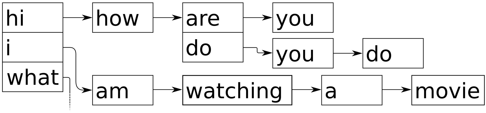
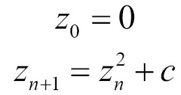
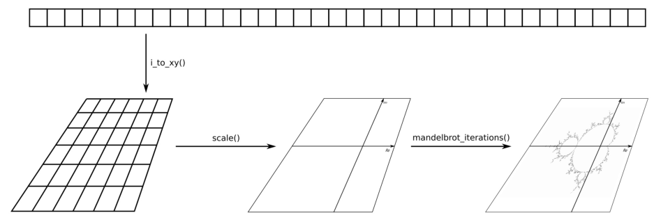
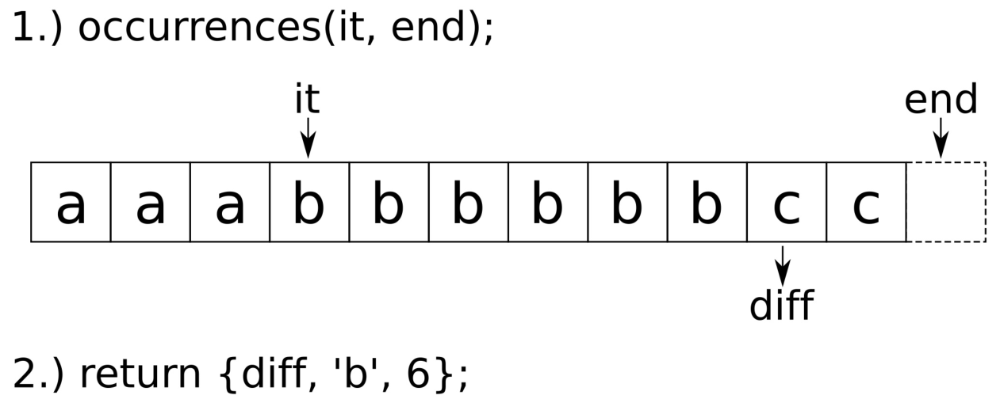

# STL算法的高级使用方式

大多数STL算法都将一个或多个迭代器对，作为其输入或输出参数。STL算法也能接受谓词函数，自定义比较函数和转换函数。最后，有些接口会返回迭代器，因为其他算法还会用到这个迭代器。

## 使用STL算法实现单词查找树类

让我们看下下图，这里有两个句子“hi how are you”和“hi how do you do”，存储在一个类似于树的结构体中。其都以“hi how”开头，句子后面不同的部分，划分为树结构：



因为trie数据结构结合了相同的前缀，其也称为前缀树，很容易使用STL的数据结构实现。

### How to do it...

```
#include <iostream>
#include <optional>
#include <algorithm>
#include <functional>
#include <iterator>
#include <map>
#include <vector>
#include <string>

using namespace std;
```

我们首先实现一个类。我们的实现中，trie为`map`的递归映射。每个trie节点够包含一个`map`，节点的有效值`T`映射了下一个节点：

```
template <typename T>
class trie
{
    map<T, trie> tries;
```

将新节点插入队列的代码很简单。使用者需要提供一个`begin/end`迭代器对，并且会通过循环进行递归。当用户输入的序列为{1, 2, 3}时，我们可以将1作为一个子trie，2为下一个子trie，以此类推。如果这些子trie在之前不存在，其将会通过`std::map`的`[]`操作符进行添加：

```
public:
    template <typename It>
    void insert(It it, It end_it) {
        if (it == end_it) { return; }
        tries[*it].insert(next(it), end_it);
    }
```

我们这里也会定义一个辅助函数，用户只需要提供一个容器，之后辅助函数就会通过迭代器自动进行查询：

```
    template <typename C>
    void insert(const C &container) {
        insert(begin(container), end(container));
    }
```

调用我们的类时，可以写成这样`my_trie.insert({"a", "b","c"});`，必须帮助编译器正确的判断出这段代码中的所有类型，因此我们又添加了一个函数，这个函数用于重载的插入接口：

```
    void insert(const initializer_list<T> &il) {
        insert(begin(il), end(il));
    }
```

我们也想了解，trie中有什么，所以我们需要一个打印函数。为了打印，我们可以对tire进行深度遍历。这样根节点下面的是第一个叶子节点，我们会记录我们所看到的元素的负载。当我们达到叶子节点，那么就可以进行打印了。我们会看到，当到达叶子的时候`tries.empty()`为true。递归调用print后，我们将再次弹出最后添加的负载元素：

```
    void print(vector<T> &v) const {
        if (tries.empty()) {
            copy(begin(v), end(v),
                ostream_iterator<T>{cout, " "});
            cout << '\n';
        }
        for (const auto &p : tries) {
            v.push_back(p.first);
            p.second.print(v);
            v.pop_back();
        }
    }
```

打印函数需要传入一个可打印负载元素的列表，不过用户不需要传入任何参数就能调用它。这样，我们就定义了一个无参数的打印函数，其构造了辅助列表对象：

```
    void print() const {
        vector<T> v;
        print(v);
    }
```

现在，我们就可以创建和打印trie了，我们将先搜索子trie。当trie包含的序列为`{a, b, c}`和`{a, b, d, e}`，并且我们给定的序列为`{a, b}`，对于查询来说，返回的子序列为包含`{c}`和`{d, e}`的部分。当我们找到子trie，将返回一个`const`的引用。在搜索中，也会出现没有要搜索序列的情况。即便如此，我们还是要返回些什么。`std::optional`是一个非常好的帮手，因为当没有找到匹配的序列，我们可以返回一个空的`optional`对象：

```
    template <typename It>
    optional<reference_wrapper<const trie>>
    subtrie(It it, It end_it) const {
        if (it == end_it) { return ref(*this); }
        auto found (tries.find(*it));
        if (found == end(tries)) { return {}; }

        return found->second.subtrie(next(it), end_it);
    }
```

与`insert`方法类似，我们将提供一个只需要一个参数的`subtrie`方法，其能自动的从输入容器中获取迭代器：

```
    template <typename C>
    auto subtrie(const C &c) {
        return subtrie(begin(c), end(c));
    }
};
```

这样就实现完了。我们在主函数中使用我们trie类，使用`std::string`类型对类进行特化，并实例化对象：

```
int main()
{
    trie<string> t;
    t.insert({"hi", "how", "are", "you"});
    t.insert({"hi", "i", "am", "great", "thanks"});
    t.insert({"what", "are", "you", "doing"});
    t.insert({"i", "am", "watching", "a", "movie"});
    
    cout << "recorded sentences:\n";
    t.print();
    
    cout << "\npossible suggestions after \"hi\":\n";

    if (auto st (t.subtrie(initializer_list<string>{"hi"}));
        st) {
        st->get().print();
    }
}
```

### How it works...

有趣的是，单词序列的插入代码要比在子trie查找给定字母序列的代码简单许多。所以，我们首先来看一下插入代码：

```
template <typename It>
void trie::insert(It it, It end_it) {
    if (it == end_it) { return; }
    tries[*it].insert(next(it), end_it);
}
```

迭代器对`it`和`end_it`，表示要插入的字符序列。`tries[*it]`代表在子trie中要搜索的第一个字母，然后调用`.insert(next(it), end_it);`对更低级的子trie序列使用插入函数，使用迭代器一个词一个词的推进。`if (it == end_it) { return; }`行会终止递归。返回语句不会做任何事情，这到有点奇怪了。所有插入操作都在`tries[*it]`语句上进行，`std::map`的中括号操作将返回键所对应的值或是创建该键，相关的值(本节中映射类型是一个trie)由默认构造函数构造。这样，当我们查找不理解的单词时，就能隐式的创建一个新的trie分支。

查找子trie看起来十分复杂，因为我们没有必要隐藏那么多的代码：

```
template <typename It>
optional<reference_wrapper<const trie>>
subtrie(It it, It end_it) const {
    if (it == end_it) { return ref(*this); }
    auto found (tries.find(*it));
    if (found == end(tries)) { return {}; }

    return found->second.subtrie(next(it), end_it);
}
```

这段代码的主要部分在于`auto found (tries.find(*it));`。我们使用find来替代中括号操作符。当我们使用中括号操作符进行查找时，trie将会为我们创建丢失的元素(顺带一提，当我们尝试这样做，类的函数为`const`，所以这样做事不可能的。这样的修饰能帮助我们减少bug的发生)。

另一个细节是返回值`optional<reference_wrapper<const trie>>`。我们选择`std::optional`作为包装器，因为其可能没有我们所要找打tire。当我们仅插入“hello my friend”，那么就不会找到“goodbye my friend”。这样，我们仅返回`{}`就可以了，其代表返回一个空`optional`对象给调用者。不过这还是没有解释，我们为什么使用`reference_wrapper`代替`optional<const trie &>`。`optional`的实例，其为`trie&`类型，是不可赋值的，因此不会被编译。使用`reference_warpper`实现一个引用，就是用来对对象进行赋值的。

## 使用树实现搜索输入建议生成器

### How to do it...

```
#include <iostream>
#include <optional>
#include <algorithm>
#include <functional>
#include <iterator>
#include <map>
#include <list>
#include <string>
#include <sstream>
#include <fstream>

using namespace std;

template <typename T>
class trie
{
    map<T, trie> tries;
public:
    template <typename It>
    void insert(It it, It end_it) {
        if (it == end_it) { return; }
        tries[*it].insert(next(it), end_it);
    }

    template <typename C>
    void insert(const C &container) {
        insert(begin(container), end(container));
    }

    void insert(const initializer_list<T> &il) {
        insert(begin(il), end(il));
    }

    void print(list<T> &l) const {
        if (tries.empty()) {
            copy(begin(l), end(l),
                ostream_iterator<T>{cout, " "});
            cout << '\n';
        }
        for (const auto &p : tries) {
            l.push_back(p.first);
            p.second.print(l);
            l.pop_back();
        }
    }

    void print() const {
        list<T> l;
        print(l);
    }

    template <typename It>
    optional<reference_wrapper<const trie>>
    subtrie(It it, It end_it) const {
        if (it == end_it) { return ref(*this); }
        auto found (tries.find(*it));
        if (found == end(tries)) { return {}; }

        return found->second.subtrie(next(it), end_it);
    }

    template <typename C>
    auto subtrie(const C &c) const {
        return subtrie(begin(c), end(c));
    }
};
```

实现一个简单的辅助函数，这个函数将用于提示用户输入他们想要查找的东西：

```
static void prompt()
{
    cout << "Next input please:\n > ";
}
```

主函数中，我们打开一个文本文件，其作为我们的基础数据库。我们逐行读取文本文件的内容，并且将数据放入trie中解析：

```
int main()
{
    trie<string> t;
    fstream infile {"db.txt"};
    for (string line; getline(infile, line);) {
        istringstream iss {line};
        t.insert(istream_iterator<string>{iss}, {});
    }
```

现在可以使用构建好的trie类，并且需要实现接收用户查询输入的接口。会提示用户进行输入，并且将用户的输入整行读取：

```
    prompt();
    for (string line; getline(cin, line);) {
        istringstream iss {line};
```

通过文本输入，可以使用trie对其子trie进行查询。如果在数据库中已经有相应的语句，那么会对输入进行建议，否则会告诉用户没有建议给他们：

```
    if (auto st (t.subtrie(istream_iterator<string>{iss}, {}));
        st) {
        cout << "Suggestions:\n";
        st->get().print();
    } else {
        cout << "No suggestions found.\n";
    }
     cout << "----------------\n";
     prompt();
    }
}
```

### How it works...

```
fstream infile {"db.txt"};
for (string line; getline(infile, line);) {
    istringstream iss {line};
    t.insert(istream_iterator<string>{iss}, {});
}
```

这段代码会逐行的将文本文件中的内容读取出来。然后，我们将字符串拷贝到一个`istringstream`对象中。我们可以根据输入流对象，创建一个`istring_iterator`迭代器，其能帮助我们查找子trie。这样，我们就不需要将字符串放入`vector`或`list`中了。上述代码中，有一段不必要的内存分配，可以使用移动方式，将`line`中的内容移动到iss中，避免不必要的内存分配。不过，`std::istringstream`没有提供构造函数，所以只能将`std::string`中的内容移动到流中。不过，这里会对输入字符串进行复制。

当在trie中查询用户的输入时，使用了相同的策略，但不使用输入文件流。我们使用`std::cin`作为替代，因为`trie::subtrie`对迭代器的操作，和`trie::insert`如出一辙。

### There's more...

这里有必要对每个trie节点添加统计变量，这样我们就能知道各种前缀被查询的频率。因此，我们就可以将程序的建议进行排序，当前的搜索引擎就是这样做的。智能手机触摸屏文本输入的建议，也可以通过这种方式实现。

## 使用STL数值算法实现傅里叶变换

信号处理领域傅里叶变换是非常重要和著名的公式。因为其应用领域广泛，STL也试图将其用在数值计算领域。傅里叶变换只是其中一个例子，同样也是非常棘手的一个。其公式如下所示：


公式基于累加和的变换。累加中的每个元素是输入信号向量中的一个数据点和表达式`exp(-2 * i * ...)`的乘积。这里需要一些工程数学的知识，你需要简单的了解复数的概念，如果你没有相关的知识，了解概念就可以了。仔细观察这个公式，其就是将信号中的所有数据点进行加和(信号数据的长度为N)，其循环索引值为j。其中k是另一个循环变量，因为傅里叶变换计算出的是一组值。在这组值中，每一个数据点都表示着一段重复波形的幅值和相位，这些信息不包含在原始数据中。当使用循环对其进行实现时，代码可能就会写成下面这样：

```
csignal fourier_transform(const csignal &s) {
    csignal t(s.size());
    const double pol {-2.0 * M_PI / s.size()};
    for (size_t k {0}; k < s.size(); ++k) {
        for (size_t j {0}; j < s.size(); ++j) {
            t[k] += s[j] * polar(1.0, pol * k * j);
        }
    }
    return t;
}
```

这里`csignal`的类型可能是`std::vector`，其每个元素都是一个复数。对于复数而言，STL中已经有了对应的数据结构可以对其进行表示——`std::complex`。`std::polar`函数计算得是`exp(-2 * i * ...)`部分。

### How to do it...

本节，我们将实现傅里叶变换和逆变换，然后会对一些信号进行转换：

```
#include <iostream>
#include <complex>
#include <vector>
#include <algorithm>
#include <iterator>
#include <numeric>
#include <valarray>
#include <cmath>

using namespace std;
```

信号点的值一个复数，我们使用`std::complex`来表示，并使用`double`进行特化。我们可以对类型进行别名操作，使用`cmple`表示两个`double`值，这两个`double`值分别表示复数的实部和虚部。使用`csdignal`来别名相应的`vector`对象：

```
using cmplx = complex<double>;
using csignal = vector<cmplx>;
```

我们需要使用数值指针遍历数值序列。公式中的变量k和j就会随着序列进行累加：

```
class num_iterator {
    size_t i;
public:
    explicit num_iterator(size_t position) : i{position} {}

    size_t operator*() const { return i; }

    num_iterator& operator++() {
        ++i;
        return *this;
    }

    bool operator!=(const num_iterator &other) const {
        return i != other.i;
    }
};
```


傅里叶变换需要接收一个信号，并返回一个新的信号。返回的信号表示已经经过傅里叶变换的信号。通过傅里叶逆变换，我们可以将一个经过傅里叶变换的信号，还原成原始信号，这里我们会提供一个可选的`bool`参数，其会决定变换的方向。`bool`参数作为参数是一种不好习惯，特别是在一个函数的签名中出现多次。我们这有个很简洁的例子。我们做的第一件事，是使用原始信号的尺寸来分配新的信号数组：

```
csignal fourier_transform(const csignal &s, bool back = false)
{
    csignal t (s.size());
```

公式中有两个因子，其看起来是相同的。让我们将其打包成一个变量：

```
    const double pol {2.0 * M_PI * (back ? -1.0 : 1.0)};
    const double div {back ? 1.0 : double(s.size())};
```

`std::accumulate`很适合用来执行公式中的累加部分，我们将对一个范围内的数值使用`accumulate`。对于每个值，我们将逐步的进行单个相加。`std::accumulate`算法会调用一个二元函数。该函数的第一个参数为目前为止我们所累加的变量`sum`，第二个参数为范围内下一个要累加的值。我们会在信号`s`中对当前为止的值进行查找，并且会将其和复数因子`pol`相乘。然后，我们返回新的`sum`。这里的二元函数，使用Lambda表达式进行包装，因为我们将在每次`accumulate`的调用时，`j`变量的值是不同的。因为其是二维循环算法，所以内层Lambda做内部的循环，外层Lambda做外层的循环：

```
    auto sum_up ([=, &s] (size_t j) {
        return [=, &s] (cmplx c, size_t k) {
            return c + s[k] *
                polar(1.0, pol * k * j / double(s.size()));
        };
    });
```

傅里叶的内部循环，现在使用`std::accumulate`进行，算法中每个位置都会进行加和。我们使用Lambda表达式来实现，这样我们就能计算出傅里叶变换数组中的每个数据点的值：

```
    auto to_ft ([=, &s](size_t j){
        return accumulate(num_iterator{0},
                          num_iterator{s.size()},
                          cmplx{},
                          sum_up(j))
        / div;
    });
```

目前位置，还没有执行傅里叶变换的代码。我们会准备大量的功能性代码，他们会帮助我们完成很多事情。`std::transform`的调用将会使j的值在[0, N)间变换(这步是在外层循环完成)。变换之后的值将全部放入`t`中，`t`就是我们要返回给用户的值：

```
    transform(num_iterator{0}, num_iterator{s.size()},
             begin(t), to_ft);
    return t;
}
```

我们将会实现一些辅助函数帮助我们生成信号。首先实现的是一个余弦信号生成器，其会返回一个Lambda表达式，这个表达式通过传入的长度参数，产生对应长度的余弦信号数据。信号本身的长度是不固定的，但是其有固定的周期。周期为N，意味着该信号会在N步之后重复。返回的Lambda表达式不接受任何参数。我们可以重复的对其进行调用，并且每次调用表达式将会返回给我们下一个时间点的信号值：

```
static auto gen_cosine (size_t period_len){
    return [period_len, n{0}] () mutable {
        return cos(double(n++) * 2.0 * M_PI / period_len);
    };
}
```

我们所要生成另一个波形是方波。该波形会在`-1`和`+1`两值间震荡，其中不会有其他的值。公式看起来有点复杂，但是其变换非常简单，也就是将值n置为`+1`或`-1`，并且其震荡周期为`period_len`。这里要注意，我们没有使用0对n进行初始化。这样，我们的方波的其实位置就在`+1`上：

```
static auto gen_square_wave (size_t period_len)
{
    return [period_len, n{period_len*7/4}] () mutable {
        return ((n++ * 2 / period_len) % 2) * 2 - 1.0;
    };
}
```

产生实际信号可以通过`vector`和信号生成器联合进行，使用重复调用信号生成器对`vector`数组进行填充。`std::generate`就用来完成这个任务的。其接受一组`begin/end`迭代器组和一个生成函数。对于每个合法的迭代器，都会进行`*it = gen()`。通过将这些代码包装成一个函数，我们可以很容易的生成一个信号数组：

```
template <typename F>
static csignal signal_from_generator(size_t len, F gen)
{
    csignal r (len);
    generate(begin(r), end(r), gen);
    return r;
}
```

最后，我们需要将信号的结果进行打印。我们可以将数组中的值拷贝到输出流迭代器中进行输出，不过我们需要先将数据进行变换，因为我们的信号数据都是复数对。这样，我们只需要在意每个点的实部就好；所以，我们可以将数组扔到`std::transform`中进行变换，然后将实部提取出来：

```
static void print_signal (const csignal &s)
{
    auto real_val ([](cmplx c) { return c.real(); });
    transform(begin(s), end(s),
             ostream_iterator<double>{cout, " "}, real_val);
    cout << '\n';
}
```

目前为止，傅里叶公式就已经实现了，不过现在还没有信号进行变换。这个工作我们将在主函数中完成。我们先来定义信号数据的长度：

```
int main()
{
    const size_t sig_len {100};
```

现在来生成信号数据，转换他们，然后进行打印。首先，生成一个余弦信号和一个方波信号。这两组信号的长度和周期数相同：

```
    auto cosine (signal_from_generator(sig_len,
        gen_cosine( sig_len / 2)));

    auto square_wave (signal_from_generator(sig_len,
        gen_square_wave(sig_len / 2)));
```

那么现在有了两个波形信号。为了生成第三个信号，我们对方波信号进行傅里叶变换，并且保存在`trans_sqw`数组中。方波的傅里叶变换有些特殊，我们在后面会进行介绍。索引从10到`(signal_length - 10)`都设置为0.0。经过傅里叶变换之后，原始信号将发生很大的变化。我们将在最后看到结果：

```
    auto trans_sqw (fourier_transform(square_wave));

    fill (next(begin(trans_sqw), 10), prev(end(trans_sqw), 10), 0);
    auto mid (fourier_transform(trans_sqw, true));
```

现在，我们有三个信号：余弦、mid和方波。对于每个信号，我们将会打印其原始波形，和傅里叶变换过后的波形。输出将有六条曲线组成：

```
    print_signal(cosine);
    print_signal(fourier_transform(cosine));

    print_signal(mid);
    print_signal(trans_sqw);

    print_signal(square_wave);
    print_signal(fourier_transform(square_wave));
}
```

### How it works...

首先，我们来看一下傅里叶变换。其核心部分在循环中实现(虽然没有在我们实现中这样做，但可以结合代码看下介绍中的公式)，可能会以如下方式实现：

```
for (size_t k {0}; k < s.size(); ++k) {
    for (size_t j {0}; j < s.size(); ++j) {
        t[k] += s[j] * polar(1.0, pol * k * j / double(s.size()));
    }
}
```

基于STL算法`std::transform`和`std::accumulate`，我们完成了自己的例子，总结一下就类似如下的伪代码：

```
transform(num_iterator{0}, num_iterator{s.size()}, ...
    accumulate((num_iterator0}, num_iterator{s.size()}, ...
        c + s[k] * polar(1.0, pol * k * j / double(s.size()));
```

和循环相比，结果完全一样。当然，使用STL算法也可以产生不太好的代码。不管怎么样吧，这个实现是不依赖所选用的数据结构。其对于列表也起作用(虽然这没有太大的意义)。另一个好处是，在C++17中STL很容易并行(将在本书的另一个章节进行介绍)，当需要并行的时候，我们就需要对纯循环进行重构和拆分，将其放入指定的线程中(除非使用类似OpenMP这样的并发库，其会自动的将循环进行重构)。

下一个难点是信号生成。让我来看一下另一个`gen_cosine`:

```
static auto gen_cosine (size_t period_len)
{
    return [period_len, n{0}] () mutable {
        return cos(double(n++) * 2.0 * M_PI / period_len);
    };
}
```

每一个Lambda表达式代表一个函数对象，其会在每次调用时改变自身的状态。其状态包含两个变量`period_len`和`n`。变量n会在每次调用时，进行变更。在不同的时间点上，得到的是不同的信号值，并且在时间增加时会使用`n++`对`n`的值进行更新。为了获得信号值的数组，我们创建了辅助函数`signal_from_generator`：

```
template <typename F>
static auto signal_from_generator(size_t len, F gen)
{
    csignal r (len);
    generate(begin(r), end(r), gen);
    return r;
}
```

这个函数会通过所选长度创建一个信号`vector`，并且调用`std::generate`对数据点进行填充。数组r中的每一个元素，都会调用一个`gen`函数。`gen`函数是是一种自修改函数对象，我们使用相同的方式创建了`gen_cosine`对象。

## 计算两个vector的误差和

我们给出一个简单的计算信号a与信号b之间的误差公式：


对于每一个`i`，都会计算一次`a[i] - b[i]`，对差值求平方(负值和正值就能进行比较)，最后计算平方差的和。通常我们会使用循环来做这件事，但是为了让事情更加好玩，我们决定使用STL算法来完成。使用STL的好处是，无需耦合特定的数据结果。我们的算法能够适应`vector`和类似链表的数据结构，不用直接进行索引。

### How to do it...

```
#include <iostream>
#include <cmath>
#include <algorithm>
#include <numeric>
#include <vector>
#include <iterator>

using namespace std;
```

我们将对两个信号的误差和进行计算。这两个信号一个是`sine`，另一个信号也是`sine`，不过其中之一的使用`double`类型进行保存，另一个使用`int`类型进行保存。因为`double`和`int`类型表示数值的范围有差异，就像是模拟信号`as`转换成数字信号`ds`。

```
int main()
{
   const size_t sig_len {100};
   vector<double> as (sig_len); // a for analog
   vector<int> ds (sig_len); // d for digital
```

为了生成一个`sin`波形，我们实现了一个简单的Lambda表达式，并可以传入一个可变的计数变量`n`。我们可以经常在需要的时候调用表达式，其将返回下一个时间点的`sine`波形。`std::generate`可以使用信号值来填充数组，并且使用`std::copy`将数组中的`double`类型的变量，转换成`int`类型变量：

```
    auto sin_gen ([n{0}] () mutable {
        return 5.0 * sin(n++ * 2.0 * M_PI / 100);
    });
    generate(begin(as), end(as), sin_gen);
    copy(begin(as), end(as), begin(ds));
```

我们可以对信号进行打印，也可以使用绘图进行显示：

```
    copy(begin(as), end(as),
        ostream_iterator<double>{cout, " "});
    cout << '\n';
    copy(begin(ds), end(ds),
        ostream_iterator<double>{cout, " "});
    cout << '\n';
```

现在来计算误差和，我们使用`std::inner_product`，因为这个函数能帮助我们计算两个信号矢量的差异。该函数能在指定范围内进行迭代，然后选择相应位置上进行差值计算，然后在进行平方，再进行相加：

```
    cout << inner_product(begin(as), end(as), begin(ds),
                        0.0, std::plus<double>{},
                        [](double a, double b) {
                               return pow(a - b, 2);
                        })
        << '\n';
}
```

### How it works...

本节，我们需要将两个向量放入循环中，然后对不同位置的值计算差值，然后差值进行平方，最后使用`std::inner_product`将差的平方进行加和。这样，我们可以使用Lambda表达式来完成求差值平方的操作——`[](double a, double b){return pow(a - b), 2}`，这样就可以通过传入不同的参数来计算差值平方。

这里我们可以看下`std::inner_product`是如何工作的：

```
template<class InIt1, class InIt2, class T, class F, class G>
T inner_product(InIt1 it1, InIt1 end1, InIt2 it2, T val,
               F bin_op1, G bin_op2)
{
    while(it1!= end1){
        val = bin_op1(val, bin_op2(*it1, *it2));
        ++it1;
        ++it2;
    }
    return value;
}
```

算法会接受一对`begin/end`迭代器作为第一个输入范围，另一个`begin`迭代器代表第二个输入范围。我们的例子中，这些迭代器所指向的是`vector`，并对这两个`vector`进行误差和的计算。`val`是一个初始化值。我们这里将其设置为`0.0`。然后，算法可以接受两个二元函数，分别为`bin_op1`和`bin_op2`。

我们会发现，这个算法与`std::accumulate`很相似。不过`std::accumulate`只对一个范围进行操作。当将`bin_op2(*it1, *it2)`看做一个迭代器，那么我们可以简单的是用`accumulate`算法进行计算了。所以，我们可以将`std::inner_product`看成是带有打包输入范围的`std::accumulate`。

例子中，打包函数就是`pow(a - b, 2)`。因为我们需要将所有元素的差平方进行加和，所以我们选择`std::plus<double>`作为`bin_op1`。

## 使用ASCII字符曼德尔布罗特集合

1975年，数学家贝诺曼德尔布罗特(Benoit Mandelbrot)创造了一个术语——**分形**。分形是一个数学图像或者集合，这个术语中包含了很多有趣的数学特性，不过最后看起来分形更像是艺术品。分形图像看起来是无限重复的缩小。其中最为众人所知的分形是曼德尔布罗特(Mandelbrot)集合，其集合看起来就像下图一样：


曼德尔布罗特集合可以通过迭代下面的等式得到：



`z`和`c`变量都是复数。曼德尔布罗特集合包含等式所覆盖所有让方程收敛的`c`值，也就是海报彩色的部分。有些值收敛的早，有些值收敛的晚，这里用不同的颜色对这些值进行描述，所以我们能在海报中看到各种不同的颜色。对于那些不收敛的值，我们则直接将其所在区域直接涂黑。

使用STL的`std::complex`类，且不使用循环来实现上面的等式。这并不是炫技，只是为了让大家更容易理解STL相关特性的使用方式。

### How to do it...

```
#include <iostream>
#include <algorithm>
#include <iterator>
#include <complex>
#include <numeric>
#include <vector>

using namespace std;
```

曼德尔布罗特集合和之前的等式，都是对复数进行操作。所以，我们需要使用类型别名，使用`cmplx`来代表`std::complex`，并特化为`double`类型：

```
   using cmplx = complex<double>;
```

我们将使用大约20行的代码来完成一个ASCII组成的曼德尔布罗特集合图像，不过我们会将逻辑逐步实现，最后将所有结果进行组合。第一步就是实现一个函数，用于将整型坐标缩放为浮点坐标。这也就是我们如何在屏幕上特定的位置上打印相应的字符。我们想要的是曼德尔布罗特集合中复数的坐标，就需要实现一个函数，用于将对应的坐标转换成相应的几何图形。用一个Lambda表达式来构建这些变量，并将其返回。该函数能将`int`类型的函数转换成一个`double`类型的函数：

```
static auto scaler(int min_from, int max_from,
double min_to, double max_to)
{
    const int w_from {max_from - min_from};
    const double w_to {max_to - min_to};
    const int mid_from {(max_from - min_from) / 2 + min_from};
    const double mid_to {(max_to - min_to) / 2.0 + min_to};

    return [=] (int from) {
           return double(from - mid_from) / w_from * w_to + mid_to;
    };
}
```

现在需要在一个维度上进行坐标变换，不过曼德尔布罗特集合使用的是二维坐标系。为了能将(x, y)坐标系统转换成另一个，我们需要将`x-scaler`和`y-scaler`相结合，并且构建一个`cmplx`实例作为输出：

```
template <typename A, typename B>
static auto scaled_cmplx(A scaler_x, B scaler_y)
{
    return [=](int x, int y) {
        return cmplx{scaler_x(x), scaler_y(y)};
    };
}
```

将坐标转换到正确的维度上后，就可以来实现曼德尔布罗特方程。现在不管怎么打印输出，一心只关注于实现方程即可。循环中，对`z`进行平方，然后加上`c`，知道`abs`的值小于2。对于一些坐标来说，其值永远不可能比2小，所以当循环次数达到`max_iterations`时，我们就决定放弃。最后，将会返回那些`abs`值收敛的迭代次数：

```
static auto mandelbrot_iterations(cmplx c)
{
    cmplx z {};
    size_t iterations {0};
    const size_t max_iterations {1000};
    while (abs(z) < 2 && iterations < max_iterations) {
        ++iterations;
        z = pow(z, 2) + c;
    }
    return iterations;
}
```

那么现在我们就来实现主函数。在主函数中我们会定义缩放函数对象`scale`，用于对坐标值进行多维变换：

```
int main()
{
    const size_t w {100};
    const size_t h {40};

    auto scale (scaled_cmplx(
        scaler(0, w, -2.0, 1.0),
        scaler(0, h, -1.0, 1.0)
    ));
```

为了可以在一维上迭代器整个图形，需要完成另一个转换函数，用于将二维图像进行降维操作。其会根据我们所设置的字符宽度进行计算。其会将一维上的长度进行折断，然后进行多行显示，通过使用`scale`函数对坐标进行变换，然后返回复数坐标：

```
    auto i_to_xy ([=](int i) { return scale(i % w, i / w); });
```

我们将图像的二维坐标(int，int类型)转换为一维坐标(int类型)，再将坐标转换成曼德尔布罗特结合坐标(cmplx类型)。让我们将所有功能放入一个函数，我们将使用一组调用链：

```
    auto to_iteration_count ([=](int i) {
        return mandelbrot_iterations(i_to_xy(i));
    });
```

现在我们可以来设置所有数据。假设我们的结果ASCII图像的字符宽度为`w`，高度为`h`。这样就能将结果存储在一个长度为`w * h`数组中。我们使用`std::iota`将数值范围进行填充。这些数字可以用来作为转换的输入源 ，我们将变换过程包装在`to_iteration_count`中：

```
    vector<int> v (w * h);
    iota(begin(v), end(v), 0);
    transform(begin(v), end(v), begin(v), to_iteration_count);
```

现在有一个v数组，其使用一维坐标进行初始化，不过后来会被曼德尔布罗特迭代计数所覆盖。因此，我们就可以对图像进行打印。可以将终端窗口设置为`w`个字符宽度，这样我们就不需要打印换行符。不过，可能会有对`std::accumulate`有一种创造性的误用。`std::accumulate`使用二元函数对处理范围进行缩小。我们可以对其提供一个二元函数，其能接受一个输出迭代器(并且我们将在下一步进行终端打印)，并使用范围内的单个值进行计算。如果相应值的迭代次数大于50次时，我们会打印`*`字符到屏幕上。否则，会打印空字符在屏幕上。在每行结束时(因为计数器变量n可被W均匀地分割)，我们会打印一个换行符：

```
    auto binfunc ([w, n{0}] (auto output_it, int x) mutable {
        *++output_it = (x > 50 ? '*' : ' ');
        if (++n % w == 0) { ++output_it = '\n'; }
        return output_it;
    });
```

通过对输入范围使用`std::accumulate`，我们将二元打印函数和`ostream_iterator`相结合，我们需要在屏幕上刷新计算出的曼德尔布罗特集合：

```
    accumulate(begin(v), end(v), ostream_iterator<char>{cout},
              binfunc);
}
```

编译并运行程序，就可以看到如下的输出，其看起来和墙上的海报很像吧！


### How it works...

整个计算过程都使用`std::transform`对一维数组进行处理：

```
vector<int> v (w * h);
iota(begin(v), end(v), 0);
transform(begin(v), end(v), begin(v), to_iteration_count);
```

所以，会发生什么呢？我们为什么要这么做？`to_iteration_count`函数是基于从`i_to_xy`开始的调用链，从`scale`到`mandelbrot_iterations`。下面的图像就能展示我们的转换步骤：



这样，我们就可以使用一维数组作为输入，并且获得曼德尔布罗特方程的迭代次数(使用一维坐标表示的二维坐标上的值)。三个互不相关的转换是件好事。这样代码就可以独立的进行测试，这样就不用互相牵制了。同样，这样更容易进行正确性测试，并寻找并修复bug。

## 实现分割算法

本节我们将实现一个算法，叫做**分割**(split)。该算法可以通过给定的值，对任何范围的元素进行分割，将分割后的结果块拷贝到输出区域中。

### How to do it...

本节，将实现类似于STL的算法叫做分割，并且用这个算法对字符串进行分割：

```
#include <iostream>
#include <string>
#include <algorithm>
#include <iterator>
#include <list>

using namespace std;
```

本节的所有算法都围绕分割来进行。其接受一对`begin/end`迭代器和一个输出迭代器，其用法和`std::copy`或`std::transform`类似。其他参数为`split_val`和`bin_func`。`split_val`参数是要在输入范围内要查找的值，其表示要当碰到这个值时，要对范围进行分割。`bin_func`参数是一个函数，其为分割的子序列的开始和结尾。我们可以使用`std::find`对输入范围进行迭代查找，这样就能直接跳转到`split_val`所在的位置。当将一个长字符串分割成多个单词，可以通过分割空格字符达到目的。对于每一个分割值，都会做相应的分割，并将对应的分割块拷贝到输出范围内：

```
template <typename InIt, typename OutIt, typename T, typename F>
InIt split(InIt it, InIt end_it, OutIt out_it, T split_val,
          F bin_func)
{
    while (it != end_it) {
        auto slice_end (find(it, end_it, split_val));
        *out_it++ = bin_func(it, slice_end);

        if (slice_end == end_it) { return end_it; }
        it = next(slice_end);
    }
    return it;
}
```

现在尝试一下我们的新算法，构建一个需要进行分割的字符串。其中的字符使用`-`进行连接：

```
int main()
{
    const string s {"a-b-c-d-e-f-g"};
```

创建一个`bin_func`对象，其能接受一组迭代器，我们需要通过该函数创建一个新的字符串：

```
    auto binfunc ([](auto it_a, auto it_b) {
        return string(it_a, it_b);
    });
```

输出的子序列将保存在`std::list`中。我们现在可以调用`split`算法：

```
    list<string> l;
    split(begin(s), end(s), back_inserter(l), '-', binfunc);
```

为了看一下结果，我们将对子字符串进行打印：

```
    copy(begin(l), end(l), ostream_iterator<string>{cout, "\n"});
}
```

### How it works...

`split`算法与`std::transform`的工作原理很类似，因为其能接受一对`begin/end`迭代器和一个输出迭代器。其也会将最终的算法结果拷贝到输出迭代器所在的容器。除此之外，其接受一个`split_val`值和一个二元函数。让我们再来看一起其整体实现：

```
template <typename InIt, typename OutIt, typename T, typename F>
InIt split(InIt it, InIt end_it, OutIt out_it, T split_val, F bin_func)
{
    while (it != end_it) {
        auto slice_end (find(it, end_it, split_val));
        *out_it++ = bin_func(it, slice_end);

        if (slice_end == end_it) { return end_it; }
        it = next(slice_end);
    }
    return it;
}
```

实现中的循环会一直进行到输入范围结束。每次迭代中都会调用`std::find`用来在输入范围内查找下一个与`split_val`匹配的元素。在我们的例子中，分割字符就是`-`。每次的下一个减号字符的位置会存在`slice_end`。每次循环迭代之后，`it`迭代器将会更新到下一个分割字符所在的位置。循环起始范围将从一个减号跳到下一个减号，而非每一个独立的元素。

迭代器`it`指向的是最后子字符串的起始位置，`slice_end`指向的是子字符串的末尾位置。通过这两个迭代器，就能表示分割后的子字符串。对于字符串`foo-bar-baz`来说，循环中就有三个迭代器。对于用户而言，迭代器什么的并不重要，他们想要的是子字符串，所以这里就是`bin_func`来完成这个任务。当我们调用`split`时，我们可以给定其一个如下的二元函数：

```
[](auto it_a, auto it_b) {
    return string(it_a, it_b);
}
```

`split`函数会将迭代器传递给`bin_func`，并通过迭代器将结果放入输出迭代器中。这样我们就能通过`bin_func`获得相应的单词，这里的结果是`foo`，`bar`和`baz`。

### There's more...

我们也可以实现相应的迭代器来完成这个算法的实现。我们现在不会去实现这样一个迭代器，但是可以简单的看一下。

迭代的每次增长，都会跳转到下一个限定符。

当对迭代器进行解引用时，其会通过迭代器指向的当前位置，创建一个字符串对象，就如同之前用到的`bin_func`函数那样。

迭代器类可以称为`split_iterator`，用来替代算法`split`，用户的代码可以写成如下的样式：

```
string s {"a-b-c-d-e-f-g"};
list<string> l;

auto binfunc ([](auto it_a, auto it_b) {
    return string(it_a, it_b);
});

copy(split_iterator{begin(s), end(s), "-", binfunc},{}, back_inserter(l));
```

虽然在使用中很方便，但是在实现时，迭代器的方式要比算法的形式复杂许多。并且，迭代器实现中很多边缘值会触发代码的bug，并且迭代器实现需要经过非常庞杂的测试。不过，其与其他STL算法能够很好的兼容。

## 将标准算法进行组合

`gather`算法能操作任意的元素类型。其更改元素的顺序，通过用户的选择，其会将对应的数据放置在对应位置上。

### How to do it...

```
#include <iostream>
#include <algorithm>
#include <string>
#include <functional>

using namespace std;
```

`gather`算法是表现标准算法组合性很好的一个例子。`gather`接受一对`begin/end`迭代器和另一个迭代器`gather_pos`，其指向`begin`和`end`迭代器的中间位置。最后一个参数是一个谓词函数。使用谓词函数，算法会将满足谓词条件的所有元素放置在`gather_pos`迭代器附近。使用`std::stable_partition`来完成移动元素的任务。`gather`算法将会返回一对迭代器。这两个迭代器由`stable_partition`所返回，其表示汇集范围的起始点和结束点：

```
template <typename It, typename F>
pair<It, It> gather(It first, It last, It gather_pos, F predicate)
{
    return {stable_partition(first, gather_pos, not_fn(predicate)),
            stable_partition(gather_pos, last, predicate)};
}
```

算法的另一种变体为`gather_sort`。其工作原理与`gather`相同，不过其不接受一元谓词函数；其能接受一个二元比较函数。这样，其就也能将对应值汇集在`gather_pos`附近，并且能知道其中最大值和最小值：

```
template <typename It, typename F>
void gather_sort(It first, It last, It gather_pos, F comp_func)
{
    auto inv_comp_func ([&](const auto &...ps) {
        return !comp_func(ps...);
    });

    stable_sort(first, gather_pos, inv_comp_func);
    stable_sort(gather_pos, last, comp_func);
}
```

让我们来使用一下这些算法。先创建一个谓词函数，其会告诉我们当前的字母是不是`a`，再构建一个字符串，仅包含`a`和`-`字符：

```
int main()
{
    auto is_a ([](char c) { return c == 'a'; });
    string a {"a_a_a_a_a_a_a_a_a_a_a"};
```

继续构造一个迭代器，让其指向字符串的中间位置。这时可以调用`gather`算法，然后看看会发生什么。`a`字符将汇集在字符串中间的某个位置附近：

```
    auto middle (begin(a) + a.size() / 2);

    gather(begin(a), end(a), middle, is_a);
    cout << a << '\n';
```

再次调用`gather`，不过这次`gather_pos`的位置在字符串的起始端：

```
    gather(begin(a), end(a), begin(a), is_a);
    cout << a << '\n';
```

再将`gather_pos`的位置放在末尾试试：

```
    gather(begin(a), end(a), end(a), is_a);
    cout << a << '\n';
```

最后一次，这次将再次将迭代器指向中间位置。这次与我们的期望不相符，后面我们来看看发生了什么：

```
    // This will NOT work as naively expected
    gather(begin(a), end(a), middle, is_a);
    cout << a << '\n';
```

再构造另一个字符串，使用下划线和一些数字组成。对于这个输入队列，我们使用`gather_sort`。`gather_pos`迭代器指向字符串的中间，并且比较函数为`std::less<char>`：

```
    string b {"_9_2_4_7_3_8_1_6_5_0_"};
    gather_sort(begin(b), end(b), begin(b) + b.size() / 2,
               less<char>{});
    cout << b << '\n';
}
```

编译并运行程序，就会看到如下的输出。对于前三行来说和预期一样，不过第四行貌似出现了一些问题。最后一行中，我们可以看到`gather_short`函数的结果。数字的顺序是排过序的(中间小，两边大)：

```
$ ./gather
_____aaaaaaaaaaa_____
aaaaaaaaaaa__________
__________aaaaaaaaaaa
__________aaaaaaaaaaa
_____9743201568______
```

### How it works...

`gather`算法有点难以掌握，因为其非常短，但处理的是比较复杂的问题。让我们来逐步解析这个算法：


- 初始化相应元素，并提供一个谓词函数。图中满足谓词函数条件的元素为灰色，其他的为白色。迭代器`a`和`c`表示整个范围的长度，并且迭代器`b`指向了最中间的元素。这就表示要将所有灰色的格子聚集在这个迭代器附近。
- `gather`算法会对范围`(a, b]`调用`std::stable_partition`，并对另一边使用不满足谓词条件的结果。这样就能将所有灰色格子集中在b迭代器附近。
- 另一个`std::stable_partition`已经完成，不过在`[b, c)`间我们将使用满足谓词函数的结果。这样就将灰色的格子汇集在b迭代器附近。
- 所有灰色的格子都汇集在`b`迭代器附近，这是就可以返回起始迭代器`x`和末尾迭代器`y`，用来表示所有连续灰色格子的范围。

我们对同一个范围多次调用`gather`算法。最初，将所有元素放在范围中间位置。然后，尝试放在开始和末尾。这种实验很有趣，因为这会让其中一个`std::stable_partition`无元素可以处理。

最后一次对`gather`进行调用时，参数为`(begin, end, middle)`，但没有和我们预期的一样，这是为什么呢？这看起来像是一个bug，实际上不是。

试想一个字符组`aabb`，使用谓词函数`is_character_a`，用来判断元素是否为`a`，当我们将第三个迭代器指向字符范围的中间时，会复现这个bug。原因：第一个`stable_partition`调用会对子范围`aa`进行操作，并且另一个`stable_partition`会对子范围`bb`上进行操作。这种串行的调用时无法得到`baab`的，其结果看起来和开始一样，没有任何变化。

要是想得到我们预期的序列，我们可以使用`std::rotate(begin, begin + 1, end);`

`gather_sort`基本上和`gather`差不多。签名不同的就是在于谓词函数。实现的不同在于`gather`调用了两次`std::stable_partition`，而`gather_sort`调用了两次`std::stable_sort`。

这是由于`not_fn`不能作用域二元函数，所以反向比较不能由`not_fn`完成。

## 删除词组间连续的空格

我们将实现一个聪明的空格滤波算法，其会删除多于的空格，会给单词间留下一个空格。我们可以将这个算法称为`remove_multi_whitespace`，并且接口与STL很像。

### How to do it...

```
#include <iostream>
#include <string>
#include <algorithm>

using namespace std;
```

`remove_multi_whitespace`看起来与STL的风格非常类似。这个算法会移除多余的空格，只保留一个空格。当字符串为`a b`，算法是不会进行任何操作的；当字符串为`a b`时，算法会返回`a b`。为了完成这个算法，我们使用`std::unqiue`通过对一段区域的迭代，用来查找一对连续的元素。然后，通过谓词函数进行判断，确定两个元素是否相等。如果相等，那么`std::unique`会将其中一个移除。这样，子范围中就不会存在相等的元素了。谓词函数会通过读取到的内容来判断二者是否相等。我们需要给`std::unique`怎么样一个谓词函数呢？其需要判断两个元素是否是连续的空格；如果是，就要移除一个空格。与`std::unique`类似，也需要传入一对`begin/end`迭代器，然后返回的迭代器将返回新范围的末尾迭代器：

```
template <typename It>
It remove_multi_whitespace(It it, It end_it)
{
    return unique(it, end_it, [](const auto &a, const auto &b) {
        return isspace(a) && isspace(b);
    });
}
```

万事俱备，就来进行测试，尝试使用算法将不必要的空格进行删除：

```
int main()
{
    string s {"fooo bar \t baz"};

    cout << s << '\n';
```

对字符串使用过滤算法，去掉多余的空格：

```
    s.erase(remove_multi_whitespace(begin(s), end(s)), end(s));

    cout << s << '\n';
}
```

### How it works...

整个问题的解决中，我们没有使用循环或者元素间的互相比较。我们只使用谓词函数来完成判断两个给定字符是否是空格的任务。然后，将谓词函数与`std::unique`相结合，所有多余的空格就都消失了。

我们来看一下`std::unique`可能的实现代码：

```
template<typename It, typename P>
It unique(It it, It end, P p)
{
    if (it == end) { return end; }

    It result {it};
    while (++it != end) {
        if (!p(*result, *it) && ++result != it) {
            *result = std::move(*it);
        }
    }
    return ++result;
}
```

其中循环会迭代到范围的最后，当元素满足谓词条件，就会从原始位置上移除一个元素。这个版本的`std::unique`不接受多余的谓词函数，来判断两个相邻的元素是否相等。这样的话，只能将重复的字符去除，比如会将`abbbbbbbbc`变换成`abc`。

那么，我们应该怎么做才能不去除除了空格之外的重复的元素呢？这样，谓词函数不能告诉程序“两个输入字符是相同的”，而是要说“两个输入字符都是空格”。

最后需要注意的是，无论是`std::unique`还是`remove_multi_whitespace`都会从字符串中移除字母元素。根据字符串的语义来移动字符串，并表明新的结尾在哪里。新的尾部到旧的尾部的元素依旧存在，所以我们必须将它们删除：

```
s.erase(remove_multi_whitespace(begin(s), end(s)), end(s));
```

和`vector`和`list`一样，`erase`成员函数其会对元素进行擦除和删除。

## 压缩和解压缩字符串

压缩问题在编程面试中出现的相对较多。就是使用一个函数将`aaaaabbbbbbbccc`字符串转换成一个短字符串`a5b7c3`。`a5`表示原始字符串中有5个a，`b7`表示原始字符串中有7个b。这就一个相对简单的压缩算法。对于普通的文本，并不需要使用这个算法，因为文本中重复的东西很少，不需要进行压缩。不过，这套算法就算没有计算机，我们也能很容易的对其进行实现。如果代码在一开始没有进行很好的设计，那么就很容易出现bug。虽然，处理字符串并不是一件很困难的事情，但是代码中大量使用C风格的字符串时，很有可能遇到缓冲区溢出的bug。

### How to do it...

本节，我们将对字符串实现简单的`compress`和`decompress`函数：

```
#include <iostream>
#include <string>
#include <algorithm>
#include <sstream>
#include <tuple>

using namespace std;
```

对于我们的压缩算法，我们会尝试去找到文本中连续相同的字符，并且对他们进行单独的进行压缩处理。当我们拿到一个字符串，我们需要知道与第一个字符不同的字符在哪里。这里使用`std::find`来寻找与第一个位置上的元素不同的元素位置。先将起始位置的字符赋予`c`。经过查找后就会返回一个迭代器，其指向第一个不同的元素。两个不同字符间的距离，会放到元组中返回：

```
template <typename It>
tuple<It, char, size_t> occurrences(It it, It end_it)
{
    if (it == end_it) { return {it, '?', 0}; }

    const char c {*it};
    const auto diff (find_if(it, end_it,
                    [c](char x) { return c != x; }));

    return {diff, c, distance(it, diff)};
}
```

`compress`会连续的对`occurrences`函数进行调用。这样，就能从同一个字符组，跳转到另一个。`r << c << n`行表示将字符`c`推入到输出流中，并且将`occurrences`函数的调用次数作为结果字符串的一部分。最后会返回一个字符串对象，就包含了压缩过的字符串：

```
string compress(const string &s)
{
    const auto end_it (end(s));
    stringstream r;

    for (auto it (begin(s)); it != end_it;) {
        const auto [next_diff, c, n] (occurrences(it, end_it));
        r << c << n;
        it = next_diff;
    }

    return r.str();
}
```

`decompress`的原理也不复杂，但会更简短。其会持续的从输入流中获取字符，字符串包括字符和数字。对于这两种值，函数会构造一个字符串用于解压所获取到的字符串。最后，会再次返回一个字符串。顺带一提，这里的`decompress`函数是不安全的。其很容易被破解。我们会在后面来看下这个问题：

```
string decompress(const string &s)
{
    stringstream ss{s};
    stringstream r;

    char c;
    size_t n;

    while (ss >> c >> n) { r << string(n, c); }
    return r.str();
}
```

主函数中会构造一个简单的字符串，里面有很多重复的字符。打印压缩过后，和解压过后的字符串。最后，我们应该会得到原始的字符串：

```
int main()
{
    string s {"aaaaaaaaabbbbbbbbbccccccccccc"};
    cout << compress(s) << '\n';
    cout << decompress(compress(s)) << '\n';
}
```

### How it works...

这里我们使用两个函数`compress`和`decompress`来解决这个问题。

解压函数这里实现的十分简单，因为其就包含一些变量的声明，其主要工作的代码其实只有一行：

```
while (ss >> c >> n) { r << string(n, c); }
```

其能持续将字符读取到`c`当中，并且将数字变量读取到`n`中，然后输出到`r`中。`stringstream`类在这里会隐藏对字符串解析的细节。当成功进行解压后，解压的字符串将输入到字符流中，这也就是`decompress`最后的结果。如果`c = 'a'`并且`n = 5`，那么`string(n, c)`的字符串为`aaaaa`。

压缩函数比较复杂，我们为其编写了一个小的辅助函数。这个辅助函数就是`occurences`。那么我们就先来看一下`occurences`函数。下面的图展示了`occurences`函数工作的方式：



`occurences`函数能够接受两个参数：指向字符序列起始点的迭代器和末尾点的迭代器。使用`find_if`能找到第一个与起始点字符不同的字符的位置，也就是图中的`diff`迭代器的位置。起始位置与`diff`位置之间元素就与起始字符相同，图中相同的字符有6个。在我们计算出这些信息后，`diff`迭代就可以在下次查询时，进行重复利用。因此，我们将`diff`、子序列范围和子序列范围的长度包装在一个元组中进行返回。

根据这些信息，我们就能在子序列之间切换，并且将结果推入到目标字符串中：

```
for (auto it (begin(s)); it != end_it;) {
    const auto [next_diff, c, n] (occurrences(it, end_it));
    r << c << n;
    it = next_diff;
}
```

### There's more...

试想我们传入一个字符串：`a00000`。压缩的第一个结果为`a1`因为其只包含了一个字母`a`。然后，对后面5个0进行处理，结果为`05`。然后将两个结果合并，那么结果就为`a105`。不幸的是，外部对这个字符串的解读是“a连续出现了105次”。我们的输入字符串并没有什么错。这里最糟糕的情况就是，我们将这个字符串进行了压缩，然后我们通过输入的六个字符得到了一个长度为105的字符串。

为了避免这样的事情发生，我们只能在`compress`函数中禁止数字的输入，或者将数字使用其他的方式进行处理。之后，`decompress`算法需要加入一个条件，就是需要固定输出字符串的最大长度。


