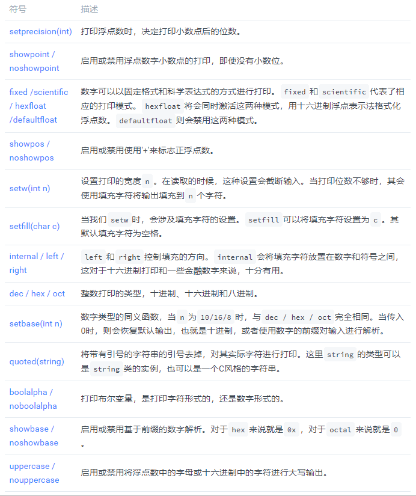
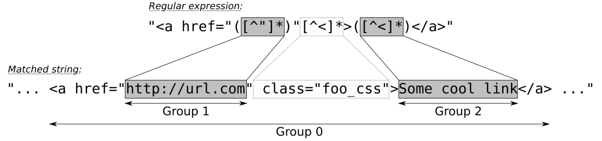

# 字符串, 流和正则表达

我们将对字符串的处理进行介绍，其中包括处理、解析和打印任意的数据。对于这样的需求，STL提供了I/O流库进行支持。这些库由以下的类组成，对应的类使用灰色框表示：


图的最顶端，能看到`std::ios_base`类。我们不能直接对其进行使用，不过其他的类型都是其子类。其一种特化为`std::ios`，这个类型对象会包含流数据，其能通过`good`成员函数对流的状态进行查询，还能通过`empty`成员函数数据状态是否为(EOF)。

我们经常使用的特化类有两个：`std::istream`和`std::ostream`。两个类型的前缀`i`和`o`代表着输入和输出。我们在之前的代码使用使用其`std::cout`和`std::cin`(还有`std::cerr`)对象对字符串进行过输入和输出。其都是这些类型的实例，也是非常通用的。我们通过`ostream`进行数据输出，使用`istream`进行数据输入。

`iostream`类则是对`istream`和`ostream`的继承，其将输入和输出的能力进行合并。当我们要对流数据进行输入和输出的时候，我们就有三个类可供使用。

`ifstream`，`ofstream`和`fstream`继承于`istream`，`ostream`和`iostream`，不过为I/O流添加了文件的读入写出功能。

`istringstream`, `ostringstream`和`iostringstream`原理十分类似，会将字符串读入内存中，并在内存中对数据进行处理。

## 创建、连接和转换字符串

### How to do it...

C++17中添加了一个全新的类——`std::string_view`。

本节，将创建几个字符串和几个字符串代理，并使用它们进行对字符串的连接和转换：

```
#include <iostream>
#include <string>
#include <string_view>
#include <sstream>
#include <algorithm>

using namespace std; 
using namespace std::literals;
```

首先来创建字符串对象，这里`a`就为一个`string`对象。我们使用C风格的字符串对其进行构造(编译后，C风格的字符串就成为静态数组)。构造函数将对其进行拷贝，然后构成一个字符串对象。或者也可直接使用字符字面值操作符`""s`来代替C风格的字符串。其也会在运行时创建一个字符串对象，这里`b`也是一个字符串对象，不过这里我们让程序自己去推断这个类型：

```
int main()
{
    string a { "a" };
    auto b ( "b"s );
```

构造字符串对象的时候，会将相应的内容拷贝到字符串的内部内存中。为了不拷贝，可以直接对输入字符串进行引用，这里就用一下`string_view`。这个类具有一个字面值操作，称为`""sv`：

```
    string_view c { "c" };
    auto d ( "d"sv );
```

OK！现在就让我们来用一下字符串和代理字符串吧！对于这两种类型，其`operator<<`都是对`std::ostream`类型重载的类型，所以这两种类型可以直接打印：

```
    cout << a << ", " << b << '\n';
    cout << c << ", " << d << '\n';
```

字符串类也对operator+操作进行了重载，所以可以直接将两个字符串进行连接。连接a和b只要使用+操作就能完成。对于a和c来说，就没有那么简单了，因为c不是一个字符串对象，而是一个字符串代理对象。我们必须先获取c的字符串，这步可以通过对c进行新的字符串构造得到，然后再和a进行相加。这里就有一个问题，“等下！只是为了和a相加，我们就要将c的内容拷贝到临时字符串对象中吗？没有避免使用c.data()进行内容拷贝的方法吗？”这个想法很好，但是类型本身具有缺陷——string_view实例中没有终止符。这个很可能会导致缓存溢出：

```
    cout << a + b << '\n';
    cout << a + string{c} << '\n';
```

我们来创建一个新的字符串，其包含我们之前创建的所有字符串和字符串代理。使用`std::ostringstream`，我们能将任意的变量通过流对象进行打印(类似`std::cout`)，不过其不会显示在终端，而是打印到一个字符串缓存中。对于所有的字符串，我们是用空格对这些字符串进行分割，并使用`operator<<`将这些字符串打印到新的字符串对象中(使用`o.str()`):

```
ostringstream o;

o << a << " " << b << " " << c << " " << d;
auto concatenated (o.str());
cout << concatenated << '\n';
```

这时我们可以通过相应的函数，将新字符串中所有的字符转换成大写字符。这里使用C库中的`toupper`函数来完成将字母转换为大写的工作，可将其与`std::transform`相结合。因为这里字符串的基础类型为`char`，所以可以直接使用：

```
transform(begin(concatenated), end(concatenated), begin(concatenated), ::toupper);  
cout << concatenated << '\n';
}
```

### How it works...

显然，字符串可以通过加法操作进行连接。如果要对`string_view`使用这个特性，我们首先需要将其转化为`std::string`。

不过，进行字符串和字符串代理编码时要格外注意，`string_view`的内容中没有终止符！这也就是为什么我们宁愿写成`"abc"s + string{some_string_view}`，而不写成`"abc"s + some_string_view.data()`的原因。除此之外，`std::string`也提供了`append`成员函数，其能对`string_view`实例进行处理，不过其会对字符串的内容直接进行操作。

`std::string_view`是非常有用的，不过为了将其与字符串和字符串函数相混合。我们不能假设其具有终止符，其会在标准字符串环境中快速的跳出。幸运的是，通常一些函数的重载版本，可以对其进行正确的处理。

如果我们想要将更为复杂的字符串进行格式化连接，不需要对字符串实例进行逐个处理。`std::stringstream`，`std::ostringstream`和`std::istringstream`类就适合来处理这种任务，它们能对通过对内存的管理来进行字符串的添加，并且能提供流所具有的所有通用格式化特性。

## 消除字符串开始和结束处的空格

### How to do it...

我们将完成一个辅助函数的实现，其将判断是否有多余的空格在字符串开头和结尾，并复制返回去掉这些空格的字符串，并进行简单的测试：

```
#include <iostream>
#include <string>
#include <algorithm>
#include <cctype>

using namespace std;
```

函数将对一个常量字符串进行首尾空格的去除，并返回首尾没有空格的新字符串：

```
string trim_whitespace_surrounding(const string &s)
{
```

`std::string`能够提供两个函数，这两个函数对我们很有帮助。第一个就是`string::find_first_not_of`，其能帮助我们找到我们想要跳过的字符。本节中毫无疑问就是空格，其包括空格，制表符和换行符。函数能返回第一个非空格字符的位置。如果字符串里面只有空格，那么会返回`string::npos`。这意味着没有找到除了空格的其他字符。如果这样，我们就会返回一个空的字符串：

```
    const char whitespace[] {" \t\n"};
    const size_t first (s.find_first_not_of(whitespace));
    if (string::npos == first) { return {}; }
```

现在我们知道新字符串从哪里开始，但是再哪里结尾呢？因此，需要使用另一个函数`string::find_last_not_of`，其能找到最后一个非空格字符的位置：

```
    const size_t last (s.find_last_not_of(whitespace));
```

使用`string::substr`就能返回子字符串，返回的字符串没有空格。这个函数需要两个参数——一个是字符串的起始位置，另一个是字符串的长度：

```
    return s.substr(first, (last - first + 1));
}

int main()
{
    string s {" \t\n string surrounded by ugly"
             " whitespace \t\n "};
    
    cout << "{" << s << "}\n";
    cout << "{"
         << trim_whitespace_surrounding(s)
         << "}\n";
}      
```

### How it works...

我们使用了`string::find_first_not_of`和`string::find_last_not_of`函数。这两个函数也能接受C风格的字符串，会将其当做字符链表进行搜索。当有一个字符串`foo bar`时，当调用`find_first_not_of("bfo ")`时返回5，因为'a'字符是第一个不属于`bfo`的字符。参数中字符的顺序，在这里并不重要。

倒装的函数也是同样的原理，当然还有两个没有使用到的函数：`string::find_first_of`和`string::find_last_of`。

同样也是基于迭代器的函数，需要检查函数是否返回了合理的位置，当没有找到时，函数会返回一个特殊的位置——`string::npos`。

## 无需构造获取std::string

### How to do it...

```
#include <iostream>
#include <string_view>

using namespace std;
```

对输入字符串做其他事情之前，将移除字符开头和末尾的空格。将不会对字符串进行修改，仅适用字符串代理获取没有空格字符串。`find_first_not_of`函数将会在字符串找到第一个非空格的字符，适用`remove_prefix`，`string_view`将指向第一个非空格的字符。当字符串只有空格，`find_first_not_of`函数会返回`npos`，其为`size_type(-1)`。`size_type`是一个无符号类型，其可以是一个非常大的值。所以，会在字符串代理的长度和`words_begin`中选择较小的那个：

```
void print(string_view v)
{
    const auto words_begin (v.find_first_not_of(" \t\n"));
    v.remove_prefix(min(words_begin, v.size()));
    const auto words_end (v.find_last_not_of(" \t\n"));
    if (words_end != string_view::npos) {
        v.remove_suffix(v.size() - words_end - 1);
    }
    
    cout << "length: " << v.length()
    << " [" << v << "]\n";
}   
```

主函数中，将使用`print`的函数答应一系列完全不同的参数类型。首先，会通过`argv`传入`char*`类型的变量，运行时其会包含可执行文件的名字。然后，传入一个`string_view`的实例。然后，使用C风格的静态字符串，并使用`""sv`字面字符构造的`string_view`类型。最后，传入一个`std::string`。`print`函数不需要对参数进行修改和拷贝。这样就没有多余的内存分配发生。对于很多大型的字符串，这将会非常有效：

```
int main(int argc, char *argv[])
{
    print(argv[0]);
    print({});
    print("a const char * array");
    print("an std::string_view literal"sv);
    print("an std::string instance"s);
    print(" \t\n foobar \n \t ");
    
    char cstr[] {'a', 'b', 'c'};
    print(string_view(cstr, sizeof(cstr)));
}
```

### How it works...

函数可以接受传入一个`string_view`的参数，其看起来与字符串类型没有任何区别。我们实现的`print`，对于传入的字符串不进行任何的拷贝。

对于`print(argv[0])`的调用是非常有趣的，字符串代理会自动的推断字符串的长度，因为需要将其适用于无终止符的字符串。另外，我们不能通过查找终止符的方式来确定`string_view`实例的长度。正因如此，当使用裸指针(`string_view::data()`)的时候就需要格外小心。通常字符串函数都会认为字符串具有终止符，这样就很难出现使用裸指针时出现内存溢出的情况。这里还是使用字符串代理的接口比较好。

使用`std::string_view`用于解析字符或获取子字符串时，能避免多余的拷贝和内存分配，并且还不失代码的舒适感。不过，对于`std::string_view`将终止符去掉这点，需要特别注意。

## 从用户的输入读取数值

用户输入通常通过`std::cin`，其为最基础的输入流对象，类似这样的类还有`ifstream`和`istringstream`。

### How to do it...

```
#include <iostream>

using namespace std;

int main()
{
    cout << "Please Enter two numbers:\n> ";
    int x;
    double y;
```

解析和错误检查同时在`if`判断分支中进行。只有两个数都被解析成有效的数字，才能对其进行打印：

```
    if (cin >> x >> y) {
        cout << "You entered: " << x << " and " << y << '\n';
```

如果因为任何原因，解析不成功，那么我们要告诉用户为什么会出错。`cin`流对象现在处于失败的状态，并且将错误状态进行清理之前，无法为我们提供输入功能。为了能够对新的输入进行解析需要调用`cin.clear()`，并且将之前接受到的字符丢弃。使用`cin.ignore`完成丢弃的任务，这里我们指定了丢弃字符的数量，直到遇到下一个换行符为止。完成这些事之后，输入有可以用了：

```
    } else {
        cout << "Oh no, that did not go well!\n";
        cin.clear();
        cin.ignore(
            std::numeric_limits<std::streamsize>::max(),
            '\n');
    }
```

让用户输入一些其他信息。我们让用户输入名字，名字由多个字母组成，字母间使用空格隔开。因此，可以使用`std::getline`函数，其需要传入一个流对象和一个分隔字符。我们选逗号作为分隔字符。这里使用`getline`来代替`cin >> ws`的方式读入字符，这样我们就能丢弃在名字前的所有空格。对于每一个循环中都会打印当前的名字，如果名字为空，那么我们会将其丢弃：

 ```
    cout << "now please enter some "
            "comma-separated names:\n> ";
    for (string s; getline(cin >> ws, s, ',');) {
        if (s.empty()) { break; }
        cout << "name: \"" << s << "\"\n";
    }
}
 ```

编译并运行程序，就会得到如下的输出，其会让用户进行输入，然后我们输入合法的字符。数字`1 2`都能被正确的解析，并且后面输入的名字也能立即排列出来。两个逗号间没有单词的情况将会跳过：

```
$ ./strings_from_user_input
Please Enter two numbers:
> 1 2
You entered: 1 and 2
now please enter some comma-separated names:
> john doe,ellen ripley, alice,chuck norris,,
name: "john doe"
name: "ellen ripley"
name: "alice"
name: "chuck norris"
```

再次运行程序，这次将在一开始就输入一些非法数字，可以看到程序就会走到不同的分支，然后丢弃相应的输入，并继续监听正确的输入。可以看到`cin.clear()`和`cin.ignore(...)`的调用如何对名字读取进行影响：

```
$ ./strings_from_user_input
Please Enter two numbers:
> a b
Oh no, that did not go well!
now please enter some comma-separated names:
> bud spencer, terence hill,,
name: "bud spencer"
name: "terence hill"
```

### How it works...

表达式`cin >> x`是对`cin`的再次引用。因此，就可以将输入些为`cin >> x >> y >> z >> ...`。与此同时，其也能将输入内容转换成为一个布尔值，并在`if`条件中使用。这个布尔值告诉我们最后一次读取是否成功，这也就是为什么我们会将代码写成`if (cin >> x >> y) { ... }`的原因。

当我们想要读取一个整型，但输入中包含`foobar`为下一个表示，那么流对象将无法对这段字符进行解析，并且这让输入流的状态变为失败。这对于解析来说是非常关键的，但对于整个程序来说就不是了。这里可以将输入流的状态进行重置，然后在进行其他的操作。在我们的例程中，我们尝试在读取两个数值失败后，读取一组姓名。例子中，我们使用`cin.clear()`对`cin`的工作状态进行了重置。不过，这样内部的光标就处于我们的现在的类型上，而非之前的数字。为了将之前输入的内容丢弃，并对姓名输入进行流水式的读取，我们使用了一个比较长的表达式，`cin.ignore(std::numeric_limits<std::streamsize>::max(),'\n');`。这里对内存的清理是十分有必要的，因为我们需要在用户输入一组姓名时，对缓存进行刷新。

下面的循环看起来也挺奇怪的：

```
for (string s; getline(cin >> ws, s, ',');) { ... }
```

`for`循环的判断部分，使用了`getline`函数。`getline`函数接受一个输入流对象，一个字符串引用作为输出，以及一个分隔符。通常，分隔字符代表新的一行。这里使用逗号作为分隔符，所以姓名输入列表为`john, carl, frank`，这样就可以单个的进行读取。

目前为止还不错。不过，`cin >> ws`的操作是怎么回事呢？这可以让`cin`对所有空格进行刷新，其会读取下一个非空格字符到下一个逗号间的字符。回看一下"john, carl, frank"例子，当我们不使用`ws`时，将获取到"john"，" carl"和" frank"字符串。这里需要注意"carl"和"frank"开头不必要的空格，因为在`ws`中对输入流进行了预处理，所以能够避免开头出现空格的情况。

## 计算文件中的单词数量

我们定义的单词是位于两个空格之间的字符组合。那要如何进行统计呢？

### How to do it...

```
#include <iostream>
#include <fstream>
#include <string>
#include <algorithm>
#include <iterator>

using namespace std;
```

`wordcount`函数能接受一个输入流，例如`cin`。其能创建一个`std::input_iterator`迭代器，其能对输出字符进行标记，然后交由`std::distance`进行计算。`distance`接受两个迭代器作为参数，并确定从一个迭代器到另一个迭代器要用多少步(距离)。对于随机访问迭代器，因为有减法操作符的存在，所以实现起来非常简单。其迭代器如同指针一样，可以直接进行减法，计算出两点的距离。不过`istream_iterator`就不行，因为其是前向迭代器，只能向前读取，直至结束。最后所需要的步数也就是单词的数量：

```
template <typename T>
size_t wordcount(T &is)
{
    return distance(istream_iterator<string>{is}, {});
}
```

主函数中，我们会让用户来选择输入源：

```
int main(int argc, char **argv)
{
    size_t wc;
    
    if (argc == 2) {
        ifstream ifs {argv[1]};
        wc = wordcount(ifs);}else {
        	wc = wordcount(cin);
    }
    
    cout << "There are " << wc << " words\n";
};    
```

### How it works...

我们对`std::cin`和`std::ifstream`的实例进行了互换。`cin`是`std::istream`的类型之一，并且`std::ifstream`继承于`std::istream`。可以回顾一下本章开头的类型继承表。这两种类型即使在运行时，都能进行互换。

## 格式化输出

### How to do it...

```
#include <iostream>
#include <iomanip>
#include <locale>

using namespace std;
```

接下来，定义一个辅助函数，其会以不同的方式打印出一个数值。其能接受使用一种字符对宽度进行填充，其默认字符为空格：

```
void print_aligned_demo(int val,
                        size_t width,
                        char fill_char = ' ')
{
    cout << "================\n";
    cout << setfill(fill_char);
    cout << left << setw(width) << val << '\n';
    cout << right << setw(width) << val << '\n';
    cout << internal << setw(width) << val << '\n';
}
```

使用`setw`，我们可以设置打印数字的最小字符数输出个数。当我们要将123的输出宽度设置为6时，我们会得到"abc "或" abc"。我们也可以使用`std::left`, `std::right`和`std::internal`控制从哪边进行填充。当我们以十进制的方式对数字进行输出，`internal`看起来和`right`的作用一样。不过，当打印`0x1`时，打印宽度为6时，`internal`会得到"0x 6"。`setfill`控制符可以用来定义填充字符。

主函数中，我们使用已经实现的函数。首先，打印数字12345，其宽度为15。我们进行两次打印，不过第二次时，将填充字符设置为'_'：

```
int main()
{
    print_aligned_demo(123456, 15);
    print_aligned_demo(123456, 15, '_');
```

随后，我们将打印`0x123abc`，并使用同样的宽度。不过，打印之前需要使用的是`std::hex`和`std::showbase`告诉输出流对象`cout`输出的格式，并且添加`0x`前缀，看起来是一个十六进制数：

```
    cout << hex << showbase;
    print_aligned_demo(0x123abc, 15);
```

对于八进制我们也可以做同样的事：

```
    cout << oct;
    print_aligned_demo(0123456, 15);
```

通过`hex`和`uppercase`，我们可以将`0x`中的x转换成大写字母。`0x123abc`中的`abc`同样也转换成大写：

```
    cout << "A hex number with upper case letters: "
        << hex << uppercase << 0x123abc << '\n';
```

如果我们要以十进制打印100，我们需要将输出从`hex`切换回`dec`：

```
    cout << "A number: " << 100 << '\n';
    cout << dec;

    cout << "Oops. now in decimal again: " << 100 << '\n';
```

我们可以对布尔值的输出进行配置，通常，true会打印出1，false为0。使用`boolalpha`，我们就可以得到文本表达：

```
    cout << "true/false values: "
        << true << ", " << false << '\n';
    cout << boolalpha
        << "true/false values: "
        << true << ", " << false << '\n';
```

现在让我们来一下浮点型变量`float`和`double`的打印。当我们有一个数12.3，那么打印也应该是12.3。当我们有一个数12.0，打印时会将小数点那一位进行丢弃，不过我们可以通过`showpoint`来控制打印的精度。使用这个控制符，就能显示被丢弃的一位小数了：

```
   cout << "doubles: "
       << 12.3 << ", "
       << 12.0 << ", "
       << showpoint << 12.0 << '\n';
```

可以使用科学计数法或固定浮点的方式来表示浮点数。`scientific`会将浮点数归一化成一个十进制的小数，并且其后面的位数使用10的幂级数表示，其需要进行乘法后才能还原成原始的浮点数。比如，300.0科学计数法就表示为"3.0E2"，因为300 = 3.0 x $10^2$。`fixed`将会恢复普通小数的表达方式：

```
    cout << "scientific double: " << scientific
        << 123000000000.123 << '\n';
    cout << "fixed double: " << fixed
        << 123000000000.123 << '\n';
```

除此之外，我们也能对打印的精度进行控制。我们先创建一个特别小的浮点数，并对其小数点后的位数进行控制：

```
    cout << "Very precise double: "
        << setprecision(10) << 0.0000000001 << '\n';
    cout << "Less precise double: "
        << setprecision(1) << 0.0000000001 << '\n';
}
```

### How it works...

因此，让我们来看一下格式化修饰符的表。其都是用`input_stream >> modifier`或`output_stream << modifier`来对之后的输入输出进行影响：



其中有一些控制符具有粘性，另一些没有。这里的粘性是说其会持续影响接下来的所有输入或输出，直到对控制符进行重置。表格中没有粘性的为`setw`和`quoted`控制符。其只对下一次输入或输出有影响。了解这些非常重要，当我们要持续使用一个格式进行打印时，对于有粘性的控制符我们设置一次即可，其余的则在需要是进行设置。这些对输入解析同样适用，不过错误的设置了控制符则会得到错误的输入信息。

下面的一些控制符我们没有使用它们，因为他们对于格式化没有任何影响，但出于完整性的考量我们在这里也将这些流状态控制符列出来：


这些控制符中，只有`skipws / noskipws`和`unitbuf / nounitbuf`是具有粘性的。

## 使用输入文件初始化复杂对象

对于任意类型，我们都可以对输入流`operator>>`操作符进行重载。

### How to do it...

```
#include <iostream>
#include <iomanip>
#include <string>
#include <algorithm>
#include <iterator>
#include <vector>

using namespace std;

struct city {
    string name;
    size_t population;
    double latitude;
    double longitude;
};
```

为了从输入流中读取一个城市的信息，这时我们就需要对`operator>>`进行重载。对于操作符来说，会跳过`ws`开头的所有空格，我们不希望空格来污染城市的名称。然后，会对一整行的文本进行读取。这样类似于从输入文件中读取一整行，行中只包含城市的信息。然后，我们就可以用空格将人口，经纬度进行区分：

```
istream& operator>>(istream &is, city &c)
{
    is >> ws;
    getline(is, c.name);
    is >> c.population
        >> c.latitude
        >> c.longitude;
    return is;
}
```

主函数中，我们创建一个`vector`，其包含了若干城市元素，使用`std::copy`将其进行填充。我们会将输入的内容拷贝到`istream_iterator`中。通过给定的`city`结构体作为模板参数，其会使用重载过的`operator>>`进行数据的读取：

```
int main()
{
    vector<city> l;

    copy(istream_iterator<city>{cin}, {},
        back_inserter(l));
```

为了了解城市信息是否被正确解析，我们会将其进行打印。使用格式化输出`left << setw(15) <<`，城市名称左边必有很多的空格，这样我们的输出看起来就很漂亮：

```
    for (const auto &[name, pop, lat, lon] : l) {
        cout << left << setw(15) << name
            << " population=" << pop
            << " lat=" << lat
            << " lon=" << lon << '\n';
    }
   }
```

例程中所用到的文件内容如下。我们将四个城市的信息写入文件：

```
Braunschweig
250000 52.268874 10.526770
Berlin
4000000 52.520007 13.404954
New York City
8406000 40.712784 -74.005941
Mexico City
8851000 19.432608 -99.133208
```

### How it works...

我们只是创建了一个新的结构体`city`，我们对`std::istream`迭代器的`operator>>`操作符进行重载。这样也就允许我们使用`istream_iterator<city>`对数据进行反序列化。

关于错误检查则是一个开放性的问题。我们现在再来看下`operator>>`实现：

```
istream& operator>>(istream &is, city &c)
{
    is >> ws;
    getline(is, c.name);
    is >> c.population >> c.latitude >> c.longitude;
    return is;
}
```

我们读取了很多不同的东西。读取数据发生了错误，下一个应该怎么办？这是不是意味着我们有可能读取到错误的数据？不会的，这不可能发生。即便是其中一个元素没有被输入流进行解析，那么输入流对象则会置于错误的状态，并且拒绝对剩下的输入进行解析。这样就意味着，如果`c.population`或`c.latitude`没有被解析出来，那么对应的输入数据将会被丢弃，并且我们可以看到反序列了一半的`city`对象。

站在调用者的角度，我们需要注意这句`if(input_stream >> city_object)`。这也就表面流表达式将会被隐式转换成一个布尔值。当其返回false时，输入流对象则处于错误状态。如果出现错误，就需要采取相应的措施对流进行重置。

本节中没有使用`if`判断，因为我们让`std::istream_iterator<city>`进行反序列化。`operator++`在迭代器的实现中，会在解析时对其状态进行检查。当遇到错误时，其将会停止之后的所有迭代。当前迭代器与`end`迭代器比较返回true时，将终止`copy`算法的执行。如此，我们的代码就很安全了。

## 迭代器填充容器——std::istream

### How to do it...

```
#include <iostream>
#include <iomanip>
#include <map>
#include <iterator>
#include <algorithm>
#include <numeric>

using namespace std;
```

我们会引用网络上的一些梗。这里的梗作为一个名词，我们记录其描述和诞生年份。我们会将这些梗放入`std::map`，其名称为键，包含在结构体中的其他信息作为值：

```
struct meme {
    string description;
    size_t year;
};
```

我们暂时先不去管键，我们先来实现结构体`meme`的流操作符`operator>>`。我们假设相关梗的描述由双引号括起来，后跟对应年份。举个栗子，`"some description" 2017`。通过使用`is >> quoted(m.description)`，双引号会被当做限定符，直接被丢弃。这就非常的方便。然后我们继续读取年份即可：

```
istream& operator>>(istream &is, meme &m) {
    return is >> quoted(m.description) >> m.year;
}
```

OK，现在将梗的名称作为键插入`map`中。为了实现插入`map`，需要一个`std::pair<key_type, value_type>`实例。`key_type`为`string`，那么`value_type`就是`meme`了。名字中允许出现空格，所以可以使用`quoted`对名称进行包装。`p.first`是名称，`p.second`代表的是相关`meme`结构体变量。可以使用`operator>>`实现直接对其进行赋值：

```
istream& operator >>(istream &is,
                    pair<string, meme> &p) {
    return is >> quoted(p.first) >> p.second;
}
```

现在来写主函数，创建一个`map`实例，然后对其进行填充。因为对流函数`operator>>`进行了重载，所以可以直接对`istream_iterator`类型直接进行处理。我们将会从标准输入中解析出更多的信息，然后使用`inserter`迭代器将其放入`map`中：

```
int main()
{
    map<string, meme> m;

    copy(istream_iterator<pair<string, meme>>{cin},
           {},
        inserter(m, end(m)));
```

对梗进行打印前，先在`map`中找到名称最长的梗吧。可以对其使用`std::accumulate`。累加的初始值为0u(u为无符号类型)，然后逐个访问`map`中的元素，将其进行合并。使用`accumulate`合并，就意味着叠加。例子中，并不是对数值进行叠加，而是对最长字符串的长度进行进行累加。为了得到长度，我们为`accumulate`提供了一个辅助函数`max_func`，其会将当前最大的变量与当前梗的名字长度进行比较(这里两个数值类型需要相同)，然后找出这些值中最大的那个。这样`accumulate`函数将会返回当前梗中，名称最长的梗：

```
    auto max_func ([](size_t old_max,
                     const auto &b) {
        return max(old_max, b.first.length());
    });
    size_t width {accumulate(begin(m), end(m),
                            0u, max_func)};
```

现在，对`map`进行遍历，然后打印其中每一个元素。使用`<< left << setw(width)`打印出漂亮的“表格”：

```
    for (const auto &[meme_name, meme_desc] : m) {
        const auto &[desc, year] = meme_desc;

        cout << left << setw(width) << meme_name
             << " : " << desc
             << ", " << year << '\n';
    }
}
```

现在需要一些梗的数据，我们写了一些梗在文件中：

```
"Doge" "Very Shiba Inu. so dog. much funny. wow." 2013
"Pepe" "Anthropomorphic frog" 2016
"Gabe" "Musical dog on maximum borkdrive" 2016
"Honey Badger" "Crazy nastyass honey badger" 2011
"Dramatic Chipmunk" "Chipmunk with a very dramatic look" 2007
```

### How it works...

本节有三点需要注意：

- 第一，没有选择`vector`或`list`比较简单的结构，而是选择了`map`这样比较复杂的结构。
- 第二，使用了`quoted`控制符对输入流进行处理。
- 第三，使用`accumulate`来找到最长的键值。

我们先来看一下`map`，结构体`meme`只包含一个`description`和`year`。因为我们将梗的名字作为键，所以没有将其放入结构体中。可以将`std::pair`实例插入`map`中，首先实现了结构体`meme`的流操作符`operator>>`，然后对`pair<string, meme>`做同样的事。最后，使用`istream_iterator<pair<string, meme>>{cin}`从标准输入中获取每个元素的值，然后使用`inserter(m, end(m))`将组对插入`map`中。

当我们使用流对`meme`元素进行赋值时，允许梗的名称和描述中带有空格。我们使用引号控制符，很轻易的将问题解决，得到的信息类似于这样，`"Name with spaces" "Description with spaces" 123`。

当输入和输出都对带有引号的字符串进行处理时，`std::quoted`就能帮助到我们。当有一个字符串`s`，使用`cout << quoted(s)`对其进行打印，将会使其带引号。当对流中的信息进行解析时，`cin >> quoted(s)`其就能帮助我们将引号去掉，保留引号中的内容。

```
auto max_func ([](size_t old_max, const auto &b) {
    return max(old_max, b.first.length());
});

size_t width {accumulate(begin(m), end(m), 0u, max_func)};
```

实际上，`max_func`能够接受一个`size_t`和一个`auto`类型的参数，这两个参数将转换成一个`pair`，从而就能插入`map`中。这看起来很奇怪，因为二元函数会将两个相同类型的变量放在一起操作，例如`std::plus`。我们会从每个组对中获取键值的长度，将当前元素的长度值与之前的最长长度相对比。

叠加调用会将`max_func`的返回值与0u值进行相加，然后作为左边参数的值与下一个元素进行比较。第一次左边的参数为0u，所以就可以写成`max(0u, string_length)`，这时返回的值就作为之前最大值，与下一个元素的名称长度进行比较，以此类推。

## 迭代器进行打印——std::ostream

### How to do it...

```
#include <iostream>
#include <vector>
#include <iterator>
#include <unordered_map>
#include <algorithm>

using namespace std;
using namespace std::string_literals;
```

让我们实现一个转换函数，其会将数字和字符串相对应。比如输入1，就会返回“one”；输入2，就会返回“two”，以此类推：

```
string word_num(int i) {
    unordered_map<int, string> m {
        {1, "one"}, {2, "two"}, {3, "three"},
        {4, "four"}, {5, "five"}, //...
    };
    const auto match (m.find(i));
    if (match == end(m)) { return "unknown"; }
    	return match->second;
};
```

接下来我们就要定义一个结构体`bork`。其仅包含一个整型成员，其可以使用一个整型变量进行隐式构造。其具有`print`函数，其能接受一个输出流引用，通过`borks`结构体的整型成员变量，重复打印"bork"字符串：

```
struct bork {
    int borks;

    bork(int i) : borks{i} {}

    void print(ostream& os) const {
        fill_n(ostream_iterator<string>{os, " "},
               borks, "bork!"s);
    }
};
```

为了能够更方便的对`bork`进行打印，对`operator<<`进行了重载，当通过输出流对`bork`进行输出时，其会自动的调用`bork::print`：

```
ostream& operator<<(ostream &os, const bork &b) {
    b.print(os);
    return os;
}
```

现在来实现主函数，先来初始化一个`vector`:

```
int main()
{
    const vector<int> v {1, 2, 3, 4, 5};
```

`ostream_iterator`需要一个模板参数，其能够表述哪种类型的变量我们能够进行打印。当使用`ostream_iterator<T>`时，其会使用`ostream& operator(ostream&, const T&)`进行打印。这也就是之前在`bork`类型中重载的输出流操作符。我们这次只对整型数字进行打印，所以使用`ostream_iterator<int>`。使用`cout`进行打印，并可以将其作为构造参数。我们使用循环对`vector`进行访问，并且对每个输出迭代器`i`进行解引用。这也就是在STL算法中流迭代器的用法：

```
    ostream_iterator<int> oit {cout};
    for (int i : v) { *oit = i; }
    cout << '\n';
```

使用的输出迭代器还不错，不过其打印没有任何分隔符。当需要空格分隔符对所有打印的元素进行分隔时，我们可以将空格作为第二个参数传入输出流构造函数中。这样，其就能打印"1, 2, 3, 4, 5, "，而非"12345"。不过，不能在打印最后一个数字的时候将“逗号-空格”的字符串丢弃，因为迭代器并不知道哪个数字是最后一个：

```
    ostream_iterator<int> oit_comma {cout, ", "};

    for (int i : v) { *oit_comma = i; }
    cout << '\n';
```

为了将其进行打印，我们将值赋予一个输出流迭代器。这个方法可以和算法进行结合，其中最简单的方式就是`std::copy`。我们可以通过提供`begin`和`end`迭代器来代表输入的范围，在提供输出流迭代器作为输出迭代器。其将打印`vector`中的所有值。这里我们会将两个输出循环进行比较：

```
   copy(begin(v), end(v), oit);
   cout << '\n';

   copy(begin(v), end(v), oit_comma);
   cout << '\n';
```

还记得`word_num`函数吗？其会将数字和字符串进行对应。我们也可以使用进行打印。我们只需要使用一个输出流操作符，因为我们不需要对整型变量进行打印，所以这里使用的是`string`的特化版本。使用`std::transfrom`替代`std::copy`，因为需要使用转换函数将输入范围内的值转换成其他值，然后拷贝到输出中：

```
    transform(begin(v), end(v),
             ostream_iterator<string>{cout, " "}, word_num);
    cout << '\n';
```

程序的最后一行会对`bork`结构体进行打印。可以直接使用，也并不需要为`std::transform`函数提供任何转换函数。另外，可以创建一个输出流迭代器，其会使用`bork`进行特化，然后再调用`std::copy`。`bork`实例可以通过输入范围内的整型数字进行隐式创建。然后，将会得到一些有趣的输出：

```
    copy(begin(v), end(v),
         ostream_iterator<bork>{cout, "\n"});
}
```

### How it works...

`std::ostream_iterator`可以用来对数据进行打印，其在语法上为一个迭代器，对这个迭代器进行累加是无效的。对其进行解引用会返回一个代理对象，这些赋值操作符会将这些数字转发到输出流中。

输出流迭代器会对类型T进行特化(`ostream_iterator<T>`)，对于所有类型的`ostream& operator<<(ostream&, const T&)`来说，都需要对其进行实现。

`ostream_iterator`总是会调用`operator<<`，通过模板参数，我们已经对相应类型进行了特化。如果类型允许，这其中会发生隐式转换。当A可以隐式转换为B时，我们可以对A类型的元素进行迭代，然后将这些元素拷贝到`output_iterator<B>`的实例中。我们会对`bork`结构体做同样的事情：`bork`实例也可以隐式转换为一个整数，这也就是我们能够很容易的在终端输出一堆`bork!`的原因。

如果不能进行隐式转换，可使用`std::treansform`和`word_num`函数相结合，对元素类型进行转换。

通常，对于自定义类型来说，隐式转换是一种不好的习惯，因为这是一个常见的Bug源，并且这种Bug非常难找。例子中，隐式构造函数有用程度要超过其危险程度，因为相应的类只是进行打印。

## 使用特定代码段将输出重定向到文件

### How to do it...

我们将实现一个辅助类，其能在构造和析构阶段，帮助我们完成流的重定向，以及对流的定向进行恢复。然后，我们来看其是怎么使用的：

```
#include <iostream>
#include <fstream>

using namespace std;
```

我们实现了一个类，其具有一个文件输出流对象和一个指向流内部缓冲区的指针。`cout`作为流对象，其内部具有一个缓冲区，其可以用来进行数据交换，我们可以保存我们之前做过的事情，这样就很方便进行对后续修改的撤销。我们可以在C++手册中查询对其返回类型的解释，也可以使用`decltype`对`cout.rdbuf()`所返回的类型进行查询。这并不是一个很好的体验，在我们的例子中，其就是一个指针类型：

```
class redirect_cout_region
{
    using buftype = decltype(cout.rdbuf());

    ofstream ofs;
    buftype buf_backup;
```

类的构造函数接受一个文件名字符串作为输入参数。这个字符串用来初始化文件流成员`ofs`。对其进行初始化后，可以将其输入到`cout`作为一个新的流缓冲区。`rdbuf`在接受一个新缓冲区的同时，会将旧缓冲区以指针的方式进行返回，这样当需要对缓冲区进行恢复时，就可以直接使用了：

```
public:
    explicit
    redirect_cout_region (const string &filename)
    : ofs{filename}
    , buf_backup{cout.rdbuf(ofs.rdbuf())}
    {}
```

默认构造函数和其他构造函数做的事情几乎一样。其区别在于，默认构造函数不会打开任何文件。默认构造的文件流会直接替换`cout`的流缓冲，这样会导致`cout`的一些功能失效。其会丢弃一些要打印的东西。这在某些情况下是非常有用的：

```
    redirect_cout_region()
    : ofs{}
    ,buf_backup{cout.rdbuf(ofs.rdbuf())}
    {}
```

析构函数会对重定向进行恢复。当类在运行过程中超出了范围，可以使用原始的`cout`流缓冲区对其进行还原：

```
    ~redirect_cout_region() {
        cout.rdbuf(buf_backup);
    }
};
```

让我们模拟一个有很多输出的函数：

```
void my_output_heavy_function()
{
    cout << "some output\n";
    cout << "this function does really heavy work\n";
    cout << "... and lots of it...\n";
    // ...
}

int main()
{
    cout << "Readable from normal stdout\n";
    {
        redirect_cout_region _ {"output.txt"};
        cout << "Only visible in output.txt\n";
        my_output_heavy_function();
    }
```

离开这段代码后，文件将会关闭，打印输出也会重归标准输出。我们再开启一个代码段，并使用默认构造函数对类进行构造。这样后续的打印信息将无法看到，都会被丢弃：

```
    {
        redirect_cout_region _;
        cout << "This output will "
                "completely vanish\n";
    }
```

离开这段代码后，我们的标准输出将再度恢复，并且将程序的最后一行打印出来：

```
   cout << "Readable from normal stdout again\n";
```

### How it works...

每个流对象都有一个内部缓冲区，这样的缓冲区可以进行交换。当我们有一个流对象`s`时，我们将其缓冲区存入到变量`a`中，并且为流对象换上了一个新的缓冲区`b`，这段代码就可以完成上述的过程:`a = s.rdbuf(b)`。需要恢复的时候只需要执行`s.rdbuf(a)`。

另一件很酷的事情是，可以将这些`redirect_cout_region`辅助函数放入堆栈中：

```
{
    cout << "print to standard output\n";

    redirect_cout_region la {"a.txt"};
    cout << "print to a.txt\n";

    redirect_cout_region lb {"b.txt"};
    cout << "print to b.txt\n";
}
cout << "print to standard output again\n";
```

这也应该好理解，通常析构的顺序和构造的顺序是相反的。这种模式是将对象的构造和析构进行紧耦合，其也称作为**资源获得即初始化(RAII)**

这里有一个很重要的点需要注意——`redirect_cout_region`类中成员变量的初始化顺序：

```
class redirect_cout_region {
    using buftype = decltype(cout.rdbuf());
    ofstream ofs;
    buftype buf_backup;
public:
    explicit
    redirect_cout_region(const string &filename)
    : ofs{filename},
    buf_backup{cout.rdbuf(ofs.rdbuf())}
    {}
...
```

我们可以看到，成员`buf_backup`的初始化需要依赖成员`ofs`进行。有趣的是，这些成员初始化的顺序，不会按照初始化列表中给定元素的顺序进行初始化。这里初始化的顺序值与成员变量声明的顺序有关！

## 通过集成std::char_traits创建自定义字符串类

### How to do it...

我们将实现两个自定义字符串类：`lc_string`和`ci_string`。第一个类将通过输入创建一个全是小写字母的字符串。另一个字符串类型不会对输入进行任何变化，不过其会对字符串进行大小写不敏感的比较：

```
#include <iostream>
#include <algorithm>
#include <string>

using namespace std;
```

C++17中一些`string`函数可以声明成`constexpr`类型，但是还要使用自定义的类型。所以对于输入字符串，只将大写字母转换为小写，而其他字符则不进行修改：

```
static constexpr char tolow(char c) {
    switch (c) {
    case 'A'...'Z': return c - 'A' + 'a'; // 读者自行将case展开
    default:         return c;
    }
}
```

`std::basic_string`类可以接受三个模板参数：字符类型、字符特化类和分配器类型。本节中我们只会修改字符特化类，因为其定义了字符串的行为。为了重新实现与普通字符串不同的部分，我们会以`public`方式继承标准字符特化类：

```
class lc_traits : public char_traits<char> {
public:
```

我们类能接受输入字符串，并将其转化成小写字母。这里有一个函数，其是字符级别的，所以我们可以对其使用`tolow`函数。我们的这个函数为`constexpr`：

```
    static constexpr
    void assign(char_type& r, const char_type& a ) {
        r = tolow(a);
    }
```

另一个函数将整个字符串拷贝到我们的缓冲区内。使用`std::transform`将所有字符从源字符串中拷贝到内部的目标字符串中，同时将每个字符与其小写版本进行映射：

```
    static char_type* copy(char_type* dest,
                            const char_type* src,
                         size_t count) {
        transform(src, src + count, dest, tolow);
        return dest;
    }
};
```

上面的特化类可以帮助我们创建一个字符串类，其能有效的将字符串转换成小写。接下来我们在实现一个类，其不会对原始字符串进行修改，但是其能对字符串做大小写敏感的比较。其继承于标准字符串特征类，这次将对一些函数进行重新实现：

```
class ci_traits : public char_traits<char> {
public:
```

`eq`函数会告诉我们两个字符是否相等。我们也会实现一个这样的函数，但是我们只实现小写字母的版本。这样'A'与'a'就是相等的：

```
    static constexpr bool eq(char_type a, char_type b) {
        return tolow(a) == tolow(b);
    }
```

`lt`函数会告诉我们两个字符在字母表中的大小情况。这里使用了逻辑操作符，并继续对两个字符使用转换成小写的函数：

```
    static constexpr bool lt(char_type a, char_type b) {
        return tolow(a) < tolow(b);
    }
```

最后两个函数都是字符级别的函数，接下来两个函数都为字符串级别的函数。`compare`函数与`strncmp`函数差不多。当两个字符串的长度`count`相等，那么就返回0。如果不相等，会返回一个负数或一个正数，返回值就代表了其中哪一个在字母表中更小。并计算两个字符串中所有字符之间的距离，当然这些都是在小写情况下进行的操作。C++14后，这个函数可以声明成`constexpr`类型：

```
     static constexpr int compare(const char_type* s1,
                               const char_type* s2,
                               size_t count) {
        for (; count; ++s1, ++s2, --count) {
            const char_type diff (tolow(*s1) - tolow(*s2));
            if (diff < 0) { return -1; }
            else if (diff > 0) { return +1; }
        }
        return 0;
    }
```

我们所需要实现的最后一个函数就是大小写不敏感的`find`函数。对于给定输入字符串`p`，其长度为`count`，我们会对某个字符`ch`的位置进行查找。然后，其会返回一个指向第一个匹配字符位置的指针，如果没有找到则返回`nullptr`。这个函数比较过程中我们需要使用`tolow`函数将字符串转换成小写，以匹配大小写不敏感的查找。不幸的是，我们不能使用`std::find_if`来做这件事，因为其是非`constexpr`函数，所以我们需要自己去写一个循环：

```
    static constexpr
    const char_type* find(const char_type* p,
                          size_t count,
                          const char_type& ch) {
    const char_type find_c {tolow(ch)};

    for (; count != 0; --count, ++p) {
        if (find_c == tolow(*p)) { return p; }
    }
        return nullptr;
    }
};
```

OK，所有自定义类都完成了。这里我们可以定义两种新字符串类的类型。`lc_string`代表小写字符串，`ci_string`代表大小写不敏感字符串。这两种类型与`std::string`都有所不同：

```
using lc_string = basic_string<char, lc_traits>;
using ci_string = basic_string<char, ci_traits>;
```

为了能让输出流接受新类，我们需要对输出流操作符进行重载：

```
ostream& operator<<(ostream& os, const lc_string& str) {
    return os.write(str.data(), str.size());
}

ostream& operator<<(ostream& os, const ci_string& str) {
    return os.write(str.data(), str.size());
}
```

```
int main()
{
    cout << " string: "
        << string{"Foo Bar Baz"} << '\n'
        << "lc_string: "
        << lc_string{"Foo Bar Baz"} << '\n'
        << "ci_string: "
        << ci_string{"Foo Bar Baz"} << '\n';
        
    ci_string user_input {"MaGiC PaSsWoRd!"};
    ci_string password {"magic password!"};
    
    if (user_input == password) {
    	cout << "Passwords match: \"" << user_input
    	<< "\" == \"" << password << "\"\n";
    }
}    
```

### How it works...

首先，来看一下`std::string`的类声明：

```
template <
    class CharT,
    class Traits = std::char_traits<CharT>,
    class Allocator = std::allocator<CharT>
    >
class basic_string;
```

可以看出`std::string`其实就是一个`std::basic_string<char>` 类，并且其可以扩展为`std::basic_string<char, std::char_traits<char>, std::allocator<char>>`。OK，这是一个非常长的类型描述，不过其意义何在呢？这就表示字符串可以不限于有符号类型`char`，也可以是其他类型。其对于字符串类型都是有效的，这样就不限于处理ASCII字符集。当然，这不是我们的关注点。

`char_traits<char>`类包含`basic_string`所需要的算法。`char_traits<char>`可以进行字符串间的比较、查找和拷贝。

`allocator<char>`类也是一个特化类，不过其运行时给字符串进行空间的分配和回收。这对于现在的我们来说并不重要，我们只使用其默认的方式就好。

当我们想要一个不同的字符串类型是，可以尝试对`basic_string`和`char_traits`类中提供的方法进行复用。我们实现了两个`char_traits`子类：`case_insentitive`和`lower_caser`类。我们可以将这两个字符串类替换标准`char_traits`类型。

## 使用正则表达式库标记输入

### How to do it...

```
#include <iostream>
#include <iterator>
#include <regex>
#include <algorithm>
#include <iomanip>

using namespace std;
```

在后面将会生成一段可迭代器的区间，这个区间中只包含字符串。这里会以链接地址字符串和链接描述字符串配对出现。因此，我们也要写一个辅助函数来打印这些字符串：

```
template <typename InputIt>
void print(InputIt it, InputIt end_it)
{
    while (it != end_it) {
```

每次循环中，我们对迭代器增加了两次，这是因为要对链接地址和链接描述进行拷贝。两个迭代器解引用间，我们添加了一个if条件，为了保证程序的安全，这个条件句会检查迭代器是否过早的到达了最后：

```
        const string link {*it++};
        if (it == end_it) { break; }
        const string desc {*it++};
       
        cout << left << setw(28) << desc
        	<< " : " << link << '\n';
    }
}
```

主函数中，我们将从标准输入中获取所要读取的数据。这样，需要将全部标准输入通过一个输入流迭代器构造为一个字符串。为了避免符号化，为了确保我们所得到的输入与用户输入的一样，我们使用了`noskipws`控制符。这个控制符将会禁用空格跳过和符号化：

```
int main()
{
    cin >> noskipws;
    const std::string in {
        istream_iterator<char>{cin}, {} 
    };
```

现在我们需要定义一个正则表达式，来对HTML文件进行查找。小括号在正在表达式中代表的是组，这里我们要获取我们想要访问的链接——其为URL地址，并且还要获取其描述：

```
    const regex link_re {
        "<a href=\"([^\"]*)\"[^<]*>([^<]*)</a>"};
```

`sregex_token_iterator`类具有相同的功能，并且能对`istream_iterator`直接操作。我们将可迭代的输入范围和刚刚定义的正则表达式传给它。不过，这里还有第三个参数`{1, 2}`。其表示我们想要表达式组1和组2中的结果：

```
   sregex_token_iterator it {
       begin(in), end(in), link_re, {1, 2}
   };
```

现在我们有一个迭代器，如果找到了连接，其会返回连接地址和相应的描述。这里对第二个参数直接进行初始化，其类型与第一个参数类型相同，然后传入我们之前实现的`print`函数中：

```
    print(it, {});
}
```

编译并运次那个程序，就会得到如下的输出。我们使用curl获取ISO C++首页的信息，其会将HTML页面直接从网上下载下来。当然，这里也能写成`cat some_html_file.html | ./link_extraction`。正则表达式可以很方便对硬编码进行解析，通过HTML固定的格式对其进行解析。当然，你可以让其变得更加通用：

```
$ curl -s "https://isocpp.org/blog" | ./link_extraction
Sign In / Suggest an Article : https://isocpp.org/member/login
Register : https://isocpp.org/member/register
Get Started! : https://isocpp.org/get-started
Tour : https://isocpp.org/tour
C++ Super-FAQ: https://isocpp.org/faq
Blog : https://isocpp.org/blog
Forums : https://isocpp.org/forums
Standardization: https://isocpp.org/std
About: https://isocpp.org/about
Current ISO C++ status : https://isocpp.org/std/status
(...and many more...)
```

### How it works...

让我们来看一下本节中的正则表达式，是如何对HTML连接进行匹配的。一个简单HTML连接可写为`<a href="some_url.com/foo">A great link</a>`。我们只需要`some_url.com/foo`和`A great link`部分。所以，我们可以使用如下的正则表达式进行匹配，其会将字符串对应每个组，从而分解成多个字符串：



字符串本身为**第0组**，也就是整个字符串。引号中`href`的URL地址部分分在**第1组**中。正则表达式中，使用小括号来定义组，所以这个表达式中有两个组。另一个组则获取的是连接描述。

有很多STL函数可以接受正则对象，不过直接使用一个正则字符迭代器适配器，其是对使用`std::regex_search`进行自动化匹配的高阶抽象。我们可用如下的代码对其进行实例化：

```
sregex_token_iterator it {begin(in), end(in), link_re, {1, 2}};
```

开始和结束部分表示我们的输入字符串，正则迭代器则在该字符串上进行迭代，并匹配所有链接。`link_re`则为用于匹配连接的正则表达式，`{1, 2}`可用来表示我们需要的部分。其第一组匹配的是我们想要的连接，进行自增后，就到了第二组，匹配的则是我们想要的连接描述，依次循环。其能非常智能的帮助我们对多行数据进行处理。

让我们来看另一个例子，以确保我们明白了上面的内容。让我们创建一个正则表达式`"a(b*)(c*)"`。其会对具有一个'a'字符，之后有或没有'b'字符，再之后有或没有'c'字符的字符串进行匹配：

```
const string s {" abc abbccc "};
const regex re {"a(b*)(c*)"};

sregex_token_iterator it {
    begin(s), end(s), re, {1, 2} 
};

print( *it ); // prints b
++it;
print( *it ); // prints c
++it;
print( *it ); // prints bb
++it;
print( *it ); // prints ccc
```

当然也可以使用`std::regex_iterator`类，其会将匹配的子字符串进行直接输出。

## 简单打印不同格式的数字

### How to do it...

我们会先来实现一个类`format_guard`，其会自动的将打印格式进行恢复。另外，我们添加了一个包装类型，其可以包含任意值，当对其进行打印时，其能使用相应的格式进行输出，而无需添加冗长的控制符：

```
#include <iostream>
#include <iomanip>

using namespace std;
```

辅助类在调用`format_guard`时，其会对输出流的格式进行清理。其构造函数保存了格式符，也就是在这里对`std::cout`进行设置。析构函数会将这些状态进行去除，这样就不会后续的打印有所影响：

```
class format_guard {
    decltype(cout.flags()) f {cout.flags()};
public:
    ~format_guard() { cout.flags(f); }
};
```

定义另一个辅助类`scientific_type`。因为其是一个模板类，所以其能拥有任意类型的成员变量。这个类没有其他任何作用：

```
template <typename T>
struct scientific_type {
    T value;

    explicit scientific_type(T val) : value{val} {}
};
```

封装成`scientific_type`之后，可以对任意类型进行自定义格式设置，当对`operator>>`进行重载后，输出流就会在执行时，运行完全不同的代码。这样就能在使用科学计数法表示浮点数时，以大写的格式，并且其为正数时，数字前添加'+'号。我们也会在跳出函数时，使用`format_guard`类对打印格式进行清理：

```
template <typename T>
ostream& operator<<(ostream &os, const scientific_type<T> &w) {
    format_guard _;
    os << scientific << uppercase << showpos;
    return os << w.value;
}
```

主函数中，我们将使用到`format_guard`类。我们会创建一段新的代码段，首先对类进行实例化，并且对`std::cout`进行输出控制符的设置：

```
int main()
{
    {
        format_guard _;
        cout << hex << scientific << showbase << uppercase;

        cout << "Numbers with special formatting:\n";
        cout << 0x123abc << '\n';
        cout << 0.123456789 << '\n';
    }
```

使用控制符对这些数字进行打印后，跳出这个代码段。这时`format_guard`的析构函数会将格式进行清理。为了对清理结果进行测试，会再次打印相同的数字。其将会输出不同的结果：

```
    cout << "Same numbers, but normal formatting again:\n";
    cout << 0x123abc << '\n';
    cout << 0.123456789 << '\n';
```

现在使用`scientific_type`，将三个浮点数打印在同一行。我们将第二个数包装成`scientific_type`类型。这样其就能按照我们指定的风格进行打印，不过在之前和之后的输出都是以默认的格式进行。与此同时，我们也避免了冗长的格式设置代码：

```
    cout << "Mixed formatting: "
        << 123.0 << " "
        << scientific_type{123.0} << " "
        << 123.456 << '\n';
}
```

## 从std::iostream错误中获取可读异常

### How to do it...

我们将会让程序打开一个文件(这个过程可能会失败)，并且将会从文件中读取一个整型数字(也可能会失败)。我们可以通过激活异常的方式来发现错误，然后再来看如何对这些错误进行处理：

```
#include <iostream>
#include <fstream>
#include <system_error>
#include <cstring>

using namespace std;
```

当我们要将流对象和异常一起使用时，首先需要启动异常。为了获取一个文件流对象，在指定文件并不存在时，抛出一个异常；或是在解析错误时，我们需要将对应的失败原因设置到异常掩码的对应位上。当执行失败的时候，将触发一个异常。并通过激活的`failbit`和`badbit`，我们能让文件系统的错误抛出异常，并对这个错误进行解析：

```
int main()
{
    ifstream f;
    f.exceptions(f.failbit | f.badbit);
    
```

现在可以使用`try`块进行对文件的访问。文件打开成功，那我们将继续读取文件中的整型数字。并且，只有在读取数字成功的情况下，我们才会对数字进行打印：

```
    try {
        f.open("non_existant.txt");

        int i;
        f >> i;

        cout << "integer has value: " << i << '\n';
    }
```

对于可能发生的两种错误，一个`std::ios_base::failure`实例将会抛出。这个对象有一个`what()`成员函数，其会为我们解释触发了哪种异常。不幸的是，并不存在标准化的信息，所以我们不会得到太多有用的信息。不过，我们至少可以区分，触发异常的是一个文件系统问题，还是一个格式解析问题。全局变量`errno`，其在C++诞生前就存在，其会设置为一个错误值，可供我们进行查看。`strerror`函数会将一个错误值，翻译为我们可以读懂的字符串。当`errno`是0时，就代表文件系统没有任何错误：

```
    catch (ios_base::failure& e) {
        cerr << "Caught error: ";
        if (errno) {
            cerr << strerror(errno) << '\n';
        } else {
            cerr << e.what() << '\n';
        }
    }
}
```

编译并运行程序，两种错误可能都会在运行时发生。当文件不存在时，我们就不可能从文件中获取数值，所以我们会得到一个`iostream_category`错误信息：

```
$ ./readable_error_msg
Caught error: ios_base::clear: unspecified iostream_category
```

### How it works...

我们可以通过`s.exceptions(s.failbit | s.badbit)`使能流对象s抛出异常的能力。不过，这也就意味着有些情况无法使用异常，例如`std::ifstream`的实例需要打开一个文件进行构造，所以我们不能在之后对异常进行设置。

```
ifstream f {"non_existant.txt"};
f.exceptions(...); // too late for an exception
```

当我们使用各种方法让流处于失败的状态，就会发现抛出的这些异常并没有什么区别。这样只需要了解何时捕获错误，而非捕获了什么错误(对于流是这样，而对于STL中的其他类型就不是了)，这也就是为什么我们要对`errno`的值进行检查的原因。这个全局变量在C++和异常诞生之前，就已经存在了。

如果有任何与系统相关的函数发生了错误，其会将`errno`设置为除0之外的其他值(0代表没有错误)，然后调用者可以通过对`errno`值的查询，来了解到底出现了什么问题。这个问题我们在多线程程序会经常遇到，并且所有线程都会对一个全局变量进行修改，那么当出现错误了，是哪个线程造成的呢？幸运的是，这个设计已经在C++11中进行了修改，每个线程都只能看到属于自己的`erron`变量。

异常会告诉我们发生了什么，而`erron`则会告诉我们会发生哪种级别的错误。


