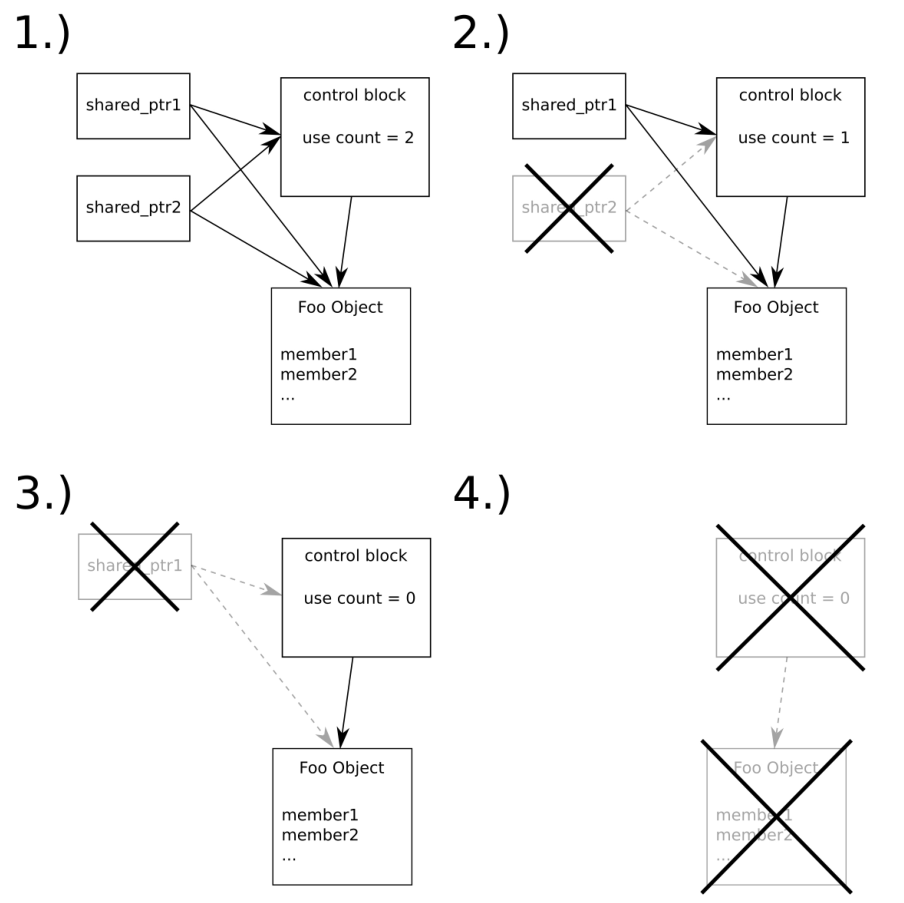
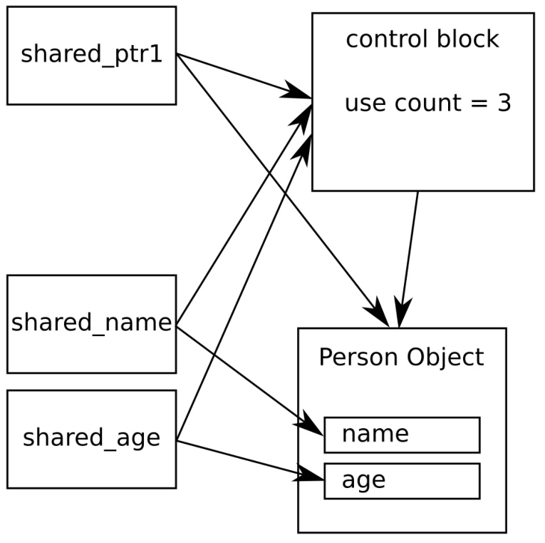

# 工具类

## 转换不同的时间单位——std::ratio

C++11之后，STL具有了很多用来测量和显示时间的新类型和函数。STL这部分内容放在`std::chrono`命名空间中。

### How to do it...

```
#include <iostream>
#include <chrono>
#include <ratio>
#include <cmath>
#include <iomanip>
#include <optional>

using namespace std;
```

`chrono::duration`经常用来表示所用时间的长度，其为秒的倍数或小数，所有STL的程序都由整型类型进行特化。本节中，将使用`double`进行特化。本节之后，我们更多的会关注已经存在于STL的时间单位：

```
using seconds = chrono::duration<double>;
```

1毫秒为1/1000秒，可以用这个单位来定义秒。`ratio_multiply`模板参数可以使用STL预定义的`milli`用来表示`seconds::period`，其会给我们相应的小数。`ratio_multiply`为基本时间的倍数：

```
using milliseconds = chrono::duration<double, ratio_multiply<seconds::period, milli>>;
```

对于微秒来说也是一样的。可以使用`micro`表示：

```
using microseconds = chrono::duration<double, ratio_multiply<seconds::period, micro>>;
```

现在我们实现一个函数，会用来从用户的输入中读取一个字符串，并且统计用户输入所用的时间。这个函数没有参数，在返回用户输入的同时，返回所用的时间，我们用一个组对(pair)将这两个数进行返回：

```
static pair<string, seconds> get_input()
{
    string s;
    
   const auto tic (chrono::steady_clock::now());
   if (!(cin >> s)) {
        return { {}, {} };
    }
```

现在可以来获取用户的输入了。当我们没有获取成功，将会返回一个默认的元组对象。这个元组对象中的元素都是空。

成功获取输入后，我们会打上下一个时间戳。然后，返回用户的输入和输入所用的时间。注意这里获取的都是绝对的时间戳，通过计算这两个时间戳的差，我们得到了打印所用的时间：

```
    const auto toc (chrono::steady_clock::now());

    return {s, toc - tic};
}
```

现在让我们来实现主函数，使用一个循环获取用户的输入，直到用户输入正确的字符串为止。在每次循环中，我们都会让用户输入"C++17"，然后调用`get_input`函数：

```
int main()
{
    while (true) {
        cout << "Please type the word \"C++17\" as"
                " fast as you can.\n> ";

        const auto [user_input, diff] = get_input();
```

然后对输入进行检查。当输入为空，程序会终止：

```
       if (user_input == "") { break; }
```

当用户正确的输入"C++17"，我们将会对用户表示祝贺，然后返回其输入所用时间。`diff.count()`函数会以浮点数的方式返回输入所用的时间。当我们使用STL原始的`seconds`时间类型时，将会得到一个已舍入的整数，而不是一个小数。通过使用以毫秒和微秒为单位的计时，我们将获得对应单位的计数，然后通过相应的转换方式进行时间单位转换：

```
        if (user_input == "C++17") {
            cout << "Bravo. You did it in:\n"
                << fixed << setprecision(2)
                << setw(12) << diff.count()
                << " seconds.\n"
                << setw(12) << milliseconds(diff).count()
                << " milliseconds.\n"
                << setw(12) << microseconds(diff).count()
                << " microseconds.\n";
            break;  } else {
            cout << "Sorry, your input does not match."
                       " You may try again.\n";
        }
    }
}
```

### How it works...

本节中对不同时间单位进行转换是，我们需要先选择三个可用的时钟对象的一个。其分别为`system_clock`，`steady_clock`和`high_resolution_clock`，这三个时钟对象都在`std::chrono`命名空间中。他们有什么区别呢？让我们来看一下：


当我们要衡量时间的“距离”，或者计算两个时间点的绝对间隔。即便时钟是112年，5小时，10分钟，1秒(或其他)之后或之前的时间，这都不影响两个时间点间的相对距离。这里我们唯一关注的就是打的两个时间点`toc`和`tic`，时钟需要是微秒级别的(许多系统都使用这样的时钟)，因为不同的时钟对于我们的测量有一定的影响。对于这样的需求，`steady_clock`无疑是最佳的选择。其能根据处理器的时间戳计数器进行实现，只要该时钟开始计数(系统开始运行)就不会停止。

OK，现在来对合适的时间对象进行选择，可以通过`chrono::steady_clock::now()`对时间点进行保存。`now`函数会返回一个`chrono::time_point<chrono::steady_clock>`类的值。两个点之间的差就是所用时间间隔，或`chrono::duration`类型的时间长度。这个类型是本节的核心类型，其看起来有点复杂。让我们来看一下`duration`模板类的签名：

```
template<
    class Rep,
    class Period = std::ratio<1>
> class duration;
```

我们需要改变的参数类为`Rep`和`Period`。`Rep`很容易解释：其只是一个数值类型用来保存时间点的值。对于已经存在的STL时间单位，都为`long long int`型。本节中，我们选择了`double`。因为我们的选择，保存的时间描述也可以转换为毫秒或微秒。当`chrono::seconds`类型记录的时间为1.2345秒时，其会舍入成一个整数秒数。这样，我们就能使用`chrono::microseconds`来保存`tic`和`toc`之间的时间，并且将其转化为粒度更加大的时间。正因为选择`double`作为`Rep`传入，可以对计时的精度在丢失较少精度的情况下，进行向上或向下的调整。

对于我们的计时单位，我们采取了`Rep = double`方式，所以会在`Period`上有不同的选择：

```
using seconds = chrono::duration<double>;
using milliseconds = chrono::duration<double,
    ratio_multiply<seconds::period, milli>>;
using microseconds = chrono::duration<double,
    ratio_multiply<seconds::period, micro>>;
```

`seconds`是最简单的时间单位，其为`Period = ratio<1>`，其他的时间单位就只能进行转换。1毫秒是千分之一秒，所以我们将使用`milli`特化的`seconds::period`转化为秒时，就要使用`std::ratio<1, 1000>`类型(`std::ratio<a, b>`表示分数值a/b)。`ratio_multiply`类型是一个编译时函数，其表示对应类型的结果是多个`ratio`值累加。

可能这看起来非常复杂，那就让我们来看一个例子吧：`ratio_multiply<ratio<2, 3>, ratio<4, 5>>`的结果为`ratio<8, 15>`，因为`(2/3) * (4/5) = 8/15`。

我们结果类型定义等价情况如下：

```
using seconds = chrono::duration<double, ratio<1, 1>>;
using milliseconds = chrono::duration<double, ratio<1, 1000>>;
using microseconds = chrono::duration<double, ratio<1, 1000000>>;
```

上面列出的类型，很容易的就能进行转换。当我们具有一个时间间隔`d`，其类型为`seconds`，我们就能将其转换成`milliseconds`。转换只需要通过构造函数就能完成——`milliseconds(d)`。

### There's more...

其他教程和书籍中，你可以会看到使用`duration_cast`的方式对时间进行转换。当我们具有一个时间间隔类`chrono::milliseconds`和要转换成的类型`chrono::hours`时，就需要转换为`duration_cast<chrono::hours>(milliseconds_value)`，因为这些时间单位都是整型。从一个细粒度的时间单位，转换成一个粗粒度的时间单位，将会带来时间精度的损失，这也是为什么我们使用`duration_cast`的原因。基于`double`和`float`的时间间隔类型不需要进行强制转换。

## 转换绝对时间和相对时间——std::chrono

### How to do it...

```
#include <iostream>
#include <iomanip>
#include <chrono>

using namespace std;
```

我们将打印绝对时间点。使用`chrono::time_point`模板类型来获取，因此需要对输出流操作符进行重载。对时间点的打印方式有很多，我们将会使用`%c`来表示标准时间格式。当然，可以只打印时间、日期或是我们需要的信息。调用`put_time`之前对不同类型的变量进行转换的方式看起来有些笨拙，不过这里只这么做一次：

```
ostream& operator<<(ostream &os,
    const chrono::time_point<chrono::system_clock> &t)
{
    const auto tt (chrono::system_clock::to_time_t(t));
    const auto loct (std::localtime(&tt));
    return os << put_time(loct, "%c");
}
```

STL已经定义了`seconds`，`minutes`，`hours`等时间类型，所以我们只需要为其添加`days`类型就好。这很简单，只需要对`chrono::duration`模板类型进行特化，将hours类型乘以24，就表示一天具有24个小时：

```
using days = chrono::duration<
    chrono::hours::rep,
    ratio_multiply<chrono::hours::period, ratio<24>>>;
```

为了用很有优雅的方式表示很多天，我们定义属于`days`类型的字面值操作符。现在我们程序中写`3_days`就代表着3天：

```
constexpr days operator ""_days(unsigned long long d)
{
    return days{d};
}
```

实际程序中，我们将会对时间点进行记录，然后就会对这个时间点进行打印。因为已经对操作符进行了重载，所以完成这样的事情就变得很简单：

```
int main()
{
    auto now (chrono::system_clock::now());

    cout << "The current date and time is " << now << '\n';
    
    chrono::hours chrono_12h {12};

    cout << "In 12 hours, it will be "
        << (now + chrono_12h)<< '\n';        
```

这里将使用`chrono_literals`命名空间中的函数，声明使用这个命名空间会解锁小时、秒等等时间类型的间隔字面值类型。这样我们就能很优雅的对12个小时15分之前的时间或7天之前的时间进行打印：

```
    using namespace chrono_literals;

    cout << "12 hours and 15 minutes ago, it was "
        << (now - 12h - 15min) << '\n'
        << "1 week ago, it was "
        << (now - 7_days) << '\n';
}
```

编译并运行程序，我们将会获得如下的输出。因为使用`%c`格式对时间进行打印，所以得到还不错的时间输出格式。通过对不同格式的的字符串进行操作，我们可以获得想要的格式。

### How it works...

我们可以通过`std::chrono::system_clock`来获取当前时间点。这个STL时钟类是唯一一个能将时间点的值转换成一个时间结构体的类型，其能将时间点以能够看懂的方式进行输出。

为了打印这样的时间点，我们可以对`operator<<`操作符进行重载：

```
ostream& operator<<(ostream &os,
                   const chrono::time_point<chrono::system_clock> &t)
{
    const auto tt (chrono::system_clock::to_time_t(t));
    const auto loct (std::localtime(&tt));
    return os << put_time(loct, "%c");
}
```

首先，将`chrono::time_point<chrono::system_clock>`转换为`std::time_t`。然后，使用`std::localtime`将这个时间值进行转换，这样就能获取到一个本地时钟的相对时间值。这个函数会给我们返回一个转换后的指针(对于这个指针背后的内存不用我们多操心，因为其是一个静态对象，并不是从堆上分配的内存)，这样我们就能完成最终的打印。

`std::put_time`函数接受一个流对象和一个时间格式字符串。`%c`表示标准时间格式字符串，例如`Sun Mar 12 11:33:40 2017`。我们也可以写成`%m/%d/%y`；之后，时间就会按照这个格式进行打印，比如`03/12/17`。时间格式符的描述很长，想要了解其具体描述的最好方式就是去查看C++参考手册。

除了打印，我们也会为我们的时间点添加偏移。这也很简单，比如：12小时15分钟就可以表示为`12h+15min`。`chrono_literals`命名空间为我们提供了字面类型：`hours(h), minutes(min), seconds(s), milliseconds(ms), microseconds(us), nanoseconds(ns)`。

通过对两个时间间隔的相加，我们会得到一个新的时间点。要实现这样的操作就需要对左加`operator+`和左减`operator-`操作符进行重载，这样对时间偏移的操作就会变得非常简单。

## 安全的标识失败——std::optional

当程序与外界的联系只依赖于一些变量时，那么各种失败都可能发生。

也就是，我们写了一个函数，其会返回一个值，但是当函数接口进行变更后，可能就无法获取这个返回值了。我们来看下对一个返回字符串的函数，怎样的接口会容易出现失败的情况：

- 使用引用值作为返回值：`bool get_string(string&);`
- 返回一个可以被设置为nullptr的指针(或智能指针)：`string* get_string();`
- 当函数出错时，直接抛出异常：`string get_string();`

以上的方式有缺点，也有优点。在C++17之后，我们会使用一种新类型来解决这个问题：`std::optional`。可选值的概念来自于纯函数式编程语言(在纯函数式语言中，这个类型为Maybe类型)，并且可以让代码看上去很优雅。

我们可以将`optional`包装到我们的类型中，其可以表示空值或错误值。

### How to do it...

我们将实现一个程序用于从用户输入中读取整型数，然后将这些数字加起来。因为不确定用户会输入什么，所以我们会使用`optional`进行错误处理：

```
#include <iostream>
#include <optional>

using namespace std;
```

定义一个整型类型，其可能会包含一个值，使用`std::optional`类型来完成这件事。将目标类型包装进`optional`，我们会给其一个附加状态，其表示当前对象中没有值：

```
using oint = optional<int>;
```

使用包装后的整型类型，我们用其来表示函数返回失败的情况。当从用户输入中获取一个整数时，这个函数可能会失败，因为用户可能输入的就不是我们想要的东西，返回可选整型就能很好的解决这个问题。当成功的读取一个整数，我们会将其放入`optional<int>`的构造函数中。否则，我们将返回一个默认构造的`optional`，其代表没有获取成功：

```
oint read_int()
{
    int i;
    if (cin >> i) { return {i}; }
    return {};
}
```

除了获取整数，我们还能做的更多。那怎么使用两个可选整数进行相加呢？如果两个可选整数中具有相应的整数值，那么使用实际的数值直接相加。存在有空的可选变量时，我们会返回一个空的可选变量。这个函数需要简单的来解释一下：通过隐式转换，将`optional<int>`变量a和b转化成一个布尔表达式(写成!a和!b)，这就能让我们确定可选变量中是否有值。如果其中有值，我们将对其使用指针或是迭代器的方式，对a和b直接解引用：

```
oint operator+(oint a, oint b)
{
    if (!a || !b) { return {}; }
    return {*a + *b};
}
```

重载加法操作，可以直接和一个普通整数进行相加：

```
oint operator+(oint a, int b)
{
    if (!a) { return {}; }

    return {*a + b};
}
```

现在来完成主函数部分，我们会让用户输入两个数值：

```
int main()
{
    cout << "Please enter 2 integers.\n> ";

    auto a {read_int()};
    auto b {read_int()};
```

然后，将获取的数值进行相加，并再与10进行相加。这里`a`和`b`为可选整型类变量，`sum`也为可选整型类变量：

```
    auto sum (a + b + 10);
```

当`a`和/或`b`中不包含一个值时，`sum`就也不包含任何值。可选整型可依然我们不必显式的对`a`和`b`进行检查。当遇到空值的时，我们定义的操作符能很完美的处理这样的情况。这样，我们只需要对结果可选整型变量进行检查即可。如果包含一个值，那就可以安全的对这个值进行访问，并将其进行打印：

```
if (sum) {
    cout << *a << " + " << *b << " + 10 = "
        << *sum << '\n'; } else {
        cout << "sorry, the input was "
                "something else than 2 numbers.\n";
    }
}
```

### How it works...

`optional`非常简单易用。其可以帮助我们对错误的情况进行处理，当我们所需要的类型为T时，可以将其特化`std::optional<T>`版本类型进行封装。

当需要从一些地方获取一些值时，我们可以用其来检查我们是否成功的获取了对应的数值。`bool optional::has_value()`可以帮助我们完成这件事。当其包含值时，其会返回true，我们就能直接对数值进行访问，对可选类型的值访问也可以通过函数`T& optional::value()`进行。

例子中，使用`if (x) {...}`和`*x`来替代`if (x.has_value()) {...}`和`x.value()`。`std::optonal`类型可以隐式的转换成`bool`类型，并且使用解引用操作符的方式和普通指针差不多。

另一个方便辅助操作符就是对`optional`的`operator->`操作符进行重载。当有一个结构体`struct Foo { int a; string b; }`类型，并且我们想要通过一个`optional<Foo>`来访问其成员变量x，那么就可以写成`x->a`或`x->b`。当然，需要对x和b进行检查，确定其是否有值。

当可选变量中没有值时，我们还要对其进行访问，其就会抛出一个`std::logic_error`异常。这样，就可以对大量的可选值在不进行检查的情况下进行使用。`try-catch`块的代码如下：

```
cout << "Please enter 3 numbers:\n";

try {
    cout << "Sum: "
        << (*read_int() + *read_int() + *read_int())
        << '\n';
} catch (const std::bad_optional_access &) {
    cout << "Unfortunately you did not enter 3 numbers\n";
}
```

`std::optional`具有一个有趣的`optional::value_or`操作。当我们想要在失败的时候，可选变量包含一个默认值进行返回时，这个操作就很有用了。`x = optional_var.value_or(123)`就能将123作为可选变量失败时的默认数值。

## 对元组使用函数

C++11中，STL添加了`std::tuple`，这种类型可以用来将多个不同类型的值捆绑在一起。

### How to do it...

我们将实现一个程序，其能对元组值进行打包和解包。然后，我们将看到在不了解元组中元素的情况下，如何使用元组：

```
#include <iostream>
#include <iomanip>
#include <tuple>
#include <functional>
#include <string>
#include <list>

using namespace std;

static void print_student(size_t id, const string &name, double gpa)
{
    cout << "Student " << quoted(name)
        << ", ID: " << id
        << ", GPA: " << gpa << '\n';
}

int main()
{
    using student = tuple<size_t, string, double>;
    student john {123, "John Doe"s, 3.7};
    
    {
        const auto &[id, name, gpa] = john;
        print_student(id, name, gpa);
    }
    cout << "-----\n";    
    
    auto arguments_for_later = {
    make_tuple(234, "John Doe"s, 3.7),
    make_tuple(345, "Billy Foo"s, 4.0),
    make_tuple(456, "Cathy Bar"s, 3.5),
};
```

这里，我们依旧可以通过对元素进行分解，然后对其进行打印。当要写这样的代码时，我们需要在函数接口变化时，对代码进行重构：

```
    for (const auto &[id, name, gpa] : arguments_for_later) {
           print_student(id, name, gpa);
    }
    cout << "-----\n";
```

当然可以做的更好，我们无需知道`print_student`的参数的个数，或学生元组中元素的个数，我们使用`std::apply`对直接将元组应用于函数。这个函数能够接受一个函数指针或一个函数对象和一个元组，然后会将元组进行解包，然后与函数参数进行对应，并传入函数：

 ```
    apply(print_student, john);
    cout << "-----\n";
    
    for (const auto &args : arguments_for_later) {
    apply(print_student, args);
    }
    cout << "-----\n";
}
 ```

### How it works...

``std::apply`是一个编译时辅助函数，可以帮助我们处理不确定的类型参数。

试想，我们有一个元组`t`，其有元素`(123, "abc"s, 456.0)`。那么这个元组的类型为`tuple<int, string, double>`。另外，有一个函数`f`的签名为`int f(int, string, double)`(参数类型也可以为引用)。

然后，我们就可以这样调用函数`x = apply(f, t)`，其和`x = f(123, "abc"s, 456.0)`等价。`apply`方法还是会返回`f`的返回值。

## 使用元组快速构成数据结构

现在我们使用一个结构体，对一些变量进行捆绑：

```
struct Foo {
  int a;
  string b;
  float c;
};

using Foo = tuple<int, string, float>;
```

我们可以根据类型列表中的索引，从而获取相应变量的具体值。如要访问元组他的第一个类型变量，可以使用`std::get<0>(t)`，第二个类型变量为`std::get<1>(t)`，以此类推。如果索引值过大，编译器会在编译时进行报错。

之前的章节中已经展示了C++17对元组的分解能力，允许我们使用如下的方式快速分解元素，并能对单独元素进行访问：

```
auto [a, b, c] = some_tuple
```

绑定和分解单个数据结构，只是元组能力之一。我们也可以想尽办法对元组进行连接和分割。

### How to do it...

本节，我们将完成对任意元组进行打印的任务。另外，我们将完成一个函数，可以对元组进行zip操作：

```
#include <iostream>
#include <tuple>
#include <list>
#include <utility>
#include <string>
#include <iterator>
#include <numeric>
#include <algorithm>

using namespace std;
```

我们对要处理的元组中的内容非常感兴趣，所以想要对其内容进行展示。因此，将实现一个非常通用的函数，能对任意具有可打印变量的元组进行打印。这个函数能接受一个输出流引用`os`和一个可变的参数列表，其中具有元组中的所有成员。为了解析这些参数，我们将一个参数放在`v`中，其余的放在参数包`vs...`中：

```
template <typename T, typename ... Ts>
void print_args(ostream &os, const T &v, const Ts &...vs)
{
    os << v;
   (void)initializer_list<int>{((os << ", " << vs), 0)...};
}
```

然后，我们就对参数包vs进行处理，其会使用逗号将`initializer_list`中的元素进行隔开。

现在就可以对任意的变量进行打印了，例如：`print_args(cout, 1, 2, "foo", 3, "bar")`。不过，依旧无法对元组进行处理。为了实现打印元组的功能，我们会对输出操作符`<<`进行重载，通过实现一个模板函数来匹配任意元组类型：

```
template <typename ... Ts>
ostream& operator<<(ostream &os, const tuple<Ts...> &t)
{
```

接下来会有些复杂。首先，使用Lambda表达式来接收任意多个参数。当调用Lambda表达式时，启用`os`参数就会传入`print_args`函数中组成新的参数列表。这也就意味着，对`capt_tup(...some parameters...)`的调用，会形成对`print_args(os, ...some parameters...)`的调用：

```
    auto print_to_os ([&os](const auto &...xs) {
        print_args(os, xs...);
    });
```

现在就可以来完成对元组解包的工作了。使用`std::apply`对元组进行解包，所有值将会解析成单独的变量，然后传入到所调用的函数中。当元组t为`(1, 2, 3)`时，调用`apply(capt_tup, t)`等价于`capt_tup(1, 2, 3)`的调用，随后就会调用`print_args(os, 1, 2, 3)`。最后，我们用小括号来包围所要打印的信息：

```
    os << "(";
    apply(print_to_os, t);
    return os << ")";
}
```

Okay，现在已经完成打印元组代码的编写，这将让后续的工作会变得更容易。不过，需要为元组做更多的事情。例如，编写一个可以接受迭代范围的函数。这个函数可以帮助对对应范围进行迭代，然后返回这段范围中所有值的加和，并且找到这个范围内的最小值和最大值，还要能对所有值求平均。并将这四个值打包入一个元组中，我们可以不添加任何新的结构体类型类，来获取其中每一个成员的值：

```
template <typename T>
tuple<double, double, double, double>
sum_min_max_avg(const T &range)
{
```

`std::minmax_element`会返回一对迭代器，其分别表示输入范围内的最小值和最大值。`std::accumulate`将会返回输入范围内所有值的加和。这样就能获得我们元组中的所有元素了！

```
    auto min_max (minmax_element(begin(range), end(range)));
    auto sum (accumulate(begin(range), end(range), 0.0));
    return {sum, *min_max.first, *min_max.second,
            sum / range.size()};
}
```

实现主函数之前，我们将实现最后一个神奇辅助函数。为什么说这个函数神奇呢？因为这个函数看起来非常复杂，但当了解工作原理后，你就能理解了，这个函数会对两个元组进行zip操作。也就是说，当传入两个元组`(1, 2, 3)`和`('a', 'b', 'c')`时，函数将会返回一个值为`(1, 'a', 2, 'b', 3, 'c')`的元组：

```
template <typename T1, typename T2>
static auto zip(const T1 &a, const T2 &b)
{
   auto z ([](auto ...xs) {
       return [xs...](auto ...ys) {
           return tuple_cat(make_tuple(xs, ys) ...);
       };
   });
    
   return apply(apply(z, a), b);
}
```

我们会创建一个函数对象`z`，其能接受任意数量的参数。其会返回另一个函数对象，返回的函数对象将获取的所有参数打包成`xs`，不过其也能接受任意数量的参数。其内部的函数对象可以对参数列表包`xs`和`ys`进行访问。现在就让我们看一下，如何对这两个参数列表包进行操作。`make_tuple(xs, ys)...`会将参数分组。当`xs = 1, 2, 3`并且`ys = 'a', 'b', 'c'`时，我们将会返回一个新的参数包`(1, 'a'), (2, 'b'), (3, 'c')`。三个元组中，用逗号来对每个成员进行区分。为了获取分组后的元组，我们使用了`std::tuple_cat`，其能接受任意数量的元组，并且将其解包后放入一个元组中。这样我们就可以获得一个新元组`(1, 'a', 2, 'b', 3, 'c')`。

最后一步就是将所有输入元组中的成员解包出来，也就是将`a`和`b`进行解包后放入`z`中。`apply(z, a)`就表示将`a`中的所有值放入`xs`中，`apply(..., b)`就表示将`b`中的所有值放入`ys`中。

首先，构造出一些元组。`student`类型包括ID，名字，和[GPA](https://zh.wikipedia.org/wiki/成績平均積點)分数。`student_desc`使用人类可读的格式对学生进行介绍。`std::make_tuple`是一个非常不错的工厂函数，因为其能通过传入的参数，自适应的生成对应的元组类型：

```
int main()
{
    auto student_desc (make_tuple("ID", "Name", "GPA"));
    auto student (make_tuple(123456, "John Doe", 3.7));
    
    cout << student_desc << '\n' << student << '\n';
    cout << tuple_cat(student_desc, student) << '\n';
    
    auto zipped (zip(student_desc, student));
    cout << zipped << '\n';
```

别忘记`sum_min_max_avg`函数。我们将初始化列表中具有一些数字，并且会将这些数字传入这个函数中。创建了另一个同等大小的元组，其包含了一些描述字符串，这可能会让程序变得复杂一些。通过zip这些元组，并将这些元组交错的存储在了一起：

```
    auto numbers = {0.0, 1.0, 2.0, 3.0, 4.0};
    cout << zip(
            make_tuple("Sum", "Minimum", "Maximum", "Average"),
            sum_min_max_avg(numbers))
        << '\n';
}
```

### How it works...

我们对元组的`operator<<`操作符进行了重载实现，这样看起来比较复杂，但是这样就能对元组中的成员进行打印。然后我们实现`sum_min_max_avg`函数，其会返回一个元组。另外，`zip`应该是个比较复杂的函数。

这里最简单的函数是`sum_min_max_avg`。当我们定义一个函数`tuple<Foo, Bar, Baz> f()`时，我们可以将返回语句写成`return {foo_instance, bar_instance, baz_instance};`，这样函数将会自动的构建一个元组进行返回。

#### operator<< for tuples

使用`operator<<`对输出流进行输出时，我们实现了`print_args`函数。其可以接受任意个参数，不过第一个参数必须是一个`ostream`实例：

```
template <typename T, typename ... Ts>
void print_args(ostream &os, const T &v, const Ts &...vs)
{
    os << v;

    (void)initializer_list<int>{((os << ", " << vs), 0)...};
}
```

这个函数打印的第一个元素是`v`，然后会将参数包`vs`中的元素进行打印。我们将第一个元素单独拎出来的原因是要使用逗号将所有元素进行分隔，但是我们不确定哪个参数是头或是尾(也就是要打印成“1, 2, 3”或是“,1, 2, 3”)。

`operator<<`实现如下所示：

```
template <typename ... Ts>
ostream& operator<<(ostream &os, const tuple<Ts...> &t)
{
    auto capt_tup ([&os](const auto &...xs) {
        print_args(os, xs...);
    });

    os << "(";
    apply(capt_tup, t);
    return os << ")";
}
```

首先我们定义了一个函数对象`capt_tup`。当我们调用`capt_tup(foo, ar, whatever)`时，其实际调用的是print_args(**os**, foo, bar, whatever)。这个函数只会做一件事，就是将可变列表中的参数输出到输出流对象`os`中。

之后，我们使用`std::apply`对元组`t`进行解包。如果这步看起来很复杂，那么可以看一下前一节，以了解`std::apply`的工作原理。

#### 元素的zip函数

zip函数能够接收两个元组，虽然其实现很清晰，但是看起来还是异常复杂：

```
template <typename T1, typename T2>
auto zip(const T1 &a, const T2 &b)
{
    auto z ([](auto ...xs) {
        return [xs...](auto ...ys) {
            return tuple_cat(make_tuple(xs, ys) ...);
        };
    });
    return apply(apply(z, a), b);
}
```

为了能更好的了解这段代码，我们可以假设有两个元组，一个元组a为(1, 2, 3)，另一个元组b为('a', 'b', 'c')。

例程中，我们调用了`apply(z, a)`，也就相当于调用函数`z(1, 2, 3)`，其会构造一个哈数对象将这些参数捕获后进行返回，这样1，2，3就被放入参数包`xs`中了。这里会再次调用，`apply(z(1, 2, 3), b)`，会将'a', 'b', 'c'放入参数包`ys`中。

Okay，现在`xs = (1, 2, 3)`，`ys = ('a', 'b', 'c')`，然后会发生什么呢？`tuple_cat(make_tuple(xs, ys) ...)`就会完成下图所描述的过程：


首先，`xs`和`ys`中的成员将会被zip到一起，也就是交叉配对在一起。这个交叉配对发生在`make_tuple(xs, ys)...`部分，这会将两个元组组成一个元组。为了获得一个大元组，我们使用了`tuple_cat`，通过对元组的级联获取一个大的元组，其包含了所有元组中的成员，并进行了交叉配对。

## 将void*替换为更为安全的std::any

有时我们会需要将一个变量保存在一个未知类型中。对于这样的变量，我们通常会对其进行检查，以确保其是否包含一些信息，如果是包括，那我们将会去判别所包含的内容。以上的所有操作，都需要在一个类型安全的方法中进行。

以前，我们会将可变对象存于`void*`指针当中。void类型的指针无法告诉我们其所指向的对象类型，所以我们需要将其进行手动转换成我们期望的类型。这样的代码看起来很诡异，并且不安全。

C++17在STL中添加了一个新的类型——`std::any`。其设计就是用来持有任意类型的变量，并且能提供类型的安全检查和安全访问。

### How to do it...

我们将实现一个函数，这个函数能够打印所有东西。其就使用`std::any`作为参数：

```
#include <iostream>
#include <iomanip>
#include <list>
#include <any>
#include <iterator>

using namespace std;
using int_list = list<int>;
```

让我们实现一个可以打印任何东西的函数。其确定能打印任意类型，并以`std::any`作为其参数：

```
void print_anything(const std::any &a)
{
```

首先，要做的事就是对传入的参数进行检查，确定参数中是否包含任何东西，还是只是一个空实例。如果为空，那就没有必要再进行接下来的打印了：

```
    if (!a.has_value()) {
        cout << "Nothing.\n";
```

当非空时，就要需要对其进行类型比较，直至匹配到对应类型。这里第一个类型为`string`，当传入的参数是一个`string`，我们可以使用`std::any_cast`将`a`转化成一个`string`类型的引用，然后对其进行打印。我们将双引号当做打印字符串的修饰：

```
    } else if (a.type() == typeid(string)) {
        cout << "It's a string: "
            << quoted(any_cast<const string&>(a)) << '\n';
```

当其不是`string`类型时，其也可能是一个`int`类型。当与之匹配是使用`any_cast<int>`将`a`转换成`int`型数值：

```
    } else if (a.type() == typeid(int)) {
        cout << "It's an integer: "
            << any_cast<int>(a) << '\n';
```

`std::any`并不只对`string`和`int`有效。我们将`map`或`list`，或是更加复杂的数据结构放入一个`any`变量中。让我们输入一个整数列表看看，按照我们的预期，函数也将会打印出相应的列表：

```
    } else if (a.type() == typeid(int_list)) {
        const auto &l (any_cast<const int_list&>(a));

        cout << "It's a list: ";
        copy(begin(l), end(l),
            ostream_iterator<int>{cout, ", "});
        cout << '\n';
```

如果没有类型能与之匹配，那就不会进行猜测了。我们会放弃对类型进行匹配，然后告诉使用者，我们对输入毫无办法：

```
    } else {
        cout << "Can't handle this item.\n";
    }
}
```

主函数中，我们能够对调用函数传入任何类型的值。我们可以使用大括号对来构建一个空的`any`变量，或是直接输入字符串“abc”，或是一个整数。因为`std::any`可以由任何类型隐式转换而成，这里并没有语法上的开销。我们也可以直接构造一个列表，然后丢入函数中：

```
int main()
{
    print_anything({});
    print_anything("abc"s);
    print_anything(123);
    print_anything(int_list{1, 2, 3});
```

当我们想要传入的参数比较大，那么拷贝到`any`变量中就会花费很长的时间，这是可以使用立即构造的方式。`in_place_type_t<int_list>{}`表示一个空的对象，对于`any`来说其就能够知道应该如何去构建对象了。第二个参数为`{1,2,3}`其为一个初始化列表，其会用来初始化`int_list`对象，然后被转换成`any`变量。这样，我们就避免了不必要的拷贝和移动：

```
    print_anything(any(in_place_type_t<int_list>{}, {1, 2, 3}));
}
```

### How it works...

`std::any`类型与`std::optional`类型很类似——具有一个`has_value()`成员函数，能告诉我们其是否携带一个值。不过这里，我们还需要对字面的数据进行保存，所以`any`要比`optional`类型复杂的多。

访问any变量的内容前，我们需要知道其所承载的类型，然后将`any`变量转换成那种类型。

这里，使用的比较方式为`x.type == typeid(T)`。如果比较结果匹配，那么就使用`any_cast`对其内容进行转换。

需要注意的是`any_cast<T>(x)`将会返回`x`中`T`值的副本。如果想要避免对复杂对象不必要的拷贝，那就需要使用`any_cast<T&>(x)`。本节的代码中，我们使用引用的方式来获取`string`和`list<int>`对象的值。

如果`any`变量转换成为一种错误的类型，其将会抛出`std::bad_any_cast`异常。

## 存储不同的类型——std::variant

C++中支持使用`struct`和`class`的方式将不同类型的变量进行包装。当我们想要使用一种类型来表示多种类型时，也可以使用`union`。不过`union`的问题在于我们无法知道，其是以哪种类型为基础进行的初始化。

看一下下面的代码：

```
union U {
    int a;
    char *b;
    float c;
};
void func(U u) { std::cout << u.b << '\n'; }
```

当我们调用`func`时，其会将已整型`a`为基础进行初始化的联合体`t`进行打印，当然也无法阻止我们对其他成员进行访问，就像使用字符串指针对成员`b`进行初始化了一样，这段代码会引发各种bug。当我们开始对联合体进行打包之前，有一种辅助变量能够告诉我们其对联合体进行的初始化是安全的，其就是`std::variant`，在C++17中加入STL。

`variant`是一种新的类型，类型安全，并高效的联合体类型。其不使用堆上的内存，所以在时间和空间上都非常高效。基于联合体的解决方案，我们就不用自己再去进行实现了。其能单独存储引用、数组或`void`类型的成员变量。

### How to do it...

我们实现一个程序，其中有两个类型：`cat`和`dog`。然后将猫狗混合的存储于一个列表中，这个列表并不具备任何运行时多态性：

```
#include <iostream>
#include <variant>
#include <list>
#include <string>
#include <algorithm>

using namespace std;
```

接下来，我们将实现两个具有类似功能的类，不过两个类型之间并没有什么联系。第一个类型是`cat`。`cat`对象具有名字，并能喵喵叫：

```
class cat {
    string name;

public:
    cat(string n) : name{n} {}

    void meow() const {
        cout << name << " says Meow!\n";
    }
};
```

另一个类是`dog`。`dog`能汪汪叫：

```
class dog {
    string name;

public:
    dog(string n) : name{n} {}

    void woof() const {
        cout << name << " says Woof!\n";
    }
};
```

现在我们就可以来定义一个`animal`类型，其为`std::variant<dog, cat>`的别名类型。其和以前的联合体一样，同时具有`variant`的特性：

```
using animal = variant<dog, cat>;
```

编写主函数之前，我们再来实现两个辅助者。其中之一为动物判断谓词，通过调用`is_type<cat>(...)`或`is_type<dog>(...)`，可以判断动物实例中的动物为`cat`或`dog`。其实现只需要对`holds_alternative`进行调用即可，其为`variant`类型的一个通用谓词函数：

```
template <typename T>
bool is_type(const animal &a) {
    return holds_alternative<T>(a);
}
```

第二个辅助者为一个结构体，其看起来像是一个函数对象。其实际是一个双重函数对象，因为其`operator()`实现了两次。一种实现是接受`dog`作为参数输入，另一个实现是接受`cat`类型作为参数输入。对于两种实现，其会调用`woof`或`meow`函数：

```
struct animal_voice
{
    void operator()(const dog &d) const { d.woof(); }
    void operator()(const cat &c) const { c.meow(); }
};
```

现在让我们使用这些辅助者和类型。首先，定义一个`animal`变量的实例，然后对其进行填充：

```
int main()
{
    list<animal> l {cat{"Tuba"}, dog{"Balou"}, cat{"Bobby"}};
```

现在，我们会将列表的中内容打印三次，并且每次都使用不同的方式。第一种使用`variant::index()`。因为`animal`类型是`variant<dog, cat>`类型的别名，其返回值的0号索引代表了一个`dog`的实例。1号索引则代表了`cat`的实例。这里的关键是变量特化的顺序。`switch-cast`代码块中，可以通过`get<T>`的方式获取内部的`cat`或`dog`实例：

```
    for (const animal &a : l) {
        switch (a.index()) {
        case 0:
            get<dog>(a).woof();
            break;
        case 1:
            get<cat>(a).meow();
            break;
        }
    }
    cout << "-----\n";
```

我们也可以显示的使用类型作为其索引。`get_if<dog>`会返回一个指向`dog`类型的指针。如果没有`dog`实例在列表中，那么指针则为`null`。这样，我们可以尝试获取下一种不同类型的实例，直到成功为止：

    for (const animal &a : l) {
        if (const auto d (get_if<dog>(&a)); d) {
            d->woof();
        } else if (const auto c (get_if<cat>(&a)); c) {
            c->meow();
        }
    }
    cout << "-----\n";
使用`variant::visit`是一种非常优雅的方式。这个函数能够接受一个函数对象和一个`variant`实例。函数对象需要对`variant`中所有可能类型进行重载。我们在之前已经对`operator()`进行了重载，所以这里可以直接对其进行使用：

```
    for (const animal &a : l) {
        visit(animal_voice{}, a);
    }
    cout << "-----\n";
```

最后，我们将回来数一下`cat`和`dog`在列表中的数量。`is_type<T>`的`cat`和`dog`特化函数，将会与`std::count_if`结合起来使用，用来返回列表中不同实例的个数：

```
    cout << "There are "
        << count_if(begin(l), end(l), is_type<cat>)
        << " cats and "
        << count_if(begin(l), end(l), is_type<dog>)
        << " dogs in the list.\n";
}
```

### How it works...

`std::variant`与`std::any`类型很相似，因为这两个类型都能持有不同类型的变量，并且我们需要在运行时对不同对象进行区分。

另外，`std::variant`有一个模板列表，需要传入可能在列表中的类型，这点与`std::any`截然不同。也就是说`std::variant<A, B, C>`必须是A、B或C其中一种实例。当然这也意味着其就不能持有其他类型的变量，除了列表中的类型`std::variant`没有其他选择。

`variant<A, B, C>`的类型定义，与以下联合体定义类似：

```
union U {
    A a;
    B b;
    C c;
};
```

当我们对`a`, `b`或`c`成员变量进行初始化时，联合体中对其进行构建机制需要我们自行区分。`std::variant`类型就没有这个问题。

本节的代码中，我们使用了三种方式来处理`variant`中成员的内容。

首先，使用了`variant`的`index()`成员函数。对变量类型进行索引，`variant<A, B, C>` 中，索引值0代表A类型，1为B类型，2为C类型，以此类推来访问复杂的`variant`对象。

下一种就是使用`get_if<T>`函数进行获取。其能接受一个`variant`对象的地址，并且返回一个类型`T`的指针，指向其内容。如果`T`类型是错误，那么返回的指针就为`null`指针。其也可能对`variant`变量使用`get<T>(x)`来获取对其内容的引用，不过当这样做失败时，函数将会抛出一个异常(使用get-系列函数进行转换之前，需要使用`holds_alternative<T>(x)`对其类型进行检查)。

最后一种方式就是使用`std::visit`函数来进行，其能接受一个函数对象和一个`variant`实例。`visit`函数会对`variant`中内容的类型进行检查，然后调用对应的函数对象的重载`operator()`操作符。

为了这个目的，我们实现为了`animal_voice`类型，将`visit`和`variant<dog, cat>`类型结合在了一起：

```
struct animal_voice
{
    void operator()(const dog &d) const { d.woof(); }
    void operator()(const cat &c) const { c.meow(); }
};
```

以`visit`的方式对`variant`进行访问看起来更加的优雅一些，因为使用这种方法就不需要使用硬编码的方式对`variant`内容中的类型进行判别。这就让我们的代码更加容易扩展。

`variant`类型不能为空的说法并不完全正确。将[std::monostate](http://zh.cppreference.com/w/cpp/utility/variant/monostate)类型添加到其类型列表中，其就能持有空值了。

## 自动化管理资源——std::unique_ptr

C++11之后，STL提供了新的智能指针，能对动态内存进行跟踪管理。C++11之前，C++中也有一个智能指针`auto_ptr`，也能对内存进行管理，但是很容易被用错。

不过，使用C++11添加的智能指针的话，我们就很少需要使用到`new`和`delete`操作符。智能指针是自动化内存管理的一个鲜活的例子。当我们使用`unique_ptr`来动态分配对象，基本上不会遇到内存泄漏，因为在析构时会自动的为其所拥有内存使用`delete`操作。

唯一指针表达了其对对象指针的所有权，当对这段内存不在进行使用时，我们会将相关的对象所具有的内存进行释放。这个类将让我们永远远离内存泄漏。

### How to do it...

我们将创建一个自定义的类型，在构造和析构函数中添加一些调试打印信息，之后展示`unique_ptr`如何对内存进行管理。我们将使用`unique`指针，并使用动态分配的方式对其进行实例化：

```
#include <iostream>
#include <memory>

using namespace std;
```

我们将实现一个小类型，后面会使用`unque_ptr`对其实例进行管理。其构造函数和析构函数都会在终端上打印相应的信息，所以之后的自动删除中，我们会看到相应输出的打印：

```
class Foo
{
public:
    string name;

    Foo(string n)
        : name{move(n)}
    { cout << "CTOR " << name << '\n'; }

    ~Foo() { cout << "DTOR " << name << '\n'; }
};
```

为了了解函数对唯一指针在作为参数传入函数的限制，我们可以实现一个这样的函数。其能处理一个`Foo`类型实例，并能将其名称进行打印。注意，`unique`指针是非常智能的，其无额外开销，并且类型安全，也可以为`null`。这就意味着我们仍然要在解引用之前，对指针进行检查：

```
void process_item(unique_ptr<Foo> p)
{
    if (!p) { return; }

    cout << "Processing " << p->name << '\n';
}
```

主函数中，我们将开辟一个代码段，在堆上创建两个`Foo`对象，并且使用`unique`指针对内存进行管理。我们显式的使用`new`操作符创建第一个对象实例，并且将其用来创建`unique_ptr<Foo>`变量`p1`。我们通过`make_unique<Foo>`的调用来创建第二个`unique`指针`p2`，我们直接传入参数对`Foo`实例进行构建。这种方式更加的优雅，因为我们使用`auto`类型对类型进行推理，并且能在第一时间对对象进行访问，并且其已经使用`unique_ptr`进行管理：

```
int main()
{
    {
        unique_ptr<Foo> p1 {new Foo{"foo"}};
        auto p2 (make_unique<Foo>("bar"));
    }
```

离开这个代码段时，所创建的对象将会立即销毁，并且将内存进行释放。让我们来看一下`process_item`函数和如何使用`unique_ptr`。当创建一个新的`Foo`实例时，其就会被`unique_ptr`进行管理，然后参数的生命周期就在这个函数中。当`process_item`返回时，这个对象就会被销毁：

```
process_item(make_unique<Foo>("foo1"));
```

如将已经存在的对象传入`process_item`函数，就需要将指针的所有权进行转移，因为函数需要使用`unique_ptr`作为输入参数，这就会有一次拷贝。但是，`unique_ptr`是无法进行拷贝的，其只能移动。现在让我们来创建两个`Foo`对象，并且将其中一个移动到`process_item`函数中。通过对输出的查阅，我们可以了解到`foo2`在`process_item`返回时会被析构，因为其所有权已经被转移。`foo3`将会持续留存于主函数中，直到主函数返回时才进行析构：

```
    auto p1 (make_unique<Foo>("foo2"));
    auto p2 (make_unique<Foo>("foo3"));

    process_item(move(p1));

    cout << "End of main()\n";
}
```

编译并运行程序。首先，我们将看到`foo`和`bar`的构造和析构的输出，离开代码段时就被销毁。我们要注意的是，销毁的顺序与创建的顺序相反。下一个构造的就是`foo1`，其在对`process_item`调用时进行创建。当函数返回时，其就会被立即销毁。然后，我们会创建`foo2`和`foo3`。因为之前转移了指针的所有权，`foo2`会在`process_item`函数调用返回时被立即销毁。另一个元素`foo3`将会在主函数返回时进行销毁：

```
$ ./unique_ptr
CTOR foo
CTOR bar
DTOR bar
DTOR foo
CTOR foo1
Processing foo1
DTOR foo1
CTOR foo2
CTOR foo3
Processing foo2
DTOR foo2
End of main()
DTOR foo3
```

### How it works...

使用`std::unique_ptr`来处理堆上分配的对象非常简单。我们初始化`unique`指针之后，其就会指向对应的对象，这样程序就能自动的对其进行释放操作。

当我们将`unique`指针赋予一些新指针时，其就会先删除原先指向的对象，然后再存储新的指针。一个`unique`指针变量`x`，我们可以使用`x.reset()`将其目前所指向的对象进行销毁，然后在指向新的对象。另一种等价方式：`x = new_pointer`与`x.reset(new_pointer)`的方式等价。

的确只有一种方式对`unique_ptr`所指向对象的内存进行释放，那就是使用成员函数`release`，但这种方式并不推荐使用。

解引用之前，需要对指针进行检查，并且其能使用于裸指针相同的方式进行运算。条件语句类似于`if (p){...}`和`if (p != nullptr){...}`，这与我们检查裸指针的方式相同。

解引用一个`unique`指针可以通过`get()`函数完成，其会返回一个指向对应对象的裸指针，并且可以直接进行解引用。

`unique_ptr`有一个很重要的特性——实例无法进行拷贝，只能移动。这就是我们会将已经存在的`unique`指针的所有权转移到`process_item`参数的原因。当我们想要拷贝`unique`指针时，就意味着两个`unique`指针指向相应的对象，这与该指针的设计理念不符，所以`unique`指针对其指向对象的所有权必须唯一。

对于其他的数据类型，由于智能指针的存在，所以很少使用`new`和`delete`对其进行手动操作。尽可能的使用智能指针！特别是`unqiue_ptr`，其在运行时无任何额外开销。

## 处理共享堆内存——std::shared_ptr

共享指针可以随时进行拷贝，其内部有一个计数器，记录了有多少对象持有这个指针。只有当最后一个持有者被销毁时，才会对动态分配的对象进行删除。同样，其也不会让我们陷入内存泄漏的窘境，因为对象也会在使用之后进行自动删除。同时，需要确定对象没有过早的被删除，或是删除的过于频繁(每次对象的创建都要进行一次删除)。

### How to do it...

```
#include <iostream>
#include <memory>

using namespace std;

class Foo
{
public:
    string name;

    Foo(string n)
        : name{move(n)}
    { cout << "CTOR " << name << '\n'; }

    ~Foo() { cout << "DTOR " << name << '\n'; }
};

void f(shared_ptr<Foo> sp)
{
    cout << "f: use counter at "
        << sp.use_count() << '\n';
}
```

主函数中声明一个空的共享指针。通过默认构造方式对其进行构造，其实际上是一个`null`指针

```
int main()
{
    shared_ptr<Foo> fa;
```

下一步，我们将创建一个代码段，并创建两个`Foo`对象。使用`new`操作符对第一个对象进行创建，然后使用构造函数在`shared_ptr`中创建这一对象。直接使用`make_shared<Foo>`对第二个实例进行创建，使用我们提供的参数创建一个`Foo`实例。这种创建的方式很优雅，使用`auto`进行类型推断，对象也算第一次访问。这里与`unique_ptr`很类似：

```
    {
        cout << "Inner scope begin\n";

        shared_ptr<Foo> f1 {new Foo{"foo"}};
        auto f2 (make_shared<Foo>("bar"));
```

当共享指针被共享时，需要记录有多少个指针共享了这个对象。这需要内部引用计数器或使用独立计数器完成，我们可以使用`use_count`将这个值进行输出。现在其值为1，因为其还没进行拷贝。我们可以`f1`拷贝到`fa`，其计数值将会为2。

```
    cout << "f1's use counter at " << f1.use_count() << '\n';
    fa = f1;
    cout << "f1's use counter at " << f1.use_count() << '\n';
```

离开这个代码段时，共享指针`f1`和`f2`将会被销毁。`f1`变量引用计数将会减少1，现在只有`fa`拥有这个`Foo`实例。当`f2`被回收时，其引用计数将减为0。因此，`shared_ptr`指针将对对象进行销毁：

```
    }
    cout << "Back to outer scope\n";

    cout << fa.use_count() << '\n';
```

现在，让我们用两种方式调用`f`函数。第一种，我们使用直接拷贝`fa`的方式。`f`函数将会将引用计数输出，值为2。在第二次对`f`的调用时，我们将指针移动到函数中。现在只有`f`函数对其指向的对象具有所有权：

```
    cout << "first f() call\n";
    f(fa);
    cout << "second f() call\n";
    f(move(fa));
```

`f`返回之后，`Foo`实例就被立即销毁，因为没有任何指针对其有所有权。因此，在主函数返回前，所有对象就都会被销毁：

```
    cout << "end of main()\n";
}
```

### How it works...

`shared_ptr`的工作方式与`unique_ptr`的类似。构造共享指针和唯一指针的方法也非常类似(使用`make_shared`函数创建共享对象的指针，使用`make_unique`创建`unique_pointer`)。

`unique_ptr`和`shared_pointer`的最大区别在于可复制性上，因为共享指针内部具有一块控制区域(control block)，其中有用来管理对象的指针，还有一个计数器。当有N个`shared_ptr`实例指向某个对象时，其内部的计数器的值就为N。当`shared_ptr`实例销毁时，内部计数器会减1。当没有指针对对象具有所有权时，计数器的值即为0，对象就会被自动销毁。这样我们就不用担心内存泄漏了。

为了更加形象的说明，我们来看一下下面的图：



第1步中，我们具有两`shared_ptr`实例用于管理`Foo`类型的一个对象。所以其引用个数为2。然后，`shared_ptr2`被销毁，计数就会变为1。因为还有指针指向其实例，所以`Foo`对象并未被销毁。第3步中，最后一个共享指针也被销毁了，这就导致引用计数为0。第4步会很快在第3步之后发生，所有控制块和`Foo`实例都会被销毁，并且其内存也会在堆上释放。

了解了`shared_ptr`和`unique_ptr`，我们将能很容易的对动态分配的对象进行管理，并且不用担心出现内存泄漏。不过，这里有个忠告——共享指针避免在循环引用的指针间进行，这样会让计数器无法归零，导致内存泄漏。

### There's more...

```
void function(shared_ptr<A>, shared_ptr<B>, int);
// "function" is defined somewhere else

// ...somewhere later in the code:
function(new A{}, new B{}, other_function());
```

我们调用函数`f(x(), y(), z())`时，编译器需要在f前找到`x`，`y`，`z`函数的定义，并先运行这些函数，然后将其返回值传入`f`函数中。结合我们上面的例子来说的话，对于编译器来说执行`x`，`y`和`z`函数的顺序并没有被规定。

回看下我们给出的例子，当编译器决定首先进行`new A{}`的操作，然后进行`other_function()`，再进行`new B{}`操作时，那么能确保这些操作的结果会传到`function`中吗？当`other_function()`抛出一个异常，因为没有使用`shared_ptr`对A进行管理，所以会造成内存泄漏。无论我们如何捕获这个异常，对这个对象的处理机会已经不在，我们无法将其删除。

这里有两种方法可以规避这个问题：

```
// 1.)
function(make_shared<A>(), make_shared<B>(), other_function());

// 2.)
shared_ptr<A> ap {new A{}};
shared_ptr<B> bp {new B{}};
function(ap, bp, other_function());
```

这样，对象在传入函数之前就被`shared_ptr`所保管，也就无所谓函数是否会在中途抛出异常了。

## 对共享对象使用弱指针

### How to do it...

```
#include <iostream>
#include <iomanip>
#include <memory>

using namespace std;

struct Foo {
    int value;

    Foo(int i) : value{i} {}
    ~Foo() { cout << "DTOR Foo " << value << '\n'; }
};
```

让我们来实现一个函数用于对弱指针的信息进行打印，这样我们就可以了解弱指针不同指向时的状态。`expired`成员函数会告诉我们，弱指针指向的对象是否依旧存在，因为使用弱指针持有这个对象并无法让其生命周期延长！`use_count`计数器告诉我们，当前`shared_ptr`实例中对象的引用次数：

```
void weak_ptr_info(const weak_ptr<Foo> &p)
{
    cout << "---------" << boolalpha
        << "\nexpired: " << p.expired()
        << "\nuse_count: " << p.use_count()
        << "\ncontent: ";
```

当我们要访问一个实际对象时，需要调用`lock`函数，会返回一个指向对象的共享指针。当对象不存在时，返回的共享指针则是一个空指针。我们将对其进行检查，然后对其进行访问：

```
    if (const auto sp (p.lock()); sp) {
        cout << sp->value << '\n';
    } else {
        cout << "<null>\n";
    }
}
```

主函数中实例化一个空的弱指针，并且对其内容进行打印：

```
int main()
{
    weak_ptr<Foo> weak_foo;
    weak_ptr_info(weak_foo);
```

新的代码段中，使用`Foo`类实例化了一个共享指针，再将其拷贝给弱指针。需要注意的是，这个操作并不会对共享指针的引用计数有任何影响。其引用计数依旧为1，因为只有共享指针对其具有所有权：

```
    {
        auto shared_foo (make_shared<Foo>(1337));
        weak_foo = shared_foo;
```

离开代码段前，我们对弱指针的状态进行打印；离开时候，再打印一次。虽然弱指针依旧指向`Foo`的对象，但是`Foo`实例还是会在离开代码段时立即被销毁：

```
        weak_ptr_info(weak_foo);
    }

    weak_ptr_info(weak_foo);
}
```

编译并运行程序，就会看到`weak_ptr_info`函数的输出。第一次，是弱指针为空的时候。第二次，是其指向我们创建的`Foo`实例，并在弱指针锁定后对其进行解引用。第三次调用之前，我们离开了内部代码区域，会触发`Foo`类型的析构。之后，我们就无法通过弱指针获取已经删除的`Foo`对象，并且在这时弱指针也意识到，原先指向的对象已经不存在了：

```
$ ./weak_ptr
---------
expired: true
use_count: 0
content: <null>
---------
expired: false
use_count: 1
content: 1337
DTOR Foo 1337
---------
expired: true
use_count: 0
content: <null>
```

### How it works...

弱指针为我们提供了一种指向共享指针对象，但不会增加其引用计数的方式。Okay，一个裸指针也可以做这样的事，不过裸指针无法告诉我们其是否处于悬垂的状态，而弱指针可以！

为了能更好的了解弱指针为共享指针添加的功能，我们画了一张图供大家参考：


流程与共享指针的图类似。第1步中，我们有两个共享指针和一个弱指针，都指向`Foo`类型的实例。虽然有三个指针指向这个对象，但是其共享指针引用数依旧为2，弱指针在控制块有属于自己的计数器。第2和3步中，共享指针的实例被销毁，这步将会让引用计数归0。第4步，`Foo`对象也被销毁了，不过控制块依旧存在。因为弱指针依旧需要控制块来对其是否悬垂进行判断。只有当最后一个指向对象的弱指针被销毁，那么控制块才会被销毁。

也可以说处于悬垂状态的弱指针是无效的。为了对这个属性进行检查，我们可以调用`weak_ptr`指针的`expired`成员函数，其将会为我们返回一个布尔值。当其返回true时，我们就不能对这个弱指针进行解引用，因为其说明这个对象已经不存在了。

为了对弱指针解引用，我们需要调用`lock()`函数。这是种安全和方便的方法，因为函数返回给我们一个共享指针。当持有这个共享指针时，我们对其进行了锁定，所以这时对象的计数器无法进行变化。`lock()`之后，对象被删除，我们将会得到一个空的共享指针。

## 使用智能指针简化处理遗留API

### How to do it...

我们将定义一种不能使用`new`创建的类型，并且也不能使用`delete`进行释放。对于这种限制，我们依旧选择直接使用智能指针，这里使用`unique_ptr`和`shared_ptr`实例来进行演示。

```
#include <iostream>
#include <memory>
#include <string>

using namespace std;
```

声明一个类，将其构造函数和析构函数声明为`private`。我们使用这样的方式来模拟无法直接和销毁对象实例的情况：

```
class Foo
{
    string name;

    Foo(string n)
        : name{n}
    { cout << "CTOR " << name << '\n'; }

    ~Foo() { cout << "DTOR " << name << '\n';}
```

然后，声明两个静态函数`create_foo`和`destroy_foo`，这两个函数用来对`Foo`实例进行创建和销毁，其会对裸指针进行操作。这是用来模拟使用旧C风格的API，这样我们就不能用之前的方式直接对`shared_ptr`指针进行使用：

```
public:
    static Foo* create_foo(string s) {
        return new Foo{move(s)};
    }

    static void destroy_foo(Foo *p) { delete p; }
};
```

现在，我们用`shared_ptr`来对这样的对象进行管理。对于共享指针，我们可以通过`create_foo`函数来构造相应的对象。只有销毁的方式有些问题，因为`shared_ptr`默认的销毁方式会有问题。解决方法就是我们将自定义的销毁器给予`shared_ptr`。删除函数或删除可调用对象的函数签名需要需要与`destroy_foo`函数统一。当我们的删除函数非常复杂，那我们可以使用Lambda表达式对其进行包装：

```
static shared_ptr<Foo> make_shared_foo(string s)
{
    return {Foo::create_foo(move(s)), Foo::destroy_foo};
}
```

需要注意的是`make_shared_foo`函数，将会返回一个普通的`shared_ptr<Foo>`实例，因为设置了自定义的销毁器，并不会对其类型有所影响。从编程角度上，之前是因为`shared_ptr`调用了虚函数，将设置销毁器的步骤隐藏了。唯一指针(`unique_ptr`)不会带来任何额外开销，所以这种方式不适合唯一指针。目前，我们就需要对`unique_ptr`所持有的类型进行修改。我们将`void(*)(Foo*)`类型作为第二个模板参数传入，其也就是`destroy_foo`函数的类型：

```
static unique_ptr<Foo, void (*)(Foo*)> make_unique_foo(string s)
{
    return {Foo::create_foo(move(s)), Foo::destroy_foo};
}
```

主函数中，我们直接使用函数对两个智能指针进行实例化。程序的输出中，我们将看到相应的对象会被创建，然后自动销毁：

```
int main()
{
    auto ps (make_shared_foo("shared Foo instance"));
    auto pu (make_unique_foo("unique Foo instance"));
}
```

### How it works...

通常来说，当`unique_ptr`和`shared_ptr`要销毁其持有的对象时，只会对内部指针使用`delete`。本节中，我们的类无法使用C++常用的方式进行创建和销毁。`Foo::create_foo`函数会返回一个构造好的`Foo`指针，这对于智能指针来说没什么，因为智能指针也可以对裸指针进行管理。

其问题在于，当对象不能使用默认方式删除时，如何让`unique_ptr`和`shared_ptr`接触到对象的析构函数。

在这方面，两种智能指针有些不同。为了为`unique_ptr`设置一个自定义销毁器，我们需要对其类型进行修改。因为`Foo`的销毁函数为`void Foo::destroy_foo(Foo*);`，那么`unique_ptr`所是有`Foo`的类型必须为`unique_ptr<Foo, void(*)(Foo*)>`。现在，`unique_ptr`也就获取了`destroy_foo`的指针了，在`make_unique_foo`函数中其作为构造的第二个模板参数传入。

`unique_ptr`为了自定义销毁器函数，需要对持有类型进行修改，那么为什么`shared_ptr`就不需要呢？我们也能向`shared_ptr`的第二个模板参数传入对应的类型的呀。为什么`shared_ptr`的操作就要比`unique_ptr`简单呢？

这是因为`shared_ptr`支持可调用删除器对象，而不用影响共享指针做指向的类型，这种功能在控制块中进行。共享指针的控制块是一个对象的虚函数。这也就意味着标准共享指针的控制块，与给定了自定义的销毁器的共享指针的控制块不同！当我们要让一个唯一指针使用一个自定义销毁器时，就需要改变唯一指针所指向的类型。当我们想让共享指针使用自定义销毁器时，只需要对内部控制块的类型进行修改即可，这种修改的过程对我们是不可见的，因为其不同隐藏在虚函数的函数接口中。

当然，我们可以手动的为`unique_ptr`做发生在`shared_ptr`上的事情，不过这会增加运行时的开销。这是我们所不希望看到的，因为`unique_ptr`能够保证在运行时无任何额外开销。

## 共享同一对象的不同成员

### How to do it...

我们将定义一个结构体，其中包含了多个成员。然后，我们会使用共享指针来管理这个类型的动态分配实例。对于共享指针来说，不会直接指向这个对象的本身，而会指向其成员：

```
#include <iostream>
#include <memory>
#include <string>

using namespace std;
```

定义一个类型，其中包含了不同的成员，将使用共享指针指向这些成员。为了能清晰的了解类型实例何时被创建与销毁，我们让构造和析构函数都打印一些信息：

```
struct person {
   string name;
   size_t age;

   person(string n, size_t a)
       : name{move(n)}, age{a}
   { cout << "CTOR " << name << '\n'; }

   ~person() { cout << "DTOR " << name << '\n'; }
};
```

再来创建几个共享指针，用于指向`person`类型实例中的`name`和`age`成员变量：

```
int main()
{
    shared_ptr<string> shared_name;
    shared_ptr<size_t> shared_age;
```

接下来，创建一个新代码段，并创建一个`person`对象，并且用共享指针对其进行管理：

```
    {
        auto sperson (make_shared<person>("John Doe", 30));
```

使用之前定义的两个共享指针，分别指向`name`和`age`成员。使用了`shared_ptr`的特定构造函数，其能接受一个共享指针和一个共享指针持有对象的成员变量。这样就能对整个对象进行管理，但不指向其本身！

```
        shared_name = shared_ptr<string>(sperson, &sperson->name);
        shared_age = shared_ptr<size_t>(sperson, &sperson->age);
    }
```

离开代码段后，我们将会打印`person`的`name`和`age`的值。这个操作只是用来验证，对象是否依旧存在：

```
    cout << "name: " << *shared_name
        << "\nage: " << *shared_age << '\n';
}
```

### How it works...

本节中，我们首先动态创建了一个`person`对象，交给共享指针进行管理。然后，我们创建两个智能指针，分别指向`person`对象的两个成员变量。

为了描述我们创建了一个什么样的情景，可以看一下下面的图：



注意`shared_ptr1`是直接指向`person`对象，而`shared_name`和`shared_age`则指向的是同一个对象的`name`和`age`成员变量。显然，这些指针管理着整个对象的生命周期。可能是因为内部控制块都指为同一个控制块，这样就无所谓是否仅指向对象的子对象了。

这种情况下，控制块中的使用计数为3。`person`对象在`shared_ptr1`销毁时，其对象也不会被销毁，因为还有其他指针指向它。

创建指向对象成员的指针的写法，看起来有些奇怪。为了让`shared_ptr<string>`指向`person`对象的`name`成员，我们的代码需要这样写：

```
auto sperson (make_shared<person>("John Doe", 30));
auto sname (shared_ptr<string>(sperson, &sperson->name));
```

为了得到指向共享对象成员的指针，我们使用成员的类型对共享指针进行特化，以便其能对成员进行访问。这也就是为什么我们在上面的代码中，创建智能指针的部分写成`shared_ptr<string>`的原因。构造函数中，我们提供了持有`person`对象的原始共享指针，第二个参数则是新共享指针所要指向对象的地址。

## 选择合适的引擎生成随机数

在C++11之后，STL中添加了一整套随机数生成器，每一个随机数生成器都有自己的特性。

### How to do it...

```
#include <iostream>
#include <string>
#include <vector>
#include <random>
#include <iomanip>
#include <limits>
#include <cstdlib>
#include <algorithm>

using namespace std;
```

实现一个辅助函数，其能帮助我们将各种类型的随机数生成引擎的结果进行统计。其接受两个参数：一个`partitions`数和一个`samples`数。随机生成器的类型是通过模板参数`RD`定义的。这个函数中做的第一件事，就是给结果数值类型进行别名。我们同样要保证至少要将所有数字分成10份：

```
template <typename RD>
void histogram(size_t partitions, size_t samples)
{
    using rand_t = typename RD::result_type;
    partitions = max<size_t>(partitions, 10);
```

接下来，我们将使用`RD`类型实例化一个生成器。然后，我们定义一个除数变量`div`。所有随机数引擎所产生的随机数都在`0`到`RD::max()`之间。函数参数`partitions`，允许我们将生成数分成几类。通过对可能的最大值进行分组，我们就能了解每一类的大小如何：

```
    RD rd;
    rand_t div ((double(RD::max()) + 1) / partitions);
```

接着，将使用一个`vector`对生成数进行计数，与我们类型的个数相同。然后，从随机引擎中获取很多随机值，其个数与`samples`数一致。`rd()`表达式会从生成器中得到一个随机数，并且调整内部状态以生成下一个随机数。每个随机数都会与`div`进行相除，这样我们就得到了其所在类的索引号，然后将`vector`对应位置的计数器进行加1：

```
    vector<size_t> v (partitions);
    for (size_t i {0}; i < samples; ++i) {
        ++v[rd() / div];
    }
```

现在就有了一个粗粒度的直方图。为了将其进行打印，就要知道实际计数器的值。可以使用`max_element`算法提取计数器的最大值。然后，将计数器的最大值除以100。这样就可以将所有计数器的值除以`max_div`，得到的结果就在0到100的范围内，我们要打印多少星号。当计数器最大值小于100时，因为我们采样的数量也不是很多，所以我们使用`max`函数将被除数的值设置为1：

```
    rand_t max_elm (*max_element(begin(v), end(v)));
    rand_t max_div (max(max_elm / 100, rand_t(1)));
```

将直方图打印在终端上，每个类都有自己的一行。通过对`max_div`的除法确定有多少`*`要进行打印，我们将会在终端上得到一段固定长度的直方图打印：

```
    for (size_t i {0}; i < partitions; ++i) {
        cout << setw(2) << i << ": "
            << string(v[i] / max_div, '*') << '\n';
    }
}
```

现在可以来完成主函数了。我们让用户来确定分成多少类，并对多少数进行采样：

```
int main(int argc, char **argv)
{
    if (argc != 3) {
        cout << "Usage: " << argv[0]
            << " <partitions> <samples>\n";
        return 1;
    }
```

然后，就可以从命令行来获取这两个值。当然，从命令行获取到的是字符串，我们需要使用`std::stoull`将其转换成数字(stoull为“**s**tring **to u**nsigned **l**ong **l**ong”的缩写)：

```
    size_t partitions {stoull(argv[1])};
    size_t samples {stoull(argv[2])};
```

现在我们就可以为STL提供的每种随机数引擎，使用我们的直方图辅助函数。这里就是本节代码最长的部分。你可以选择从代码库中直接拷贝代码过来。然后对程序的输出进行观察。我们从`random_device`开始。这个设备试图将所有随机值均匀分配：

```
    cout << "random_device" << '\n';
    histogram<random_device>(partitions, samples);
```

下一个随机引擎为`default_random_engine`，这种引擎的具体实现需要用实现来指定。其可能是后面任何一种随机引擎：

```
   cout << "\ndefault_random_engine" << '\n';
   histogram<default_random_engine>(partitions, samples);
```

后，我们将尝试其他引擎：

```
    cout << "\nminstd_rand0" << '\n';
    histogram<minstd_rand0>(partitions, samples);
    cout << "\nminstd_rand" << '\n';
    histogram<minstd_rand>(partitions, samples);

    cout << "\nmt19937" << '\n';
    histogram<mt19937>(partitions, samples);
    cout << "\nmt19937_64" << '\n';
    histogram<mt19937_64>(partitions, samples);

    cout << "\nranlux24_base" << '\n';
    histogram<ranlux24_base>(partitions, samples);
    cout << "\nranlux48_base" << '\n';
    histogram<ranlux48_base>(partitions, samples);

    cout << "\nranlux24" << '\n';
    histogram<ranlux24>(partitions, samples);
    cout << "\nranlux48" << '\n';
    histogram<ranlux48>(partitions, samples);

    cout << "\nknuth_b" << '\n';
    histogram<knuth_b>(partitions, samples);
}
```

### How it works...

通常，任何随机数生成器都需要在使用前进行实例化。生成的对象可以像函数一样调用，并无需传入参数，因为其对`operator()`操作符进行了重载。每一次调用都会产生一个新的随机数。其使用起来非常的简单。

可以使用我们的程序，在命令行传入不同的参数，得到如下的结论：

- 我们进行的采样次数越多，计数器分布就越均匀。
- 各个引擎中，计数器的分布有很大差异。
- 进行大量的样本采样时，每个随机数引擎所表现出的性能也是不同的。
- 用少量的采样进行多次的执行。每个分布生成的图形，每次都是一样的——因为随机引擎在每一次重复时，都会生成同样的随机数，这就意味着其生成的不是真正的随机数。这样的引擎具有某种确定性，因为其生成的随机数可以进行预测。唯一的例外就是`std::random_device`。

如同我们所看到的，这里有一些需要进行考量的特性。对于大多数标准应用来说，`std::default_random_engine`完全够用。对于密码学专家或是类似安全敏感的课题，都会有更加多的引擎可供选择。不过，对于一般开发者来说，这里的是否真正随机，对我们的影响并不大。

我们需要从本节总结出三个实际情况：

- 通常，选择使用`std::default_random_engine`就够用了。
- 需要生成不确定的随机数时，我们可以使用`std::random_device`。
- 通过`std::random_device`(或从系统时钟获取的时间戳)对随机数引擎进行初始化，这是为了让其在每次调用时，生成不同的随机数。这种方式也叫做“设置种子”。

如果实际实现库对不确定的随机引擎不支持，那么`std::random_device`将退化成其他随机数引擎。

## 让STL以指定分布方式产生随机数

STL有超过10种分布算法，能用来指定随机数的生成方式。

### How to do it...

```
#include <iostream>
#include <iomanip>
#include <random>
#include <map>
#include <string>
#include <algorithm>

using namespace std;
```

对于STL所提供的分布来说，我们将从打印出的直方图中看出每种分布的不同。随机采样时，可以将某种分布作为参数传入随机数生成器。然后，我们将实例化默认随机引擎和一个`map`。这个`map`将获取的值与其计数器进行映射，计数器表示这个数产生的频率。我们使用一个限定函数作为随机引擎的指定分布，然后通过随机引擎生成对应分布的随机值：

```
template <typename T>
void print_distro(T distro, size_t samples)
{
    default_random_engine e;
    map<int, size_t> m;
```

使用`samples`变量来表示我们要进行多少次采样，并且在采样过程中对`map`中的计数器进行操作。这样，就能获得非常漂亮的直方图。单独调用`e()`时，随机数引擎将生成一个随机数，`distro(e)`会通过分布对象对随机数的生成进行限定。

```
    for (size_t i {0}; i < samples; ++i) {
        m[distro(e)] += 1;
    }
```

为了输出到终端窗口中的数据的美观性，需要了解计数器的最大值。`max_element`函数能帮助我们找到`map`中所有计数器中的最大的那一个，然后返回指向具有最大计数器那个节点的迭代器。知道了最大值，就可以让所有计数器对其进行除法，这样就能在终端窗口生成固定长度的图像了：

```
    size_t max_elm (max_element(begin(m), end(m),
        [](const auto &a, const auto &b) {
            return a.second < b.second;
        })->second);
    size_t max_div (max(max_elm / 100, size_t(1)));
```

现在来遍历`map`，然后对`*`进行打印，对于每一个计数器来说都有一个固定的长度：

```
    for (const auto [randval, count] : m) {
        if (count < max_elm / 200) { continue; }

        cout << setw(3) << randval << " : "
            << string(count / max_div, '*') << '\n';
    }
}
```

主函数中，会对传入的参数进行检查，我们会指定每个分布所使用的采样率。如果用户给定的参数不合适，程序将报错：

```
int main(int argc, char **argv)
{
    if (argc != 2) {
        cout << "Usage: " << argv[0]
            << " <samples>\n";
        return 1;
    }
```

`std::stoull`会将命令行中的参数转换成数字：

```
    size_t samples {stoull(argv[1])};
```

首先，来尝试`uniform_int_distribution`和`normal_distribution`，这两种都是用来生成随机数的经典分布。学过概率论的同学应该很熟悉。均匀分布能接受两个值，确定生成随机数的上限和下限。例如，0和9，那么生成器将会生成`[0, 9]`之间的随机数。正态分布能接受平均值和标准差作为传入参数：

```
    cout << "uniform_int_distribution\n";
    print_distro(uniform_int_distribution<int>{0, 9}, samples);

    cout << "normal_distribution\n";
    print_distro(normal_distribution<double>{0.0, 2.0}, samples);
```

另一个非常有趣的分布是`piecewise_constant_distribution`。其能接受两个输入范围作为参数。比如定义为`0, 5, 10, 30`，那么其中的间隔就是0到4，然后是5到9，最后一个间隔是10到29。另一个输入范围定义了权重。比如权重`0.2, 0.3, 0.5`，那么最后生成随机数落在以上三个间隔中的概率为20%，30%和50%。在每个间隔内，生成数的概率都是相同的：

```
    initializer_list<double> intervals {0, 5, 10, 30};
    initializer_list<double> weights {0.2, 0.3, 0.5};
    cout << "piecewise_constant_distribution\n";
    print_distro(
        piecewise_constant_distribution<double>{
            begin(intervals), end(intervals),
            begin(weights)},
        samples);
```

`piecewise_linear_distribution`的构造方式与上一个类似，不过其权重值的特性却完全不同。对于每一个间隔的边缘值，只有一种权重值。从一个边界转换到另一个边界中，概率是线性的。这里我们使用同样的间隔列表，但权重值不同的方式对分布进行实例化：

```
    cout << "piecewise_linear_distribution\n";
    initializer_list<double> weights2 {0, 1, 1, 0};
    print_distro(
        piecewise_linear_distribution<double>{
            begin(intervals), end(intervals), begin(weights2)},
        samples);
```

伯努利分布是另一个非常重要的分布，因为其分布只有“是/否”，“命中/未命中”或“头/尾”值，并且这些值的可能性是指定的。其输出只有0或1。另一个有趣的分布，就是`discrete_distribution`。例子中，我们离散化了一组值`1, 2, 4, 8`。这些值可被解释为输出为0至3的权重：

```
    cout << "bernoulli_distribution\n";
    print_distro(std::bernoulli_distribution{0.75}, samples);

    cout << "discrete_distribution\n";
    print_distro(discrete_distribution<int>{ {1, 2, 4, 8} }, samples);
```

不同分布引擎之间有很大的不同。都非常特殊，也都在特定环境下非常有用。如果你没有听说过这些分布，应该对其特性不是特别的了解。不过，我们的程序中会生成非常漂亮的直方图，通过打印图，你会对这些分布有所了解：

```
    cout << "binomial_distribution\n";
    print_distro(binomial_distribution<int>{10, 0.3}, samples);
    cout << "negative_binomial_distribution\n";
    print_distro(
        negative_binomial_distribution<int>{10, 0.8},
        samples);
    cout << "geometric_distribution\n";
    print_distro(geometric_distribution<int>{0.4}, samples);
    cout << "exponential_distribution\n";
    print_distro(exponential_distribution<double>{0.4}, samples);
    cout << "gamma_distribution\n";
    print_distro(gamma_distribution<double>{1.5, 1.0}, samples);
    cout << "weibull_distribution\n";
    print_distro(weibull_distribution<double>{1.5, 1.0}, samples);
    cout << "extreme_value_distribution\n";
    print_distro(
        extreme_value_distribution<double>{0.0, 1.0},
        samples);
    cout << "lognormal_distribution\n";
    print_distro(lognormal_distribution<double>{0.5, 0.5}, samples);
    cout << "chi_squared_distribution\n";
    print_distro(chi_squared_distribution<double>{1.0}, samples);
    cout << "cauchy_distribution\n";
    print_distro(cauchy_distribution<double>{0.0, 0.1}, samples);
    cout << "fisher_f_distribution\n";
    print_distro(fisher_f_distribution<double>{1.0, 1.0}, samples);
    cout << "student_t_distribution\n";
    print_distro(student_t_distribution<double>{1.0}, samples);
}
```

### How it works...

我们通常都不会太在意随机数引擎，不过随着我们对随机数分布的要求和对生成速度的要求，我们就需要通过随机数引擎来解决这个问题。

为了使用任意的分布，首先实例化一个分布对象。会看到不同分布的构造函数所需要的构造参数并不相同。本节的描述中，只使用了一部分分布引擎，因为其中大部分的用途非常特殊，或是使用起来非常复杂。不用担心，所有分布的描述都可以在C++ STL文档中查到。

不过，当具有一个已经实例化的分布时，我们可以像函数一样对其进行调用(只需要一个随机数引擎对象作为参数)。然后，随机数生成引擎会生成一个随机数，通过特定的分布进行对随机值进行限定，然后得到了所限定的随机数。这就导致不同的直方图具有不同的分布，也就是我们程序输出的结果。

可以使用我们刚刚编写的程序，来确定不同分布的功能。另外，我们也对几个比较重要的分布进行了总结。程序中使用到分布并不都会在下表出现，如果你对某个没出现的分布感兴趣，可以查阅C++ STL文档的相关内容。


