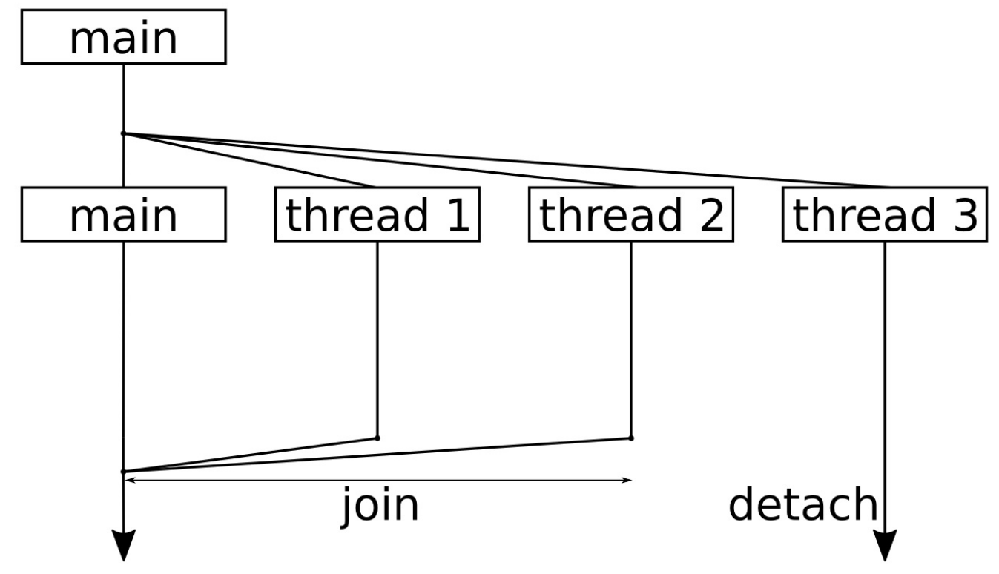
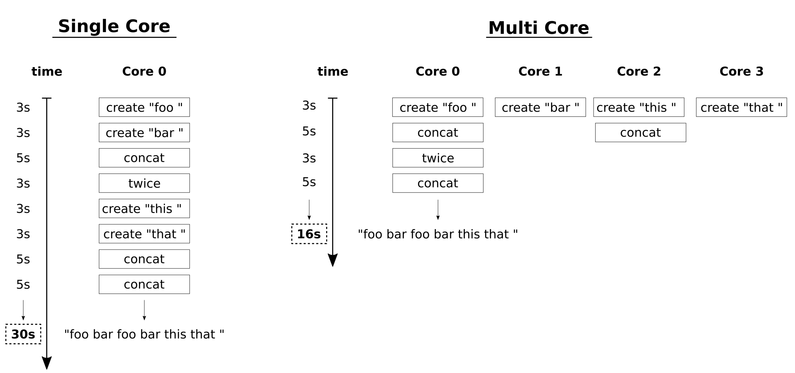

# 并行和并发

随着C++11标准的完成，我们有了`std::thread`，其能给予我们可以在所有操作系统上可移植的线程操作。为了同步线程，C++11也添加了互斥量，并且对一些RAII类型的锁进行了封装。另外，`std::condition_variable`也能够灵活的在线程间，进行唤醒操作。

另一些有趣的东西就是`std::async`和`std::future`——我们可以将普通的函数封装到`std::async`中，可以在后台异步的运行这些函数。包装后函数的返回值则用`std::future`来表示，函数的结果将会在运行完成后，放入这个对象中，所以可以在函数完成前，做点别的事情。

另一个STL中值得一提提升就是执行策略，其被添加到已有的69种算法中。这样就可以对现有的STL算法不做任何修改，就能享受其并行化带来的性能提升。

## 标准算法的自动并行

C++17对并行化的一个重要的扩展，就是对标准函数的执行策略进行了修改。69个标准算法都能并行到不同的核上运行，甚至是向量化。

对于使用者来说，如果经常使用STL中的算法，那么就能很轻易的进行并行。可以通过基于现存的STL算法一个执行策略，然后就能享受并行带来的好处。

### How to do it...

包含必要的头文件，并声明所使用的命名空间。其中`execution`头文件是C++17之后加入的：

```
#include <iostream>
#include <vector>
#include <random>
#include <algorithm>
#include <execution>

using namespace std;
```

这里声明一个谓词函数，其用来判断给定数值的奇偶：

```
static bool odd(int n) { return n % 2; }
```

主函数中先来定义一个很大的`vector`。我们将对其进行填充，并对其中数值进行计算。这个代码的执行速度是非常非常慢的。对于不同配置的电脑来说，这个`vector`的尺寸可能会有变化：

```
int main()
{
    vector<int> d (50000000);
    
    mt19937 gen;
    uniform_int_distribution<int> dis(0, 100000);
    auto rand_num ([=] () mutable { return dis(gen); });
```

现在，`std::generate`算法会用随机值将`vector`填满。这个算法是C++17新加入的算法，其能接受一种新的参数——执行策略。我们在这个位置上填入`std::execution::par`，其能让代码进行自动化并行。通过这个参数的传入，可以使用多线程的方式对`vector`进行填充，如果我们的电脑有多核CPU，那么就可以大大节约我们的时间：

```
    generate(execution::par, begin(d), end(d), rand_num);
```

C++17对其也提供了执行策略的参数：

```
    sort(execution::par, begin(d), end(d));
```

还有`std::reverse`:

```
    reverse(execution::par, begin(d), end(d));
```

然后，我们使用`std::count_if`来计算`vector`中奇数的个数。并且也可以通过添加执行策略参数对该算法进行加速：

```
    auto odds (count_if(execution::par, begin(d), end(d), odd));
    cout << (100.0 * odds / d.size())
    << "% of the numbers are odd.\n";
}
```

### How it works...

并行版本的算法和标准串行的算法并没有什么区别。其差别就是多了一个参数，也就是执行策略。

让我们结合以下代码，来看三个核心问题：

```
generate(execution::par, begin(d), end(d), rand_num);
sort( execution::par, begin(d), end(d));
reverse( execution::par, begin(d), end(d));

auto odds (count_if(execution::par, begin(d), end(d), odd));
```

#### 哪些STL可以使用这种方式进行并行？

69种存在的STL算法在C++17标准中，都可以使用这种方式进行并行，还有7种新算法也支持并行。虽然这种升级对于很多实现来说很伤，但是也只是在接口上增加了一个参数——执行策略参数。这也不是意味着我们总要提供一个执行策略参数。并且执行策略参数放在了第一个参数的位置上。

这里有69个升级了的算法。并且有7个新算法在一开始就支持了并发：

```
adjacent difference, adjacent find.
all_of, any_of, none_of
copy
count
equal
fill
find
generate
includes
inner product
in place merge, merge
is heap, is partitioned, is sorted
lexicographical_compare
min element, minmax element
mismatch
move
n-th element
partial sort, sort copy
partition
remove + variations
replace + variations
reverse / rotate
search
set difference / intersection / union /symmetric difference
sort
stable partition
swap ranges
transform
unique
```

#### 执行策略是如何工作的？

`std::execution`命名空间下面，有三种策略类型：


执行策略意味着我们需要进行严格限制。严格的约定，让我们有更多并行策略可以使用：

- 并行算法对所有元素的访问，必须不能导致死锁或数据竞争。
- 向量化和并行化中，所有可访问的函数不能使用任何一种阻塞式同步。

STL的自动并行化，并不总能保证有加速。因为具体的情况都不一样，所以可能在很多情况下并行化并没有加速。多核编程还是很有难度的。

#### 向量化是什么意思？

向量化的特性需要编译器和CPU都支持，让我们先来简单的了解一下向量化是如何工作的。假设我们有一个非常大的`vector`。简单的实现可以写成如下的方式：

```
std::vector<int> v {1, 2, 3, 4, 5, 6, 7 /*...*/};

int sum {std::accumulate(v.begin(), v.end(), 0)};
```

编译器将会生成一个对`accumulate`调用的循环，其可能与下面代码类似：

```
int sum {0};

for (size_t i {0}; i < v.size(); ++i) {
    sum += v[i];
}
```

从这点说起，当编译器开启向量化时，就会生成类似如下的代码。每次循环会进行4次累加，这样循环次数就要比之前减少4倍。为了简单说明问题，我们这里没有考虑不为4倍数个元素的情况：

```
int sum {0};
for (size_t i {0}; i < v.size() / 4; i += 4) {
    sum += v[i] + v[i+1] + v[i + 2] + v[i + 3];
}
// if v.size() / 4 has a remainder,
// real code has to deal with that also.
```

为什么要这样做呢？很多CPU指令都能支持这种操作`sum += v[i] + v[i+1] + v[i+2] + v[i+3];`，只需要一个指令就能完成。使用尽可能少的指令完成尽可能多的操作，这样就能加速程序的运行。

自动向量化非常困难，因为编译器需非常了解我们的程序，这样才能进行加速的情况下，不让程序的结果出错。目前，至少可以通过使用标准算法来帮助编译器。因为这样能让编译器更加了解哪些数据流能够并行，而不是从复杂的循环中对数据流的依赖进行分析。

### 让程序在特定时间休眠

C++11中对于线程的控制非常优雅和简单。在`this_thread`的命名空间中，包含了只能被运行线程调用的函数。

### How to do it...

`chrono_literals`空间包含一段时间的缩略值：

```
#include <iostream>
#include <chrono>
#include <thread>

using namespace std;
using namespace chrono_literals;
```

我们直接写主函数，并让主线程休眠5秒和300毫秒。感谢`chrono_literals`，我们可以写成一种非常可读方式：

```
int main()
{
    cout << "Going to sleep for 5 seconds"
            " and 300 milli seconds.\n";

    this_thread::sleep_for(5s + 300ms);
```

休眠状态是相对的。当然，我们能用绝对时间来表示。让休眠直到某个时间点才终止，这里我们在`now`的基础上加了3秒：

```
    cout << "Going to sleep for another 3 seconds.\n";

    this_thread::sleep_until(
        chrono::high_resolution_clock::now() + 3s);
    
    cout << "That's it.\n";
}
```

### How it works...

`sleep_for`和`sleep_until`函数都已经在C++11中加入，存放于`std::this_thread`命名空间中。其能对当前线程进行限时阻塞(并不是整个程序或整个进程)。线程被阻塞时不会消耗CPU时间，操作系统会将其标记挂起的状态，时间到了后线程会自动醒来。这种方式的好处在于，不需要知道操作系统对我们运行的程序做了什么，因为STL会将其中的细节进行包装。

`this_thread::sleep_for`函数能够接受一个`chrono::duration`值。最简单的方式就是`1s`或`5s+300ms`。为了使用这种非常简洁的字面时间表示方式，我们需要对命名空间进行声明`using namespace std::chrono_literals;`。

`this_thread::sleep_until`函数能够接受一个`chrono::time_out`参数。这就能够简单的指定对应的壁挂钟时间，来限定线程休眠的时间。

唤醒时间和操作系统的时间的精度一样。大多数操作系统的时间精度通常够用，但是其可能对于一些时间敏感的应用非常不利。

另一种让线程休眠一段时间的方式是使用`this_thread::yield`。其没有参数，也就意味着这个函数不知道这个线程要休眠多长时间。所以，这个函数并不建议用来对线程进行休眠或停滞一个线程。其只会以协作的方式告诉操作系统，让操作系统对线程和进程重新进行调度。如果没有其他可以调度的线程或进程，那么这个“休眠”线程则会立即执行。正因为如此，很少用`yield`让线程休眠一段时间。

## 启动和停止线程

C++11中添加了`std::thread`类，并能使用简洁的方式能够对线程进行启动或停止，线程相关的东西都包含在STL中，并不需要额外的库或是操作系统的实现来对其进行支持。

### How to do it...

```
#include <iostream>
#include <thread>

using namespace std;
using namespace chrono_literals;
```

启动一个线程时，我们需要告诉代码如何执行。所以，先来定义一个函数，这个函数会在线程中执行。这个函数可接受一个参数`i`，可以看作为线程的ID，这样就可以了解打印输出对应的是哪个线程。另外，我们使用线程ID来控制线程休眠的时间，避免多个线程在同时执行`cout`。如果出现了同时打印的情况，那就会影响到输出。

```
static void thread_with_param(int i)
{
    this_thread::sleep_for(1ms * i);

    cout << "Hello from thread " << i << '\n';

    this_thread::sleep_for(1s * i);

    cout << "Bye from thread " << i << '\n';
}
```

主函数中，会先了解在所使用的系统中能够同时运行多少个线程，使用`std::thread::hardware_concurrency`进行确定。这个数值通常依赖于机器上有多少个核，或是STL实现中支持多少个核。这也就意味着，对于不同机器，这个函数会返回不同的值：

```
int main()
{
    cout << thread::hardware_concurrency()
        << " concurrent threads are supported.\n";
```

现在让我们来启动线程，每个线程的ID是不一样的，这里我们启动三个线程。我们使用实例化线程的代码行为`thread t {f, x}`，这就等于在新线程中调用`f(x)`。这样，在不同的线程中就可以给于`thread_with_param`函数不同的参数：

```
    thread t1 {thread_with_param, 1};
    thread t2 {thread_with_param, 2};
    thread t3 {thread_with_param, 3};
```

当启动线程后，我们就需要在其完成其工作后将线程进行终止，使用`join`函数来停止线程。调用`join`将会阻塞调用线程，直至对应的线程终止为止：

```
    t1.join();
    t2.join();
```

另一种方式终止的方式是分离。如果不以`join`或`detach`的方式进行终止，那么程序只有在`thread`对象析构时才会终止。通过调用`detech`，我们将告诉3号线程，即使主线程终止了，你也可以继续运行：

```
    t3.detach();
    
    cout << "Threads joined.\n";
}
```

### How it works...

启动和停止线程其实没有什么困难的。多线程编程的难点在于，如何让线程在一起工作(共享资源、互相等待，等等)。

为了启动一个线程，我们首先定义一些执行函数。没有特定的规定，普通的函数就可以。我们来看一个简化的例子，启动线程并等待线程结束：

```
void f(int i) { cout << i << '\n'; }

int main()
{
    thread t {f, 123};
    t.join();
}
```

`std::thread`的构造函数允许传入一个函数指针或一个可调用的对象，通过这个参数，我们就可以对函数进行调用。当然，我们也可以使用没有任何参数的函数。

如果系统中有多个CPU核，那么线程就可以并行或并发的运行。并行与并发之间有什么区别呢？当计算机只有一个CPU核时，也可以有很多线程并行，但就不可能是并发的了，因为在单核CPU上，每个时间片上只有一个线程在执行。线程在单核上交错着运行，当一个时间片结束后，会对下一个线程进行执行(不过对于使用者来说，看起来就像是同时在运行)。如果线程间可以不去分享一个CPU和，那么这些线程就是并发运行。其实**并发**才是真正的同时运行。

这样，以下几点是我们绝对无法控制的：

- 共享一个CPU核时，无法控制线程交替运行的顺序。
- 线程也是有优先级的，优先级会影响线程执行的顺序。
- 实际上线程是分布在所有CPU核上的，当然操作系统也可以将线程绑定在一个核上。这也就意味着所有的线程可以运行在单核上，也可以运行在具有100个CPU核的机器上。

大多数操作系统都会提供对多线程编程提供一些可能性，不过这些特性并没包含在STL中。

在启动和停止线程的时候，告诉他们要做什么样的工作，并且什么时候线程停止工作。对于大多数应用来说就够用了。本节中，我们启动的3个线程。之后，对其中两个进行了`join`，另一个进行`detach`。让我们使用一个简单的图来总结一下本节的代码：



这幅图的顺序是自顶向下，你会看到我们将整个程序分成了4个线程。一开始，启动了额外3个线程来完成一些事情，之后主线程仅等待其他线程的结束。

线程结束对函数的执行后，会从函数中返回。标准库会进行相关的操作，将线程从操作系统的中删除，或用其他方式销毁，所以这里就不用操心了。

我们需要关心的就是`join`。当对线程对象调用函数`x.join()`时，其会让调用线程休眠，直至`x`线程返回。如果线程处于一个无限循环中，就意味着程序无法终止。如果想要一个线程继续存活，并持续到自己结束的时候，那就可以调用`x.detach()`。之后，就不会在等这个线程了。不管我们怎么做——都必须`join`或`detach`线程。如果不想使用这两种方式，可以在线程对象的析构函数中调用`std::terminate()`，这个函数会让程序“突然死亡”。

主函数返回时，整个程序也就结束了。不过，第3个线程`t3`还在等待，并将对应的信息打印到终端。操作系统才不会在乎——会直接将我们的程序终止，并不管是否有线程还未结束。要怎么解决这个这个问题，就是开发者要考虑的事情了。

## 打造异常安全的共享锁——std::unique_lock和std::shared_lock

由于对于线程的操作严重依赖于操作系统，所以STL提供与系统无关的接口是非常明智的，当然STL也会提供线程间的同步操作。这样就不仅是能够启动和停止线程，使用STL库也能完成线程的同步操作。

### How to do it...

我们将使用`std::shared_mutex`在独占(exclusive)和共享(shared)模式下来完成一段程序，并且也会了解到这两种方式意味着什么。另外，我们将不会对手动的对程序进行上锁和解锁的操作，这些操作都交给RAII辅助函数来完成：

```
#include <iostream>
#include <shared_mutex>
#include <thread>
#include <vector>

using namespace std;
using namespace chrono_literals;

shared_mutex shared_mut;
```

接下来，我们将会使用`std::shared_lock`和`std::unique_lock`这两个RAII辅助者。为了让其类型看起来没那么复杂，这里进行别名操作：

```
using shrd_lck = shared_lock<shared_mutex>;
using uniq_lck = unique_lock<shared_mutex>;
```

开始写主函数之前，先使用互斥锁的独占模式来实现两个辅助函数。下面的函数中，我们将使用`unique_lock`实例来作为共享互斥锁。其构造函数的第二个参数`defer_lock`会告诉对象让锁处于解锁的状态。否则，构造函数会尝试对互斥量上锁阻塞程序，直至成功为止。然后，会对`exclusive_lock`的成员函数`try_lock`进行调用。该函数会立即返回，并且返回相应的布尔值，布尔值表示互斥量是否已经上锁，或是在其他地方已经锁住：

```
static void print_exclusive()
{
    uniq_lck l {shared_mut, defer_lock};

    if (l.try_lock()) {
        cout << "Got exclusive lock.\n";
    } else {
        cout << "Unable to lock exclusively.\n";
    }
}
```

另一个函数也差不多。其会将程序阻塞，直至其获取相应的锁。然后，会使用抛出异常的方式来模拟发生错误的情况(只会返回一个整数，而非一个非常复杂的异常对象)。虽然，其会立即退出，并且在上下文中我们获取了一个锁住的互斥量，但是这个互斥量也可以被释放。这是因为`unique_lock`的析构函数在任何情况下都会将对应的锁进行释放：

```
static void exclusive_throw()
{
    uniq_lck l {shared_mut};
    throw 123;
}
```

首先，先开一个新的代码段，并且实例化一个`shared_lock`实例。其构造函数将会立即对共享模式下的互斥量进行上锁。我们将会在下一步了解到这一动作的意义：

```
int main()
{
    {
        shrd_lck sl1 {shared_mut};

        cout << "shared lock once.\n";
```

现在我们开启另一个代码段，并使用同一个互斥量实例化第二个`shared_lock`实例。现在具有两个`shared_lock`实例，并且都具有同一个互斥量的共享锁。实际上，可以使用同一个互斥量实例化很多的`shared_lock`实例。然后，调用`print_exclusive`，其会尝试使用互斥量的独占模式对互斥量进行上锁。这样的调用当然不会成功，因为互斥量已经在共享模式下锁住了：

```
        {
            shrd_lck sl2 {shared_mut};

            cout << "shared lock twice.\n";

            print_exclusive();
        }
```

离开这个代码段后，`shared_locks12`的析构函数将会释放互斥量的共享锁。`print_exclusive`函数还是失败，这是因为互斥量依旧处于共享锁模式：

```
        cout << "shared lock once again.\n";

        print_exclusive();
    }
    cout << "lock is free.\n";
```

离开这个代码段时，所有`shared_lock`对象就都被销毁了，并且互斥量再次处于解锁状态，现在我们可以在独占模式下对互斥量进行上锁了。调用`exclusive_throw`，然后调用`print_exclusive`。不过因为`unique_lock`是一个RAII对象，所以是异常安全的，也就是无论`exclusive_throw`返回了什么，互斥量最后都会再次解锁。这样即便是互斥量处于锁定状态，`print_exclusive` 也不会被错误的状态所阻塞：

```
    try {
           exclusive_throw();
    } catch (int e) {
        cout << "Got exception " << e << '\n';
    }

    print_exclusive();
}
```

### How it works...

#### 互斥量

其为mutual exclusion的缩写。并发时不同的线程对于相关的共享数据同时进行修改时，可能会造成结果错误，我们在这里就可以使用互斥量对象来避免这种情况的发生，STL提供了不同特性的互斥量。不过，这些互斥量的共同点就是具有`lock`和`unlock`两个成员函数。

一个互斥量在解锁状态下时，当有线程对其使用`lock()`时，这个线程就获取了互斥量，并对互斥量进行上锁。这样，但其他线程要对这互斥量进行上锁时，就会处于阻塞状态，直到第一个线程对该互斥量进行释放。`std::mutex`就可以做到。

这里将STL一些不同的互斥量进行对比：


#### 锁

线程对互斥量上锁之后，很多事情都变的非常简单，我们只需要上锁、访问、解锁三步就能完成我们想要做的工作。不过对于有些比较健忘的开发者来说，在上锁之后，很容易忘记对其进行解锁，或是互斥量在上锁状态下抛出一个异常，如果要对这个异常进行处理，那么代码就会变得很难看。最优的方式就是程序能够自动来处理这种事情。这种问题很类似与内存泄漏，开发者在分配内存之后，忘记使用`delete`操作进行内存释放。

内存管理部分，我们有`unique_ptr`，`shared_ptr`和`weak_ptr`。这些辅助类可以很完美帮我们避免内存泄漏。互斥量也有类似的帮手，最简单的一个就是`std::lock_guard`。使用方式如下：

```
void critical_function()
{
    lock_guard<mutex> l {some_mutex};

    // critical section
}
```

`lock_guard`的构造函数能接受一个互斥量，其会立即自动调用`lock`，构造函数会直到获取互斥锁为止。当实例进行销毁时，其会对互斥量再次进行解锁。这样互斥量就很难陷入到`lock/unlock`循环错误中。

C++17 STL提供了如下的RAII辅助锁。其都能接受一个模板参数，其与互斥量的类型相同(在C++17中，编译器可以自动推断出相应的类型)：


`lock_guard`和`scoped_lock`只拥有构造和析构函数，`unique_lock`和`shared_lock`就比较复杂了，但也更为通用。

虽然，只在单线程的上下文中运行程序，但是我们可以了解到如何对辅助锁进行使用。`shrd_lck`类型为`shared_lock<shared_mutex>`的缩写，并且其允许我们在共享模式下对一个实例多次上锁。当`sl1`和`sl2`存在的情况下，`print_exclusive`无法使用独占模式对互斥量进行上锁。

现在来看看处于独占模式的上锁函数：

```
int main()
{
    {
        shrd_lck sl1 {shared_mut};
        {
            shrd_lck sl2 {shared_mut};
            print_exclusive();
        }
        print_exclusive();
    }

    try {
        exclusive_throw();
    } catch (int e) {
        cout << "Got exception " << e << '\n';
    }

    print_exclusive();
}
```

`exclusive_throw`的返回也比较重要，即便是抛出异常退出，`exclusive_throw`函数依旧会让互斥量再度锁上。

因为`print_exclusive`使用了一个奇怪的构造函数，我们就再来看一下这个函数：

```
void print_exclusive()
{
    uniq_lck l {shared_mut, defer_lock};

    if (l.try_lock()) {
        // ...
    }
}
```

这里我们不仅提供了`shared_mut`，还有`defer_lock`作为`unique_lock`构造函数的参数。`defer_lock`是一个空的全局对象，其不会对互斥量立即上锁，所以我们可以通过这个参数对`unique_lock`不同的构造函数进行选择。这样做之后，我们可以调用`l.try_lock()`，其会告诉我们有没有上锁。在互斥量上锁的情况下，就可以做些别的事情了。如果的确有机会获取锁，依旧需要析构函数对互斥量进行清理。

## 避免死锁——std::scoped_lock

如果在路上发生了死锁，就会像下图一样：


为了让交通顺畅，可能需要一个大型起重机，将路中间的一辆车挪到其他地方去。如果找不到起重机，那么我们就希望这些司机们能互相配合。当几个司机愿意将车往后退，留给空间给其他车通行，那么每辆车就不会停在原地了。

多线程编程中，开发者肯定需要避免这种情况的发生。不过，程序比较复杂的情况下，这种情况其实很容易发生。

### How to do it...

本节中有两对函数要在并发的线程中执行，并且有两个互斥量。其中一对制造死锁，另一对解决死锁。主函数中，我们将使用这两个互斥量：

```
#include <iostream>
#include <thread>
#include <mutex>

using namespace std;
using namespace chrono_literals;

mutex mut_a;
mutex mut_b;
```

为了使用两个互斥量制造死锁，我们需要有两个函数。其中一个函数试图对互斥量`A`进行上锁，然后对互斥量B进行上锁，而另一个函数则试图使用相反的方式运行。让两个函数在等待锁时进行休眠，我们确定这段代码永远处于一个死锁的状态。(这就达到了我们演示的目的。当我们重复运行程序，那么程序在没有任何休眠代码的同时，可能会有成功运行的情况。)需要注意的是，这里我们没有使用`\n`字符作为换行符，我们使用的是`endl`。`endl`会输出一个换行符，同时也会对`cout`的流缓冲区进行刷新，所以我们可以确保打印信息不会有延迟或同时出现：

```
static void deadlock_func_1()
{
    cout << "bad f1 acquiring mutex A..." << endl;

    lock_guard<mutex> la {mut_a};

    this_thread::sleep_for(100ms);

    cout << "bad f1 acquiring mutex B..." << endl;

    lock_guard<mutex> lb {mut_b};

    cout << "bad f1 got both mutexes." << endl;
}
```

`deadlock_func_2`和`deadlock_func_1`看起来一样，就是`A`和`B`的顺序相反：

```
static void deadlock_func_2()
{
    cout << "bad f2 acquiring mutex B..." << endl;

    lock_guard<mutex> lb {mut_b};

    this_thread::sleep_for(100ms);

    cout << "bad f2 acquiring mutex A..." << endl;

    lock_guard<mutex> la {mut_a};

    cout << "bad f2 got both mutexes." << endl;
}
```

现在我们将完成与上面函数相比，两个无死锁版本的函数。它们使用了`scoped_lock`，其会作为构造函数参数的所有互斥量进行上锁。其析构函数会进行解锁操作。锁定这些互斥量时，其内部应用了避免死锁的策略。这里需要注意的是，两个函数还是对`A`和`B`互斥量进行操作，并且顺序相反：

```
static void sane_func_1()
{
    scoped_lock l {mut_a, mut_b};

    cout << "sane f1 got both mutexes." << endl;
}

static void sane_func_2()
{
    scoped_lock l {mut_b, mut_a};

    cout << "sane f2 got both mutexes." << endl;
}
```

主函数中观察这两种情况。首先，我们使用不会死锁的函数：

```
int main()
{
    {
        thread t1 {sane_func_1};
        thread t2 {sane_func_2};

        t1.join();
        t2.join();
    }
```

然后，调用制造死锁的函数：

```
    {
        thread t1 {deadlock_func_1};
        thread t2 {deadlock_func_2};

        t1.join();
        t2.join();
    }
}
```

编译并运行程序，就能得到如下的输出。前两行为无死锁情况下，两个函数的打印结果。接下来的两个函数则产生死锁。因为我们能看到f1函数始终是在等待互斥量B，而f2则在等待互斥量A。两个函数都没做成功的对两个互斥量上锁。我们可以让这个程序持续运行，不管时间是多久，结果都不会变化。程序只能从外部进行杀死，这里我们使用`Ctrl + C`的组合键，将程序终止：

```
$ ./avoid_deadlock
sane f1 got both mutexes
sane f2 got both mutexes
bad f2 acquiring mutex B...
bad f1 acquiring mutex A...
bad f1 acquiring mutex B...
bad f2 acquiring mutex A...
```

### How it works...

例子中，我们故意制造了死锁，我们也了解了这样一种情况发生的有多快。在一个很大的项目中，多线程开发者在编写代码的时候，都会共享一些互斥量用于保护资源，所有开发者都需要遵循同一种加锁和解锁的顺序。这种策略或规则是很容易遵守的，不过也是很容易遗忘的。另一个问题则是锁序倒置。

`scoped_lock`对于这种情况很有帮助。其实在C++17中添加，其工作原理与`lock_guard`和`unique_lock`一样：其构造函数会进行上锁操作，并且析构函数会对互斥量进行解锁操作。`scoped_lock`特别之处是，可以指定多个互斥量。

`scoped_lock`使用`std::lock`函数，其会调用一个特殊的算法对所提供的互斥量调用`try_lock`函数，这是为了避免死锁。因此，在加锁与解锁的顺序相同的情况下，使用`scoped_lock`或对同一组锁调用`std::lock`都是非常安全的。

## 同步并行中使用std::cout

多线程中的一个麻烦的地方在于，需要对并发线程所要访问的共享数据使用互斥量或其他方式进行保护，以避免让多线程修改失控。

其中`std::cout`打印函数通常被使用到。如果多个线程同时调用`cout`，那么其输出将会混合在一起。为了避免输出混在一起，我们将要用我们的函数进行并发安全的打印。

### How to do it...

```
#include <iostream>
#include <thread>
#include <mutex>
#include <sstream>
#include <vector>

using namespace std;
```

然后实现辅助类，其名字为`pcout`。其中字母p代表parallel，因为其会将并发的上下文进行同步。`pcout`会`public`继承于`stringstream`。这样，我们就能直接对其实例使用`<<`操作符了。当`pcout`实例销毁时，其析构函数会对一个互斥量进行加锁，然后将`stringstream`缓冲区中的内容进行打印。我们将在下一步了解，如何对这个类进行使用：

```
struct pcout : public stringstream {
    static inline mutex cout_mutex;

    ~pcout() {
        lock_guard<mutex> l {cout_mutex};
        cout << rdbuf();
        cout.flush();
    }
};
```

现在，让我们来完成两个函数，这个两函数可运行在额外的线程上。每个线程都有一个线程ID作为参数。这两个函数的区别在于，第一个就是简单的使用`cout`进行打印。另一个使用`pcout`来进行打印。对应的实例都是一个临时变量，只存在于一行代码上。在所有`<<`调用执行完成后，我们想要的字符流则就打印在屏幕上了。然后，调用`pcout`实例的析构函数。我们可以了解到析构函数做了什么事：其对一个特定的互斥量进行上锁，所有`pcout`的实例都会这个互斥量进行共享：

```
static void print_cout(int id)
{
    cout << "cout hello from " << id << '\n';
}

static void print_pcout(int id)
{
    pcout{} << "pcout hello from " << id << '\n';
}
```

首先，我们使用`print_cout`，其会使用`cout`进行打印。我们并发的启动10个线程，使用其打印相应的字符串，并等待打印结束：

```
int main()
{
    vector<thread> v;

    for (size_t i {0}; i < 10; ++i) {
        v.emplace_back(print_cout, i);
    }

    for (auto &t : v) { t.join(); }
```

然后，使用`print_pcout`来完成同样的事情：

```
    cout << "=====================\n";

    v.clear();
    for (size_t i {0}; i < 10; ++i) {
        v.emplace_back(print_pcout, i);
    }

    for (auto &t : v) { t.join(); }
}
```

编译并运行程序，我们就会得到如下的输出。如我们所见，前10行打印完全串行了。我们无法了解到哪条信息是由哪个线程所打印的。后10行的打印中，我们使用`print_pcout`进行打印，就不会造成任何串行的情况。可以清楚的看到不同线程所打印出的信息，因为每次运行的时候打印顺序都是以类似随机数的方式出现：


### How it works...

OK，我们已经构建了“cout包装器”，其可以在并发程序中串行化的对输出信息进行打印。其是如何工作的呢？

当我们一步一步的了解`pcout`的原理，就会发现其工作的原理并不神奇。首先，实现一个字符流，能接受我们输入的字符串：

```
stringstream ss;
ss << "This is some printed line " << 123 << '\n';
```

然后，其会对全局互斥量进行锁定：

```
{
    lock_guard<mutex> l {cout_mutex};
```

锁住的区域中，其能访问到字符流`ss`，并对其进行打印。离开这个代码段时，对互斥锁进行释放。`cout.flush()`这会告诉字符流对象立即将其内容打印到屏幕上。如果没有这一行，程序将会运行的更快，因为多次的打印可能会放在一起打印。我们的代码中，想立即看到打印信息，所以我们使用了`flush`：

```
    cout << ss.rdbuf();
    cout.flush();
}
```

OK，这就很简单了吧，但每次都写这几行代码，就会让整体的代码变的很冗长。我们可以将`stringstream`的实例化简写为如下的方式：

```
stringstream{} << "This is some printed line " << 123 << '\n';
```

这个字符串流对象的实例，可以容纳我们想打印的任何字符，最后对字符串进行析构。字符串流的声明周期只在这一行内存在。之后，我们无法打印任何东西，因为我们无法对其进行访问。最后，哪段代码能访问流的内容呢？其就是`stringstream`的析构函数。

我们无法对`stringstream`实例的成员函数进行修改，但是可以对通过继承的方式包装成我们想要的类型：

```
struct pcout : public stringstream {
    ~pcout() {
        lock_guard<mutex> l {cout_mutex};
        cout << rdbuf();
        cout.flush();
    }
};
```

这个类依旧是一个字符串流，并且可以像字符串流一样对这个类型进行使用。不同的是，其会对互斥量进行上锁，并且将其内容使用`cout`进行输出。

我们也会将`cout_mutex`对象作为静态实例移入`pcout`结构体中，所以可以让不同的实例共享一个互斥量。

## 进行延迟初始化——std::call_once

有时我们有一些特定的代码段，可以在多个线程间并行执行，不过其中有一些功能需要在进行执行前，完成一次初始化的过程。一个很简单的方式，就是在程序进入并行前，执行已存在的准备函数。

这种方法有如下几个缺点：

- 当并行线程来自于一个库，使用者肯定会忘记调用准备函数。这样会让库函数不是那么容易的让人使用。
- 当准备函数特别复杂，并且在某些条件下我们要通过条件来判断，是否要执行这个准备函数。

### How to do it...

我们将完成一个程序，我们使用多线程对同一段代码进行执行。虽然这里执行的是相同的代码，但是我们的准备函数只需要运行一次：

```
#include <iostream>
#include <thread>
#include <mutex>
#include <vector>

using namespace std;
```

我们将使用`std::call_once`。为了对其进行使用，需要对`once_flag`进行实例化。在对指定函数使用`call_once`时，需要对所有线程进行同步：

```
once_flag callflag;
```

现在来定义一个只需要执行一次的函数，就让这个函数打印一个感叹号吧：

```
static void once_print()
{
    cout << '!';
}
```

再来定义所有线程都会运行的函数。首先，要通过`std::call_once`调用`once_print`。`call_once`需要我们之前定义的变量`callflag`。其会被用来对线程进行安排：

```
static void print(size_t x)
{
    std::call_once(callflag, once_print);
    cout << x;
}
```

OK，让我们启动10个线程，并且让他们使用`print`函数进行执行：

```
int main()
{
    vector<thread> v;

    for (size_t i {0}; i < 10; ++i) {
        v.emplace_back(print, i);
    }

    for (auto &t : v) { t.join(); }
    cout << '\n';
}
```

编译并运行程序，我们就会得到如下的输出。首先，我们可以看到由`once_print`函数打印出的感叹号。然后，我么可以看到线程对应的ID号。另外，其会对所有线程进行同步，所以不会有ID在`once_print`函数执行前被打印：

```
$ ./call_once
!1239406758
```

### How it works...

`std::call_once`工作原理和栅栏类似。其能对一个函数(或是一个可调用的对象)进行访问。第一个线程达到`call_once`的线程会执行对应的函数。直到函数执行结束，其他线程才能不被`call_once`所阻塞。当第一个线程从准备函数中返回后，其他线程也就都结束了阻塞。

我们可以对这个过程进行安排，当有一个变量决定其他线程的运行时，线程则必须对这个变量进行等待，直到这个变量准备好了，所有变量才能运行。这个变量就是`once_flag callflag;`。每一个`call_once`都需要一个`once_flag`实例作为参数，来表明预处理函数是否运行了一次。

另一个细节是：如果`call_once`执行失败了(因为准备函数抛出了异常)，那么下一个线程则会再去尝试执行(这种情况发生在下一次执行不抛出异常的时候)。

## 将执行的程序推到后台——std::async

当我们想要将一些可以执行的代码放在后台，可以用线程将这段程序运行起来。然后，我们就等待运行的结果就好：

```
std::thread t {my_function, arg1, arg2, ...};
// do something else
t.join(); // wait for thread to finish
```

这里`t.join()`并不会给我们`my_function`函数的返回值。为了获取返回值，需要先实现`my_function`函数，然后将其返回值存储到主线程能访问到的地方。如果这样的情况经常发生，我们就要重复的写很多代码。

C++11之后，`std::async`能帮我们完成这项任务。我们将写一个简单的程序，并使用异步函数，让线程在同一时间内做很多事情。`std::async`其实很强大，让我们先来了解其一方面。

### How to do it...

我们将在一个程序中并发进行多个不同事情，不显式创建线程，这次使用`std::async`和`std::future`：

```
#include <iostream>
#include <iomanip>
#include <map>
#include <string>
#include <algorithm>
#include <iterator>
#include <future>

using namespace std;
```

实现了三个函数，算是完成些很有趣的任务。第一个函数能够接收一个字符串，并且创建一个对于字符串中的字符进行统计的直方图：

```
static map<char, size_t> histogram(const string &s)
{
    map<char, size_t> m;

    for (char c : s) { m[c] += 1; }

    return m;
}
```

第二个函数也能接收一个字符串，并返回一个排序后的副本：

```
static string sorted(string s)
{
    sort(begin(s), end(s));
    return s;
}
```

第三个函数会对传入的字符串中元音字母进行计数：

```
static bool is_vowel(char c)
{
    char vowels[] {"aeiou"};
    return end(vowels) !=
            find(begin(vowels), end(vowels), c);
}

static size_t vowels(const string &s)
{
    return count_if(begin(s), end(s), is_vowel);
}
```

主函数中，我们从标准输入中获取字符串。为了不让输入字符串分段，我们禁用了`ios::skipws`。这样就能得到一个很长的字符串，并且不管这个字符串中有多少个空格。我们会对结果字符串使用`pop_back`，因为这种方式会让一个字符串中包含太多的终止符：

```
int main()
{
    cin.unsetf(ios::skipws);
    string input {istream_iterator<char>{cin}, {}};
    input.pop_back();
```

为了获取函数的返回值，并加快对输入字符串的处理速度，我们使用了异步的方式。`std::async`函数能够接收一个策略和一个函数，以及函数对应的参数。我们对于这个三个函数均使用`launch::async`策略。并且，三个函数的输入参数是完全相同的：

```
    auto hist (async(launch::async,
                    histogram, input));
    auto sorted_str (async(launch::async,
                    sorted, input));
    auto vowel_count (async(launch::async,
                    vowels, input));
```

`async`的调用会立即返回，因为其并没有执行我们的函数。另外，准备好同步的结构体，用来获取函数所返回的结果。目前的结果使用不同的线程并发的进行计算。此时，我们可以做其他事情，之后再来获取函数的返回值。`hist`，`sorted_str`和`vowel_count`分别为函数`histogram`，`sorted` 和`vowels`的返回值，不过其会通过`std::async`包装入`future`类型中。这个对象表示在未来某个时间点上，对象将会获取返回值。通过对`future`对象使用`.get()`，我们将会阻塞主函数，直到相应的值返回，然后再进行打印：

```
    for (const auto &[c, count] : hist.get()) {
        cout << c << ": " << count << '\n';
    }

    cout << "Sorted string: "
        << quoted(sorted_str.get()) << '\n'
        << "Total vowels: "
        << vowel_count.get() << '\n';
}
```

编译并运行代码，就能得到如下的输出。我们使用一个简短的字符串的例子时，代码并不是真正的在并行，但这个例子中，我们能确保代码是并发的。另外，程序的结构与串行版本相比，并没有改变多少：

```
 $ echo "foo bar baz foobazinga" | ./async
  : 3
 a: 4
 b: 3
 f: 2
 g: 1
 i: 1
 n: 1
 o: 4
 r: 1
 z: 2
 Sorted string: "   aaaabbbffginoooorzz"
 Total vowels: 9
```

### How it works...

如果你没有使用过`std::async`，那么代码可以简单的写成串行代码：

```
auto hist (histogram(input));
auto sorted_str (sorted( input));
auto vowel_count (vowels( input));

for (const auto &[c, count] : hist) {
  cout << c << ": " << count << '\n';
}
cout << "Sorted string: " << quoted(sorted_str) << '\n';
cout << "Total vowels: " << vowel_count << '\n';
```

下面的代码，则是并行的版本。我们将三个函数使用`async(launch::async, ...)`进行包装。这样三个函数都不会由主函数来完成。此外，`async`会启动新线程，并让线程并发的完成这几个函数。这样我们只需要启动一个线程的开销，就能将对应的工作放在后台进行，而后可以继续执行其他代码：

```
auto hist (async(launch::async, histogram, input));
auto sorted_str (async(launch::async, sorted, input));
auto vowel_count (async(launch::async, vowels, input));

for (const auto &[c, count] : hist.get()) {
    cout << c << ": " << count << '\n';
}

cout << "Sorted string: "
    << quoted(sorted_str.get()) << '\n'
    << "Total vowels: "
    << vowel_count.get() << '\n';
```

例如`histogram`函数则会返回一个`map`实例，`async(..., histogram, ...)`将返回给我们的`map`实例包装进之前就准备好的`future`对象中。`future`对象是一种空的占位符，直到线程执行完函数返回时，才有具体的值。结果`map`将会返回到`future`对象中，所以我们可以对对象进行访问。`get`函数能让我们得到被包装起来的结果。

让我们来看一个更加简单的例子。看一下下面的代码：

```
auto x (f(1, 2, 3));
cout << x;
```

与之前的代码相比，我们也可以以下面的方式完成代码：

```
auto x (async(launch::async, f, 1, 2, 3));
cout << x.get();
```

这都是最基本的。后台执行的方式可能要比标准C++出现还要早。当然，还有一个问题要解决：`launch::async`是什么东西？`launch::async`是一个用来定义执行策略的标识。其有两种独立方式和一种组合方式：


不使用策略参数调用`async(f, 1, 2, 3)`，我们将会选择都使用的策略。`async`的实现可以自由的选择策略。这也就意味着，我们不能确定任务会执行在一个新的线程上，还是执行在当前线程上。

### There's more...

还有件事情我们必须要知道，假设我们写了如下的代码：

```
async(launch::async, f);
async(launch::async, g);
```

这就会让`f`和`g`函数并发执行(这个例子中，我们并不关心其返回值)。运行这段代码时，代码会阻塞在这两个调用上，这并不是我们想看到的情况。

所以，为什么会阻塞呢？`async`不是非阻塞式、异步的调用吗？没错，不过这里有点特殊：当对一个`async`使用`launch::async`策略时，获取一个`future`对象，之后其析构函数将会以阻塞式等待方式运行。

这也就意味着，这两次调用阻塞的原因就是，`future`生命周期只有一行的时间！我们可以以获取其返回值的方式，来避免这个问题，从而让`future`对象的生命周期更长。

## 实现生产者/消费者模型——std::condition_variable

我们将使用多线程实现一个经典的生产者/消费者模型。其过程就是一个生产者线程将商品放到队列中，然后另一个消费者线程对这个商品进行消费。如果不需要生产，生产者线程休眠。如果队列中没有商品能够消费，消费者休眠。

这里两个线程都需要对同一个队列进行修改，所以我们需要一个互斥量来保护这个队列。

### How to do it...

我们将实现一个单生产者/消费者程序，每个角色都有自己的线程：

```
#include <iostream>
#include <queue>
#include <tuple>
#include <condition_variable>
#include <thread>

using namespace std;
using namespace chrono_literals;
```

队列进行实例化，并且队列`q`里只放简单的数字。生产者将商品放入队列中，消费者将商品从队列中取出。为了进行同步，我们需要一个互斥量。这就需要我们对`condition_variable`进行实例化，其变量名为`cv`。`finished`变量将会告诉生产者，无需在继续生产：

```
queue<size_t> q;
mutex mut;
condition_variable cv;
bool finished {false};
```

首先，我们来实现一个生产者函数。其能接受一个参数`items`，其会限制生产者生产的最大数量。一个简单的循环中，我们将会隔100毫秒生产一个商品，这个耗时就是在模拟生产的复杂性。然后，我们会对队列的互斥量进行上锁，并同步的对队列进行访问。成功的生产后，将商品加入队列时，我们需要调用`cv.notify_all()`，函数会叫醒所有消费线程。我们将在后面看到消费者那边是如何工作的：

```
static void producer(size_t items) {
    for (size_t i {0}; i < items; ++i) {
        this_thread::sleep_for(100ms);
        {
            lock_guard<mutex> lk {mut};
            q.push(i);
        }
        cv.notify_all();
    }
```

生产完所有商品后，我们会将互斥量再度上锁，因为需要对`finished`位进行设置。然后，再次调用`cv.notify_all()`：

```
    {
        lock_guard<mutex> lk {mut};
        finished = true;
    }
    cv.notify_all();
}
```

现在来实现消费者函数。因为只是对队列上的数值进行消费，直到消费完所有的数值，所以这个函数不需要参数。当`finished`未被设置时，循环会持续执行，并且会对保护队列的互斥量进行上锁，将对队列和`finished`标识同时进行保护。当互斥量上锁，则锁就会调用`cv.wait`，并以Lambda表达式为参数。这个Lambda表达式其实就是个条件谓词，如果生产者线程还在继续工作，并且还有商品在队列上，消费者线程就不能停下来：

```
static void consumer() {
   while (!finished) {
       unique_lock<mutex> l {mut};

       cv.wait(l, [] { return !q.empty() || finished; });
```

`cv.wait`的调用会对锁进行解锁，并且会等到给予的条件达成时才会继续运行。然后，其会再次对互斥量上锁，并对队列上的商品进行消费，直到队列为空。如果生成者还在继续生成，那么这个循环可能会一直进行下去。否则，当`finished`被设置时，循环将会终止，这也就表示生产者不会再进行生产：

```
        while (!q.empty()) {
            cout << "Got " << q.front()
                << " from queue.\n";
            q.pop();
        }
    }
}
```

主函数中，我们让生产者生产10个商品。然后，我们就等待程序的结束：

```
int main() {
    thread t1 {producer, 10};
    thread t2 {consumer};
    t1.join();
    t2.join();
    cout << "finished!\n";
}
```

编译并运行程序，我们将会得到下面的输出。当程序在运行阶段时，我们将看到每一行，差不多隔100毫秒打印出来，因为生产者需要时间进行生产：

```
$ ./producer_consumer
Got 0 from queue.
Got 1 from queue.
Got 2 from queue.
Got 3 from queue.
Got 4 from queue.
Got 5 from queue.
Got 6 from queue.
Got 7 from queue.
Got 8 from queue.
Got 9 from queue.
finished!
```

### How it works...

我们只启动了两个线程。第一个线程会生产一些商品，并放到队列中。另一个则是从队列中取走商品。当其中一个线程需要对队列进行访问时，其否需要对公共互斥量`mut`进行上锁，这样才能对队列进行访问。这样，我们就能保证两个线程不能再同时对队列进行操作。

除了队列和互斥量，我们还声明了2个变量，其也会对生产者和消费者有所影响：

```
queue<size_t> q;
mutex mut;
condition_variable cv;
bool finished {false};
```

`finished`变量很容易解释。当其设置为true时，生产者则会对固定数量的产品进行生产。当消费者看到这个值为true的时候，其就要将队列中的商品全部消费完。但是`condition_variable cv`代表了什么呢？我们在两个不同上下文中使用`cv`。其中一个上下文则会去等待一个特定的条件，并且另一个会达成对应的条件。

消费者这边将会等待一个特殊的条件。消费者线程会在对互斥量`mut`使用`unique_lock`上锁后，进行阻塞循环。然后，会调用`cv.wait`：

```
while (!finished) {
    unique_lock<mutex> l {mut};

    cv.wait(l, [] { return !q.empty() || finished; });

    while (!q.empty()) {
        // consume
    }
}
```

我们写了下面一段代码，这上下来两段代码看起来是等价的。我们会在后面了解到，这两段代码真正的区别到底在哪里：

```
while (!finished) {
    unique_lock<mutex> l {mut};

    while (q.empty() && !finished) {
        l.unlock();
        l.lock();
    }

    while (!q.empty()) {
        // consume
    }
}
```


这就意味着，我们先要进行上锁，然后对我们的应对方案进行检查：

- 还有商品能够消费吗？有的话，继续持有锁，消费，释放锁，结束。
- 如果没有商品可以消费，但是生产者依旧存在，释放互斥锁，也就是给生产者一个机会向队列中添加商品。然后，尝试再对现状进行检查，如果现状有变，则跳转到1方案中。

`cv.wait`为什么与`while(q.empty() && ... )`不等价呢？因为在`wait`不需要再循环中持续的进行上锁和解锁的循环。如果生产者线程处于未激活状态时，这就会导致互斥量持续的被上锁和解锁，这样的操作是没有意义的，而且还会耗费掉不必要的CPU周期。

`cv.wait(lock, predicate)`将会等到`predicate()`返回true时，结束等待。不过其不会对`lock`持续的进行解锁与上锁的操作。为了将使用`wait`阻塞的线程唤醒，我们就需要使用`condition_variable` 对象，另一个线程会对同一个对象调用`notify_one()`或`notify_all()`。等待中的线程将从休眠中醒来，并检查`predicate()`条件是否成立。

`wait`还有一个很好的地方在于，如果出现了伪唤醒操作，那么线程则会再次进行休眠状态。这也就是当我们发出了过多的叫醒信号时，其不会对程序流有任何影响(但是会影响到性能)。

生产者端，在向队列输出商品后，调用`cv.notify_all()`，并且在生产最后一个商品时，将`finished`设置为true，这就等于引导了消费者进行消费。

## 实现多生产者/多消费者模型——std::condition_variable

### How to do it...

我们将实现一个类似于上节的程序，这次我们有多个生产者和消费者：

```
#include <iostream>
#include <iomanip>
#include <sstream>
#include <vector>
#include <queue>
#include <thread>
#include <mutex>
#include <condition_variable>
#include <chrono>

using namespace std;
using namespace chrono_literals;

struct pcout : public stringstream {
    static inline mutex cout_mutex;
    ~pcout() {
        lock_guard<mutex> l {cout_mutex};
        cout << rdbuf();
    }
};
```

所有生产者都会将值写入到同一个队列中，并且所有消费者也会从这个队列中获取值。对于这个队列，我们需要使用一个互斥量对队列进行保护，并设置一个标识，其会告诉我们生产者是否已经停止生产：

```
queue<size_t> q;
mutex q_mutex;
bool production_stopped {false};
```

我们将在程序中使用两个`condition_variable`对象。单生产者/消费者的情况下，只需要一个`condition_variable`告诉我们队列上面摆放了新商品。本节的例子中，我们将来处理更加复杂的情况。我们需要生产者持续生产，以保证队列上一直有可消费的商品存在。如果商品囤积到一定程度，则生产者休息。`go_consume`变量就用来提醒消费者消费的，而`go_produce`则是用来提醒生产者进行生产的：

```
condition_variable go_produce;
condition_variable go_consume;
```

生产者函数能够接受一个生产者ID，所要生产的商品数量，以及囤积商品值的上限。然后，生产者就会进入循环生产阶段。这里，首先其会对队列的互斥量进行上锁，然后在通过调用`go_produce.wait`对互斥量进行解锁。队列上的商品数量未达到囤积阈值时，满足等待条件：

```
static void producer(size_t id, size_t items, size_t stock)
{
    for (size_t i = 0; i < items; ++i) {
        unique_lock<mutex> lock(q_mutex);
        go_produce.wait(lock,
            [&] { return q.size() < stock; });
```

生产者开始生产后，就会有商品放入队列中。队列商品的表达式为`id * 100 + i`。因为百位和线程id强相关，这样我们就能了解到哪些商品是哪些生产者生产的。我们也能将生产事件打印到终端上。格式看起来可能有些奇怪，不过其会与消费者打印输出对齐：

```
        q.push(id * 100 + i);

        pcout{} << " Producer " << id << " --> item "
                << setw(3) << q.back() << '\n';
```

生产商品之后，我们叫醒沉睡中的消费者。每个睡眠周期为90毫秒，这用来模拟生产者生产商品的时间：

```
        go_consume.notify_all();
        this_thread::sleep_for(90ms);
    }

    pcout{} << "EXIT: Producer " << id << '\n';
}
```

现在来实现消费者函数，其只接受一个消费者ID作为参数。当生产者停止生产，或是队列上没有商品，消费者就会继续等待。队列上没有商品时，生产者还在生产的话，那么可以肯定的是，队列上肯定会有新商品的产生：

```
static void consumer(size_t id)
{
    while (!production_stopped || !q.empty()) {
        unique_lock<mutex> lock(q_mutex);
```

对队列的互斥量上锁之后，我们将会在等待`go_consume`事件变量时对互斥量进行解锁。Lambda表达式表明，当队列中有商品的时候我们就会对其进行获取。第二个参数`1s`说明，我们并不想等太久。如果等待时间超过1秒，我们将不会等待。当谓词条件达成，则`wait_for`函数返回；否则就会因为超时而放弃等待。如果队列中有新商品，我们将会获取这个商品，并进行相应的打印：

```
        if (go_consume.wait_for(lock, 1s,
                [] { return !q.empty(); })) {
            pcout{} << " item "
                    << setw(3) << q.front()
                    << " --> Consumer "
                    << id << '\n';
            q.pop();
```

商品被消费之后，我们将会提醒生产者，并进入130毫秒的休眠状态，这个时间用来模拟消费时间：

```
            go_produce.notify_all();
            this_thread::sleep_for(130ms);
        }
    }

    pcout{} << "EXIT: Producer " << id << '\n';
}
```

主函数中，我们对工作线程和消费线程各自创建一个`vector`:

```
int main()
{
    vector<thread> workers;
    vector<thread> consumers;
```

然后，我们创建3个生产者和5个消费者：

```
    for (size_t i = 0; i < 3; ++i) {
        workers.emplace_back(producer, i, 15, 5);
    }

    for (size_t i = 0; i < 5; ++i) {
        consumers.emplace_back(consumer, i);
    }
```

我们会先让生产者线程终止。然后返回，并对`production_stopped`标识进行设置，这将会让消费者线程同时停止。然后，我们要将这些线程进行回收，然后退出程序：

```
    for (auto &t : workers) { t.join(); }
    production_stopped = true;
    for (auto &t : consumers) { t.join(); }
}
```

编译并运行程序，我们将获得如下的输出。输出特别长，我们进行了截断。我们能看到生产者偶尔会休息一下，并且消费者会消费掉对应的商品，直到再次生产。若是将生产者/消费者的休眠时间进行修改，则会得到完全不一样的结果：

```
$ ./multi_producer_consumer
Producer 0 --> item 0
Producer 1 --> item 100
item 0 --> Consumer 0
Producer 2 --> item 200
item 100 --> Consumer 1
item 200 --> Consumer 2
Producer 0 --> item 1
Producer 1 --> item 101
item 1 --> Consumer 0
...
Producer 0 --> item14
EXIT: Producer 0
Producer 1 --> item 114
EXIT: Producer 1
item14 --> Consumer 0
Producer 2 --> item 214
EXIT: Producer 2
item 114 --> Consumer 1
item 214 --> Consumer 2
EXIT: Consumer 2
EXIT: Consumer 3
EXIT: Consumer 4
EXIT: Consumer 0
EXIT: Consumer 1
```

### How it works...

与单生产者和消费者不同，我们实现了M个生产者和N个消费者之间的同步。因此，程序中不是消费者因为队列中没有商品而等待，就是因为队列中囤积了太多商品让生产者等待。

当有多个消费者等待同一个队列中出现新的商品时，程序的模式就又和单生产者/消费者工作的模式相同了。当有一个线程对保护队列的互斥量上锁时，然后对货物进行添加或减少，这样代码就是安全的。这样的话，无论有多少线程在同时等待这个锁，对于我们来说都无所谓。生产者也同理，其中最重要的就是，队列不允许两个及两个以上的线程进行访问。

比单生产者/消费者原理复杂的原因在于，当商品的数量在队列中囤积到一定程度，我们将会让生产者线程停止。为了迎合这个需求，我们使用两个不同的`condition_variable`：

- `go_produce`表示队列没有被填满，并且生产者会继续生产，而后将商品放置在队列中。
- `go_consume`表示队列已经填满，消费者可以继续消费。

这样，生产者会将队列用货物填满，并且`go_consume`会用如下代码，提醒消费者线程：

```
if (go_consume.wait_for(lock, 1s, [] { return !q.empty(); })) {
    // got the event without timeout
}
```

生产者也会进行等待，直到可以再次生产：

```
go_produce.wait(lock, [&] { return q.size() < stock; });
```

还有一个细节就是我们不会让消费者线程等太久。在对`go_consume.wait_for`的调用中，我们添加了超时参数，并且设置为1秒。这对于消费者来说是一种退出机制：当队列为空的状态持续多于1秒，那么就可能没有生产者在工作。

这个处理起来很简单，代码会尽可能让队列中商品的数量达到阈值的上限。更复杂的程序中，当商品的数量为阈值上限的一半时，消费者线程会对生产者线程进行提醒。这样生产者就会在队列为空前继续生产。

`condition_variable`帮助我们完美的解决了一个问题：当一个消费者触发了`go_produce`的提醒，那么将会有很多生产者竞争的去生产下一个商品。如果只需要生产一个商品，那么只需要一个生产者就好。当`go_produce`被触发时，所有生产者都争相生产这一个商品，我们将会看到的情况就是商品在队列中的数量超过了阈值的上限。

我们试想一下这种情况，我们有`(max - 1)`个商品在队列中，并且想在要一个商品将队列填满。不论是一个消费者线程调用了`go_produce.notify_one()`(只叫醒一个等待线程)或`go_produce.notify_all()`(叫醒所有等待的线程)，都需要保证只有一个生产者线程调用了`go_produce.wait`，因为对于其他生成线程来说，一旦互斥锁解锁，那么`q.size() < stock`(stock货物阈值上限)的条件将不复存在。

## 并行ASCII曼德尔布罗特渲染器——std::async

### How to do it...

本节中，我们将对曼德尔布罗特渲染器进行升级。首先，要提升对选定坐标迭代计算的次数。然后，通过程序并行化，来提高运行的速度：

```
#include <iostream>
#include <algorithm>
#include <iterator>
#include <complex>
#include <numeric>
#include <vector>
#include <future>

using namespace std;
```

`scaler` 和`scaled_cmplx`没有任何改动：

```
using cmplx = complex<double>;

static auto scaler(int min_from, int max_from,
                    double min_to, double max_to)
{
    const int w_from {max_from - min_from};
    const double w_to {max_to - min_to};
    const int mid_from {(max_from - min_from) / 2 + min_from};
    const double mid_to {(max_to - min_to) / 2.0 + min_to};

    return [=] (int from) {
        return double(from - mid_from) / w_from * w_to + mid_to;
    };
}

template <typename A, typename B>
static auto scaled_cmplx(A scaler_x, B scaler_y)
{
    return [=](int x, int y) {
        return cmplx{scaler_x(x), scaler_y(y)};
    };
}
```

`mandelbrot_iterations`函数中会增加迭代的次数，为的就是增加计算负荷：

```
static auto mandelbrot_iterations(cmplx c)
{
    cmplx z {};
    size_t iterations {0};
    const size_t max_iterations {100000};
    while (abs(z) < 2 && iterations < max_iterations) {
        ++iterations;
        z = pow(z, 2) + c;
    }
    return iterations;
}
```

主函数中的部分代码也不需要进行任何修改：

```
int main()
{
    const size_t w {100};
    const size_t h {40};

    auto scale (scaled_cmplx(
        scaler(0, w, -2.0, 1.0),
        scaler(0, h, -1.0, 1.0)
    ));

    auto i_to_xy ([=](int x) {
           return scale(x % w, x / w);
    });
```

`to_iteration_count`函数中，不能直接调用`mandelbrot_iterations(x_to_xy(x))`，需要使用异步函数`std::async`：

```
    auto to_iteration_count ([=](int x) {
        return async(launch::async,
                    mandelbrot_iterations, i_to_xy(x));
    });
```

进行最后的修改之前，函数`to_iteration_count`会返回特定坐标需要迭代的次数。那么就会返回一个`future`变量，这个变量用于在后面获取异步结果时使用。因此，需要一个`vector`来盛放所有`future`变量，所以我们就在这里添加了一个。将输出迭代器作为第三个参数传入`transform`函数，并在`vector`变量`r`中放入新的输出：

```
    vector<int> v (w * h);
    vector<future<size_t>> r (w * h);
    iota(begin(v), end(v), 0);
    transform(begin(v), end(v), begin(r),
             to_iteration_count);
```

`accumulate`不会在对第二个参数中`size_t`的值进行打印，不过这次改成了`future<size_t>`。我们需要花点时间对这个类型进行适应(对于一些初学者来说，这里使用`auto&`类型的话可能会让其产生疑惑)，之后需要调用`x.get()`来访问`x`中的值，如果`x`中的值还没计算出来，程序将会阻塞进行等待：

```
    auto binfunc ([w, n{0}] (auto output_it, future<size_t> &x)
            mutable {
        *++output_it = (x.get() > 50 ? '*' : ' ');
        if (++n % w == 0) { ++output_it = '\n'; }
            return output_it;
    });

    accumulate(begin(r), end(r),
              ostream_iterator<char>{cout}, binfunc);
}
```

编译并运行程序，我们也能得到和之前一样的输出。唯一不同的就是执行的速度。我们增加了原始版本的迭代次数，程序应该会更慢，不过好在有并行化的帮助，我们能够计算的更快。我的机器上有4个CPU核，并且支持超线程(也就是有8个虚拟核)，我使用GCC和clang得到了不同结果。最好的加速效果有5.3倍，最差也有3.8倍。当然，这个结果和机器的很多状态有关。

### How it works...

理解本节代码的关键就在于下面这句和CPU强相关的代码行：

```
transform(begin(v), end(v), begin(r), to_iteration_count);
```

`vector v`中包含了所有复数坐标，然后这些坐标会通过曼德尔布罗特算法进行迭代。每次的迭代结果则会保存在`vector r`中。

原始代码中，我们将所要绘制的分形图形保存为一维数据。代码则会对之前所有的工作结果进行打印。这也就意味着并行化是提升性能的一个关键因素。

唯一可能并行化的部分就是从`begin(v)`到`end(v)`的处理，每块都具有相同尺寸，并能够分布在所有核上。这样所有核将会对输入数据进行共享。如果使用并行版本的`std::transform`，就需要带上一个执行策略。不幸的是，这不是问题的正确解决方式，因为每一个曼德尔布罗特集合中的点，迭代的次数是不同的。

我们的方式是使用一个`vector`收集将要获取每个点所要计算的数量的`future`变量。代码中`vector`能容纳`w * h`个元素，例子中就是`100 * 40`，也就是说`vector`实例中存储了4000个`future`变量，这些变量都会在异步计算中得到属于自己的值。如果我们的系统有4000个CPU核，就可以启动4000个并发的对坐标进行迭代计算。一个常见的机器上并没有那么多核，CPU只能是异步的对于一个元素进行处理，处理完成后再继续下一个。

`to_iteration_count`中调用异步版本的`transform`时，并不是去计算，而是对线程进行部署，然后立即获得对应的`future`对象。原始版本会在每个点上阻塞很久，因为迭代需要花费很长时间。

并行版本的程序，也有可能会在那里发生阻塞。打印函数所打印出的结果必须要从`future`对象中获取，为了完成这个目的，我们调用`x.get()`用来获取所有结果。诀窍就在这里：等待第一个值被打印时，其他值也同时在计算。所以，当调用`get()`返回时，下一个`future`的结果也会很快地被打印出来！

当`w * h`是一个非常大的数时，创建`future`对象和同步`future`对象的开销将会非常可观。

## 实现一个小型自动化并行库——std::future

大多数复杂的任务都能分解为很多子任务。对于所有子任务，我们可以通过画一张有向图无环图来描述哪些子任务键是有依赖的。我们来看一个例子，假设我们想要产出一个字符串`"foo bar foo barthis that "`，我们只能通过一个个字符进行产生，然后将这些词汇拼接在一起。为了完成这项工作，我们提供了三个函数`create`，`concat`和`twice`。

考虑到这一点，我们可以通过绘制DAG图来看一下词组间相互的依赖关系：


实现过程中，当一个CPU核上串行的完成这些工作并没有什么问题。通过依赖关系在多个CPU核上执行任务，当所依赖的任务未完成时，只能处于等待状态。

即使使用`std::async`，这样写出的代码也太无趣了。因为子任务间的依赖关系需要提前建模。本节中，我们将实现两个简单的辅助库，帮助我们将`create`，`concat`和`twice`函数转换成异步的。这样，我们就能找到一种更为优雅的方式，来设置依赖关系图。执行过程中，代码将会以一种智能的方式进行并行计算，并尽快将整个图完成。

### How to do it...

```
#include <iostream>
#include <iomanip>
#include <thread>
#include <string>
#include <sstream>
#include <future>

using namespace std;
using namespace chrono_literals;
```

需要对输出进行同步，所以可以使用之前章节中的同步辅助函数来帮助我们：

```
struct pcout : public stringstream {
    static inline mutex cout_mutex;

    ~pcout() {
        lock_guard<mutex> l {cout_mutex};
        cout << rdbuf();
        cout.flush();
    }
};
```

现在，我们对三个字符串转换函数进行实现。第一个函数会通过一个C风格的字符串来创建一个`std::string`对象。我们会让这个函数休眠3秒，以模拟计算复杂度：

```
static string create(const char *s)
{
    pcout{} << "3s CREATE " << quoted(s) << '\n';
    this_thread::sleep_for(3s);
    return {s};
}
```

下一个函数需要两个字符串对象作为参数，并且返回拼接后的结果。我们让其休眠5秒：

```
static string concat(const string &a, const string &b)
{
    pcout{} << "5s CONCAT "
            << quoted(a) << " "
            << quoted(b) << '\n';
    this_thread::sleep_for(5s);
    return a + b;
}
```

最后一个函数接收一个字符串作为参数，并返回自己和自己拼接后的结果。我们让其休眠3秒：

```
static string twice(const string &s)
{
    pcout{} << "3s TWICE " << quoted(s) << '\n';
    this_thread::sleep_for(3s);
    return s + s;
}
```

对于串行任务来说，这就已经准备好了，但是我们想使用并行的方式来完成。所以，我们还需要实现一些辅助函数。这里需要注意了，下面三个函数看起来有些复杂。`asynchronize`能接收一个函数`f`，并返回一个其捕获到的可调用对象。我们可以传入任意数量的参数到这个可调用的对象中，然后其会将这些参数连同`f`捕获到另一个可调用对象中，并且将这个可调用对象返回给我们。最后一个可调用对象不需要任何参数。之后，其会将参数传入`f`中，并异步的执行函数`f`:

```
template <typename F>
static auto asynchronize(F f)
{
    return [f](auto ... xs) {
        return [=] () {
            return async(launch::async, f, xs...);
        };
    };
}
```

接下来这个函数，将会使用下一步中我们声明的函数。其能接受一个函数`f`，并且将该函数捕获到一个可调用的对象中并返回。该对象可以被多个`future`对象所调用。然后，对`future`对象使用`.get()`，来获取`f`中的结果：

```
template <typename F>
static auto fut_unwrap(F f)
{
    return [f](auto ... xs) {
        return f(xs.get()...);
    };
}
```

最后一个辅助函数能够接受一个函数`f`。其会返回一个持有`f`函数的可调用对象。这个可调用对象可以传入任意个参数，并且会将函数`f`与这些参数让另一个可调用对象获取。最后，返回给我们的可调用对象无需任何参数。然后，就可以调用`xs...`包中获取到所有可调用对象。这些对象会返回很多`futrue`，这些`future`对象需要使用`fut_unwarp`进行展开。`future`展开，并会通过`std::async`对实际函数`f`进行执行，在通过`future`返回函数`f`执行的结果：

```
template <typename F>
static auto async_adapter(F f)
{
    return [f](auto ... xs) {
        return [=] () {
            return async(launch::async,
                        fut_unwrap(f), xs()...);
        };
    };
}
```

OK，完成以上工作的感觉就是“疯狂”，这种表达式的嵌套让我想起了电影《盗梦空间》的场景(上一步的代码中，Lambda表达式会继续返回一个Lambda表达式)。这段带有魔法的代码，我们会在后面来详细的了解。现在，让我们异步的使用`create`，`concat`和`twice`函数。`async_adapter`是一个非常简单的函数，其会等待`future`参数，并返回一个`future`的结果，其会将同步世界转换成异步世界。我们对`concat`和`twice`使用这个函数。我们必须对`create`使用`asynchronize`，因为其会返回一个`future`，不过我们会使用`future`对象获取到的值，而非`future`对象本身。任务的依赖链，需要从`create`开始：

```
int main()
{
    auto pcreate (asynchronize(create));
    auto pconcat (async_adapter(concat));
    auto ptwice (async_adapter(twice));
```

现在我们有了可以自动并行化的函数，其与同步代码的函数名相同，不过添加了前缀`p`。现在，让我们来设置一些比较复杂依赖关系树。首先，我们创建两个字符串`"foo"`和`"bar"`，然后进行拼接，返回`"foo bar"`。在`twice`中，字符串将会和自身进行拼接。然后，创建了字符串`"this"`和`"that"`，拼接得到`"this that"`。最后，我们拼接的结果为`"foo bar foo bar this that"`，结果将会保存在变量`callable`中。最后，调用`callable().get()`进行计算，并等待返回值，然后将返回值进行打印。我们没有调用`callable()`时，计算不会开始，在我们对其进行调用后，就是见证奇迹的时刻：

```
    auto result (
        pconcat(
            ptwice(
            pconcat(
                pcreate("foo "),
                pcreate("bar "))),
            pconcat(
                pcreate("this "),
                pcreate("that "))));

    cout << "Setup done. Nothing executed yet.\n";

    cout << result().get() << '\n';
}
```

编译并运行程序，我们就会看到`create`每一次调用所产生的字符串，然后其他函数也开始执行。这个过程好像是通过智能调度来完成的，整个程序使用16秒完成。如果使用串行的方式，将会使用30s完成。需要注意的是，我们使用4核的机器来运行程序，也就是有4次`create`调用在同时进行。如果机器没有太多和CPU，那么运行时间会更长：

```
$ ./chains
Setup done. Nothing executed yet.
3s CREATE "foo "
3s CREATE "bar "
3s CREATE "this "
3s CREATE "that "
5s CONCAT "this " "that "
5s CONCAT "foo " "bar "
3s TWICE"foo bar "
5s CONCAT "foo bar foo bar " "this that "
foo bar foo bar this that
```

### How it works...

本节例子的串行版本，可能看起来如下：

```
int main()
{
    string result {
        concat(
            twice(
                concat(
                    create("foo "),
                    create("bar "))),
            concat(
                create("this "),
                create("that "))) };

    cout << result << '\n';
}
```

本节中，我们完成了一些辅助函数，`async_adapter`和`asynchronize`，其能帮助我们对`create`，`concat`和`twice`函数进行包装。然后调用其异步版本`pcreate`，`pconcat`和`ptwice`。

先不看这两个函数复杂的实现，我们先来看一下我们获得了什么。

串行版本的代码可能类似如下写法：

```
string result {concat( ... )};
cout << result << '\n';
```

并行版本的写法：

```
auto result (pconcat( ... ));
cout << result().get() << '\n';
```

好了！现在就是最复杂的环节了。并行最后的结果并不是`string`，而是一个能够返回一个`future<string>`实例的可调用对象，我们可以对返回值调用`get()`得到函数运算后的值。这看起来可能很疯狂。

所以，我们为什么要返回`future`对象呢？问题在于我们的`create`，`concat`和`twice`函数运行起得来都非常慢。不过，我们通过依赖关系树可以看到，数据流还是有可以独立的部分，也就是可并行的部分。让我们来看一下下面两个例子的流水：



左侧边是单核的流水。所有函数一个接一个的在CPU上进行。这样时间累加起来就是30秒。

右侧边是多核的流水。函数会通过依赖关系并行的运行。在有4个核的机器上，我们将同时创建4个子字符串，然后对其进行拼接，等等的操作。并行版本需要16秒就能完成任务。如果我们没法让函数本身变的更快，则我们无法再进行加速。4个CPU的情况下，我们能有如此的加速，其实我们可以以更好的方式进行调度。

应该怎么做？我们通常会写成如下的模式：

```
auto a (async(launch::async, create, "foo "));
auto b (async(launch::async, create, "bar "));
auto c (async(launch::async, create, "this "));
auto d (async(launch::async, create, "that "));
auto e (async(launch::async, concat, a.get(), b.get()));
auto f (async(launch::async, concat, c.get(), d.get()));
auto g (async(launch::async, twice, e.get()));
auto h (async(launch::async, concat, g.get(), f.get()));
```

`a` , `b` , `c`和 `d`都可以作为一个不错的开始，因为会创建对应的子字符串，并且会在后台同时进行创建。不幸的是，这段代码将会在初始化`e`的时候被阻塞。为了拼接`a`和`b`，我们需要调用`get()`函数来获取这两个值，函数会对程序进行阻塞，直到获得相应的值为止。这明显不是一个好方法，因为并行代码会在第一个`get()`调用时阻塞。我们需要更好的策略来解决这个问题。

OK，现在让我们来看看我们在例子中完成的比较复杂的辅助函数。第一个就是`asynchronize`：

```
template <typename F>
static auto asynchronize(F f)
{
    return [f](auto ... xs) {
        return [=] () {
            return async(launch::async, f, xs...);
        };
    };
}
```

当我们有一个函数`int f(int, int)`时，我们可以进行如下的操作：

```
auto f2 ( asynchronize(f) );
auto f3 ( f2(1, 2) );
auto f4 ( f3() );
int result { f4.get() };
```

`f2`就是异步版本的`f`。其调用方式与`f`完全相同。之后，其会返回可调用对象，并保存在`f3`中。现在`f3`得到了`f`和参数`1`和`2`，不过函数还没运行，只是捕获过程。

我们调用`f3()`时，最后就会得到一个`future`实例，因为`f3`中的返回值是`async(launch::async, f, 1, 2);`的返回值。某种意义上来说`f3`表示为集获取函数和函数参数，与抛出*`std::async`*返回值与一身的变量。

内部Lambda表达式只通过捕获进行获取，但不接受任何输入参数。因此，可以让任务并行的方式分发，而不会遭遇任何方式的阻塞。我们对同样复杂的`async_adapter`函数采取同样的策略：

```
template <typename F>
static auto async_adapter(F f)
{
    return [f](auto ... xs) {
        return [=] () {
            return async(launch::async, fut_unwrap(f), xs()...);
        };
    };
}
```

函数能够返回一个函数`f`的模拟函数，因为其能接受相同的参数。然后，函数会返回一个可调用对象，并且也不接受任何参数，这里返回的可调用对象与其他辅助函数所返回的有所不同。

`async(launch::async, fut_unwrap(f), xs()...);`是什么意思呢？其中`xs()...`部分意味着，所有参数都保存在`xs`包中，供可调用对象使用，并且返回的可调用对象都不需要参数。那些可调用对象通过自身的方式生产`future`变量，通过对`future`变量调用`get()`获得实际返回值。这也就是`fut_unwrap`所要完成的事情：

```
template <typename F>
static auto fut_unwrap(F f)
{
    return [f](auto ... xs) {
        return f(xs.get()...);
    };
}
```

`fut_unwrap`会将函数`f`转换为一个可调用对象，其能接受一组参数。函数对象执行之后可以对所有的`future`对象调用`.get()`，从而获得`f`函数实际的执行结果。

我们花点时间来消化一下上面的内容。当主函数中调用这些函数，使用`auto result (pconcat(...));`的方式创建调用链，将所有子字符串最后拼接成一个长字符串。这时对`async`的调用还未完成。然后，当调用`result()`时，我们则获得`async`的返回值，并对其返回值调用`.get()`，这就能保证任何线程不会发生阻塞。实际上，在`async`调用前，不会有`get()`的调用。

最后，我们可以对`result()`的返回值调用`.get()`，从而获取最终的结果字符串。


