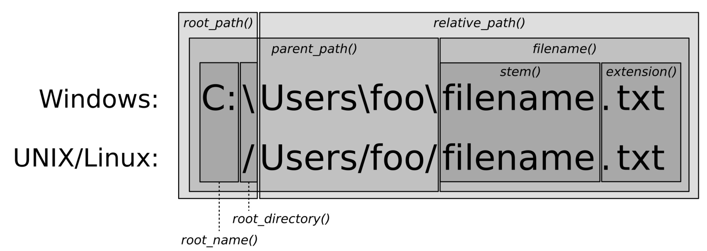

# 文件系统

有些路径是绝对路径，而有些是相对路径，有时候路径还会互相包含。`.`表示当前目录，`..`表示上级目录。然后，不同系统用来分隔目录的斜杠也不同，Linux, MacOS和各种UNIX变体操作系统上使用的是`/`，而Windows下使用的是`\`，这样就会导致文件的不同。

因为有时程序难免要实现和文件系统相关的功能，所以C++17的STL中添加了对文

## 实现标准化路径

### How to do it...

本节中，我们的程序可以从命令行参数中获得文件系统路径，并使用标准化格式进行打印：

```
#include <iostream>
#include <filesystem>

using namespace std;
using namespace filesystem;
```

主函数中，会对命令行传入的参数进行检查。如果没有传入，我们将会直接返回，并在终端上打印程序具体的使用方式。当提供了一个路径，那我们将用其对`filesystem::path`对象进行实例化：

```
int main(int argc, char *argv[])
{
    if (argc != 2) {
        cout << "Usage: " << argv[0] << " <path>\n";
        return 1;
    }

    const path dir {argv[1]};
```

实例化`path`对象之后，还不能确定这个路径是否真实存在于计算机的文件系统中。这里我们使用了`filesystem::exists`来确认路径。如果路径不存在，我们会再次返回：

```
    if (!exists(dir)) {
        cout << "Path " << dir << " does not exist.\n";
        return 1;
    }
```

Okay，如果完成了这个检查，我们就能确定这是一个正确的路径，并且将会对这个路径进行标准化，然后将其进行打印。`filesystem::canonical`将会为我们返回另一个`path`对象，可以直接对其进行打印，不过`path`的`<<`重载版本会将双引号进行打印。为了去掉双引号，我们通过`.c_str()`或`.string()`方法对路径进行打印：

```
    cout << canonical(dir).c_str() << '\n';
}
```

编译代码并运行。当我们在家目录下输入相对地址`"src"`时，程序将会打印出其绝对路径：

```
$ ./normalizer src
/Users/tfc/src
```

当我们打印一些更复杂的路径时，比如：给定路径中包含桌面文件夹的路径，`..`，还会有`Documents`文件夹，然后在到`src`文件夹。然而，程序会打印出与上次相同的地址！

```
$ ./normalizer Desktop/../Documents/../src
/Users/tfc/src
```

### How it works...

作为一个`std::filesystem`的新手，看本节的代码应该也没有什么问题。通过文件系统路径字符串初始化了一个`path`对象。`std::filesystem::path`类为文件系统库的核心，因为库中大多数函数和类与之相关。

`filesystem::exists`函数可以用来检查给定的地址是否存在。检查文件路径的原因是，`path`对象中的地址，不确定在文件系统中是否存在。`exists`能够接受一个`path`实例，如果地址存在，则返回`true`。`exists`无论是相对地址和绝对地址都能够进行判断。

最后，我们使用了`filesystem::canonical`将给定路径进行标准化。

```
path canonical(const path& p, const path& base = current_path());
```

`canonical`函数能接受一个`path`对象和一个可选的第二参数，也就是另一个地址。如果`p`路径是一个相对路径，那么`base`就是其基础路径。完成这些后，`canonical`会将`.`和`..`从路径中移除。

打印时对标准化地址使用了`.c_str()`函数，这样我们打印出来的地址前后就没有双引号了。

### There's more...

`exists` 和`canonical`函数都能抛出`bad_alloc`异常。如果我们遇到了，那程序肯定会失败。更为重要的是，当我们对路径进行标准化处理时，其他人将对应的文件重命名或删除了，则会造成更严重的问题。这样的话，即便是之前进行过检查，`canonical`还是会抛出一个`filesystem_error`异常。

大多数系统函数都会有一些重载，他们能够接受相同的参数，甚至是一个`std::error_code`引用：

```
path canonical(const path& p, const path& base = current_path());
path canonical(const path& p, error_code& ec);
path canonical(const std::filesystem::path& p,
               const std::filesystem::path& base,
               std::error_code& ec );
```

我们可以使用`try-catch`将系统函数进行包围，手动的对其抛出的异常进行处理。需要注意的是，这里只会改变系统相关错误的动作，而无法对其他进行修改。带或不带`ec`参数，更加基于异常，例如当系统没有可分配内存时，还是会抛出`bad_alloc`异常。

## 使用相对路径获取规范的文件路径

### How to do it...

```
#include <iostream>
#include <filesystem>

using namespace std;
using namespace filesystem;
```

然后，我们实例化一个`path`对象。不过这次，路径中的文件是否存在就没有那么重要了。这里有些函数，在文件不存在的时候会抛出异常。

```
int main()
{
    path p {"testdir/foobar.txt"};
```

现在我们来了解一下不同的文件系统库函数。`current_path`将返回我们执行程序的路径，也就是工作目录。`absolute`能接受一个相对地址，就像我们定义的`p`一样。`system_complete`在Linux，MacOS和类UNIX操作系统上与`absolute`的功能相同。在Windows下我们将获取一个带有盘符(比如`c:`)的绝对地址。`canonical`与`absolute`的功能相同，不过其删除了所有的`.`和`..`。我们可以使用如下的方式使用这些函数：

```
    cout << "current_path : " << current_path()
         << "\nabsolute_path : " << absolute(p)
         << "\nsystem_complete : " << system_complete(p)
         << "\ncanonical(p) : " << canonical(p)
         << '\n';
```

`path`另一个优势在于，其对`/`操作符进行了重载。通过这种方式我们可以连接文件夹和文件。让我们组合一个，然后进行打印：

```
    cout << path{"testdir"} / "foobar.txt" << '\n';
```

我们将`canonical`与合并的路径一起使用。通过给定`canonical`一个相对地址，比如`"foobar.txt"`，和一个合并的绝对地址`current_path() / "testdir"`，其将会返回给我们一个绝对地址。在另一个调用中，我们给定的路径为`p`(假设为`"testdir/foobar.txt"`)，并且通过`current_path()`获取当前位置的绝对路径，我们这里就使用`"testdir"`好了。其结果与`current_path()`相同，因为间接获得了绝对地址。在这两次调用中，`canonical`将会返回给我们相同的绝对地址：

```
cout << "canonical testdir : "
     << canonical("foobar.txt",
                 current_path() / "testdir")
     << "\ncanonical testdir 2 : "
     << canonical(p, current_path() / "testdir/..")
     << '\n';
```

我们也可以对两个非标准化的路径进行比较。`equivalence`能接受两个路径，并在内部将两个路径进行标准化，如果这两个路径相同，就会返回true，否则会返回false。这个例子中，相应的路径必须存在，否则就会抛出一个异常：

```
    cout << "equivalence: "
         << equivalent("testdir/foobar.txt",
                       "testdir/../testdir/foobar.txt")
         << '\n';
}
```

### How it works...

本节的目的就是如何快速的组成新的路径。其主要还有通过`path`类重载的`/`操作符来完成。另外，文件系统函数的相对路径和绝对路径是一致的，并且路径中包含`.`和`..`。

很多函数会返回一个转换或未转换的`path`实例。我们不会将所有函数都列在这里，如果想要了解它们，去看下C++手册是个不错的选择。

`path`类中有很多的成员函数，很值得一看。让我们来了解一下，对于一个路径来说，成员函数返回的是哪一部分。下面的图就为我们描述了在Windows和UNIX/Linux下，对应函数所返回的路径：



这样我们就能很容易的了解到，`path`的那个函数返回的是绝对地址。相对地址中，`root_path`，`root_name` 和 `root_directory`部分都空的。`relative_path`将会返回一个相对地址。

## 列出目录下的所有文件

### How to do it...

我们将实现一个很小的工具，为使用者列出对应文件夹下的所有文件。会将文件名，文件类型，大小和访问权限分别列出来。

```
#include <iostream>
#include <sstream>
#include <iomanip>
#include <numeric>
#include <algorithm>
#include <vector>
#include <filesystem>

using namespace std;
using namespace filesystem;
```

`file_info`是我们要实现的一个辅助函数。其能接受一个`directory_entry`对象的引用，并从这个路径中提取相应的信息，实例化`file_status`对象(使用`status`函数)，其会包含文件类型和权限信息。最后，如果是一个常规文件，则会提取其文件大小。对于文件夹或一些特殊的文件，我们将返回大小设置为0。所有的信息都将会封装到一个元组中：

```
static tuple<path, file_status, size_t>
file_info(const directory_entry &entry)
{
    const auto fs (status(entry));
    return {entry.path(),
            fs,
            is_regular_file(fs) ? file_size(entry.path()) : 0u};
}
```

另一个辅助函数就是`type_char`。路径不能仅表示目录和简单文本/二进制文件。操作系统提供了多种抽象类型，比如字符/块形式的硬件设备接口。STL库也提供了为此提供了很多为此函数。我们通过返回`'d'`表示文件夹，通过返回`'f'`表示普通文件等。

```
static char type_char(file_status fs)
{
    if (is_directory(fs)) { return 'd'; }
    else if (is_symlink(fs)) { return 'l'; }
    else if (is_character_file(fs)) { return 'c'; }
    else if (is_block_file(fs)) { return 'b'; }
    else if (is_fifo(fs)) { return 'p'; }
    else if (is_socket(fs)) { return 's'; }
    else if (is_other(fs)) { return 'o'; }
    else if (is_regular_file(fs)) { return 'f'; }

    return '?';
}
```

下一个辅助函数为`rwx`。其能接受一个`perms`变量(其为文件系统库的一个`enum`类)，并且会返回一个字符串，比如`rwxrwxrwx`，用来表示文件的权限设置。`"rwx"`分别为**r**ead, **w**rite和e**x**ecution，分别代表了文件的权限属性。每三个字符表示一个组，也就代表对应的组或成员，能对文件进行的操作。`rwxrwxrwx`则代表着每个人多能对这个文件进行访问和修改。`rw-r--r--`代表着所有者可以的对文件进行读取和修改，不过其他人只能对其进行读取操作。我们将这些`读取/修改/执行`所代表的字母进行组合，就能形成文件的访问权限列表。Lambda表达式可以帮助我们完成重复性的检查工作，检查`perms`变量`p`中是否包含特定的掩码位，然后返回`'-'`或正确的字符。

```
static string rwx(perms p)
{
    auto check ([p](perms bit, char c) {
        return (p & bit) == perms::none ? '-' : c;
    });
    return {check(perms::owner_read, 'r'),
            check(perms::owner_write, 'w'),
            check(perms::owner_exec, 'x'),
            check(perms::group_read, 'r'),
            check(perms::group_write, 'w'),
            check(perms::group_exec, 'x'),
            check(perms::others_read, 'r'),
            check(perms::others_write, 'w'),
            check(perms::others_exec, 'x')};
}
```

最后一个辅助函数能接受一个整型的文件大小，并将其转换为跟容易读懂的模式。将其大小除以表示的对应边界，然后使用K, M或G来表示这个文件的大小：

```
static string size_string(size_t size)
{
    stringstream ss;
    if (size >= 1000000000) {
        ss << (size / 1000000000) << 'G';
    } else if (size >= 1000000) {
        ss << (size / 1000000) << 'M';
    } else if (size >= 1000) {
        ss << (size / 1000) << 'K';
    } else { ss << size << 'B'; }

    return ss.str();
}
```

现在来实现主函数。我们会对用户在命令行输入的路径进行检查。如果没有传入，则默认为当前路径。然后，再来检查文件夹是否存在。如果不存在，就不会列出任何文件：

```
int main(int argc, char *argv[])
{
    path dir {argc > 1 ? argv[1] : "."};

    if (!exists(dir)) {
        cout << "Path " << dir << " does not exist.\n";
        return 1;
    }
```

现在，将使用文件信息元组来填充一个`vector`。实例化一个`directory_iterator`，并且将其传入`path`对象的构造函数中。并通过目录迭代器对文件进行迭代，我们将`directory_entry`对象转换成文件信息元组，然后将其插入相应的`vector`。

```
    vector<tuple<path, file_status, size_t>> items;

    transform(directory_iterator{dir}, {},
        back_inserter(items), file_info);
```

现在，将所有文件的信息都存在于`vector`之中，并且使用辅助函数将其进行打印：

```
    for (const auto &[path, status, size] : items) {
        cout << type_char(status)
             << rwx(status.permissions()) << " "
             << setw(4) << right << size_string(size)
             << " " << path.filename().c_str()
             << '\n';
    }
}
```

编译并运行程序，并通过命令行传入C++文档文件所在的地址。我们能了解到对应文件夹所包含的文件，因为文件夹下只有`'d'`和`'f'`作为输出的表示。这些文件具有不同的权限，并且都有不同的大小。需要注意的是，这些文件的显示顺序，是按照名字在字母表中的顺序排序，不过我们不依赖这个顺序，因为C++17标准不需要字母表排序：

```
$ ./list ~/Documents/cpp_reference/en/cpp
drwxrwxr-x 0B   algorithm
frw-r--r-- 88K  algorithm.html
drwxrwxr-x 0B   atomic
frw-r--r-- 35K  atomic.html
drwxrwxr-x 0B   chrono
frw-r--r-- 34K  chrono.html
frw-r--r-- 21K  comment.html
frw-r--r-- 21K  comments.html
frw-r--r-- 220K compiler_support.html
drwxrwxr-x 0B   concept
frw-r--r-- 67K  concept.html
drwxr-xr-x 0B   container
frw-r--r-- 285K container.html
drwxrwxr-x 0B   error
frw-r--r-- 52K  error.html
```

### How it works...

本节中，我们迭代了文件夹中的所有文件，并且对每个文件的状态和大小进行检查。对于每个文件的操作都非常直接和简单，我们对文件夹的遍历看起来也很魔幻。

为了对我们的文件夹进行遍历，只是对`directory_iterator`进行实例化，然后对该对象进行遍历。使用文件系统库来遍历一个文件夹是非常简单的。

```
for (const directory_entry &e : directory_iterator{dir}) {
    // do something
}
```

除了以下几点，`directory_iterator`也没有什么特别的：

- 会对文件夹中的每个文件访问一次
- 文件中元素的遍历顺序未指定
- 文件节元素中`.`和`..`都已经被过滤掉

不过，`directory_iterator`看起来是一个迭代器，并且同时具有一个可迭代的范围。为什么需要注意这个呢？对于简单的`for`循环来说，其需要一个可迭代的范围。本节例程中，我们会将其当做一个迭代器使用：

```
transform(directory_iterator{dir}, {},
         back_inserter(items), file_info);
```

实际上，就是一个迭代器类型，只不过这个类将`std::begin`和`std::end`函数进行了重载。当调用`begin`和`end`时，其会返回相应的迭代器。虽说第一眼看起来比较奇怪，但是让这个类型的确更加有用。

## 实现一个类似grep的文本搜索工具

大多数操作系统都会提供本地的搜索引擎。用户可以使用一些快捷键，对本地文件进行查找。

这种功能出现之前，命令行用户会通过`grep`或`awk`工具对文件进行查找。用户可以简单的输入`grep -r foobar .`，然后工具将会基于当前目录，进行递归的的查找，并显示包含有`"foobar"`名字的文件。

### How to do it...

我们将实现小工具，用于查找与用户提供的文本段匹配的文件。这工具与UNIX中的`grep`工具类似，不过为了简单起见，其功能没有那么强大：

```
#include <iostream>
#include <fstream>
#include <regex>
#include <vector>
#include <string>
#include <filesystem>

using namespace std;
using namespace filesystem;
```

先来实现一个辅助函数，这个函数能接受一个文件地址和一个正则表达式对象，正则表达式对象用来描述我们要查找的文本段。然后，实例化一个`vector`，用于保存匹配的文件行和其对应的内容。然后，实例化一个输入文件流对象，读取文件，并进行逐行的文本匹配。

```
static vector<pair<size_t, string>>
matches(const path &p, const regex &re)
{
    vector<pair<size_t, string>> d;
    ifstream is {p.c_str()};
```

通过`getline`函数对文件进行逐行读取，当字符串中包含有我们提供文本段，则`regex_search`返回true，如果匹配会将字符串和对应的行号保存在`vector`中。最后，我们将返回所有匹配的结果：

```
    string s;
    for (size_t line {1}; getline(is, s); ++line) {
        if (regex_search(begin(s), end(s), re)) {
            d.emplace_back(line, move(s));
        }
    }

    return d;
}
```

主函数会先对用户提供的文本段进行检查，如果这个文本段不能用，则返回错误信息：

```
int main(int argc, char *argv[])
{
    if (argc != 2) {
        cout << "Usage: " << argv[0] << " <pattern>\n";
        return 1;
    }
```

接下来，会通过输入文本创建一个正则表达式对象。如果表达式是一个非法的正则表达式，这将会导致一个异常抛出。如果触发了异常，我们将对异常进行捕获并处理：

```
    regex pattern;

    try { pattern = regex{argv[1]}; }
    catch (const regex_error &e) {
        cout << "Invalid regular expression provided.n";
        return 1;
    }
```

现在，可以对文件系统进行迭代，然后对我们提供的文本段进行匹配。使用`recursive_directory_iterator`对工作目录下的所有文件进行迭代。原理和之前章节的`directory_iterator`类似，不过会对子目录进行递归迭代。对于每个匹配的文件，我们都会调用辅助函数`matches`：

```
    for (const auto &entry :
            recursive_directory_iterator{current_path()}) {
        auto ms (matches(entry.path(), pattern));
```

如果有匹配的结果，我们将会对文件地址，对应文本行数和匹配行的内容进行打印：

```
    for (const auto &[number, content] : ms) {
        cout << entry.path().c_str() << ":" << number
             << " - " << content << '\n';
        }
    }
}
```

现在，准备一个文件`foobar.txt`，其中包含一些测试行：

```
foo
bar
baz
```

编译并运行程序，就会得到如下输出。我们在`/Users/tfc/testdir`文件夹下运行这个程序，我们先来对`bar`进行查找。在这个文件夹下，其会在`foobar.txt`的第二行和`testdir/dir1`文件夹下的另外一个文件`text1.txt`中匹配到：

````
$ ./grepper bar
/Users/tfc/testdir/dir1/text1.txt:1 - foo bar bla blubb
/Users/tfc/testdir/foobar.txt:2 - bar
````

再次运行程序，这次我们对`baz`进行查找，其会在第三行找到对应内容：

````
$ ./grepper baz
/Users/tfc/testdir/foobar.txt:3 - baz
````

### How it works...

与`directory_iterator`和`recursive_directory_iterator`迭代类似，其可以用来对子文件夹进行递归，就如其名字一样。当进入文件系统中的一个文件夹时，将会产生一个`directory_entry`实例。当递归到子文件夹时，也会产生对应的`directory_entry`实例。

`recursive_directory_iterator`具有一些有趣的成员函数：

- `depth()`代表我们需要迭代多少层子文件夹。
- `recursion_pending()`代表在进行当前迭代器后，是否会在进行对子文件夹进行迭代。
- `disable_recursion_pending()`当迭代器需要再对子文件夹进行迭代时，提前调用这个函数，则会让递归停止。
- `pop()`将会终止当前级别的迭代，并返回上一级目录。

### There's more...

我们需要了解的另一个就是`directory_options`枚举类。`recursive_directory_iterator`能将`directory_options`的实例作为其构造函数的第二个参数，通常将`directory_options::none`作为默认值传入。其他值为：

- `follow_directory_symlink`能允许对符号链接的文件夹进行递归迭代。
- `skip_permission_denied`这会告诉迭代器，是否跳过由于权限错误而无法访问的目录。

这两个选项可以通过`|`进行组合。

## 实现一个自动文件重命名器

本节中，我们将试下一个类似的工具，叫做`renamer`。其能接受一些列输入文本段，作为其替代，类似如下的方式：

```
$ renamer jpeg jpg JPEG jpg
```

本节中，重命名器将会对当前目录进行递归，然后找到文件后缀为`jpeg`和`JPEG`的所有文件，并将这些文件的后缀统一为`jpg`。

### How to do it...

我们将实现一个工具，通过对文件夹的递归对于所有文件名匹配的文件进行重命名。所有匹配到的文件，都会使用用户提供的文本段进行替换。

```
#include <iostream>
#include <regex>
#include <vector>
#include <filesystem>

using namespace std;
using namespace filesystem;
```

我们将实现一个简单的辅助函数，其能接受一个使用字符串表示的输入文件地址和一组替换对。每一个替换对都有一个文本段和其要替换文本段。对替换范围进行循环时，我们使用了`regex_replace`用于对输入字符串进行匹配，然后返回转换后的字符串。之后，我们将返回结果字符串。

```
template <typename T>
static string replace(string s, const T &replacements)
{
    for (const auto &[pattern, repl] : replacements) {
        s = regex_replace(s, pattern, repl);
    }

    return s;
}
```

主函数中，我们首先对命令行的正确性进行检查。可以成对的接受命令行参数，因为我们想要匹配段和替换段相对应。`argv`的第一个元素为执行文件的名字。当用户提供了成对的匹配段和替换段时，`argc`肯定是大于3的奇数：

```
int main(int argc, char *argv[])
{
    if (argc < 3 || argc % 2 != 1) {
        cout << "Usage: " << argv[0]
             << " <pattern> <replacement> ...\n";
        return 1;
    }
```

我们对输入对进行检查时，会将对应的`vector`进行填充：

```
    vector<pair<regex, string>> patterns;

    for (int i {1}; i < argc; i += 2) {
        patterns.emplace_back(argv[i], argv[i + 1]);
    }
```

现在，可以对整个文件系统进行遍历。简单起见，将当前目录作为遍历的默认起始地址。对于每一个文件夹入口，我们将其原始路径命名为`opath`。然后，只在没有剩余路径的情况下使用文件名，并根据之前创建的匹配列表，对对应的匹配段进行替换。我们将拷贝`opath`到`rpath`中，并且将文件名进行替换。

```
    for (const auto &entry :
            recursive_directory_iterator{current_path()}) {
                    path opath {entry.path()};
                string rname {replace(opath.filename().string(),
                patterns)};

        path rpath {opath};
        rpath.replace_filename(rname);
```

对于匹配的文件，我们将打印其重命名后的名字。当重命名后的文件存在，我们将不会对其进行处理。会跳过这个文件。当然，我们也可以添加一些数字或其他字符到地址中，从而解决这个问题：

```
        if (opath != rpath) {
            cout << opath.c_str() << " --> "
                << rpath.filename().c_str() << '\n';
            if (exists(rpath)) {
                cout << "Error: Can't rename."
                    " Destination file exists.\n";
            } else {
                rename(opath, rpath);
            }
        }
    }
}
```

编译并运行程序，我们将会得到如下的输出。我的文件夹下面有一些JPEG文件，但是都是以不同的后缀名结尾，有`jpg`，`jpeg`和`JPEG`。然后，执行程序将`jpeg`和`JPEG`替换成`jpg`。这样，就可以对文件名进行统一化。

## 实现一个磁盘使用统计器

### How to do it...

我们将会实现一个程序用于迭代目录中的所有文件，并将所有文件的大小进行统计。对于统计一个文件的大小就很简单，但是要统计一个文件夹的大小，就需要将文件夹下的所有文件的大小进行相加。

```
#include <iostream>
#include <sstream>
#include <iomanip>
#include <numeric>
#include <filesystem>

using namespace std;
using namespace filesystem;
```

我们将实现一个辅助函数使用`directory_entry`对象作为其参数，然后返回其在文件系统中对应的大小。如果传入的不是一个文件夹地址，将通过`file_size`获得文件的大小。

```
static size_t entry_size(const directory_entry &entry)
{
    if (!is_directory(entry)) { return file_size(entry); }
```

如果传入的是一个文件夹，需要对其中所有元素进行文件大小的计算。需要调用辅助函数`entry_size`对子文件夹进行再次递归：

```
    return accumulate(directory_iterator{entry}, {}, 0u,
        [](size_t accum, const directory_entry &e) {
            return accum + entry_size(e);
        });
}
```

为了具有更好的可读性，本节使用了其他章节中的`size_string`函数。

```
static string size_string(size_t size)
{
    stringstream ss;
    if (size >= 1000000000) {
        ss << (size / 1000000000) << 'G';
    } else if (size >= 1000000) {
        ss << (size / 1000000) << 'M';
    } else if (size >= 1000) {
        ss << (size / 1000) << 'K';
    } else { ss << size << 'B'; }

    return ss.str();
}
```

主函数中，首先就是要检查用户通过命令行提供的文件系统路径。如果没有提供，则默认为当前文件夹。处理之前，我们会检查路径是否存在。

```
int main(int argc, char *argv[])
{
    path dir {argc > 1 ? argv[1] : "."};

    if (!exists(dir)) {
    cout << "Path " << dir << " does not exist.\n";
        return 1;
    }
```

现在，我们可以对所有的文件夹进行迭代，然后打印其名字和大小：

```
    for (const auto &entry : directory_iterator{dir}) {
        cout << setw(5) << right
             << size_string(entry_size(entry))
             << " " << entry.path().filename().c_str()
             << '\n';
    }
}
```

### How it works...

整个程序通过`file_size`对普通的文件进行大小的统计。当程序遇到一个文件夹，其将会对子文件夹进行递归，然后通过`file_size`计算出文件夹中包含所有文件的大小。

有件事我们需要区别一下，当我们直接调用`file_size`时，或需要进行递归时，需要通过`is_directory`谓词进行判断。这对于只包含有普通文件和文件夹的文件夹是有用的。

与我们的简单程序一样，程序会在如下的情况下崩溃，因为有未处理的异常抛出：

- `file_size`只能对普通文件和符号链接有效。否则，会抛出异常。
- `file_size`对符号链接有效，如果链接失效，函数还是会抛出异常。

为了让本节的程序更加成熟，我们需要更多的防御性编程，避免遇到错误的文件和手动处理异常。

## 计算文件类型的统计信息

本节中，我们将递归的对文件夹中的文件名后缀进行统计。这样对每种文件类型的文件进行个数统计，并且计算每种文件类型大小的平均值。

### How to do it...

```
#include <iostream>
#include <sstream>
#include <iomanip>
#include <map>
#include <filesystem>

using namespace std;
using namespace filesystem;
```

`size_string`函数已经在上一节中使用过了。这里我们继续使用：

```
static string size_string(size_t size)
{
    stringstream ss;
    if (size >= 1000000000) {
        ss << (size / 1000000000) << 'G';
    } else if (size >= 1000000) {
        ss << (size / 1000000) << 'M';
    } else if (size >= 1000) {
        ss << (size / 1000) << 'K';
    } else { ss << size << 'B'; }

    return ss.str();
}
```

然后，实现一个函数用于接受一个`path`对象，并对该路径下的所有文件进行遍历。我们使用一个`map`来收集所有的信息，用对应的扩展名与总体数量和所有文件的总大小进行统计：

```
static map<string, pair<size_t, size_t>> ext_stats(const path &dir)
{
    map<string, pair<size_t, size_t>> m;

    for (const auto &entry :
        recursive_directory_iterator{dir}) {
```

如果目录入口是一个目录，我们将跳过这个入口。跳过的意思就是不会对这个目录进行递归操作。`recursive_directory_iterator`可以完成这个工作，但是不需要去查找所有文件夹中的文件。

```
        const path p {entry.path()};
        const file_status fs {status(p)};

        if (is_directory(fs)) { continue; }
```

接下来，会对文件的扩展名进行提取。如果文件没有扩展名，就会对其进行忽略：

```
        const string ext {p.extension().string()};

        if (ext.length() == 0) { continue; }
```

接着，计算我们查找到文件的总体大小。然后，将会对`map`中同一扩展的对象进行聚合。如果对应类型还不存在，创建起来也很容易。我们可以简单的对文件计数进行增加，并且对扩展总体大小进行累加：

```
        const size_t size {file_size(p)};

        auto &[size_accum, count] = m[ext];

        size_accum += size;
        count += 1;
    }
    
    return m;
}
```

主函数中，我们会从用户提供的路径中获取对应的路径，或是使用当前路径。当然，需要对地址是否存在进行检查，否则继续下去就没有任何意义：

```
int main(int argc, char *argv[])
{
    path dir {argc > 1 ? argv[1] : "."};

    if (!exists(dir)) {
        cout << "Path " << dir << " does not exist.\n";
        return 1;
    }
```

可以对`ext_stats`进行遍历。因为`map`中的`accum_size`元素包含有同类型扩展文件的总大小，然后用其除以总数量，以计算出平均值：

```
    for (const auto &[ext, stats] : ext_stats(dir)) {
        const auto &[accum_size, count] = stats;

        cout << setw(15) << left << ext << ": "
             << setw(4) << right << count
             << " items, avg size "
             << setw(4) << size_string(accum_size / count)
             << '\n';
    }
}
```


