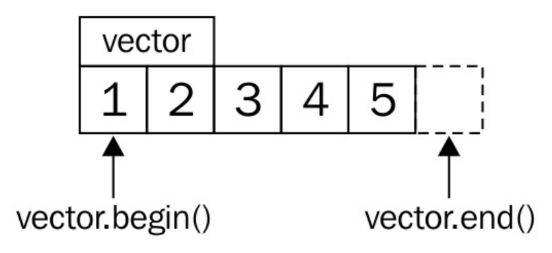

# 迭代器

大多数容器类(除了类似C风格的数组)，可包含一系列的数据项。许多日常任务会处理超大的数据量，这里先不关心如何获得这些数据。不过，如果我们考虑数组和链表，并且想要计算这两种结构所有项的和，那么将如下使用两种不同的算法： 

通过查询数组的大小，来进行加和计算：

```
int sum {0};
for (size_t i {0}; i < array_size; ++i) { sum += array[i]; }
```

使用迭代器进行循环，直到数组的末尾：

```
int sum {0};
while (list_node != nullptr) {
    sum += list_node->value; list_node = list_node->next;
}
```

使用迭代器的代码才更加的通用：

```
int sum {0};
for (int i : array_or_vector_or_map_or_list) { sum += i; }
```

这段代码很简洁，只是使用C++11添加的for循环范围特性就完成了整体的叠加。其就像是个语法糖，将其扩展后类似如下代码：

```
{
    auto && __range = array_or_vector_or_map_or_list ;
    auto __begin = std::begin(__range);
    auto __end = std::end(__range);
    for ( ; __begin != __end; ++__begin) {
        int i = *__begin;
        sum += i;
    }
}
```



`std::begin(vector)`和`vector.begin()`等价，并且返回`vector`中指向第一个元素的迭代器(指向1)。`std::end(vector)`与`vector.end()`等价，并返回指向`vector`末尾元素的迭代器(指向5的后方)。

每一次迭代，循环都会检查开始迭代器是否与末尾迭代器不同。如果是，那么可以对开始迭代器进行解引用，并获取其指向的值。然后，推动迭代器指向下一个元素，再与末尾迭代器进行比较，以此类推。这也能提升代码的可读性，这样的迭代器就类似于C风格的指针。实际上，C风格的指针也是一种迭代器。

## 迭代器的类型

C++ 中很多迭代器类型，都有各自的局限性。不用去死记这些限制，只要记住一种类型的能力是从更强大的类型继承过来的即可。当知道算法是使用何种迭代器实现时，编译器就可以以更好的方式优化这个算法。所以，开发者只要表达清楚自己想要实现的算法，那么编译器将选择优化后的实现来完成对应的任务。


### 输入迭代器

只能用来读取指向的值。当该迭代器自加时，之前指向的值就不可访问。也就是说，不能使用这个迭代器在一个范围内遍历多次。`std::istream_iterator`就是这样的迭代器。

### 前向迭代器

类似于输入迭代器，不过其可以在指示范围内迭代多次。`std::forward_list`就是这样的迭代器。就像一个单向链表一样，只能向前遍历，不能向后遍历，但可以反复迭代。

### 双向迭代器

从名字就能看出来，这个迭代器可以自增，也可以自减，迭代器可以向前或向后迭代。`std::list`，`std::set`和`std::map`都支持双向迭代器。

### 随机访问迭代器

与其他迭代器不同，随机访问迭代器一次可以跳转到任何容器中的元素上，而非之前的迭代器，一次只能移动一格。`std::vector`和`std::deque`的迭代器就是这种类型。

### 连续迭代器

这种迭代器具有前述几种迭代器的所有特性，不过需要容器内容在内存上是连续的，类似一个数组或`std::vector`。

### 输出迭代器

该迭代器与其他迭代器不同。因为这是一个单纯用于写出的迭代器，其只能增加，并且将对应内容写入文件当中。如果要读取这个迭代中的数据，那么读取到的值就是未定义的。

### 可变迭代器

如果一个迭代器既有输出迭代器的特性，又有其他迭代器的特性，那么这个迭代器就是可变迭代器。该迭代器可读可写。如果我们从一个非常量容器的实例中获取一个迭代器，那么这个迭代器通常都是可变迭代器。

## 建立可迭代区域

### How to do it...

```
#include <iostream>

class num_iterator {
	int i;
public:
    explicit num_iterator(int position = 0) : i{position} {}
    int operator*() const { return i; }
    
    num_iterator& operator++() {
        ++i;
        return *this;
    }
    
    int operator*() const { return i; }
    
    num_iterator& operator++() {
        ++i;
        return *this;
    }
    
    bool operator!=(const num_iterator &other) const {
        return i != other.i;
    }
};   
```

迭代器类就实现完成了。我们仍需要一个中间对象对应于`for (int i : intermediate(a, b)) {...}`写法，其会从头到尾的遍历，其为一种从a到b遍历的预编程。我们称其为`num_range`:

### How it works...

考虑一下如下的代码段：

```
for (auto x : range) { code_block; }
```

这段代码将被编译器翻译为类似如下的代码：

```
{
    auto __begin = std::begin(range);
    auto __end = std::end(range);
    for ( ; __begin != __end; ++__begin) {
        auto x = *__begin;
        code_block
    }
}
```

这样看起来就直观许多，也能清楚的了解我们的迭代器需要实现如下操作：

- operator!=
- operatpr++
- operator*

也需要`begin`和`end`方法返回相应的迭代器，用来确定开始和结束的范围。

使用`std::begin(x)`替代`x.begin()`。如果有`begin`成员函数，那么`std::begin(x)`会自动调用`x.begin()`。当`x`是一个数组，没有`begin()`方法时，`std::begin(x)`会找到其他方式来处理。同样的方式也适用于`std::end(x)`。当用户自定义的类型不提供`begin/end`成员函数时，`std::begin/std::end`就无法工作了。

## 让自己的迭代器与STL的迭代器兼容

### How to do it...

```
#include <iostream>
#include <algorithm>

using namespace std;
```

实现一个计数迭代器，作为基础版本。当我们使用其进行遍历时，我们只需要增加计数器即可。`num_range`用来处理`begin`和`end`迭代器。

```
class num_iterator
{
    int i;
public:
    explicit num_iterator(int position = 0) : i{position} {}
    int operator*() const { return i; }
    num_iterator& operator++() {
        ++i;
        return *this;
    }
    bool operator!=(const num_iterator &other) const {
        return i != other.i;
    }
    bool operator==(const num_iterator &other) const {
        return !(*this != other);
    }
};

class num_range {
    int a;
    int b;
public:    
    num_range(int from, int to)
        : a{from}, b{to}
    {}
    num_iterator begin() const { return num_iterator{a}; }
    num_iterator end() const { return num_iterator{b}; }
};
```

现在让我们来遍历100到109间的数字。这里需要注意的是，110这里是开区间，所以值无法遍历到110。

```
int main()
{
    num_range r {100, 110};
```

使用一个STL算法`std::minmax_element`。这个算法会返回一个`std::pair`，其具有两个迭代器：一个指向最小值的迭代器和一个指向最大值的迭代器。在这个范围中100和109即为这两个迭代器所指向的位置。

```
    auto min_max(minmax_element(r.begin(), r.end()));
    cout << *min_max.first << " - " << *min_max.second << '\n';
}
```

### How it works...

一些STL算法需要知道其处理容器的迭代器类型，有些还需要知道迭代器所指向的类型。这就是要有不同实现的原因。

不过，所有STL算法将会通过`std::iterator_traits<my_iterator>`访问对应类型的迭代器(这里假设迭代器类型为my_iterator)。这个特性类需要包含五种不同类型的成员定义：

- difference_type: `it1- it2`结果的类型
- value_type: 迭代器解引用的数据的类型(这里需要注意void类型)
- pointer: 指向元素指针的类型
- reference: 引用元素的类型
- iterator_category: 迭代器属于哪种类型

pointer、reference和difference_type并没有在num_iterator中定义，因为其实际的内存值不重复(我们只是返回int值，不想数组一样是连续的)。因此num_iterator并不需要定义这些类型，因为算法是依赖于解引用后指定内存上的值。如果我们的迭代器定义了这些类型，就可能会出现问题。

### There's more...

C++17标准之前，C++都鼓励自定义迭代器继承于`std::iterator<...>`，这样所有主流的类型都会自动定义。C++17中这条建议仍然能工作，但是不再推荐从`std::iterator<...>`继承了。

## 使用迭代适配器填充通用数据结构

不同数据结构间的数据传递现在可以只通过一行代码就完成，这要感谢STL中的**迭代适配器**。

### How to do it...

```
#include <iostream>
#include <string>
#include <iterator>
#include <sstream>
#include <deque>

using namespace std;
```

开始使用`std::istream_iterator`。这里我们特化为`int`类型。这样，迭代器就能将标准输入解析成整数。例如，当我们遍历这个迭代器，其就和`std::vector<int>`一样了。`end`迭代器的类型没有变化，但不需要构造参数:

```
int main()
{
    istream_iterator<int> it_cin {cin};
    istream_iterator<int> end_cin;
```

接下来，我们实例化一个`std::deque<int>`，并且将标准输入中的所有数字拷贝到队列中。队列本身不是一个迭代器，所以我们使用`std::back_inserter`辅助函数将队列包装入`std::back_insert_iterator`中。这样指定的迭代器就能执行`v.pack_back(item)`，将标准输入中的每个元素放入容器中。这样就能让队列自动增长。

```
deque<int> v;
copy(it_cin, end_cin, back_inserter(v));
```

接下来，我们使用`std::istringstream`将元素拷贝到队列中部。先使用字符串，来定义一个字符流的实例：

```
istringstream sstr {"123 456 789"};
```

我们需要选择列表的插入点。这个点必须在中间，我们使用队列的起始指针，然后使用`std::next`函数将其指向中间位置。函数第二个参数的意思就是让指针前进多少，这里选择`v.size() / 2`步，也就是队列的正中间位置(这里我们将`v.size()`强转为`int`类型，因为`std::next`第二个参数类型为`difference_type`，是和第一个迭代器参数间的距离。因此，该类型是个有符号类型。

```
auto deque_middle (next(begin(v),static_cast<int>(v.size()) / 2));
```

现在，我们可以从输入流中一步步的拷贝整数到队列当中。另外，流的`end`包装迭代器为空的`std::istream_iterator<int>`。这个队列已经被包装到一个插入包装器中，也就是成为`std::insert_iterator`的一个实例，其指向队列中间位置的迭代器，我们用`deque_middle`表示:

```
copy(istream_iterator<int>{sstr}, {}, inserter(v, deque_middle));
```

现在，让我们使用`std::front_insert_iterator`插入一些元素到队列中部：

```
initializer_list<int> il2 {-1, -2, -3};
copy(begin(il2), end(il2), front_inserter(v));
```

最后一步将队列中的全部内容打印出来。`std::ostream_iterator`作为输出迭代器，在我们的例子中其就是从`std::cout`拷贝打印出的信息，并将各个元素使用逗号隔开：

```
    copy(begin(v), end(v), ostream_iterator<int>{cout, ", "});
    cout << '\n';
}
```

### How it works...

#### std::back_insert_iterator

`back_insert_iterator`可以包装`std::vector`、`std::deque`、`std::list`等容器。其会调用容器的`push_back`方法在容器最后插入相应的元素。如果容器实例不够长，那么容器的容量会自动增长。

#### std::front_insert_iterator

`front_insert_iterator`和`back_insert_iterator`一样，不过`front_insert_iterator`调用的是容器的`push_front`函数，也就是在所有元素前插入元素。这里需要注意的是，当对类似于`std::vector`的容器进行插入时，其已经存在的所有元素都要后移，从而空出位置来放插入元素，这会对性能造成一定程度的影响。

#### std::insert_iterator

这个适配器与其他插入适配器类似，不过能在容器的中间位置插入新元素。使用`std::inserter`包装辅助函数需要两个参数。第一个参数是容器的实例，第二个参数是迭代器指向的位置，就是新元素插入的位置。

#### std::istream_iterator

`istream_iterator`是另一种十分方便的适配器。其能对任何`std::istream`使用(文件流或标准输入流)，并且可以根据实例的具体特化类型，对流进行分析。本节中，我们使用了`std::istram_iterator<int>(std::cin)`，其会将整数从标准输入中拉出来。

通常，对于流来说，其长度我们是不知道的。这就存在一个问题，也就是`end`迭代器指向的位置在哪里？对于流迭代器来说，它就知道相应的`end`迭代器的位置。这样就使得迭代器的比较更加高效，不需要通过遍历来完成。这样就是为什么`end`流迭代器不需要传入任何参数的原因。

#### std::ostream_iterator

`ostream_iterator`和`istream_iterator`类似，不过是用来进行输出的流迭代器。与`istream_iterator`不同在于，构造时需要传入两个参数，且第二个参数必须要是一个字符串，这个字符串将会在各个元素之后，推入输出流中。这样我们就能很容易的在元素中间插入逗号或者换行的符号，以便用户进行观察。

## 使用迭代器实现算法

我们要实现一个函数，可以输出斐波那契第n个数的值。通常我们都会使用函数迭代，或者是循环来实现这个函数。这样的话，我们只能一个个的将相应的值算出来，然后才能计算出下一个值。这里我们有两个选择——递归调用斐波那契函数计算整个数列，这样很浪费计算时间，或者将最后两个斐波那契数作为临时变量，并用它们来计算下一个数。第二种方法我们需要重新实现斐波那契算法循环。这样我们就可以将斐波那契数列计算的代码和我们实际的代码放在一起：

```
size_ta{0};
size_tb{1};
for(size_ti{0};i< N;++i){
    constsize_told_b{b};
    b+=a;
    a=old_b;
    // do something with b, which is the current fibonacci number
}
```

### How to do it...

```
#include <iostream>
```

我们调用斐波那契迭代器——`fibit`。其会指向一个值`i`，其保存的值为斐波那契数列对应的位置，`a`和`b`保存斐波那契数列中最后两个值。实例化迭代器时，需要将斐波那契迭代器初始化为`F(0)`的值：

```
class fibit
{
    size_t i {0};
    size_t a {0};
    size_t b {1};
    
    public:
    fibit() = default;
    explicit fibit(size_t i_)
        : i{i_}
    {}
   
   size_t operator*() const { return b; }
   
   bool operator!=(const fibit &o) const { return i != o.i; }
};
```

当使用循环时，增加后的迭代器将会和`end`迭代器进行比较，所以这里需要为迭代器实现不等于`!=`操作符。我们只比较当且迭代器所对应的步数，这比循环1000000次再结束迭代器简单许多，这样我们就不需要计算太多的斐波那契数：

为了能让斐波那契迭代器适应`for`循环的范围写法，我们需要实现一个范围类。我们称这个类为`fib_range`，其构造函数只需要一个参数，这个参数能够告诉我们我们想要遍历的范围：

```
class fib_range
{
    size_t end_n;
public:
    fib_range(size_t end_n_)
        : end_n{end_n_}
    {}
  
   fibit begin() const { return fibit{}; }
   fibit end() const { return fibit{end_n}; }
};
```

`begin`和`end`函数将会返回对应位置上的迭代器，也就是`F(0)`和`F(end_n)`对应的迭代器。

好了，其他与迭代器相关的代码我们就不管了。因为我们辅助类就能很好的帮助我们将这些细节的东西隐藏掉！让我们打印10个斐波那契数字：

```
int main()
{
    for (size_t i : fib_range(10)) {
           std::cout << i << ", ";
    }
    std::cout << '\n';
}
```

### There's more...

为了保证例子的简洁性，我们并没有对其做任何事情，不过要是作为斐波那契迭代器的发布库的话，其可用性还是比较差的——`fibit`传入一个参数的构造函数，可以直接使用`end`迭代器替换，因为`fibit`并没有包含任何一个合法的斐波那契值，这里的库并不强制使用这种方式。

还有些方面需要进行修复：

- 将`fibit(size_t i_)`声明为私有构造函数，并在`fibit`类中将`fib_range`类声明为一个友元类。这样用户就只能使用正确的方式进行迭代了。
- 可以使用迭代器哨兵，避免用户引用`end`迭代器。

## 使用反向迭代适配器进行迭代

STL中提供了反向迭代适配器，其能帮助我们对迭代器进行包装。

### How to do it...

```
#include <iostream>
#include <list>
#include <iterator>

using namespace std;

int main()
{
    list<int> l {1, 2, 3, 4, 5};
        copy(l.rbegin(), l.rend(), ostream_iterator<int>{cout, ", "});
    cout << '\n';
```

如果容器不提供`rbegin`和`rend`函数的话，就需要使用双向迭代器来帮忙了，这里可以使用工厂函数`std::make_reverse_iterator`创建双向迭代器。其能接受普通迭代器，然后将其转换为反向迭代器：

```
    copy(make_reverse_iterator(end(l)),
        make_reverse_iterator(begin(l)),
        ostream_iterator<int>{cout, ", "});
    cout << '\n';
}
```

### How it works...

为了将一个普通迭代器转换为一个反向迭代器，容器至少要支持双向迭代。这就需要双向类别或更高级的迭代器才能满足条件。

反向迭代器是普通迭代器的一种，并且连接口和普通迭代器都一样，不过其累加操作会被当做递减操作来进行。


当我们想让我们自定义的容器类支持反向迭代，我们不用将所有细节一 一实现；我们只需使用`std::make_reverse_iterator`工厂函数，将普通的迭代器包装成反向迭代器即可，背后的操作STL会帮我们完成。

## 使用哨兵终止迭代

对于STL算法和基于范围的for循环来说，都会假设迭代的位置是提前知道的。在有些情况下，并不是这样，我们在迭代器到达末尾之前，我们是很难确定结束的位置在哪里。

这里使用C风格的字符串来举例，我们在编译时无法知道字符串的长度，只能在运行时使用某种方法进行判断。字符串遍历的代码如下所示：

```
for (const char *c_ponter = some_c_string; *c_pointer != '\0'; ++c_pointer) {
    const char c = *c_pointer;
    // do something with c
}
```

对于基于范围的for循环来说，我们可以将这段字符串包装进一个`std::string`实例中，`std::string`提供`begin()`和`end()`函数：

```
for (char c : std::string(some_c_string)) { /* do something with c */ }
```

不过，`std::string`在构造的时候也需要对整个字符串进行遍历。C++17中加入了`std::string_view`，但在构造的时候也会对字符串进行一次遍历。对于比较短的字符串来说这是没有必要的，不过对于其他类型来说就很有必要。`std::istream_iterator`可以用来从`std::cin`捕获输入，当用户持续输入的时候，其`end`迭代器并不能指向输入字符串真实的末尾。

C++17添加了一项新的特性，其不需要`begin`迭代器和`end`迭代器是同一类型的迭代器。

### How to do it...

```
#include <iostream>
```

迭代器哨兵是本节的核心内容。奇怪的是，它的定义完全是空的。

```
class cstring_iterator_sentinel {};
```

我们先来实现迭代器。其包含一个字符串指针，指针指向的容器就是我们要迭代的：

```
class cstring_iterator {
    const char *s {nullptr};
    public:
    explicit cstring_iterator(const char *str)
        : s{str}
    {}
    
 	char operator*() const { return *s; }
 	
 	cstring_iterator& operator++() {
        ++s;
        return *this;
    }
    
    bool operator!=(const cstring_iterator_sentinel) const {
        return s != nullptr && *s != '\0';
    }
};
```

为了使用基于范围的`for`循环，我们需要一个范围类，用来指定`begin`和`end`迭代器：

```
class cstring_range {
    const char *s {nullptr};
```

实例化时用户只需要提供需要迭代的字符串：

```
public:
    cstring_range(const char *str)
        : s{str}
    {}
```

`begin()`函数将返回一个`cstring_iterator`迭代器，其指向了字符串的起始位置。`end()`函数会返回一个哨兵类型。需要注意的是，如果不使用哨兵类型，这里将返回一个迭代器，这个迭代器要指向字符串的末尾，但是我们无法预知字符串的末尾在哪里。

```
   cstring_iterator begin() const {
          return cstring_iterator{s};
   }
   cstring_iterator_sentinel end() const {
       return {};
   }
};
```

为了让使用者给我们一些输入，我们的例子会判断是否有输入参数。

```
int main(int argc, char *argv[])
{
    if (argc < 2) {
        std::cout << "Please provide one parameter.\n";
        return 1;
    }
    
    for (char c : cstring_range(argv[1])) {
        std::cout << c;
    }
    std::cout << '\n';
}
```

## 使用检查过的迭代器自动化检查迭代器代码

迭代器很有用，能提供一般化的接口供用户使用。不过，迭代器经常被当做指针误用。当指针指向一个非法的内存位置时，不能进行解引用。这对迭代器也适用，不过有大量的条件来界定迭代器指向的位置是否合法。这些可以通过看一下STL文档就能了解到，但是还会写出很容易出现bug的代码。

最好的情况是，这些问题没有在客户的机器上出现，而是开发者测试这些程序时就能暴露出来。不过，通常即使是解引用了悬垂指针和错误的迭代器，代码也不会报错。这种情况是最糟的，因为这种未定义行为的代码，没法确定会发生什么。

### How to do it...

```
#include <iostream>
#include <vector>
```

首先实例化一个整型类`vector`，并且让指针指向值1。我们使用`shrink_to_fit()`将`vector`的容积设置为3，多分配的内存是不必要的，小一点的存储空间会让迭代速度更快：

```
int main()
{
    std::vector<int> v {1, 2, 3};
    v.shrink_to_fit();
    const auto it (std::begin(v));
    std::cout << *it << '\n';
```

接下来，让我们向`vector`中增加一个新数。这样`vector`的长度就不够再放下另外一个数，这里`vector`会自动增加其长度。通过分配一个新的更大的内存块来实现长度的增加，会将所有现存的项移到新的块，然后删除旧的内存块。

```
v.push_back(123);
```

现在，让我们再次通过迭代器从1开始打印`vector`。这就坏了。为什么呢？因为在`vector`自增的过程中，会分配新的内存，删除旧的内存，但是迭代器却不知道这个改变。这就意味着，迭代器将会指向旧地址，并且我们不知道这样做会怎样。

```
    std::cout << *it << '\n'; // bad bad bad!
}
```

编译变这个程序并运行，我们不会看到任何错误，不过迭代器解引用所打印出来的数字看上去像是随机数。看上去没有问题，反而最有问题。如果不指出来，可能没人会发现问题。

GUN STL支持一种预处理宏`_GLIBCXX_DEBUG`，其会激活STL中对健壮性检查的代码。这会让程序变慢，不过更容易找到Bug。我们可以通过`-D_GLIBCXX_DEBUG`编译选项来启用这些代码，或者在代码的最开始加上这个宏。如你所见，其输出相关的错误信息，并关闭了应用的进程。Microsoft Visual C++ 编译器可以通过`/D_ITERATOR_DEBUG_LEVEL=1`启用检查。

LLVM/clang实现的STL也有调试标识，其目的是为了调试STL代码，而非用户的代码。对于用户的代码的调试，我们会使用不同的选项来调试。向clang编译器传入`-fsanitize=address -fsanitize=undefined`，可以看看会发生什么。

### How it works...

我们不需要通过修改任何代码，只需要通过为编译器添加一些编译器特性就能容易的找到代码中的Bug。

这些特性由调试器实现。一个调试器通常由一个编译器模块和一个运行时库组成。当调试器被激活时，编译器将会添加额外的信息到我们的代码中，然后形成二进制可执行文件。在运行时，调试器库由二进制文件自己去链接，例如：对应库实现会代替`malloc`和`free`函数，来分析程序到底想要多少内存。

调试器可以检测不同类型的Bug。这里只列举出一些常用的类型：

- **越界访问**: 当我们访问类似数组和`vector`类型的数据结构时，判别我们访问的位置是否在合法范围内。
- **释放后使用**: 当我们释放了堆上分配的指针后，再使用这个指针，则会出发这个Bug。
- **整数溢出**: 不同的机器上整数表达的范围可能是不同的，所以就会出现一些值使用整型无法进行表示。对于有符号整型，算法通常会出发一个未定义的行为。
- **指针对齐**: 一些架构中，需要指针以某种形式进行对齐，否则无法访问对应的地址。

### There's more...

对于不同类型的Bug，调试器的种类也是多种多样，并且还有很多调试器还在开发中。我们可以上网了解更多的信息，以便我们自己去调试程序。GCC和LLVM网站首页就列举了很多调试器，可以从在线文档中了解其调试能力。

- https://gcc.gnu.org/onlinedocs/gcc/Instrumentation-Options.html

- http://clang.llvm.org/docs/index.html 

## 构建zip迭代适配器

这里用向量点乘为例，使用函数式方法优雅地实现这个功能。给定两个向量，然后让对应位置上的两个数字相乘，然后将所有数字加在一起。也就是`(a, b, c) * (d, e, f)`的结果为`(a * e + b * e + c * f)`。我们在C和C++也能完成这样的操作。代码可能类似如下的方式：

```
std::vector<double> a {1.0, 2.0, 3.0};
std::vector<double> b {4.0, 5.0, 6.0};
double sum {0};
for (size_t i {0}; i < a.size(); ++i) {
    sum += a[i] * b[i];
}
// sum = 32.0
```

STL提供了相应的函数实现`std::inner_product`，也能在一行之内完成向量点积。不过，其他语言中在没有相应的库对某种操作进行支持的情况下，也能做到在一行之内完成。

假设我们有两个向量a和b，变换后将两个向量混合在一起。例如：`[a1, a2, a3]`和`[b1, b2, b3]`，使用zip函数处理的结果为`[(a1, b1), (a2, b2), (a3, b3)]`。让我们仔细观察这个例子，就是将两个向量连接在了一起。

现在，关联的数字可以直接进行乘法，然后累加在一起。

### How to do it...

```
#include <iostream>
#include <vector>
#include <numeric>

class zip_iterator {
    using it_type = std::vector<double>::iterator;

    it_type it1;
    it_type it2;
    
   public:
    zip_iterator(it_type iterator1, it_type iterator2)
        : it1{iterator1}, it2{iterator2}
    {} 
    
     zip_iterator& operator++() {
        ++it1;
        ++it2;
        return *this;
    }
```

如果zip中的两个迭代器来自不同的容器，那么他们一定不相等。通常，这里会用逻辑或(||)替换逻辑与(&&)，但是这里我们需要考虑两个容器长度不一样的情况。这样的话，我们需要在比较的时候同时匹配两个容器。这样，我们就能遍历完其中一个容器时，及时停下循环：

```
    bool operator!=(const zip_iterator& o) const {
        return it1 != o.it1 && it2 != o.it2;
    }
```

逻辑等操作符可以使用逻辑不等的操作符的实现，是需要将结果取反即可：

```
    bool operator==(const zip_iterator& o) const {
        return !operator!=(o);
    }
```

解引用操作符用来访问两个迭代器指向的值：

```
    std::pair<double, double> operator*() const {
        return {*it1, *it2};
    }
};
```

迭代器算是实现完了。我们需要让迭代器兼容STL算法，所以我们对标准模板进行了特化。这里将迭代器定义为一个前向迭代器，并且解引用后返回的是一对`double`值。虽然，本节我们没有使用`difference_type`，但是对于不同编译器实现的STL可能就需要这个类型：

```
namespace std {
template <>
struct iterator_traits<zip_iterator> {
    using iterator_category = std::forward_iterator_tag;
    using value_type = std::pair<double, double>;
    using difference_type = long int;
};
}
```

现在来定义范围类，其`begin`和`end`函数返回`zip`迭代器：

```
class zipper {
    using vec_type = std::vector<double>;
    vec_type &vec1;
    vec_type &vec2;
```

这里需要从zip迭代器中解引用两个容器中的值：

```
public:
    zipper(vec_type &va, vec_type &vb)
        : vec1{va}, vec2{vb}
    {}
```

`begin`和`end`函数将返回指向两容器开始的位置和结束位置的迭代器对：

```
    zip_iterator begin() const {
        return {std::begin(vec1), std::begin(vec2)};
    }
    zip_iterator end() const {
           return {std::end(vec1), std::end(vec2)};
    }
};
```

我们定义了两个`double`为内置类型的`vector`。这里我们也声明了所使用的命名空间。

```
int main()
{
    using namespace std;
    vector<double> a {1.0, 2.0, 3.0};
    vector<double> b {4.0, 5.0, 6.0};
    
    zipper zipped {a, b};
```

我们将使用`std::accumulate`将所有值累加在一起。这里我们不能直接对`std::pair<double, double>`实例的结果进行累加，因为这里没有定义`sum`变量。因此，我们需要定义一个辅助Lambda函数来对这个组对进行操作，将两个数相乘，然后进行累加。Lambda函数指针可以作为`std::accumulate`的一个参数传入：

```
    const auto add_product ([](double sum, const auto &p) {
        return sum + p.first * p.second;
    });
```

现在，让我们来调用`std::accumulate`将所有点积的值累加起来：

```
    const auto dot_product (accumulate(
        begin(zipped), end(zipped), 0.0, add_product));
    cout << dot_product << '\n';
}
```

### There's more...

oost作为STL库的先锋，已经支持了`zip_iterator`。这个迭代器非常简单、通用。

顺便提一下，如果你想看到了使用C++实现的更优雅的点积，并且不关心`zip`迭代器相关的内容，那么你可以了解一下`std::valarray`。例子如下：

```
#include <iostream>
#include <valarray>
int main()
{
    std::valarray<double> a {1.0, 2.0, 3.0};
    std::valarray<double> b {4.0, 5.0, 6.0};
    std::cout << (a * b).sum() << '\n';
}
```

#### 范围库

这是C++中非常有趣的一个库，其支持`zipper`和所有迭代适配器、滤波器等等。其受到Boost范围库的启发，并且某段时间内里，很有可能进入C++17标准。不幸的是，我们只能在下个标准中期待这个特性的加入。这种性能可以带来更多的便利，能让我们想表达的东西通过C++快速实现，并可以通过将通用和简单的模块进行组合，来表现比较复杂的表达式。

计算从1到10数值的平方：

```
const int sum = accumulate(view::ints(1)
                        | view::transform([](int i){return i*i;})
                        | view::take(10), 0);
```

从数值`vector`中过滤出非偶数数字，并且将剩下的数字转换成字符串：

```
std::vector<int> v {1,2,3,4,5,6,7,8,9,10};

auto rng = v | view::remove_if([](int i){return i % 2 == 1;})
            | view::transform([](int i){return std::to_string(i);});
// rng == {"2"s,"4"s,"6"s,"8"s,"10"s};
```


